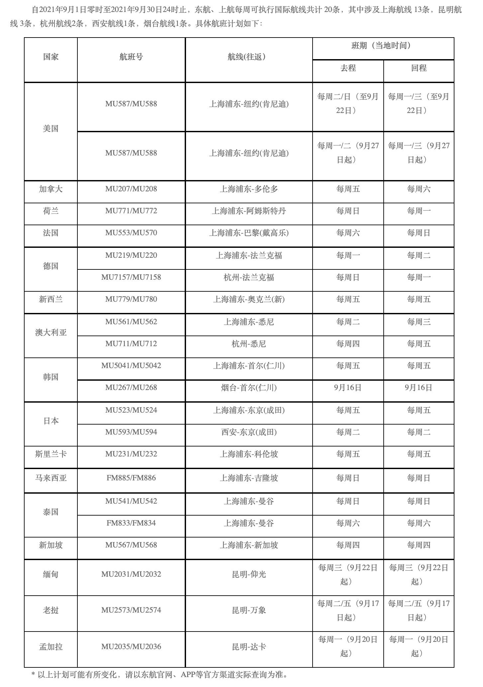
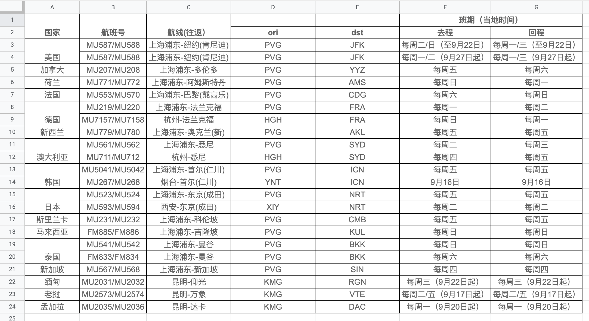
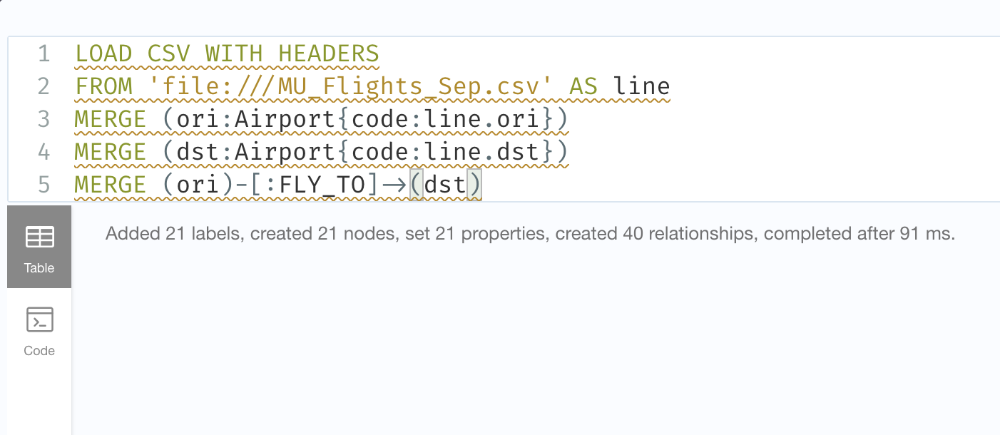
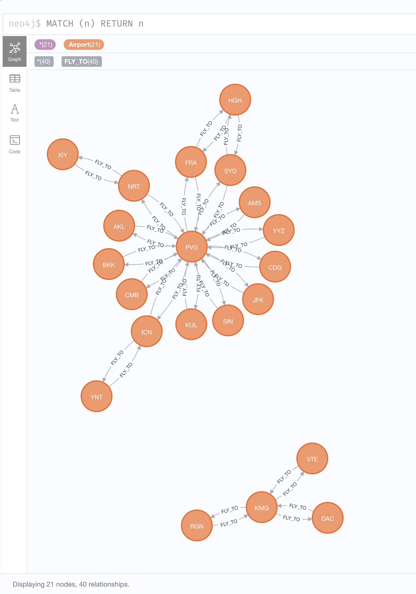

# My first graph data model: Using Neo4j to store flight schedule data

Recently I have been using Neo4j, a graph database platform. A Graph Database is a database that regards the relationship between data as important as the data itself. It uses Graph data structure. Data in the real world all have connections. We need to deal with the relationships between data no matter what business we analyze. Graph databases are very suitable for managing highly connected data and complex queries.

I can't wait to share with you how much data in reality is suitable for storage and processing using a graph database platform, and Neo4j is such a graph database platform that integrates storage, computing, data science and application integration.

This post describes how to store a real dataset in Neo4j, and use Neo4j tools to query and display these data. I hope that through this short post, you can learn about graph data modeling and Neo4j's query tools. For other related concepts such as the architecture and tool chain of Neo4j, application integration, the advantages of graph databases, etc., I will show you in my upcoming posts. If you have any thoughts please do let me know.

## Prepare the Dataset

Now let's get started. Since the outbreak of the COVID-19, the travel industry has been greatly affected. Flight schedules have often changed with health policies. I worked in air travel industry for years. So I'd like to use flight schedule data as example in  graph database platform. 

China Eastern Airline is a flight carrier based in Shanghai. I'm going to take the latest flight schedule notice on their website:  <http://www.ceair.com/about/jjgg2016/202108/t20210831_19747.html>. On this page, China Eastern Airline announced the flight schedule of international flights in September as shown in the figure. Then I'll show you how to store in Neo4j.



Let me introduce a little bit about the flight schedule table. The route represents the flight itinerary from the Origin (Airport) to the Destination. In the table also contains information such as the destination country, flight number, and weekly schedule. Let's sort out the data first. I'll separate the Origin airport and Destination into two columns, and convert them into the standard [IATA airport code](https://en.wikipedia.org/wiki/IATA_airport_code) (I can remember many airport codes).



We know that a route is the itinerary of a flight from the origin to the destination. The connection or relationship between the two airports is the flight. A flight has a direction so we can reverse the destination and the origin to express the return flight, that is to say the destination becomes the origin. Remember the relationship between origin airport and destination is the flight. 

I'd remove duplicate data and integrate the reverse data of `dst` and `ori` append to the end of my list. The relationship between airports is from `ori` to `dst`. Let's call it `FLY_TO`. Then save the list in a `csv` file, we'll use it later.


## Data modeling

Now is the amazing time. I'll start modeling the data. Let's figure out the data storage structure and relationships. 

If you are familiar with relational database. You'll use the ER modeling. We need three tables, an Airport table and a Flight table, and plus a separate flight schedule table is needed to associate airport and flight through foreign keys. Hold on. However, in graph modeling, we use intuitive modeling as shown in the figure to directly draw data entities and the relationships between them. In Neo4j, data entities are called nodes and connections between nodes are called relationships. You can add properties to store extra information on both nodes and relationships. I use nodes to represent airport, and the relationship between airports is flight.


In this model there are some other properties on the nodes and relationships, such as country, flight number, and schedule. But we don't need them to demonstrate the modeling and querying. Let's simplify this model here and only focus on the route. I use `FLY_TO` to represent the flight relationship. So the model looks like this:


## Store dataset in Neo4j

Now we can use Neo4j to load the previous flight schedule data into the database. I use Neo4j Browser to run the following Cypher statement:

```cypher
LOAD CSV WITH HEADERS
FROM'file:///MU_Flights_Sep.csv' AS line
MERGE (ori:Airport{code:line.ori})
MERGE (dst:Airport{code:line.dst})
MERGE (ori)-[:FLY_TO]->(dst)
```



You can see that 21 labels, 21 nodes and 40 relationships have been created. We can now query the data. Enter and run in the query box of Neo4j Browser:

```cypher
MATCH (n) RETURN n
```



Neo4j Browser provides a Graph view, we can clearly see the relationships between airports and the flight directions.

## Summary

Oh I know, there are so many concepts and fundamental points are not covered in this post. But I believe you know Neo4j the graph database platform, and how to design and model the relationship and the data itself for real data. If you have any thoughts and suggestions, please feel free to contact me.

