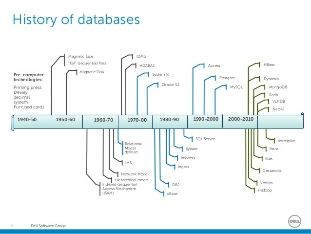
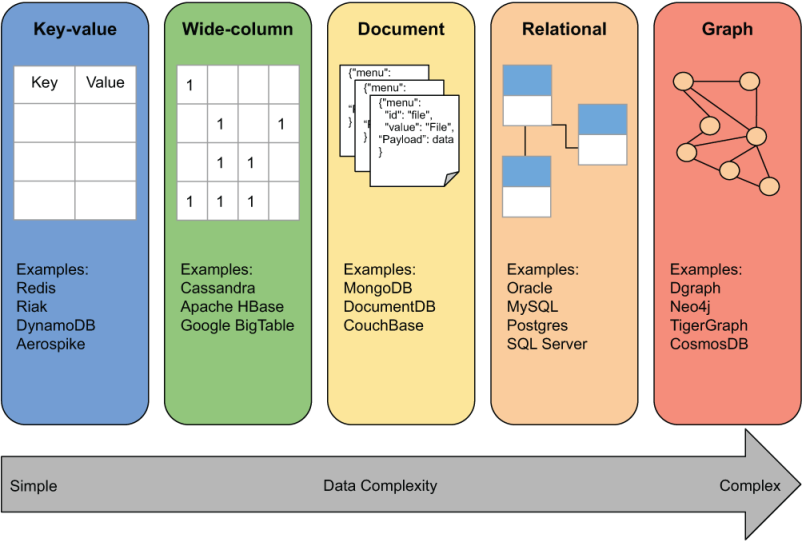

# 从数据库的分类说起，一文了解图数据库

在[CSDN Neo4j技能树](https://bbs.csdn.net/skill/neo4j)发布后，已经有64位同学正在学习，还有不少同学完成了全部的内容和练习题！太棒了！感谢大家的参与。

在接下来的博客中，我会用一个系列来详细讲解各章节的内容，希望能帮助大家更扎实地掌握这些知识，也希望通过我分享的一些实战代码帮助大家顺利启动自己的图数据项目，一起探索图的世界。

CSDN发布的[第二期《新程序员》](https://newprogrammer.blog.csdn.net/article/details/120199739)的主题之一是“**新数据库时代：带你走进数据库的全新阶段**”，其中有如下描述：

> 在开源吞噬软件、互联网数据海量的今天，数据库进入了全新阶段：新型数据库全面兴起、数据库开源已成趋势、数字化转型势在必行、资本热潮喷涌而出。

> 数据库全景图内含关系型数据库、面向文档的数据库、键值数据库、图数据库、时序数据库、列存储数据库、搜索引擎数据库等各类开源及闭源产品。

相信不少从事软件研发工作或自己有兴趣动手做过开发的同学，对数据库有一定了解。如果你是第一次知道“数据库”，可以先从数据库的定义开始：

> 在形式上，“数据库”是指一组相关数据及其组织方式。访问这些数据通常由一个“数据库管理系统”（DBMS）提供，该系统由一套集成的计算机软件组成，允许用户（数据库的使用者）与一个或多个数据库交互，并提供对数据库中包含的数据的访问。DBMS提供各种功能，允许输入、存储和检索大量信息，并提供管理这些信息的组织方式的方法。

我们从如下3个方面来展开。

## 数据库的发展历史

在这里我们简单回顾一下数据库的发展，让没有了解过数据库的同学有个粗略概览，也想以此来带出图数据库的发展。

在数据库软件系统诞生之前，数据存储和数据的管理已经存在了相当长的时间。不过当时数据管理主要是通过表格、卡片等方式进行，效率低下，需要大量人员参与，也极易出错。

在这样的背景下，于20世纪60年代，数据库系统应运而生。我们一起看一下几个关键的时间和出现的事物。

1962年：“数据库（Database）”一词开始流行于系统研发公司的备忘录中。

1970年：IBM的Edgar Frank Codd撰写了“大型共享数据库的关系模型”的论文，以此被称为“关系数据库之父“。

1979年：Oracle创建了第一个商业关系型数据库管理系统（RDBMS）。

1983年：IBM发布DB2。

1984年：Teradata发布第一个大规模并行处理（MPP）数据库平台。

1985年：适用于PC桌面的数据库系统出现，比如微软Access。

1988年：IBM首次提出“数据仓库”一词及行业标准。

1995年：第一款开源关系型数据库管理系统MySQL发布。

2000年：Neo4j的创始团队在RDBMS上遇到了性能问题，并开始构建第一个Neo4j原型。

2003年：第一款XML数据库发布，标志着进入NoSQL阶段。

2007年：第一款商用图数据库Neo4j发布，同期发布了开源版本。

2009年：商用大数据Hadoop平台Cloudera的产品发布。同期由MongoDB引发了去SQL的浪潮。

2010年：Neo4j图数据库发布1.0正式版。

2011年：基于资源描述框架（RDF）的图数据库管理系统开始浮现。

2014年：Spark发布。

2015年：Apache发布超过25个数据相关项目。

2016年：Neo4j图数据库发布3.0正式版。

其实这个列表还可以很长，大家有兴趣也可以根据关键字搜索互联网了解更详细的历史故事。比如[知乎上这篇信息图表][1]。

## 数据库模型的分类

接下来我们了解一下数据库模型的不同类别。

数据库模型是用于确定数据库的逻辑结构。它从根本上决定了数据可以用何种方式存储、组织和操作。数据库管理系统可以提供一个或多个模型。最佳结构取决于应用程序数据的自然组织，以及应用程序的要求，包括交易率（速度）、可靠性、可维护性、可伸缩性和成本。大多数数据库管理系统都是围绕一个特定的数据模型构建的。

数据库模型不仅仅是构建数据的一种方式：它还定义了一组可以在数据上执行的操作。例如，关系模型定义了`SELECT`和`JOIN`等操作。虽然这些操作在特定的查询语言中可能不是显式的，但它们为构建查询语言提供了基础。

我最近在阅读[《图数据库实战》][3]这本书，第一章里有这个对比图。可以看到从最广泛的应用角度来看，面向不同的数据复杂程度，数据库管理系统可以分为以下5种类别。

键值（KV）数据库：所有数据有唯一的Key作为标识符，以及和Key关联的数据对象。模型简单易用，非常容易上手。

宽列数据库：这种数据库系统的数据按照列来存储，每行有大量的列表示不同的数据属性，允许不同行的数据有不同的列。

文档数据库：类似于键值数据库，也有一个唯一键，存储的数据是按照一定模式来组织的文档，也可以包含嵌套的数据。

图数据库：图（Graph）是指数据结构的图，图数据库将数据存储为节点（Node）和关系（Relationship），因此在处理关联数据方面有很大优势。

关系数据库：历史最悠久使用最广泛的数据库模型，以二维表的形式存储数据，允许不同表之间建立关联。

我们深入了解一下为什么图数据库会出现，不难看出虽然关系型数据库允许建立关联，但只能在查询计算时来处理关联，因此在处理多级和不确定的关联数据场景下就显得力不从心。而图数据库从模型设计开始就将数据和关系同时考虑，也同时存储下来，所以在计算关联关系的时候就很得心应手。

另一方面，从[DB-Engines][4]对市场上数据库系统的统计数据来看，关系型数据库一直稳定占据大部分市场，而图数据库则是过去10年增长最快的数据库类型。

关于图数据库的使用场景，我会在后续文章中陆续分享几类常见的图问题模式，即什么场景下使用图数据库更具有优势，敬请持续关注。

## 展望数据库的未来

在2021年[CSDN 1024程序员节](https://1024.csdn.net)上，Neo4j创始人兼CEO Emil Eifrem在圆桌论坛“[六大国际数据库掌门人尖峰对话](https://live.csdn.net/v/180165)”上，分享了[图数据平台引领数据库未来十年发展](https://blog.csdn.net/Jennifer726/article/details/121123696?spm=1001.2014.3001.5501)的观点。

> 过去两年，数据库行业的发展趋势呈现三大特征。
>
> 首先是融合，随着新型数据的大规模创新，高速扩展的数据库市场再次呈现出融合的局面，数百家数据库厂商逐渐归入到包括文档数据库、图数据库、时序数据库、NewSQL数据库在内的四个全新且稳定的数据库阵营中。在不同细分领域中，仅有有限的几家公司在领军之路上引吭高歌，如图领域的Neo4j 和文档领域的 MongoDB。
>
> 第二，向云转移成为整个行业的长期趋势。2017年前后一些大型云供应商和独立云供应商开始涌现。虽然曾因数据重力和监管等因素的影响进展放缓，而今这一趋势再次气势如虹。数据向云服务转移在很大程度上成为数据库平台的发展驱动要素。
>
> 第三，数据科学家方兴未艾。整体而言，数据科学家并不喜欢数据库，他们更加钟爱数据。而图数据库是个例外，越来越多的数据科学家对图数据库青睐有加。数据科学家使用图形算法处理数据，再通过图将数据输入机器学习管道中，从而为机器学习模型和预测提供关系型信号。由此，图数据库成为机器学习管道中的核心部分。
>

值此2022年新春佳节之际，我相信随着大家对关联数据的需求不断攀升，图数据库的流行将是很快到来的一个状态。因此，现在就跟我一起进入图数据的世界吧。

希望通过本文的介绍，让你对数据库的发展、数据库模型的类别以及图数据库的发展有一个初步印象。

欢迎持续关注和跟进。

## 资源推荐

- [Neo4j 技能树](https://bbs.csdn.net/skill/neo4j)：人人都能学会图数据库的学习路径，帮助你从0基础掌握Neo4j。
- [成为 Neo4j 认证专家](https://neo4j.com/graphacademy/neo4j-certification/?ref=shiny-csdn-skilltreeblog2)：已有多人通过了Neo4j认证专家的考试。下一个是你吗？

[1]: https://zhuanlan.zhihu.com/p/25179862 "一张图清晰追溯数据库的发展历程（1962-2016年）"
[2]: https://livebook.manning.com/book/graph-databases-in-action/chapter-1/ "Graph Databases in Action Chapter 1"
[3]: https://book.douban.com/subject/35634944/ "豆瓣读书：图数据库实战"
[4]: https://db-engines.com/en/ranking_categories "DBMS popularity broken down by database model "
