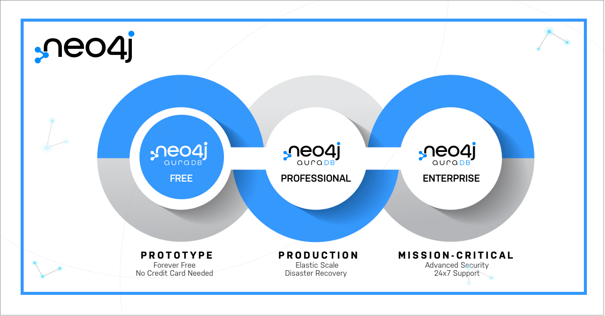

# Neo4j 推出Neo4j AuraDB免费版，助力开发者掌握图技术

新闻稿

Neo4j已推出Neo4j AuraDB免费版，助力开发者掌握图技术 - 世界领先的图数据库Neo4j现提供永久免费云服务Neo4j AuraDB Free。

全球领先的图数据平台Neo4jⓇ近日宣布全面推出Neo4j AuraDB FreeTM，无需信用卡即可启用，是该公司广受欢迎的图数据库即服务AuraDB的永久免费版。

通过发布AuraDB免费版，Neo4j旨在以零阻力和零成本为所有用户提供应用最为广泛的图数据平台，加速其变革性图技术在现代智能应用中的部署。开发人员使用图技术可进行快速学习、原型化和开发，无需对基础设施进行管理。免费版提供了在易于使用、完全托管的云服务中最快的图路径。

Neo4j亚太区副总裁Nik Vora表示，Aura免费版是公司在Aura4All理念下向所有用户群体提供产品的重要组成部分。 Vora表示：“Neo4j AuraDB免费版为开发人员和组织机构学习和测试Neo4j一流免费的图数据平台解决方案提供了顺畅的途径。一旦用户准备好进阶应用，我们还提供专业版和企业版供其选择。我们的Aura4All生态系统可覆盖从最基本的图数据需求，到最多可处理超过2000亿个节点和超过一万亿个关系”。

## 关于Neo4j AuraDB Free的更多信息

所有用户都可通过访问[此链接](https://neo4j.com/cloud/aura/?ref=pr-&utm_source=announcement&utm_medium=referral&utm_campaign=AuraDB-Free)开始使用Neo4j AuraDB免费版。AuraDB免费版包括一个免费图数据库，用于支持所有核心功能和开发者工具；以及用于数据可视化的Neo4j Bloom。

如需更大规模、高级安全性、灾难恢复和专门支持，用户可以轻松升级至AuraDB专业版或 AuraDB企业版。AuraDB免费版支持[Neo4j连接器](https://neo4j.com/product/#connectors/?ref=pr-&utm_source=announcement&utm_medium=referral&utm_campaign=AuraDB-Free)和集成，包括 GraphQL、Apache Spark、Apache Kafka和BI工具。

借助AuraDB免费版，用户可以利用Neo4j技术在全自动云服务中实现：

- 零阻力**：易于使用的平台，内置学习指南和一键部署**

- 轻松简易：**自动优化升级和应用补丁，无需停机**

- 永久免费：**无需信用卡即可开始或使用**

## 关于 Neo4j

Neo4j是全球图数据平台的领导者。我们帮助客户，包括康卡斯特([Comcast](https://neo4j.com/case-studies/comcast/?ref=pr-&utm_source=announcement&utm_medium=referral&utm_campaign=Neo4j-Board-of-Directors))、美国宇航局([NASA](https://neo4j.com/users/nasa/?ref=pr-&utm_source=announcement&utm_medium=referral&utm_campaign=Neo4j-Board-of-Directors))、瑞银([UBS](https://neo4j.com/case-studies/ubs-case-study/?ref=pr-&utm_source=announcement&utm_medium=referral&utm_campaign=Neo4j-Board-of-Directors))和沃尔沃汽车([Volvo Cars](https://www.slideshare.net/neo4j/volvo-cars-build-a-car-with-graphs))等，捕捉数据中隐藏的现实世界丰富的上下文情境，以应对任何规模的挑战。我们的客户通过遏制金融欺诈和网络犯罪、优化全球网络、加速突破性研究和提供更好的建议来改变其所在的行业。Neo4j提供实时交易处理、先进的AI/ML、直观的数据可视化等支持。 

## 如何开始

现在访问产品网址开始注册使用，或点击“阅读原文”直达。

欢迎给我们提出意见反馈。