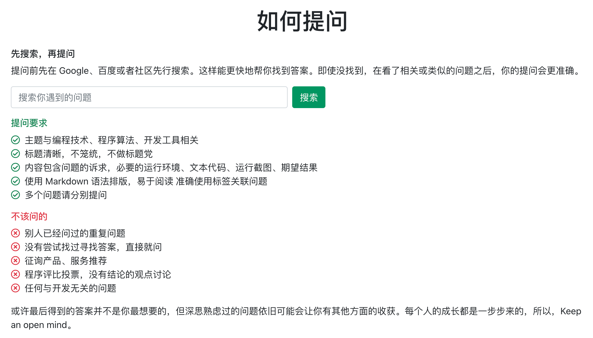

# Neo4j 社区参与指南

各位好，我是Neo4j DevRel（开发者关系）的Shiny亮小猪，2021年加入Neo4j中国团队，帮助开发者了解和掌握Neo4j。我是一直从事开发工作，前端后端数据库都涉足过，常常在一些技术社区活跃，也会出现在一些技术分享活动上，希望跟大家多多交流。

今天想跟大家分享**如何参与社区能更快地解决遇到的技术问题**。

## Neo4j 社区在哪里？

因为Neo4j刚正式进入中国，我们首先采用了跟现有技术社区合作的方式来帮助大家。你可以在以下这些地方找到我们：

### Neo4j 中文社区：http://neo4j.com.cn/

该网站由国内的Neo4j爱好者创建，跟Neo4j官方合作紧密，我们也会在社区论坛里回答大家的提问，社区氛围也挺好，大家互助能解决很多问题。

### CSDN Neo4j 社区：https://bbs.csdn.net/forums/neo4j

Neo4j跟开发者熟悉的CSDN合作，推出了Neo4j社区节点，同时也有Neo4j开发者博客，还有[Neo4j技能树](https://bbs.csdn.net/skill/neo4j)，如果你更熟悉CSDN，可以在CSDN提问，加上Neo4j关键字或标签，我们会很容易找到。

### 思否：https://segmentfault.com/

思否社区有非常友好的使用体验，我们也在思否建立了专栏，欢迎使用标签`neo4j`来提问，我们会很容易找到。

### 知乎：https://www.zhihu.com/

有问题上知乎，学技术也可以上知乎。尽情提问吧，我们也可以通过搜索Neo4j找到你的问题。

## 推荐的参与方式

我们有很多的在线活动，也邀请大家加入了很多微信群。但群聊是不推荐的方式。

我们推荐到你熟悉的技术社区发布完整的包含上下文的提问，这样会极大减少回复者的负担，让问题更容易被解决。同时在整理问题的过程中，我相信你也会思考问题的根源，这也会帮助你更理解遇到的问题。

还有一些建议比如：先搜索再提问，重复的问题无需再问等等。

每个社区还会有一些提问规范，大家熟悉的可以去继续了解。我这里推荐思否的提问前页面：

相信通过这样的方式，可以让提问更清晰，回复更准确。

## 写在最后

希望大家在学习和实际应用中所有问题都能迎刃而解，也希望大家多参与社区，比如回复自己能解决的问题，共同进步。

最后一条建议是，如果你愿意用英文来提问，那将是更好的状态，因为会有全世界各地的专家来帮助你，这个时候你需要去的地方是Neo4j官方社区：https://community.neo4j.com/。

感谢阅读，我们社区里见。

