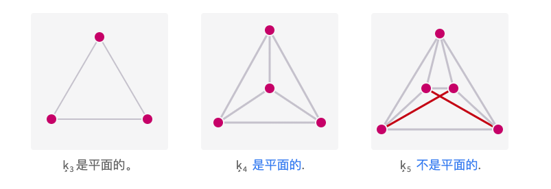

# 趣味图问题：规划问题 - 平面图

前面提到过一个有趣的城市规划的问题。

在一个小村庄里，有三间房屋和三座生产水、电和煤的公用设施。我们必须将每个房屋连接到每个公用设施，但由于村庄的布局，不同的管道和电缆不允许交叉。如下图这样，聪明的读者你能做到吗？

你可以试一试。

》〉》〉》等待中…………

最后的结论是：**不交叉是不可能完成的**。

## 什么是平面图（Planar Graph）

定义：如果能把图画在一个平面上，使得除顶点外的边与边不会有交叉，这样的图称为平面图，或叫做可以嵌入平面。

很难理解对吧，我也很难理解。我们还是聚焦在解决谜题上面。

如上图，完全图K5是最小的非平面图，其他的多于5个顶点的完全图都不是平面的。那么，对于谜题是不是有些眉目了呢？

## 解题时间

今天推荐的是**3Blue1Brown**的一个视频，邀请了众多数学家科学家一起来挑战谜题。一起来看视频吧。

[]

怎么样，是不是非常有趣？记得点击“阅读原文”了解图嵌入。