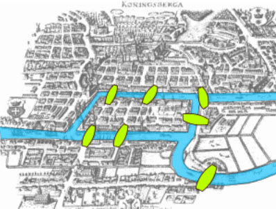
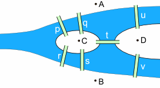
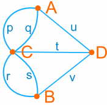
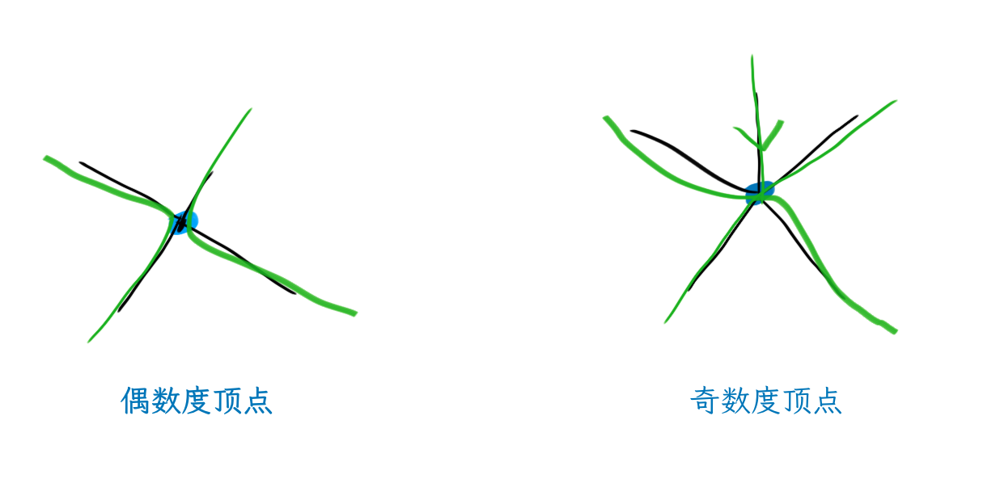

# 趣味图问题：七桥问题或一笔画

今天我们来继续看看七桥问题，或叫做一笔画问题。

传说在Euler那个时代，当时东普鲁士柯尼斯堡市区跨普列戈利亚河两岸，河中心有两个小岛。小岛与河的两岸有七条桥连接。就像上面的图看起来那样。Euler经常去散步，逛得有些厌烦了，所以提出了这么一个问题：

**在所有桥都只能走一遍的前提下，如何才能把所有的桥都走遍？**

可以在图上尝试着画一下，看看能不能一次走遍所有桥。

》〉》〉》等待中…………

最后的结论是：**不能一遍把所有桥都走遍**。

## 试着看一下这是为什么

我们把地图抽象一下，标记上符号，变成这样。

继续抽象一下，我们只关注桥，小岛就用一个点来表示好了，变成这样。

我不是要证明这个问题，还没有掌握到那个程度，真的太复杂了，很烧脑。但我们用一种有趣的方式来解释，这样你就能够**很快看穿一个图到底能不能一笔画**，而且**用最快的方式画出来**。

跟着我继续吧。

我们知道这是一个图问题。我们已经知道**顶点**（Vertex）和**边**（Edge）是**图**（Graph）的基本组成，**度数**（Degree）表示通过一个顶点的边的数量。我们也知道这种一笔画问题实际上是寻找所有边只经过一次的路径，这种路径称为**欧拉路径**。

如果你尝试过画一画，这时我们可以看一个规律，顶点的度数分为奇数和偶数两种。那些有偶数度的顶点，可以经过而且能够走出来。那些有奇数度的顶点，最后会没有桥可以走，只能停在这样的顶点上。

回到七桥的图里，顶点ABD的度数是3，C的度数是5，呃，怎么画也会陷入到其中的点而无桥可走对吧。

## 一招学会一笔画

但是等一等，都数出来了然后呢？

这里的结论是：

**只要有0个或2个奇数度顶点的图，就可以一笔画。其他的都不可以。**

好了，这下如果有人给一个图让你一笔画，你拿过来可以先数一数多少个奇数度顶点。

那更进一步，只要有奇数度顶点，你就可以从这个顶点开始，这样你就会又快又准地找到一笔画解决方案。

如果有0个奇数度顶点，则起点和终点都会在同一个顶点。

如果有2个奇数度顶点，肯定其中一个是起点，另一个是终点。

你学会了吗？

## 动动笔

聪明的读者你可以试试如何用一笔画完成这几个图：

我们可以用如下表格来记录下。

| 图   | 是欧拉路径吗？ | 顶点个数 | 偶数度顶点个数 | 奇数度顶点个数 |
| ---- | -------------- | -------- | -------------- | -------------- |
| 1    | Yes            | 4        | 4              | 0              |
| 2    |                |          |                |                |
| 3    |                |          |                |                |
| 4    |                |          |                |                |
| 5    |                |          |                |                |
| 6    |                |          |                |                |
| 7    |                |          |                |                |
| 8    |                |          |                |                |

看看是不是符合我们说的**只有0个或2个奇数度顶点的图才能一笔画**的规律。

继续动手画一画吧：

还有这个：

很期待看到你画的结果哦。