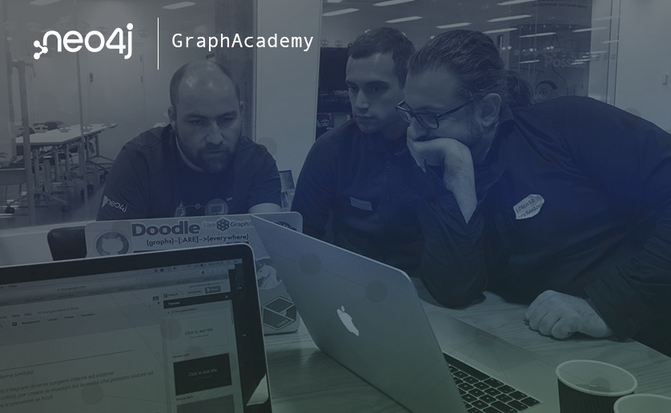
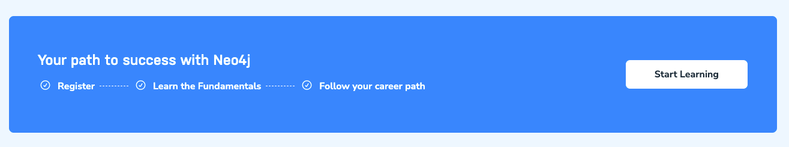
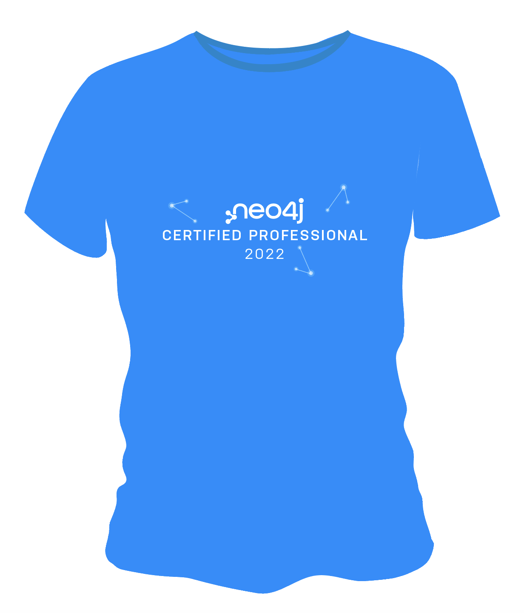
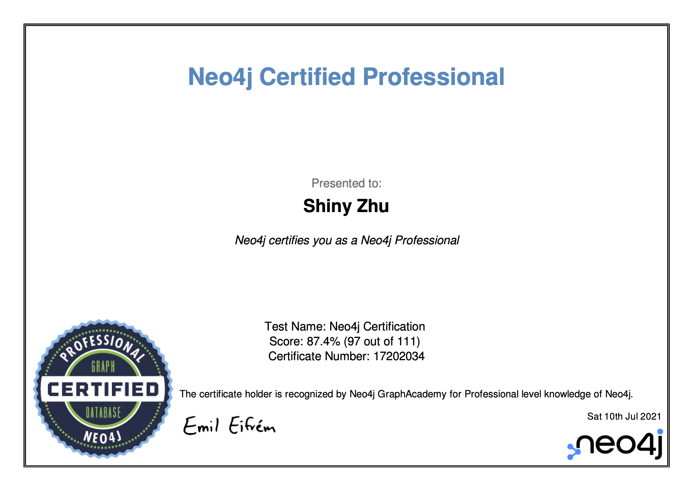

# 听说你还不知道 Neo4j 的免费考试认证

2022-04-20

学习通常不是一件容易的事情，尤其是要掌握一门还不熟悉的技术。

现在你不用担心啦！……

//哈哈哈，并没有……

## 什么是GraphAcademy

GraphAcademy是Neo4j推出的免费、自主掌握进度的在线动手实验培训平台，从 Neo4j 专家那里了解如何构建、优化和启动你的 Neo4j 项目。

### 向专家学习，少走弯路

所有课程均由具有多年经验的经验丰富的 Neo4j 专业人士开发。我们的目标是为您提供令人愉快的实践培训，其中包含文本内容、视频和代码挑战。

### 面向不同人群量身打造，针对性强

我们针对广泛的工作角色设计了一套全面的课程。查看我们针对 [数据科学家](https://graphacademy.neo4j.com/categories/data-scientist/)、 [开发人员](https://graphacademy.neo4j.com/categories/developer/) 和 [管理员](https://graphacademy.neo4j.com/categories/administrator/)的课程。

### 有奖学习，我们都喜欢T-Shirt！

您通过的每门课程都会解锁一个数字徽章，可以通过您的公共档案与您的朋友和同事分享。通过完成 [Neo4j 认证](https://graphacademy.neo4j.com/categories/certification)，您将解锁免费的限量版 Neo4j T 恤。

## 如何开始

简单三步走，注册 -> 挑选课程开始学习 -> 完成课程或学习路径。

现在就打开网址：`graphacademy.neo4j.com`，开始学习之旅吧。

## 进一步挑战：通过考试获得认证

对具有 Neo4j 技能的专业人士的需求正在急剧增长。除了在你的简历里面写上你经历的Neo4j项目外，现在，你可以通过Neo4j的考试认证来证明你的专业经验，以此提升你的职业生涯。

同时，通过考试认证之后，你还将获得 Neo4j 高级培训课程的访问权限，这些课程仅供 Neo4j 认证专业人士使用。

现在是向你的老板、客户和同事展示你是 Neo4j 专家的最佳时机。

比如我的LinkedIn页面：

GraphAcademy 提供了3种职业认证：

1. Neo4j 认证专家（Neo4j Certified Professional）
2. Neo4j 图数据科学认证（Neo4j Graph Data Science Certification Exam）
3. Neo4j 4.x 认证（Neo4j 4.x Certified Exam）

我们进一步看看通过考试的要求。

### Neo4j认证专家

Neo4j 认证专家的考试的考点是在以下领域使用Neo4j 4.x ：

- Neo4j 属性图模型
- 用于开发的 Neo4j 组件
- Cypher查询语言
- 创建节点和关系
- 导入数据

考试时长：60分钟

考试内容：80道题目

达标分数：超过80%

可以重考吗？可以，但24小时内只能考1次。

T恤奖励，可以选颜色：

考试注册：https://neo4j.com/graphacademy/neo4j-certification/

### Neo4j 图数据科学认证

考点内容如下：

- Neo4j 图数据科学（GDS）库的一般用途。
- 用于数据分析的图数据科学工作流程。
- 使用特定的图算法。

考试时长：60分钟

考试内容：40道题目

达标分数：超过80%

可以重考吗？可以，但24小时内只能考1次。

考试注册：https://neo4j.com/graphacademy/neo4j-gds-certify/

### Neo4j 4.x 认证

Neo4j 在 Neo4j 4.x 中添加了许多新功能。为了跟上对具有 Neo4j 经验的专业人士的需求，就需要了解并获得 Neo4j 4.x 的经验。

本考试的考点内容如下：

- Cypher 的新功能
- 多数据库功能
- 基于角色的访问控制 (RBAC)
- Fabric

考试时长：45分钟

考试内容：30道题目

达标分数：超过80%

可以重考吗？可以，但24小时内只能考1次。

考试注册：https://neo4j.com/graphacademy/neo4j-certification-40/

所有考试通过后，都会收到Neo4j CEO亲自签名的电子证书。

看看我的：

## 额外奖励

如果你通过了考试认证，可以联系Neo4j中国团队，我们会提供额外奖励。同时也会被邀请到参加Neo4j官方的技术活动中。

现在就开始学习并通过考试认证吧，加入到Neo4j的图数据技术社区中！

## 参考资源

GraphAcademy

`https://graphacademy.neo4j.com/`

Neo4j 认证专家考试

`https://neo4j.com/graphacademy/neo4j-certification/`

Neo4j 图数据科学认证

`https://neo4j.com/graphacademy/neo4j-gds-certify/`

Neo4j 4.x 认证

`https://neo4j.com/graphacademy/neo4j-certification-40/`