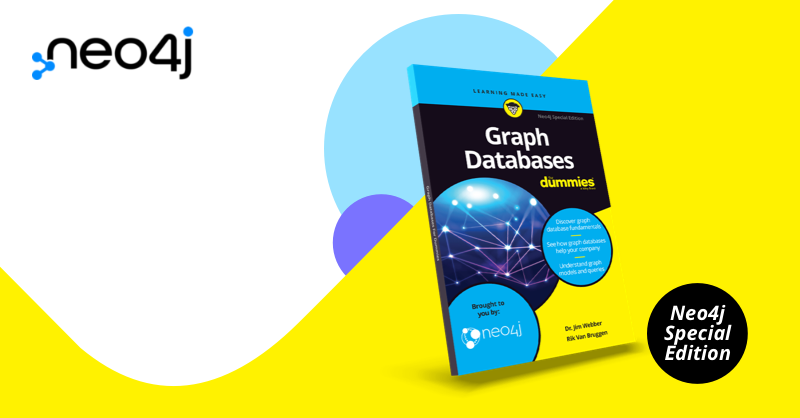

# 书籍推荐《图数据库达人迷》

2022-04-25

不知道你在学习技术的时候，有没有发现这么一个系列书籍：**x for Dummies**，刚巧今天在豆瓣上看到翻译成 **x 达人迷**，我觉得非常贴切，要成为一个“达人”，看完这本书就能对一项技术有一个全局的认识了。

我们也有一本书叫做**Graph Database for Dummies**，今天推荐给你。直接免费下载（阅读原文直达）。

## 内容概要

这本书的作者是Neo4j首席科学家Jim Webber和区域总裁Rik Van Bruggen。

> Graph Databases For Dummies walks you through modeling, querying, and importing graph data, all the way through to your first production system.

**图数据库是发展最快的数据库技术。**有些人出于技术或性能原因而被图数据库所吸引，其他人可能对直观的数据模型而感兴趣。有一点很清楚：图数据库模型代表了与关系模型和 NoSQL 模型不同的另一条路，但这种背离本质上是值得的。

通过这本书，我们为每个人提供图数据库的基础知识，以便能够快速而自信地开始学习和使用图数据库。这本书里没有令人眼花缭乱的数学或代码，只有过来人提供的一些实用建议。

我们快速过一下每章的内容。

## 第一章：图数据库简介

本章介绍了NoSQL的发展结束了关系数据库一统天下的局面，NoSQL的世界里也有不同的方式，比如文档、键值、列存储和图等等，NoSQL的模型更简单，其中图数据模型认为关系和数据实体同样重要，而在很多场景下使用图数据库会是一个更优的选择。

图数据库是通用的数据技术。它们可以被广泛的领域使用，从医疗保健到金融，从能源到灾难响应。了解何时使用图数据库的关键是**关系的价值**。如果你的数据是互相关联的，无论是支持在线移动应用还是离线机器学习框架，那么图将是一个不错的选择。

### 了解标签属性图

还记得我们讲过**标签属性图**（Labeled Property Graph）？图数据模型使用图的节点和关系来表示，标签属性图是图数据库使用最广泛的模型。这里有一些命名约定：

- 节点标签是**PascalCase**。每个单词都以没有空格的大写字母开头。
- 关系是**SNAKE_CASE_ALL_CAPS**。用下划线字符替换所有空格并将所有字母转换为大写字母。
- 节点和关系的属性是**snake_case**。用下划线字符替换所有空格并将所有单词小写。

## 第二章：构建丰富的图数据模型

本章介绍图数据库建模。在图数据库中，每个节点代表一个**实体**，每个**关系**连接两个特定节点。这意味着如果你有很多产品要存储在数据库中，就会有很多产品节点，如果这些产品有很多客户，就会有很多关系将它们链接在一起。

来自关系世界的实体关系图（ERG）通常为标记节点及其在图模型中的连接制作良好的设计图。如果您可以绘制实体关系图来为关系数据库建模，则可以创建图形数据模型。

设计图数据模型的最佳方法是：让业务专家使用白板来解释他们的业务问题。他们很可能会开始画圆圈和箭头，解释信息流、流程和关键实体以及它们之间的关系。你看，业务专家在你眼前构建好了图数据模型。

更进一步，你还需要优化或重构这个白板模型，以便让它更高效地支持业务需求，比如实现更高性能的查询，支持更容易编写的Cypher语句等等。

## 第三章：数据导入

数据模型构建好了，就可以准备导入数据了。可以将实体和关系的数据准备好，比如以csv的格式。

本章介绍了两种数据导入的方式：

1. LOAD CSV
2. neo4j-admin

## 第四章：查询图数据

本章介绍了Cypher查询语言，跟SQL一样是一种声明式数据库查询语言。

内容包含CRUD，看完后基本满足日常使用。

## 第五章：生产环境的Neo4j图数据库

本章介绍了一些能从客户端或应用连接到图数据库的工具，比如Neo4j Browser和多种编程语言的驱动。以及如何跟其他系统做集成，比如ETL工具和实时数据流等。

## 第六章：图数据技术成功的十个技巧

1. 使用正确的工具处理正确的工作。
2. 建立关联：图的优势在当你数据的关联足够多的时候才会显现。
3. 享受速度的优势。
4. 在日常场景中使用图技术。
5. 从图数据建模开始。
6. 先小步走，再扩展。
7. 为业务问题建模。
8. 聚焦在创造价值。
9. 探索隐藏的结论。
10. 加入Neo4j社区。

## 结束

这里只是一个概要，欢迎下载本书完整阅读。

下载链接

`https://neo4j.com/graph-databases-for-dummies/`

博客

`https://neo4j.com/blog/introducing-graph-databases-for-dummies/`