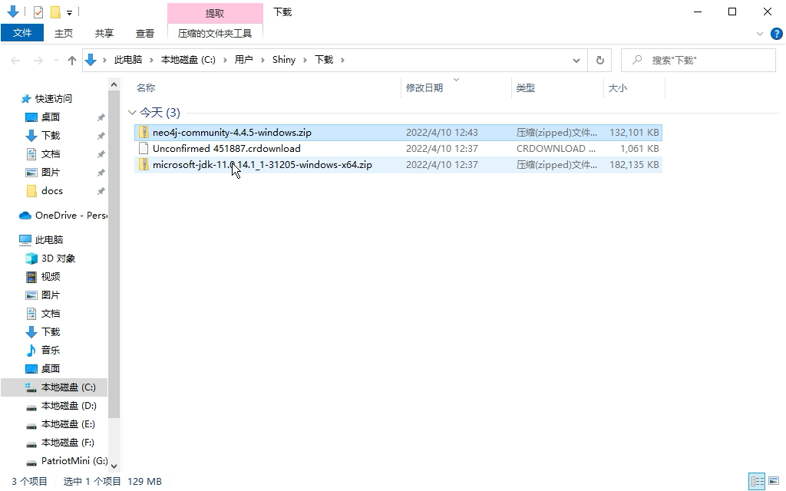

# 手把手快速上手 - 在Windows上安装Neo4j 社区版


众所周知，Neo4j CE（社区版服务端）是发布最早和使用最广泛的Neo4j发行版本，有很多用户把它用在生产系统上而且很稳定。当然我们希望有更多需求的时候无缝迁移到EE（企业版）并同时获得Neo4j原厂支持。

今天这个手把手快速上手教程跟大家分享如何在Windows系统上安装Neo4j社区版，并解决一系列常见问题。那我们开始吧。

## 太长不读

其实Neo4j 社区版部署最多的是Linux系统，因为开发人员用的最多的是Windows系统，而且按照下载页面的教程就可以正常运行起来。极简的步骤如下：

1. 下载Neo4j 社区版的Windows系统压缩包。
2. 配置好JDK环境和系统PATH环境变量。
3. 运行Neo4j的命令工具。

是不是很简单。一般来将有开发经验的人员能够一遍完成，如果你是被导师安排做一个Neo4j项目而你又不是计算机专业的，或者你是刚刚开始转行做一个“程序员”的，难免会碰到一系列问题。那么请继续往下读。

我还录制了完整的视频，因为最近上海疫情封锁在家，实在是很难去剪辑，后面再说吧。

## 准备工作

接下来我详细讲解我推荐的方法，你可以跟着这些步骤来，相信你可以更理解每个工具或命令的具体作用，也就能更容易完成未来的开发工作了。

首先是有一台用于开发的Windows电脑，硬件要求没有太多的限制，这里主要重点放在系统环境和软件方面。

软件方面的准备有2个方面：下载JDK和Neo4j安装包；配置系统环境以支持运行Neo4j。

划重点：后续内容有“》”符号的表示一个操作步骤或命令，你需要按照这些指引去动手操作的。

### 下载 Neo4j 安装包


还记得Neo4j官网主页大大的蓝色“Get Started”按钮吧，鼠标滑过它，选择第三个“Neo4j Desktop”，然后在页面上选择“Download Neo4j Server”。

就在最近，Neo4j官网主页改版了，你可以直接从菜单里的“Products”弹出层下方找到“Download Center”下的Graph Database。导航路径更容易了。

在列表里切换到“Community Server”，选择Windows系统对应的 zip 压缩包。

》下载到本地备用。

### 下载 JDK

JDK有很多版本，本教程以 Neo4j 4.* 为例，所以需要 JDK 11。

我推荐使用微软OpenJDK，访问地址`microsoft.com/openjdk`然后点击下载，找到JDK 11的版本下载 zip 压缩包，我个人不推荐 msi 安装模式，听我的，下载zip包就可以。

》下载到本地备用。

Neo4j 的 zip 压缩包和JDK的 zip 压缩包都准备好了，你应该能看到如图所示的两个 zip 文件。



》解压 JDK 的 zip 压缩包文件，放到一个文件夹，比如我喜欢放在`C:\apps\jdk`。

这时，JDK 的路径为：`C:\apps\jdk\jdk-11.0.14.1+1`。

》解压 Neo4j 的 zip 压缩包文件，放到一个文件夹，我推荐放到这里`C:\apps\neo4j`。

这时，Neo4j 服务端的路径为：`C:\apps\neo4j\neo4j-community-4.4.5`。

到这里准备工作就已经就绪了，如果JDK和Neo4j的版本号和这里的不一样，以你的下载为准。

我们继续。

## 配置系统环境

现在我们可以进行系统环境的配置了，主要包括 JDK 的环境变量和 Neo4j 的环境变量。

》操作步骤如下：右键点击“此电脑”选择属性，在弹出的关于系统界面，点击右侧的“高级系统设置”，此时会弹出“系统属性”对话框并显示“高级”标签页，在对话框下方找到“环境变量”按钮，点它会弹出“环境变量”对话框。


环境变量对话框有两组信息，一个是当前用户的环境变量，另一个是系统级别的环境变量。我们在用户环境变量里进行配置。

### 配置 JDK 环境变量

JDK需要两个地方进行配置，一个是`JAVA_HOME`，另一个是在`PATH`里添加Java程序的路径。

》在“环境变量”对话框里，点击用户变量下的“新建”按钮。这时可以看到两个输入框。


》在“变量名”字段里输入`JAVA_HOME`，在“变量值”字段里输入刚才JDK的目录，我的是`C:\apps\jdk\jdk-11.0.14.1+1`，然后点击确定。

》在“环境变量”对话框里，选中用户环境变量列表里的Path，点击“编辑”按钮。这时会弹出Path环境变量编辑对话框。点击右侧的“新建”，在文本框里输入这段文字：`%JAVA_HOME%\bin`，然后点击确定。

`bin`文件夹是JDK里可执行程序的路径，我们要使用的`java`就是在这个路径下，配置好PATH后，我们就可以在命令行里直接使用`java`命令了。


### 配置 Neo4j 环境变量

Neo4j 的环境变量也有两个，一个是`NEO4J_HOME`，另一个是在PATH里配置可执行程序的路径，它们也是在`bin`目录下。

》在“环境变量”对话框里，点击用户变量下的“新建”按钮。变量名输入`NEO4J_HOME`，变量值输入Neo4j服务端的路径`C:\apps\neo4j\neo4j-community-4.4.5`，然后点击确定。

》在“环境变量”对话框里，选中用户环境变量列表里的Path，点击“编辑”按钮。这时会弹出Path环境变量编辑对话框。点击右侧的“新建”，在文本框里输入这段文字：`%NEO4J_HOME%\bin`，然后点击确定。

这样，Neo4j的可执行程序比如`neo4j`也可以在命令行里直接使用了。

## 启动 Neo4j

现在就可以启动Neo4j了，使用系统自带的“命令提示符”程序。

我们可以先检查一下前面步骤的配置是否生效。

输入命令：`java --version` 回车，应该能看到类似消息：

```
C:\Users\Shiny>java --version
openjdk 11.0.14.1 2022-02-08 LTS
OpenJDK Runtime Environment Microsoft-31205 (build 11.0.14.1+1-LTS)
OpenJDK 64-Bit Server VM Microsoft-31205 (build 11.0.14.1+1-LTS, mixed mode)
```

输入命令：`neo4j --version`回车，应该可以看到这样的消息：

```
C:\Users\Shiny>neo4j --version
neo4j 4.4.5
```

如果能看到这些信息就说明我们的配置一切正常。

现在可以输入命令`neo4j console`来启动Neo4j服务端了。


到这里都没有出现问题的话，恭喜你，开始尽情使用Neo4j吧。

那，如果有问题会是什么样的问题呢？请继续往下看。

## 常见问题和解决方案

### 'neo4j' 不是内部或外部命令，也不是可运行的程序或批处理文件。

```
C:\Users\Shiny>neo4j console
'neo4j' 不是内部或外部命令，也不是可运行的程序
或批处理文件。
```

这是路径没有配置到PATH环境变量导致的。参考上面配置Neo4j环境变量一节，确保路径正确和保存了配置，并且重新打开了命令提示符程序。

### WARNING! You are using an unsupported Java runtime.

```
C:\Users\Shiny>neo4j console
Directories in use:
home:         C:\apps\neo4j\neo4j-community-4.4.5
config:       C:\apps\neo4j\neo4j-community-4.4.5\conf
logs:         C:\apps\neo4j\neo4j-community-4.4.5\logs
plugins:      C:\apps\neo4j\neo4j-community-4.4.5\plugins
import:       C:\apps\neo4j\neo4j-community-4.4.5\import
data:         C:\apps\neo4j\neo4j-community-4.4.5\data
certificates: C:\apps\neo4j\neo4j-community-4.4.5\certificates
licenses:     C:\apps\neo4j\neo4j-community-4.4.5\licenses
run:          C:\apps\neo4j\neo4j-community-4.4.5\run
Starting Neo4j.
WARNING! You are using an unsupported Java runtime.
* Please use Oracle(R) Java(TM) 11, OpenJDK(TM) 11 to run Neo4j.
* Please see https://neo4j.com/docs/ for Neo4j installation instructions.
OpenJDK 64-Bit Server VM warning: Option UseBiasedLocking was deprecated in version 15.0 and will likely be removed in a future release.
2022-04-10 07:46:20.413+0000 INFO  Starting...
Exception in thread "main" java.lang.LinkageError: Cannot to link java.nio.DirectByteBuffer
        at org.neo4j.internal.unsafe.UnsafeUtil.<clinit>(UnsafeUtil.java:128)
        at org.neo4j.memory.RuntimeInternals.guessHeaderSize(RuntimeInternals.java:158)
        at org.neo4j.memory.RuntimeInternals.<clinit>(RuntimeInternals.java:53)
        at org.neo4j.memory.HeapEstimator.<clinit>(HeapEstimator.java:103)
        at org.neo4j.internal.collector.RecentQueryBuffer.<clinit>(RecentQueryBuffer.java:37)
        at org.neo4j.graphdb.factory.module.GlobalModule.<init>(GlobalModule.java:212)
        at org.neo4j.graphdb.facade.DatabaseManagementServiceFactory.createGlobalModule(DatabaseManagementServiceFactory.java:273)
        at org.neo4j.graphdb.facade.DatabaseManagementServiceFactory.build(DatabaseManagementServiceFactory.java:133)
        at org.neo4j.server.CommunityBootstrapper.createNeo(CommunityBootstrapper.java:36)
        at org.neo4j.server.NeoBootstrapper.start(NeoBootstrapper.java:142)
        at org.neo4j.server.NeoBootstrapper.start(NeoBootstrapper.java:95)
        at org.neo4j.server.CommunityEntryPoint.main(CommunityEntryPoint.java:34)
Caused by: java.lang.IllegalAccessException: module java.base does not open java.nio to unnamed module @433d61fb
        at java.base/java.lang.invoke.MethodHandles.privateLookupIn(MethodHandles.java:259)
        at org.neo4j.internal.unsafe.UnsafeUtil.<clinit>(UnsafeUtil.java:111)
        ... 11 more
2022-04-10 07:46:20.568+0000 INFO  Neo4j Server shutdown initiated by request
2022-04-10 07:46:20.569+0000 INFO  Stopped.
Unexpected process failure. See log for info.
Run with '--verbose' for a more detailed error message.
```

顾名思义，Neo4j 4.* 需要JDK 11，版本不匹配就会报这个错误。请按照上述下载和配置JDK一节进行配置。

> 那如果确实需要现在的JDK而且不能删除，该怎么办呢？请看后面的高级自定义一节。

### neo4j : 无法将“neo4j”项识别为 cmdlet、函数、脚本文件或可运行程序的名称。

```
PS C:\Users\Shiny> neo4j console
neo4j : 无法将“neo4j”项识别为 cmdlet、函数、脚本文件或可运行程序的名称。请检查名称的拼写，如果包括路径，请确保路径正
确，然后再试一次。
所在位置 行:1 字符: 1
+ neo4j console
+ ~~~~~
    + CategoryInfo          : ObjectNotFound: (neo4j:String) [], CommandNotFoundException
    + FullyQualifiedErrorId : CommandNotFoundException
```

这个报错有2个问题：一是使用了PowerShell命令行，二是没有配置Neo4j环境变量。

配置环境同样参考第一个常见问题。

如果你使用的是Windows Terminal这样的集成命令行程序（我个人非常喜欢它），可以选择使用PowerShell来运行，而且Neo4j提供了PowerShell增强的管理脚本。但在使用的时候需要区分一下就好，命令提示符和PowerShell是有一些差别的。

那，如果：

### neo4j : 无法加载文件 C:\apps\neo4j\neo4j-community-4.4.5\bin\neo4j.ps1，因为在此系统上禁止运行脚本。

```
PS C:\Users\Shiny> neo4j console
neo4j : 无法加载文件 C:\apps\neo4j\neo4j-community-4.4.5\bin\neo4j.ps1，因为在此系统上禁止运行脚本。有关详细信息，请参
阅 https:/go.microsoft.com/fwlink/?LinkID=135170 中的 about_Execution_Policies。
所在位置 行:1 字符: 1
+ neo4j console
+ ~~~~~
    + CategoryInfo          : SecurityError: (:) []，PSSecurityException
    + FullyQualifiedErrorId : UnauthorizedAccess
```

这是因为我们下载的Neo4j 服务端程序不是通过Windows商店下载的，这里需要修改一下当前用户的执行策略，将默认的受限（Restricted）改成（AllSigned或RemoteSigned或Bypass）即可：

```
PS C:\Users\Shiny> Set-ExecutionPolicy -Scope CurrentUser

位于命令管道位置 1 的 cmdlet Set-ExecutionPolicy
请为以下参数提供值:
ExecutionPolicy: AllSigned
```

不同策略的区别和更详细的介绍可以参考微软文档。

### 无法从别的电脑访问Neo4j服务端

如果你需要把Neo4j服务端作为服务器，其他电脑来访问它，到目前为止你是办不到的，因为Neo4j 服务端默认只运行本机访问，需要修改配置`neo4j.conf`，这个文件在Neo4j服务端的conf文件夹下：

```
#*****************************************************************
# Network connector configuration
#*****************************************************************

# With default configuration Neo4j only accepts local connections.
# To accept non-local connections, uncomment this line:
#dbms.default_listen_address=0.0.0.0
```

取消最后一行的注释，重新启动Neo4j服务端。

然后在弹出的对话框中，选择允许访问。


这样就可以通过局域网里其他电脑来访问我们的Neo4j服务端了。

这里列举了一些问题和解决方案，希望能帮助到你。

## 高级自定义

这里的高级是表示遇到了另一个棘手的问题，就是电脑上已经有其他版本的JDK，而且不能删除，该怎么办呢？我还能运行Neo4j吗？

其实不算特别进阶，这些操作在Linux服务器上是比较常见的，所以我建议学习掌握一些Linux服务器运维知识，后续在真正部署到Linux服务器上的时候就会得心应手了。加油。

### 已经有JDK而且不能删该怎么办？

我们不难发现，运行Neo4j服务端的程序是需要知道执行文件的路径的，要执行这些文件需要JDK来做，所以也需要让系统知道JDK的路径。

请再仔细读一读上面这句话。

我们前面的配置操作是通过系统提供的界面进行的，同样我们也可以通过脚本的方式来进行，记住，脚本的方式是Linux上面的基本操作哦。

使用脚本的方式我们就不再需要对系统的用户环境变量进行配置了，这样也不会影响整个系统的运行环境。

清楚了方式之后，我们就来着手编写脚本，这个脚本主要做2个事情：设置JDK和Neo4j的可执行文件路径（环境变量），和启动Neo4j服务端。脚本里是通过一些语句作为命令，来告诉系统要做什么事情的。我把把这些命令写到名为`start-neo4j.cmd`的脚本里，`cmd`或`bat`都是为命令提示符程序运行的。

脚本文件的内容如下：

```
@ECHO
REM Author: Shiny Zhu@Neo4j
REM This script is to setup JDK and Neo4j env and run Neo4j server

REM 设置JDK和Neo4j环境变量，这些变量只在当前会话中生效
SET JAVA_HOME=C:\apps\jdk\jdk-11.0.14.1+1
SET NEO4J_HOME=C:\apps\neo4j\neo4j-community-4.4.5

REM 将JDK和Neo4j的bin目录添加到PATH环境变量，将默认PATH放在最后，这样保证我们的路径能优先运行
SET PATH=%JAVA_HOME%\bin;%NEO4J_HOME%\bin;%PATH%

REM 启动Neo4j服务
neo4j console


PAUSE
```

脚本文件如何使用呢？我们可以将脚本文件当成可执行程序一样，打开系统的命令提示符程序，切换到脚本文件所在的目录，输入`start-neo4j.cmd`按回车就可以运行脚本文件了。

如果你是使用PowerShell，我也准备了一个对应的脚本文件，名为`start-neo4j.ps1`：

```
# Author: Shiny Zhu@Neo4j
# This script is to setup JDK and Neo4j env and run Neo4j server

$ENV:JAVA_HOME="C:\apps\jdk\jdk-11.0.14.1+1"
$ENV:NEO4J_HOME="C:\apps\neo4j\neo4j-community-4.4.5"

$ENV:PATH=$ENV:JAVA_HOME + '\bin;' + $ENV:NEO4J_HOME + '\bin;' + $ENV:PATH

neo4j console
```

同样的方式来运行它就可以。

如果看到这个错误：

```
PS D:\docs\neo4j-install> .\start-neo4j.ps1
进行数字签名。无法在当前系统上运行该脚本。有关运行脚本和设置执行策略的详细信息，请参阅 https:/go.microsoft.com/fwlink/?
LinkID=135170 中的 about_Execution_Policies。
所在位置 行:1 字符: 1
+ .\start-neo4j.ps1
+ ~~~~~~~~~~~~~~~~~
    + CategoryInfo          : SecurityError: (:) []，PSSecurityException
    + FullyQualifiedErrorId : UnauthorizedAccess
```

还记得我们设置过运行策略，AllSigned在这里不适用了，对与自己的脚本需要改成Bypass：

```
PS D:\docs\neo4j-install> Set-ExecutionPolicy -Scope CurrentUser

位于命令管道位置 1 的 cmdlet Set-ExecutionPolicy
请为以下参数提供值:
ExecutionPolicy: Bypass
```

然后就可以正常运行PowerShell脚本了。

今天的手把手快速上手 - Windows上安装和配置Neo4j服务端就到这里，大家有任何问题可以随时发消息。

## 参考资源

Neo4j 服务端下载：https://neo4j.com/download-center/#community

微软OpenJDK：https://www.microsoft.com/openjdk

Zulu OpenJDK：https://www.azul.com/

Neo4j Windows 安装文档：https://neo4j.com/docs/operations-manual/current/installation/windows/

PowerShell执行策略文档：https://docs.microsoft.com/en-us/powershell/module/microsoft.powershell.core/about/about_execution_policies?view=powershell-7.2

在命令提示符里设置环境变量：https://docs.microsoft.com/en-us/windows-server/administration/windows-commands/set_1

在PowerShell里设置环境变量：https://docs.microsoft.com/en-us/powershell/module/microsoft.powershell.core/about/about_environment_variables?view=powershell-7.2

Windows Terminal 文档：https://docs.microsoft.com/en-us/windows/terminal/