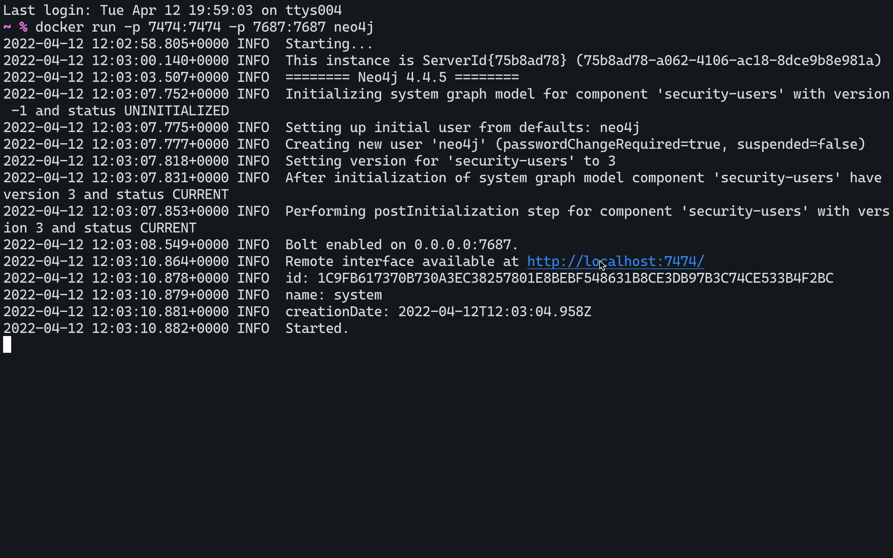

# 手把手快速上手 使用 Docker 运行 Neo4j


又见面啦，今天是一篇最简短的“手把手快速上手”文章了，主角是Docker，让我们看看如何使用Docker运行Neo4j。

## 有且仅有一句命令

安装好Docker之后，使用命令行运行这一句命令：

```
docker run -p 7474:7474 -p 7687:7687 neo4j
```

稍等片刻就能启动一个 Neo4j 社区版的实例，打开浏览器，访问 https://localhost:7474 就能开始使用了，默认账号密码是neo4j。



全文完。


## 参考资源

Neo4j 在 DockerHub 上为 Neo4j 社区版和企业版提供和维护官方Neo4j Docker 镜像。还提供了镜像的当前和历史版本。

我们还在内部使用 Docker 上的 Neo4j 来实现我们的一些工具和功能。从构建解决方案到现场演示，使用 Docker 部署 Neo4j 是一项宝贵的能力。使用 Docker 容器部署的 Neo4j 最著名的例子可能是 Neo4j 沙盒。这些沙箱是在共享云服务器上运行的 Docker 容器中的 Neo4j 实例。每个沙箱都是独立的，并且与其他沙箱分开，允许用户启动包含的环境来试用和测试 Neo4j！

开发者文档

`https://neo4j.com/developer/docker/`

操作手册文档

`https://neo4j.com/docs/operations-manual/current/docker/`

