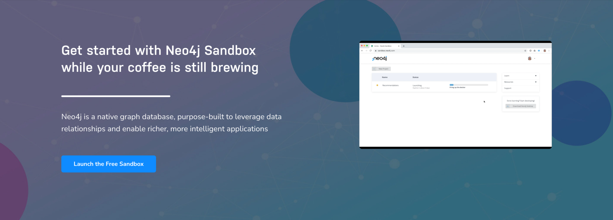
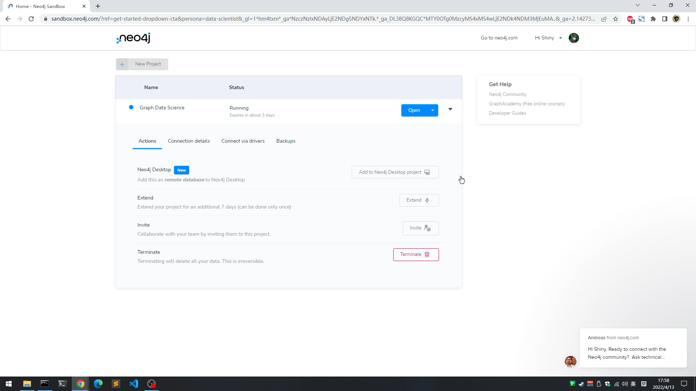
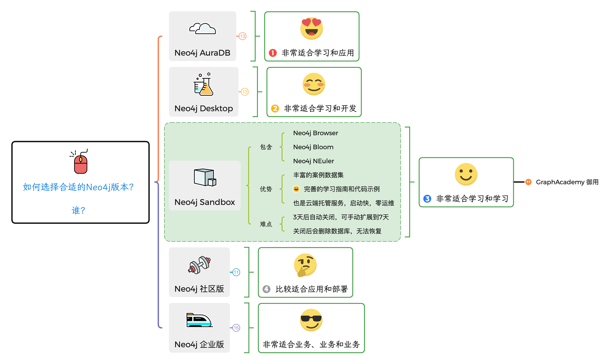

# 手把手快速上手 Neo4j Sandbox

今天的手把手快速上手我想让大家自己动手了，因为，使用Sandbox创建数据库根本不需要什么技巧，重点在于提供了丰富的数据集，可以立刻开始探索图数据，学习图数据科学、图算法。还等什么呢？现在就按照这个极简步骤开始吧。

## 什么是Neo4j Sandbox

立即访问：`neo4j.com/sandbox`

Neo4j Sandbox 是一个简化 Neo4j 生态的项目，使开发人员和爱好者能够立刻评估自己对于图数据库和图算法的创意，而无需搭建或托管自己的基础设施。沙箱是基于数据集的，能够在几分钟内准备好完整的Neo4j数据库实例和数据集，你也可以将自己的数据导入进来，或者申请备份并且下载。这一切都是免费的，无需任何支出就可以开始完整体验Neo4j提供的图技术优势。

Neo4j GraphAcademy 就是基于沙箱提供的交互式学习环境，你也可以用来作为企业内部的员工培训，然后可以考取免费的Neo4j认证专家证书并分享到LinkedIn上，展现职业进步。

## 开始

立即访问：`neo4j.com/sandbox`

使用邮箱登录即可开始创建项目了。可以创建面向开发者或面向数据科学家两种项目。

在开发者项目里可以看到典型的电影数据集。

我们这里以数据科学数据集为例，来学习一下GDS。页面往下还有很多数据集，是一个学习和练习的绝佳平台。

创建好之后可以在项目列表里看到，目前已经支持直接从Neo4j Desktop里连接到沙箱，非常的方便。

我们点击蓝色的“Open”按钮，就可以使用熟悉的Neo4j Browser开始畅游图数据集，来学习GDS了。

## 结束

敬请开始自己动手体验Neo4j Sandbox，里面的数据集非常有代表性。

至此，我们的手把手快速上手系列就覆盖了此图中除企业版之外的所以版本了。企业版其实跟社区版类似，只是需要购买授权，然后也会有原厂的技术支持会帮助你上系统。对于学习和做POC来讲，上面手把手系列的产品总有一款适合你。

别忘了访问GraphAcademy考一个免费的认证专家证书哦。

今天就到这里。

## 参考资源

立即访问：`neo4j.com/sandbox`

Graph Academy

https://graphacademy.neo4j.com/