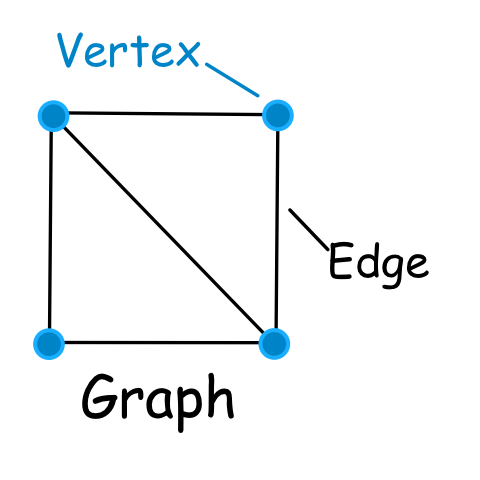
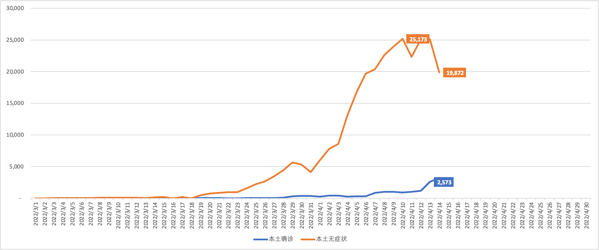
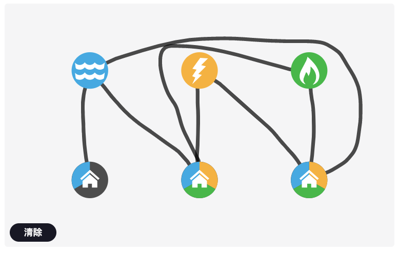
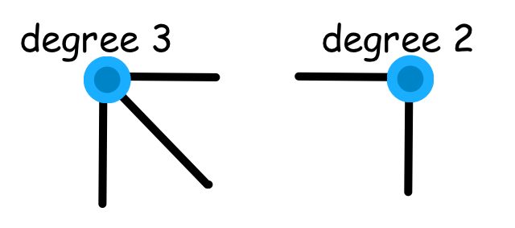
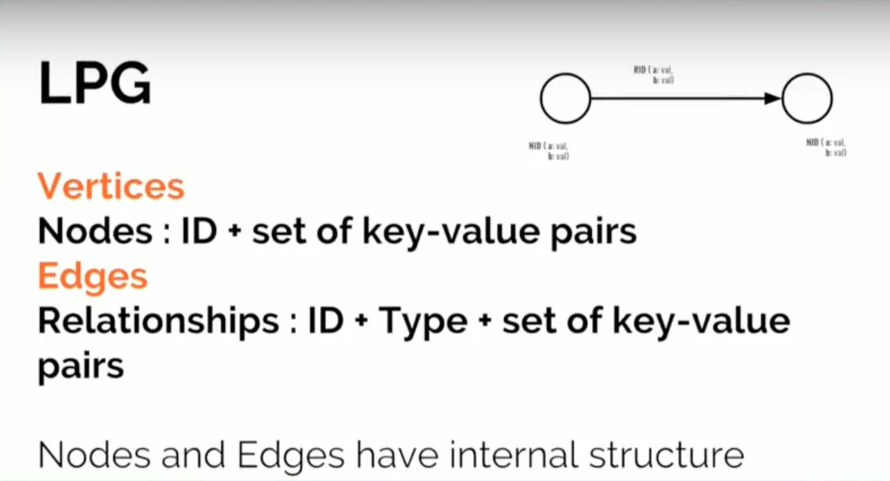
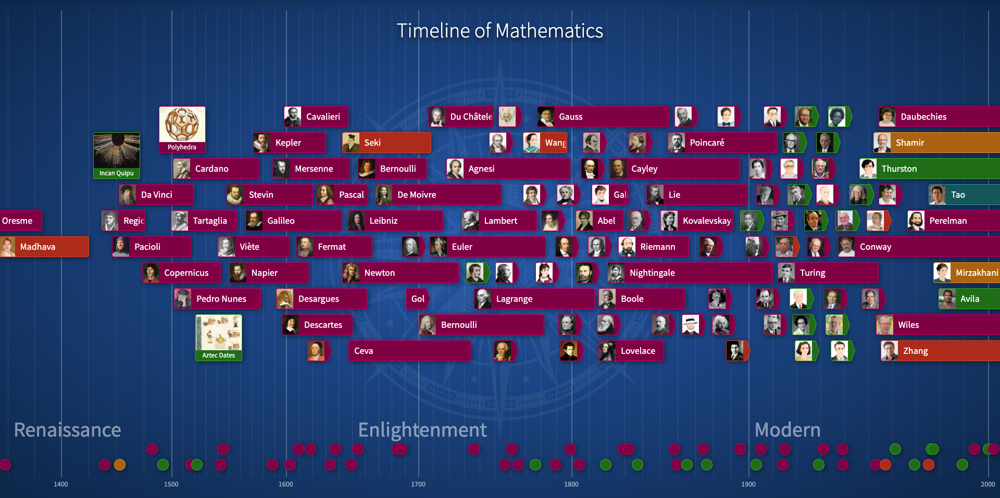

# ¡Hola Euler! 图数据库的理论基础：图论

¡Hola是西班牙语的Hello，读作“欧拉”。

今天是4月15日，1707年的今天，历史上伟大的数学家之一 Leonhard Euler 出生。欧拉发明了许多现代数学术语和符号，并在微积分、分析、图论、物理学、天文学和许多其他主题上取得了重要发现。

我也终于开始写这样一篇文章来介绍一下图数据库的理论基础和本质：数学里的图论。我无法做到深入讲解图论，但是我跟你分享我的一些理解和发现。希望对你有帮助，点燃你对图技术的兴趣。

因为今天是Euler的生日，所以我们将今天作为#GlobalGraphCelebrationDay，感兴趣的可以根据这个标签找到更多的信息。

## 图论是什么

不管你有没有发现，在我们日常生活中，比如从家里出发到公司的交通路线、电话或互联网的设备连接和交互方式、你的社交网络朋友圈、甚至神经元或元素的构成等等等等。这些例子都是由相互连接的事物组成。

### 图和图论的定义

在数学领域，类似这样的例子可以使用图（Graph）来表示，图是**由若干给定的顶点（Vertex）及连接两顶点的边（Edge）所构成的结构**。图用来描述事物之间的特定关系，顶点用来代表事物，边用于表示两个事物之间具有这种关系。

如图所示，这是一个图结构。

记住，图结构是上面的样子，而不是图表（Chart）或图像（Image）哦。下面这个是图表的例子。

根据定义，图论（Graph Theory）是研究图结构的数学分支，属于离散数学，和群论、拓扑学等其他分支有着密切关系。

在计算机领域，使用图数据结构来表示数学中的图结构，是数学知识的具体应用。我们稍后会稍微详细介绍一下。

普遍认为Euler是图论的创始人，因为他使用图的方法解决了著名的七桥问题。

### 七桥问题

传说在Euler那个时代，当时东普鲁士柯尼斯堡市区跨普列戈利亚河两岸，河中心有两个小岛。小岛与河的两岸有七条桥连接。Euler应该经常去散步，逛得有些厌烦了，所以提出了这么一个问题：

**在所有桥都只能走一遍的前提下，如何才能把这个地方所有的桥都走遍？**

但Euler毕竟是数学家，反手就解决了这个问题，证明了没有方法能够一遍不重复地走完这七座桥，还发表了论文。

这也是有名的“一笔画”问题。聪明的读者你可以试试如何用一笔画完成这几个图：

### 其他图问题

除了七桥问题，还有很多著名的图问题。

#### 握手定理

您已被邀请与您的朋友一起参加一个精彩的生日派对。包括你自己和主人共有5人。晚上，当客人准备离开时，每个人都与其他人握手。一共有多少次握手？

#### 四色定理

你知道吗？只需要4种不同的颜色，就可以给一张地图不同的区域着色，使得任何相邻的区域的颜色都不相同。

#### 旅行商问题

一个旅行商需要从自己城市出发，去拜访客户，如何做到访问每个城市一次并返回自己的城市呢？

#### 公共设施供应问题

在一个小村庄里，有三间房屋和三座生产水、电和煤气的公用设施。我们必须将每个房屋连接到每个公用设施，但由于村庄的布局，不同的管道和电缆不允许交叉。

## 稍微深入图数据结构

有了数学模型（图论）的支撑，和解决数学模型的算法一起，在计算机领域就可以用来解决实际问题了。数据结构对于开发人员非常重要，或许每天都在和不同的数据结构和算法打交道。常见的数据结构由集合、线性、树和图等等。

### 多一些定义

前面给出了图的定义，图由顶点（Vertex）和边（Edge）组成。我们表示图结构就使用圆圈表示顶点，连线表示边。这里还有一些基本概念。理解这些概念对于掌握图算法非常有帮助。

### 无向图

一个图结构中，我们知道边是连接两个顶点的，不考虑边有没有方向的场景下，这样的图结构称为**无向图**。

### 有向图

顾名思义，我们定义结构的时候决定了边是有方向的，去和回是两种不同的含义。这时的图就称为**有向图**。

### 加权图

边有表示权重的值，这样的边称为加权边，这样的图就是加权图。默认的图没有权重，就是未加权图。

### 度（Degree）

度就是通向顶点的边的数量。对于有向图，还有入度和出度的概念，入度是指指向当前节点的边的数量，出度是指从当前节点往外的边的数量。

### 子图

通过从一个图里筛选出顶点和边而形成的新图，称为子图。如图所示彩色标注的就是子图。

### 环（Cycle）

第一个顶点和最后一个顶点相同的图称为环。所有环都有相同数量的边和顶点。

### 路径（Path）

图结构最重要的就是能够很直观表示从一个顶点到另一个顶点的路径（Path），路径表示从起点到终点的顶点序列，路径可以是有方向或无方向的。

每个顶点访问一次的路径称为**简单路径**。每条边访问一次的路径称为**欧拉路径**。

## 稍微介绍一下图算法

### 图遍历（Traversal）或图搜索

图遍历是访问或更新图中每个顶点的过程。他们访问顶点的顺序用于对遍历进行分类。实现图遍历有两种方式，深度优先搜索（DFS）和广度优先搜索（BFS）。

图遍历算法通常是其他算法的核心组件。

### 寻路算法

基于图遍历，探索节点之间的路径，一般用来搜索最短路径或最优路径。

常见的有最小生成树、Dijkstra 最短路径、A*最短路径，以及随机游走等等。

### 中心度算法

中心度算法在图中找到重要的顶点，“重要”可能是有很多直接关联、传递连接到其他顶点、通过几跳达到其他顶点或位于很多路径的最短路径上。

常见的有度中心性、接近中心性、特征向量中心性等。

还有PageRank也是一种中心度算法哦。在我曾经做SEO的时候，就非常关注网页的PageRank值。这背后的算法就是基于图的。

### 社区检测算法

社区的概念表示顶点的聚集，社区检测算法用来评估这样的聚集或划分，以及它们的加强或分裂的趋势。

常见的算法有强连通分量、Louvain、模块化优化和标签传播等等。

### 链接预测

这是一个很悠久的算法，出名于社交网络分析：给定社交网络的快照，我们能否推断出成员之间在未来将发生哪些新的互动？

链接预测可以用到ML机器学习的监督学习进行，可见图算法在AI/ML领域的发展前景非常可观。

### 连通特征提取

进入ML机器学习时代，我们的特征工程是非常耗时的，因为图的连通特性，具备上下文和关联，因此在特征提取方面大显身手。

### 图嵌入

在AI/ML和深度学习中，使用的数据通常是二维向量，很难直接使用图数据结构。图嵌入就是为了将图结构表示为低维度的向量，便于在深度学习中使用。

## 图数据库

所以，什么是图数据库？跟图论、图数据结构和算法有什么关系？

从图结构来看，图算法就是基于图结构专门设计的，也可以看到在很多实际问题中，很自然地就可以用图结构来表示。

所以，图数据库提供了两方面的能力：图数据结构的存储，和图算法的支持。以此来实现使用图的方式来解决实际问题。

### 图数据模型

在图数据库中，对于图结构的存储也有不同的方法。

我最喜欢的就是**标签属性图（LPG：Labeled Property Graph）**，它非常直观的反应了现实问题的结构，无论从业务分析还是数据建模，以及到查询，都能很直观的进行。

另一种结构是**RDF（资源描述框架，Resource Description Framework）**，RDF使用三元组来表示，是W3C的语义网络标准。

### 图数据的存储方式

图数据结构常用三种方式来表示：**邻接列表**、**邻接矩阵**和**关联矩阵**。

不同的图数据库对于图数据的存储也不同，比如有的在另一种NoSQL库里存储图数据。

这里需要提到一个概念是**原生图存储**，表示存储架构专门为图数据结构而设计和构建。能够在各个方面针对图数据结构进行优化。另一方面，原生图存储使用**无索引邻接（Index-free Adjacency）**来实现数据的查询和处理。

### 图数据库的使用场景

从前面提到图问题里可以看到，现实中有很多场景非常适合图数据技术。

在这里以Neo4j的使用场景为例，可以看到能够覆盖众多场景，感兴趣的欢迎进一步了解。

## 结束

今天是著名数学家欧拉的诞生日，让我们从了解图论开始进入图的世界吧。

本文介绍了图论和图数据结构的基本概念，还介绍了图的一系列算法，以及图数据库在存储和算法方面的支持。还看了一些图数据库及图技术的使用场景。

欢迎交流和进一步讨论这个话题哦。

有兴趣的还可以访问这个网站了解数学家和他们的故事。

### 参考资源

https://globalgraphcelebrationday.com/

https://www.mathsisfun.com/activity/seven-bridges-konigsberg.html

https://www.geeksforgeeks.org/graph-data-structure-and-algorithms/

https://neo4j.com/developer/graph-data-science/graph-algorithms/

https://mathigon.org/timeline/euler