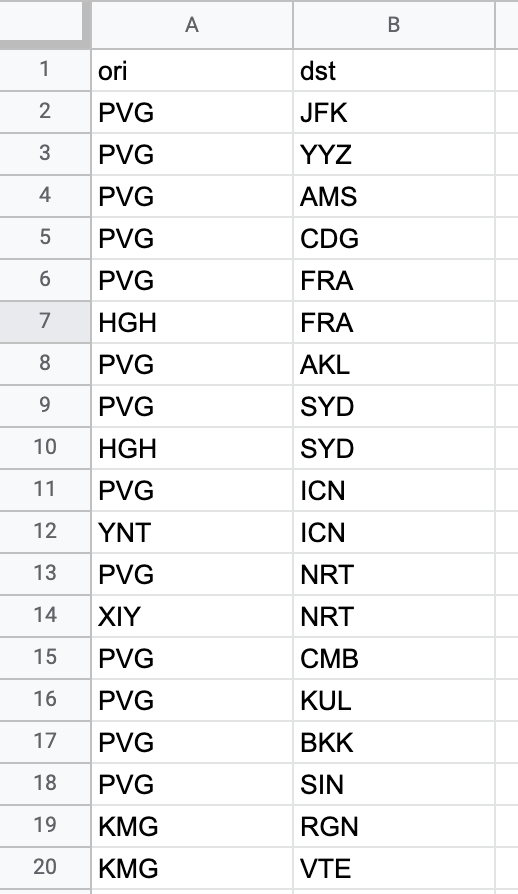
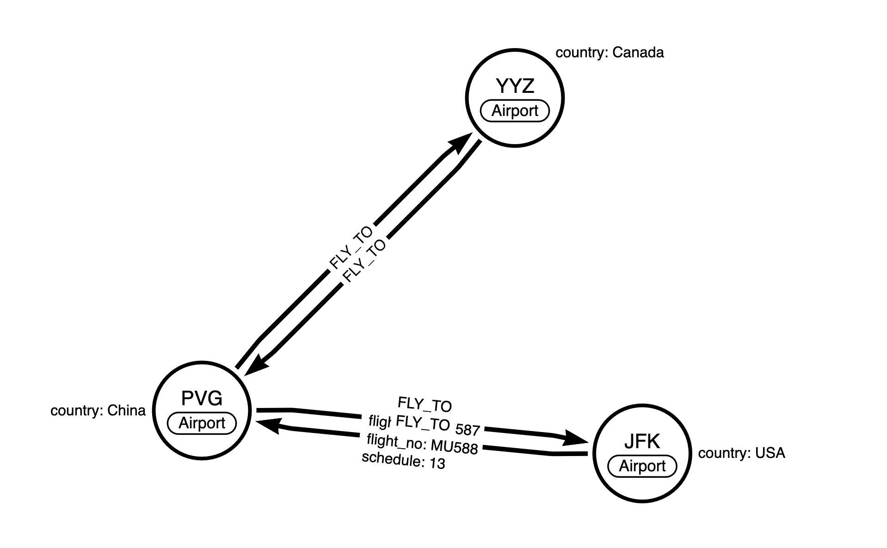
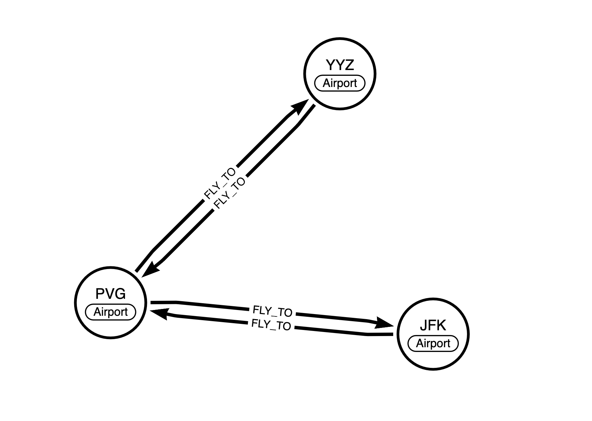

# 我的第一个图数据模型：使用Neo4j存储航班计划数据

目录：

介绍什么是图数据库平台

什么是Neo4j

任务介绍，对航班计划数据建模并使用Neo4j存储

数据来源

数据集

数据模型设计

加载数据到Neo4j

使用Cypher查询

知识点介绍，后续展望

---

最近我一直在使用图数据库平台[Neo4j](https://neo4j.com)。图数据库（Graph Database）是一种将数据之间的关系视为与数据本身同样重要的数据库，它使用了图数据结构。现实世界的数据都是相互关联的，我们不管从什么角度分析业务，都需要处理数据之间的关系。图数据库就非常适合用来管理高度连接的数据和复杂的查询。

我迫不及待地想跟你分享现实中很多数据多么适合使用图数据库平台来存储和处理，而Neo4j就是这样的集存储、计算、数据科学和应用集成的一个完整平台。

这篇文章介绍如何将真实的数据集存储到Neo4j，并使用Neo4j的工具来查询展示这些数据。希望通过这篇短文，你可以对图数据的建模、Neo4j的查询工具有所了解。涉及到的其他相关概念，比如Neo4j的完整架构和工具链，应用集成的方式，图数据库的优势等，我们会在后续的文章展开来讲。

## 准备数据集

疫情爆发以来，航空旅游行业受到极大的影响，航班计划也经常随着政策而变化。我之前在航空业的公司工作过多年，在使用图数据库平台的时候，首先就想到了航班计划数据。今天就让我们以东方航空最新公布的航班计划数据为例，来看看使用图数据库Neo4j将如何存储它们。东航的[2021年9月1日至9月30日东上航国际航班计划通告](http://www.ceair.com/about/jjgg2016/202108/t20210831_19747.html)里列出了东方航空9月的国际航班计划表，如图：


航线表示航班从始发地到目的地的行程，表格里还有目的地所属的国家、航班号、班期等信息。我们先把表格数据进行一些整理，将始发地机场和目的地机场分开成为两栏，同时转换为机场的标准三字码（我可以告诉你，我能记住很多机场三字码）。


我们知道，一条航线就是航班从始发地飞到目的地的行程，两个机场之间的关联关系就是航班飞行，因为飞行是有方向的，我们把目的地和始发地反过来就能够表示回程航班，目的地就变成了始发地，它们之间的关系也是航班飞行。我们去除重复数据，将dst和ori反过来的数据整合到文件后面，航班飞行的关系是从ori到dst，数据集里面可以省略，然后将数据存到一个csv文件里，数据集就成了如图这样，存到电脑里备用。



## 数据建模

然后，我们对数据进行建模，需要设计好数据的存储结构和关系。关系型数据库使用ER模型，在这里可能需要3张表，机场信息表和航班信息表，还需要一个单独的航班飞行计划表，通过外键来关联机场和航班信息。但是，在图数据库的建模里，我们[使用如图这样直观的建模](https://arrows.app)，直接把数据实体和它们之间的关系画出来，数据实体在图数据库里叫做节点，节点之间的连接叫做关系。在节点和关系上都可以添加属性来存储信息。我们用节点表示机场信息，机场之间的关系是航班飞行，也就是关系。



节点和关系上面还有一些其他的属性，比如所属国家，航班号和班期等，但我们这里简化这个模型，只关注航线，我们用FLY_TO表示航班飞行的关系。所以我们的模型看起来是这样的：



## 使用Neo4j存储数据

接下来，我们就使用Neo4j把前面的航班计划数据加载到数据库。在这里使用Neo4j Browser运行下列Cypher语句：

```cypher
LOAD CSV WITH HEADERS
FROM 'file:///MU_Flights_Sep.csv' AS line
MERGE (ori:Airport{code:line.ori})
MERGE (dst:Airport{code:line.dst})
MERGE (ori)-[:FLY_TO]->(dst)
```


可以看到添加了21个标签，创建了21个节点和40个关系。我们现在可以查询存储好的数据了。在Neo4j Browser的查询框输入并运行：

```cypher
MATCH (n) RETURN n
```


通过Graph展示，我们能清楚的看到机场和航班飞行关系。

## 小结

怎么样，通过这个例子，相信你知道了Neo4j图数据库平台，以及对于现实数据是如何将关系和数据本身一起设计和建模。如果对本文有任何想法和建议，欢迎联系我，我这里有很多内容还想和你分享，我们下一篇见。