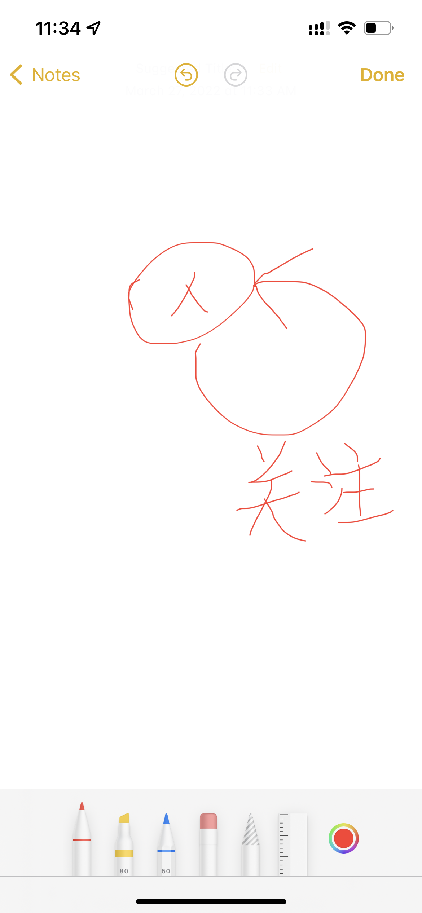
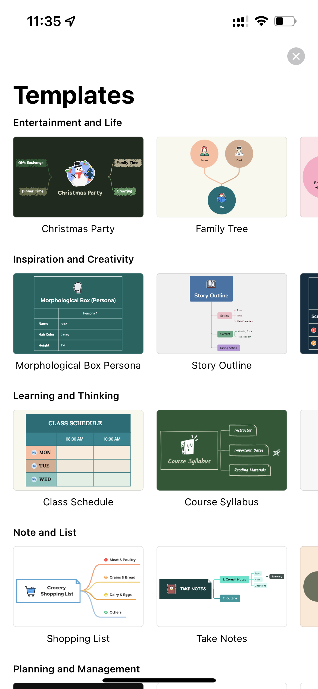

# 1分钟学会图思考（Graph Thinking）

## 关系无处不在

不管你是否意识到这样一个事实，我们每天都在跟**图（Graph）**打交道。

早上醒来，**你** *拿起* **手机**，刷了一下微信，看看今天小区解封了没有，**你**从刚*关注*的**朋友**那里看到已经解封的通知了。

赖床了一会，**你** *叫醒* **孩子**，早上还有一节网课要上。

安排好早饭和网课后，然后想着去超市买点菜，看着导航从**家里**到**超市**的*路线*一路畅通，超市那边好像交通管制有点堵，还好一切顺利。

……

说图思考之前，我们要先说一个概念，叫做”关系“。

看上面的场景里，有粗体字和斜体字，我再换个表达方式：

`(你)-[拿起]->(手机)`

`(你)-[关注]->(朋友)`

`(你)-[叫醒]->(孩子)`

`(家里)-[经过]->(路口1)-[经过]->(路口2)-[经过]->(路口3)-[经过]->(超市)`

你发现有什么明显不同吗？对的，我把“关系”放到更明显的位置了，这样我们就能关注到，我们的日常生活，其实都是在跟其他人或物进行“互动”，这些“互动”就是人或物之间的关联关系。

## 关系有什么用

我们为什么关注“关系”呢？

关系表示我们跟别人的互动，这些互动是如此的自然以至于我们已经习以为常了，把它们当成了生活很随意的一部分。但是如果我们关注这些互动，至少让我们能够感受到我们互动的过程……

（不严谨的）我把关注关系和互动的这种模式叫做“图思考”。

更进一步，前面提到的图（Graph），就是这些人或物和关联关系共同组成的一种结构，在计算机科学领域里，这是一个特别的方向。

## 图思考应该怎么做

那么可以怎么做呢？是按照上面那种给人和互动加上括号吗？

我推荐一种更直观的方式，就是画出来，我们使用圆圈表示人或物，用带箭头的线表示关系。可以用真的笔和纸来做，也可以用电脑或手机上的软件来做。

第一个工具是手机自带的笔记，打开画图模式。比如人之间的关注关系，可以用下图表示。

是不是很简单，当然你也可以更具体一点，比如另一个工具是XMind，打开之后有一个家谱的模板：

我们用XMind可以画一个家庭关系图（树）：

在实际进行图思考的过程中，可能没有这么简单的结构，我们可以随意添加更多的圆圈来表示更多的人或物，可以在圆圈之间随意添加更多的箭头来表示互动关系。

不知道，你能绘制出什么样的图（Graph）呢？不妨直接发给我。
