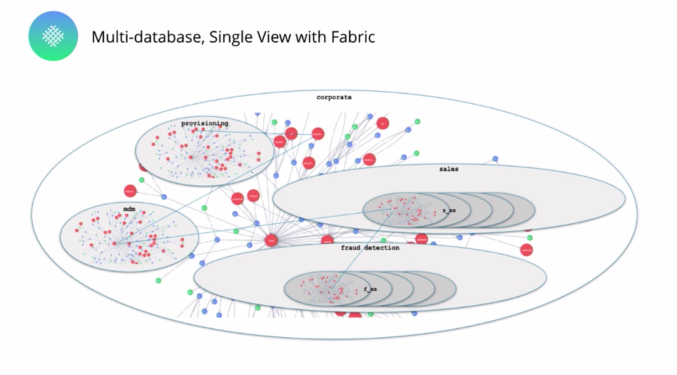

# Neo4j 4.x 版本历史更新一览

今天社区里有小伙伴提问，Neo4j 4.x相比3.x的最大变化是什么？为什么要选择4.x呢？我觉得这个问题非常值得探索，所以我将找到的一些信息分享给大家。

## Neo4j 的历史版本

从Neo4j官网可以看到，Neo4j公司是在2007年创立，同时发布了第一个开源版本。正式的1.0版本是在2010年发布的。从Release Notes里可以找到：

Neo4j 1.0：2010年

Neo4j 2.0：2013年12月

Neo4j 3.0：2016年4月

Neo4j 4.0：2020年1月

其中还有一个重要的小版本，从Neo4j 3.5开始，Neo4j从社区版和企业版都开源的模式，转换到了核心开源而企业版属于增值服务的模式，这是一种非常常见的开源商业模式。但Neo4j 3.5的用户基础很庞大，所以即使到现在（2022年了），Neo4j 3.5版本还是在官方支持时间表中，不过也请注意，从官方的支持表中也可以查到，Neo4j 3.5截止官方支持的时间点是2022年5月27日。

## Neo4j 4.x 有些什么新功能

我们时间倒退一下，从4.0版本的发布信息里可以看到有如下更新：

- 独立或因果集群的安装模式下，都提供了多数据库支持。
- 元数据库“`system`”在独立或因果集群的安装模式下都能用了。
- 基于Schema的安全性和基于角色的访问控制（RBAC）。
- 提供了角色和用户管理功能。
- 提供了Cypher管理命令。
- 可以使用 Neo4j Fabric 对数据库进行分片和联合访问。
- 具有服务器到客户端流控制的 Java、Javascript 和 .NET 驱动程序。
- 具有`keepalive`信号的Bolt协议。
- 原生索引提供程序的新索引算法。
- 事务日志文件夹可轻松在多个设备上分配 I/O 工作负载。
- 对事务的内存约束控制。
- 新的 `neo4j://` 连接模式，包括Bolt和路由协议，可用于所有版本或安装模式。
- 基于响应式驱动程序 (SDN/RX) 的 Spring Data Neo4j 新实验版本。

这还不是完整的列表，但好像有些不知道在说什么，我们从Jim Webber的博客中可以找到总结的内容：

- 我们现在拥有Neo4j 反应式架构，因此数据库非常灵敏、灵活且健壮。

- 我们已将 Neo4j 扩展到多数据库世界，以便您能够在集群或服务器中同时在线运行多个数据库。

- 我们有一个名为Neo4j Fabric的全新功能，它允许我们对多数据库进行分布式查询。

- 每个开发人员都需要安全性功能，所以我们现在有了一个有趣且创新的基于Schema的安全模型。

### 反应式架构

Neo4j 4.0 版本的架构发生了变化，采用了反应式宣言（Reactive Manifesto）的架构模式，让系统更健壮和灵活。

### 多数据库支持

我知道社区里有一些奇怪的技术来实现多数据库，但是从4.0版本开始，Neo4j数据库本身具备了多数据库支持。

### Neo4j Fabric：用于水平可扩展性的分布式运行时

在Neo4j 4.x里是一个企业版才用的重大功能。提供**多数据库分布式查询**。实际上，我们只需要编写 Cypher 代码，Fabric 弄清楚如何在网络上传输查询——它以我们的数据库为目标来并行执行查询，并收集结果。

### 企业安全性增强

一种基于角色的访问控制方法，它对用户实体的权限，我们在其中授予对数据库的访问权限，然后有非常细化的命令`GRANT/DENY`和`REVOKE`，针对任何粒度级别——从图、节点、关系、属性一路通过数据库并向下级联。

可以看到，这是一个非常大的版本。许多内部 API 发生了变化。更详细的变动，我们也可以从操作手册里找到“升级和迁移指南 》
Neo4j 3.5 和 Neo4j 4.x 之间的重大变化”这一章，分门别类地介绍了详细的各项配置参数变化，如果你要迁移到4.x，就务必仔细参考进行操作。

## 我该选择哪个版本呢？

这样看来其实要做出选择就不难了。

如果》你有遗留的Neo4j应用系统：

可以继续使用3.5版本，但请注意官方支持的时间窗口和补丁更新。

如果》你是要新建Neo4j图数据应用：

强烈推荐4.x的版本，截止目前最新的版本是4.4.5，除了上述的更新外，其实还有更多的小更新在各个版本中。另外云端的AuraDB也都是基于4.x的版本，而且无需自己管理底层架构。

同时最新版本中的开发者工具都得到了更新和改进，为学习图技术和图数据库提供了更丰富的帮助。

如果你对检验自己的技能水平有兴趣，Neo4j官方还专门为4.x版本提供了一个考试。会涵盖Cypher的新功能、多数据库功能、企业安全性和Fabric等方向。

## 结束语

希望本文能为你解决一些迷惑，我们后续的课程和讲解也都会基于4.x版本来进行，欢迎持续关注。

https://neo4j.com/company/

https://neo4j.com/release-notes/

https://neo4j.com/release-notes/database/neo4j-2-0/

https://neo4j.com/release-notes/database/neo4j-3-0-0/

https://neo4j.com/release-notes/database/neo4j-4-0-0/

https://neo4j.com/release-notes/database/neo4j-3-5-0/

https://neo4j.com/open-core-and-neo4j/

https://neo4j.com/developer/kb/neo4j-supported-versions/

https://neo4j.com/docs/upgrade-migration-guide/current/migration/surface-changes/configurations/

https://neo4j.com/blog/neo4j-graph-database-4-0-ga-release/

https://www.reactivemanifesto.org/zh-CN

https://neo4j.com/graphacademy/neo4j-certification-40/