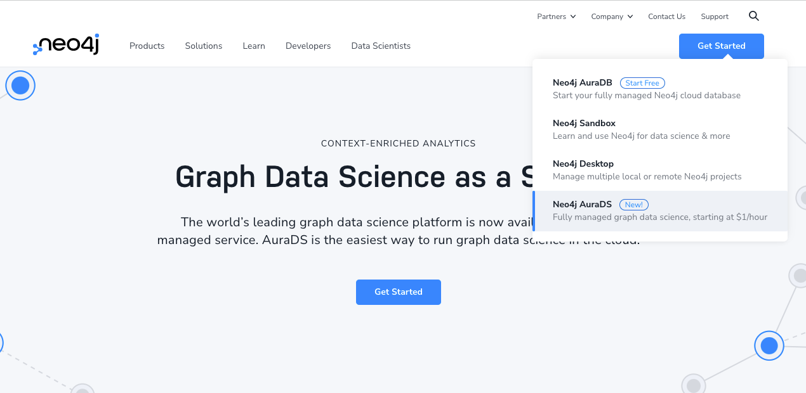

# 准备好进入图数据科学领域了吗？

2022-04-18

你知道Neo4j的主要用户有两类吗？

**开发者**：把Neo4j当作底层数据库使用，用来存储关联数据，然后使用自己喜欢的编程语言开发上层应用，可用于业务系统，因为Neo4j支持ACID。

**数据科学家**：包括数据分析师、机器学习开发者等等，他们使用Neo4j不仅仅是存数据，大部分时间需要基于图算法对数据进行分析，开发机器学习模型进行预测。

最近，Neo4j的官网改版，增加了新产品入口，不知道你有没有发现。

## 什么是GDS（图数据科学，Graph Data Science）？

今天主要介绍近期更新的GDS，如果你是新来的……Neo4j GDS 是一个图分析和建模平台。通过使用图算法和机器学习（ML），数据科学家可以识别模式和行为，用于改进他们的模型，以便在推荐引擎、欺诈检测、路线优化和客户360场景中使用。

先看看这次发布了什么：

1. **GDS 2.0**：版本2.0正式发布，更新了很多功能，提供超过60种图算法。
2. **原生Python客户端驱动**：发布了Python的GDS专用客户端驱动。

GDS 2.0适合Neo4j4.3以上版本使用，可以访问GitHub代码库页面了解详情。

原生GDS的Python客户端驱动则提供了更直观的GDS调用，相比Python客户端，无需考虑数据转化到图，可以直接调用图算法，图数据转化方便等等优势。

## 跟Neo4j 数据库的对比

我这里不涉及到详细的功能特点等，从两个方面给大家对比一下数据库和数据科学的区别。

首先从基本特点比较一下，可以通过此图了解：

是不是有了一个相对清晰的了解了？

作为数据库的Neo4j，用于OLTP，因为支持ACID，很多业务应用直接使用Neo4j进行，这时传统的用法。另一方面，对图数据的分析和机器学习/人工智能需求的增长，用于OLAP的场景也越来越多。

再从一些应用案例进行对比，可以看此图：

可以看到GDS在支持分析方面的优势有很多，提供的图算法也能满足多种应用的分析需求。

另一方面，对于AI/ML的集成也能通过GDS来实现和无缝衔接到现有的项目中。

现在就来尝试一下吧。

### 参考资源

https://github.com/neo4j/graph-data-science

https://github.com/neo4j/graph-data-science-client

