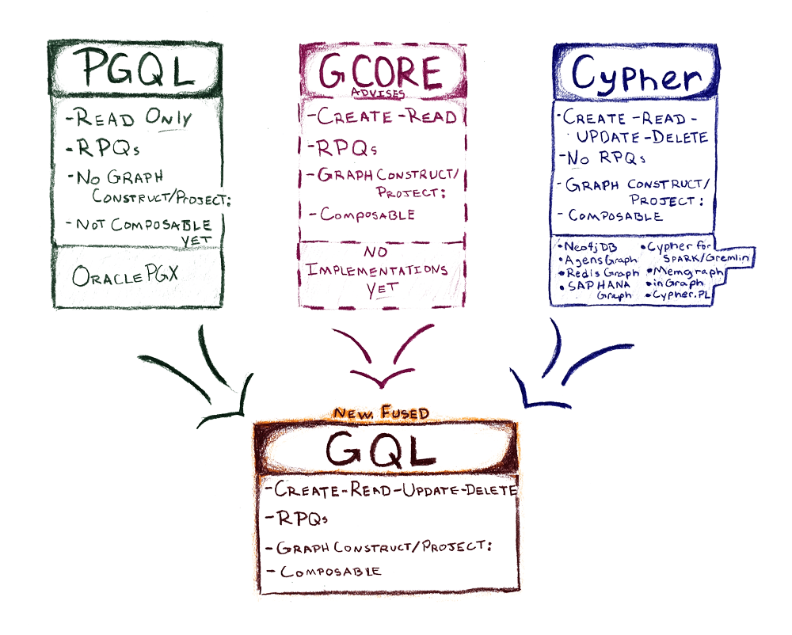

# 手把手快速上手 Cypher 查询语言

2022-04-19


欢迎回到手把手快速上手系列，今天的主角是Cypher！就是他～

但不是他，今天聊的是图数据库的查询语言。

## 图查询语言（Graph Query Language）

或者叫图数据库查询语言。但是今天聊的不是GraphQL，它又是另外一个主题。

所以先回到我们的主题：图查询语言。

如果你知道SQL（结构化查询语言，Structured Query Language），就很容易为什么需要图查询语言。不知道SQL也没有关系。我们继续。

### 为什么需要图查询语言

我们已经了解过图数据模型是用来表示关联数据的，也了解过图数据库的存储使用了图数据结构，甚至还了解过图论和图算法。但是在实际使用图数据库的时候，每个开发者、架构师、分析师、数据科学家和业务人员都需要一种具体的机制来创建、操作和查询数据。

大多数关系数据库（RDBMS）使用SQL或变体来作为查询语言，因为关系数据库按表格存储数据，SQL的设计就是用来处理这种二维的数据表。但是图数据的结构有很大的差别，而且图数据的查询有一些语义层面的区别，比如SQL是获取表格数据，图数据是用来进行模式匹配或路径查询。而且图数据建模（*还没有讲，后续会有*）的方式跟业务非常接近，而关系数据库的模型更偏底层存储。

所以图数据库需要属于图数据专有的查询语言。

### 有哪些图查询语言

GQL（Graph Query Language）是一种标准图查询语言，获得了ISO/IEC联合技术委员会的批准，旨在成为一种统一的基础标准。


GQL项目提案指出：

图数据模型能够高效执行昂贵的查询或需要观察数据实体之间的多跳关系的数据分析功能，例如可达性查询、最短或最便宜的路径查询或中心性分析。目前使用的图模型有两种：**资源描述框架（RDF）模型**和**属性图模型**。RDF 模型已被 W3C 在许多规范中标准化。另一方面，Property Graph 模型在图数据库、图算法和图处理设施中有大量实现。但是，缺少用于属性图的通用标准化查询语言（例如用于关系数据库系统的 SQL）。GQL 旨在填补这一空白。

既然还是空白，那也就意味着目前的方案有着很大的发展空间，也意味着这个行业还需要更多的人来参与。

GQL也不是SQL的竞争对象，就像大多数企业里也有多种不同的数据库系统一样，它们是并存和解决不同业务问题的。




## 快速上手学习Cypher

Cypher 是 Neo4j 的图查询语言，是一种声明式查询语言，允许对图进行表达性和高效的查询、更新和管理。它就像用于图的 SQL，它让你专注于想要从图中获取哪些数据（而不是如何获取它）。Cypher 旨在为开发人员、数据库专业人员和业务利益相关者等人轻松阅读和理解。它易于使用，因为它与我们使用类似白板的图表直观地描述图形的方式（即我们直观地描述数据的方式）相匹配。

Cypher 的基本概念是它允许你要求数据库查找与特定模式相匹配的数据。通俗地说，我们可能会要求数据库“找到类似这样的东西”，而我们描述“类似这样的东西”的方式是使用ASCII 字符来绘制它们。

与 Neo4j 本身一样，Cypher 是开源的！ openCypher 项目提供了所有需要的规范。Cypher 得到了许多公司的支持，所有这些公司都从 Cypher 中受益。

### 现在开始

你可以在Neo4j Browser里输入`:play cypher`开始教程。


下面是今天的快速上手介绍。

### 在Cypher中表示节点

```
()                  //匿名节点，可表示数据库中任何一个节点
(p:Person)          //定义变量 p 表示节点，限定节点标签为 Person
(:Technology)       //匿名节点, 但有标签限定为 Technology
(work:Company)      //定义变量 work 和标签 Company
```

如代码所示，Cypher里使用**半角小括号**表示节点，可以定义变量和限定标签，也可以支持多个标签。

### 在Cypher中表示关系

```
//创建有方向的关系LIKES
CREATE (p:Person)-[:LIKES]->(t:Technology)

//查询指定方向的关系
MATCH (p:Person)<-[:LIKES]-(t:Technology)

//查询时可不指定方向。可以为关系指定变量名
MATCH (p:Person)-[r:LIKES]-(t:Technology)
```

Cypher里使用**半角中括号**表示关系，可以指定变量和标签。

### 在Cypher中表示属性

节点和关系都支持属性，在Cypher中使用**半角大括号**表示，属性和值采用key - value的模式，支持多种不同的数据类型，类似JSON。比如

```
//节点上的属性
(p:Person {name: 'Jennifer'})

// 关系上的属性
-[rel:IS_FRIENDS_WITH {since: 2018}]->
```

### 在Cypher中表达模式

节点和关系构成了图数据模型的基本构建块。这些构建块可以组合在一起来表达简单或复杂的模式。模式是图的强大能力。在 Cypher 中，它们可以写成连续的路径，也可以分成更小的模式并用逗号写在一起。

```cypher
(p:Person {name: "Jennifer"})-[rel:LIKES]->(g:Technology {type: "Graphs"})
```

这段 Cypher 告诉了我们想要的模式，但它没有告诉我们是要找到现有的模式还是将其作为新模式插入。为了告诉 Cypher 我们希望它对模式做什么，我们需要添加一些关键字。

### Cypher里的关键字

模式匹配即Pattern Matching，所以第一个关键字叫做`MATCH`，用来搜索数据库里的节点、关系或模式，以及属性。类似SQL里的`SELECT`。

返回结果，在Cypher里用`RETURN`。比如这个查询。

```cypher
MATCH (tom:Person {name: 'Tom Hanks'})
RETURN tom
```

Cypher里的创建数据不是`INSERT`，而是`CREATE`，因为图数据里不是简单地插入数据，而是创建节点、关系、属性或模式。

比如这个查询，是用来创建关系。

```cypher
MATCH (jennifer:Person {name: 'Jennifer'})
MATCH (mark:Person {name: 'Mark'})
CREATE (jennifer)-[rel:IS_FRIENDS_WITH]->(mark)
```

更新属性使用`SET`，比如代码：

```cypher
MATCH (p:Person {name: 'Jennifer'})
SET p.birthdate = date('1980-01-01')
RETURN p
```

删除节点或关系使用`DELETE`，要注意的是Neo4j是ACID兼容的数据库，无法删除有关系的节点，这时使用`DETACH DELETE`先解除关系再删除节点。

```cypher
MATCH (m:Person {name: 'Mark'})
DETACH DELETE m
```

删除属性有两种方式，使用关键字`REMOVE`或`SET`的时候把值设为`null`。

要过滤查询结果可以使用`WHERE`关键字，然后跟上过滤表达式。

## 是时候暴露真本事了

熟悉了上面的介绍，我相信你可以开始动手亲自尝试了。现在就打开Neo4j Browser开始吧。

如果你遇到了任何问题，欢迎阅读文档，或者打开这个参考卡：


### 参考资源

https://neo4j.com/developer/cypher/

https://neo4j.com/docs/cypher-refcard/current/

http://opencypher.org

https://neo4j.com/whitepapers/getting-started-with-cypher/