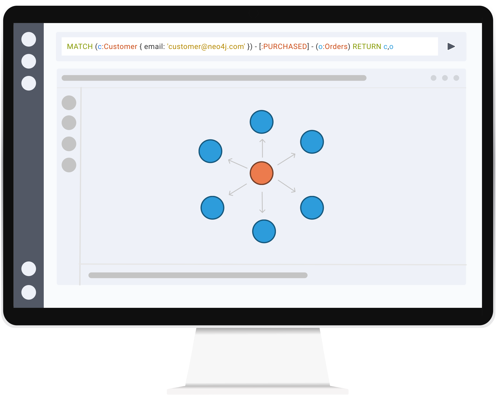
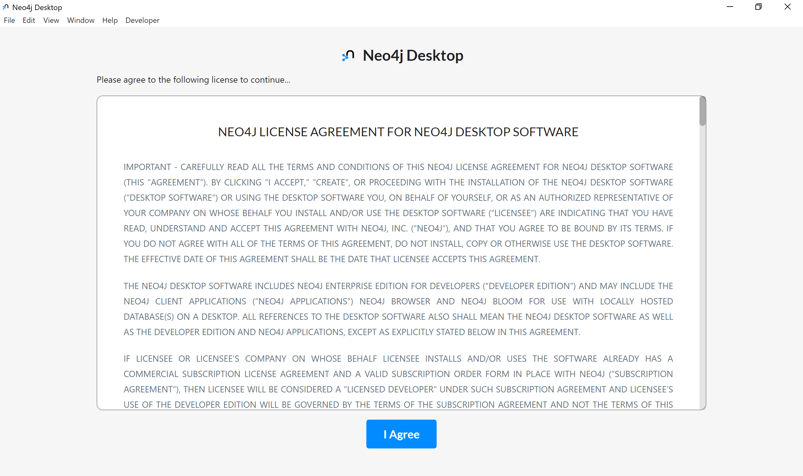
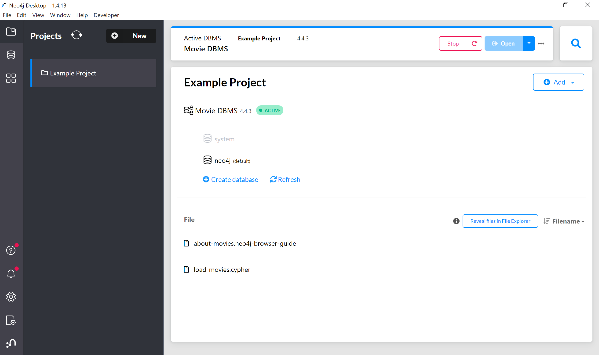
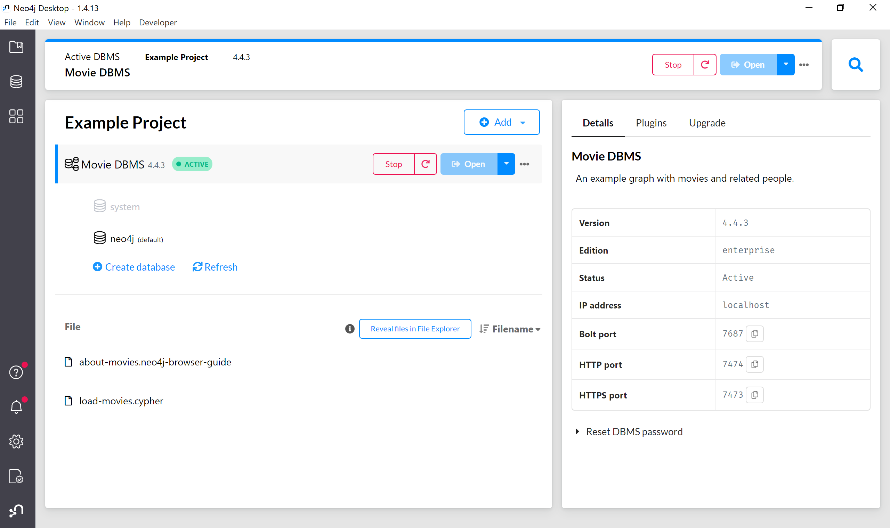
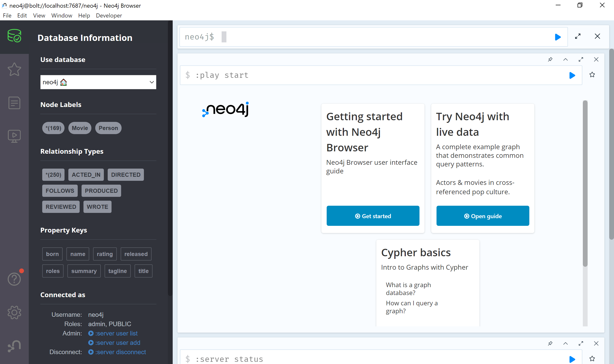
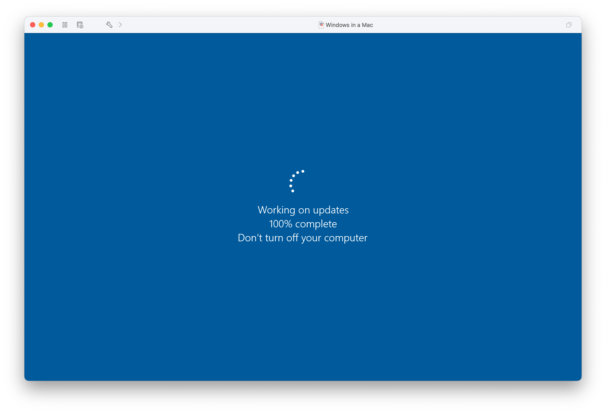
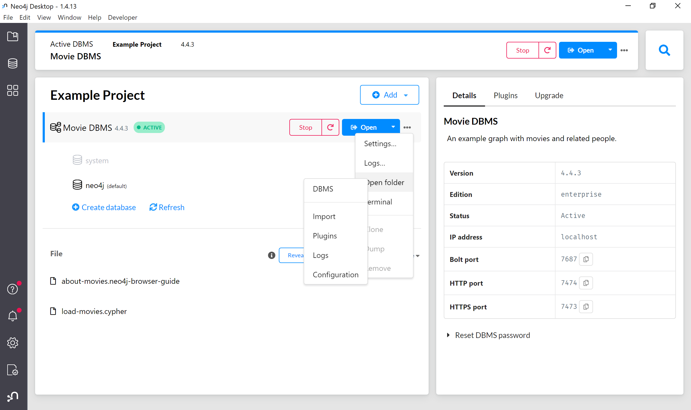

# 手把手快速上手Neo4j Desktop安装和使用

2022-04-02

干货教程来了，欢迎收藏转发，更重要的是请自己动手操作吧。



如果你不清楚为什么用Neo4j Desktop，可以阅读这篇文章了解。


Neo4j Desktop是一个方便、免费的桌面应用，允许开发人员轻松创建、使用和管理本地 Neo4j 数据库，提供了企业版的内核，同时包含Neo4j Browser和Neo4j Bloom，以及可以通过Apps Gallery安装扩展应用。也可以为数据库实例安装APOC和GDS。

那我们从头开始吧。

## 下载

这次我用Windows系统为例。首先请访问Neo4j官网`neo4j.com`，在导航拦右侧的开始使用按钮的下拉菜单里，可以看到Neo4j Desktop的链接，**点它**。


然后就来到了下载页面。点那个很大的`Download`下载按钮。


这一步需要填写表单，然后就开始下载了，同时页面会显示激活密钥，网页先别关掉，留着备用。


## 安装和激活

安装文件下载好了之后，打开它。下一步下一步下一步就可以了。

.png)

完成之后点击完成，系统会为我们自动启动Neo4j Desktop。


因为是第一次启动，会显示软件许可协议，同意后继续。



然后会提示选择应用数据的存储位置。默认会在当前用户下的`.Neo4jDesktop`文件夹里，确定后继续。


然后复制下载网页的密钥，粘贴在右边窗口就可以激活Neo4j Desktop了。


现在等待应用做一些初始化，接下来就可以开始使用Neo4j Desktop了。


## 启动数据库实例

Neo4j Desktop启动后的界面如图，左侧是导航窗口，包含项目、数据库、应用以及通知和设置。右边会按照项目来显示具体的数据库实例信息。默认会创建一个`Example Project`并加载经典的电影数据集。可以看到此时数据库实例已经启动了。



我们把左侧导航折叠起来，选中项目里的数据库实例`Movie DBMS`，这时会展开右侧栏，包含数据库实例信息和重设密码、插件和升级标签。可以看到数据库版本是企业版4.4.3，你也可以通过数据库的API来访问实例。



切换到插件标签，可以看到有APOC和GDS等，在这里可以安装并启用它们。


我们回到左侧导航，可以看到应用一栏显示了默认内置的一些应用。包括用来进行数据库查询和管理的Neo4j Browser，用来数据探索的Neo4j Bloom，以及提供了其他应用的Apps Gallery。接下来我们开始动手操作吧。


## 实战Neo4j图数据库

接下来我们就可以正式开始图技术旅程了，我们从实例的`Open`按钮可以直接打开Neo4j Browser。也可以按右边的小三角可以通过安装的应用来打开当前实例。建议初学者从Neo4j Browser开始，我们会在那里运行Cypher查询语言，来对数据进行CRUD以及可视化。


### Neo4j Browser实战

我们不需要输入数据库实例的连接信息，因为Neo4j Desktop帮我们管理了。Neo4j Browser主要有一个Cypher输入框，以及运行结果的展示，包括可视化，表格和文本等格式。



因为默认项目已经加载好了电影数据集，我们可以运行这个Cypher语句来看看里面有哪些数据吧：

`MATCH (n) RETURN n`


也可以运行`CALL db.schema.visualization`来显示当前数据集的图数据模型：


可以继续了解一些Cypher的基本语法，使用Neo4j Browser就可以看到结果了。

接下来本来要演示一下Neo4j Bloom的，当我启动的时候，虚拟机里的Windows系统崩溃了。



下次再说吧。

### 数据导入实战

社区有不少小伙伴在导入数据的时候觉得麻烦，我这里演示一下。

在数据库实例的`Open`按钮右边有个`…`按钮，点它可以打开菜单，我们选择`Open folder`下的`Import`，这个文件夹是用来存放要导入进Neo4j数据库的数据文件，比如CSV等。



我们把需要导入的数据文件复制到`Import`文件夹里。


然后回到Neo4j Browser里，我们使用`LOAD CSV`命令来进行数据导入，文件路径使用`file:///people.csv`就可以了，比如我们导入文件显示第一行数据，可以使用：

```cypher
LOAD CSV WITH HEADERS FROM 'file:///people.csv' AS line
RETURN line LIMIT 1
```

Neo4j Browser就会去加载文件，并显示结果。


## 问题排查

因为网络或者环境等问题，可能会出错。这边的建议是`重试`（重装/重买）一下呢。

### 第一次启动就失败

有时候在输入密钥激活后的初始化阶段，可能会下载运行时，大概率是网络问题，需要做的就是，重新尝试一下。

### 启动数据库实例失败

原因其实很多，推荐从分析日志开始入手进行trouble shooting，界面上也提供了日志文件的链接，在社区和论坛求助的时候，可以贴出具体的报错信息。然后具体情况具体分析……


### Cypher报错

图数据的操作叫做“遍历”，跟传统的数据查询有些不一样，所以我推荐从“图思考”开始着手，理解关系是如何影响整个数据模型的。Cypher本身也是一个声明式查询语言，可以通过文档了解详细的内容。

## 如何升级

Neo4j Desktop的更新会在启动的时候检查，并进行提示。也可以通过左侧的通知来看看是否有更新的版本。


App的更新在弹出后选择更新就可以了。


## 玩转Neo4j Browser

最后推荐一个玩转Neo4j Browser的方式，就是Browser Guide，请在你的Neo4j Browser里输入下列指令：

`:play movies`

开始你的电影探索之旅吧。

## 参考链接

Cypher语言手册

https://neo4j.com/developer/cypher/

Neo4j Desktop文档

https://neo4j.com/developer/neo4j-desktop/