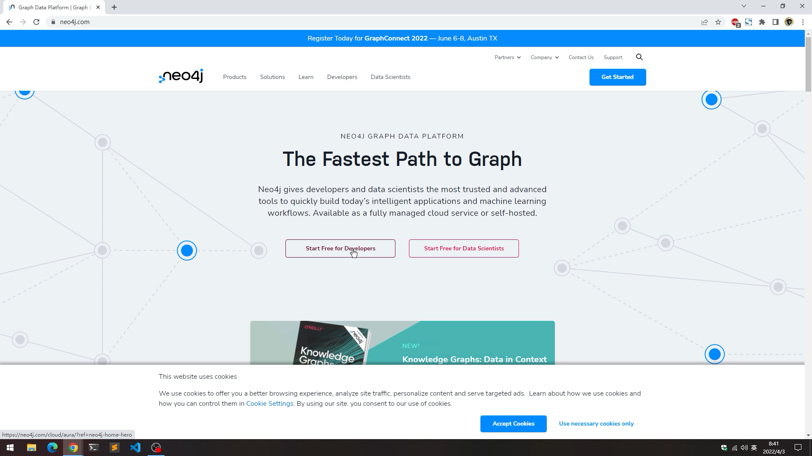
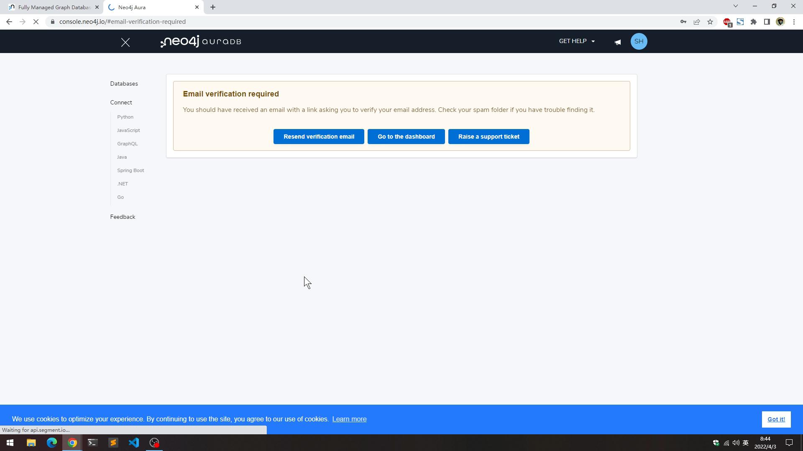
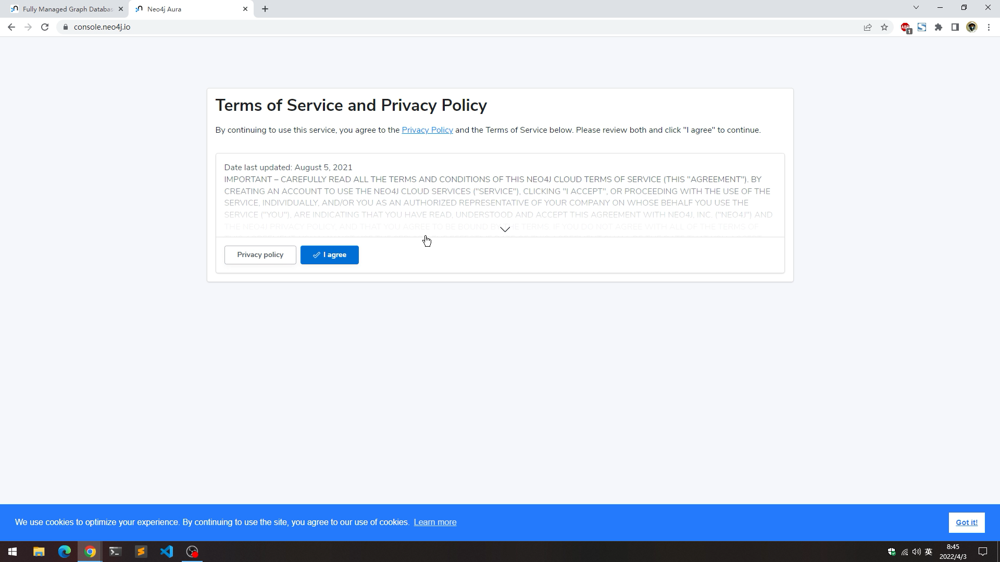
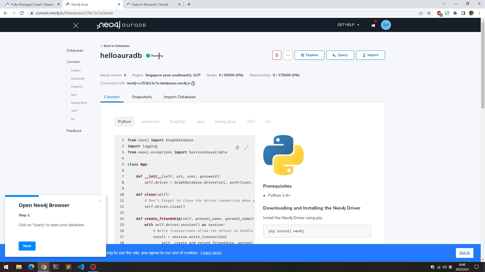
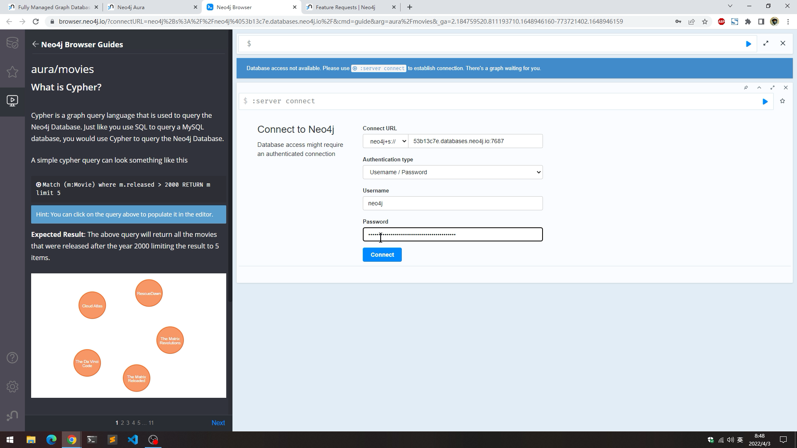
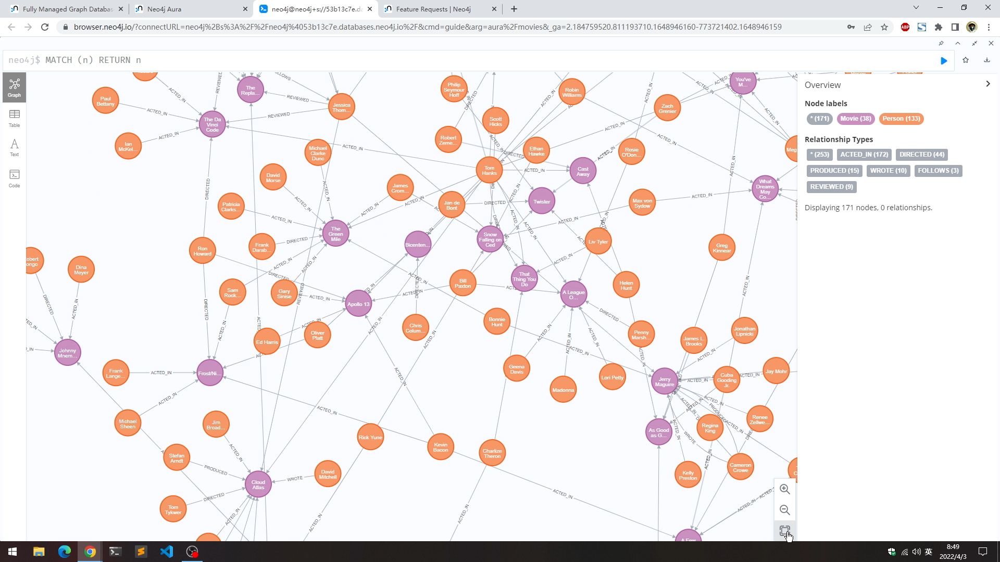
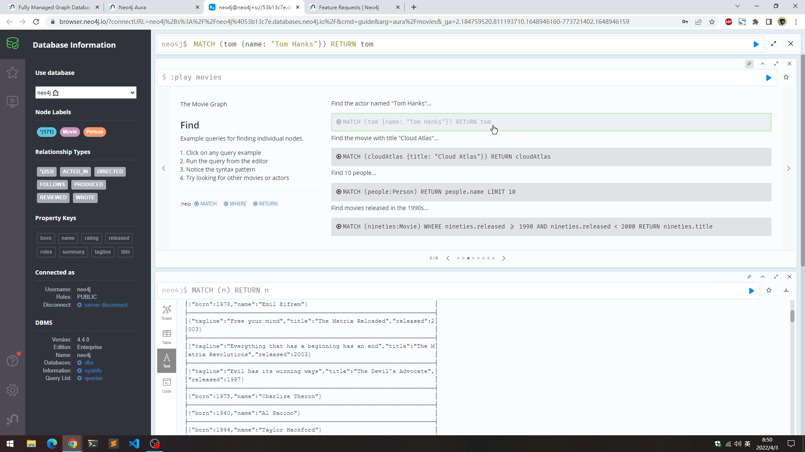
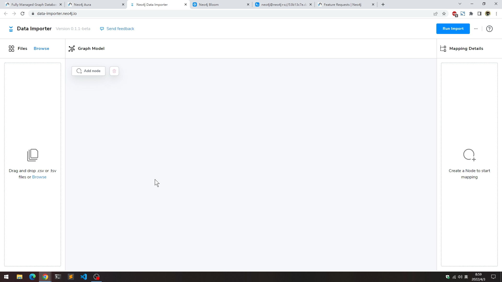

# 手把手快速上手Neo4j AuraDB免费版

> 2022-04-03

Neo4j AuraDB 免费版，零冲突，零困扰，零成本，立即开始上手Neo4j图数据平台。

没错，这又是一篇手把手快速上手文章（还有视频），本期给大家演示Neo4j AuraDB免费版的注册和使用，包含Neo4j Browser、Neo4j Bloom和Neo4j Data Importer 这3个产品！欢迎收藏转发，更重要的是请自己动手操作哦。

如果你不清楚为什么用Neo4j AuraDB，可以阅读公众号上这篇文章了解。

Neo4j AuraDB是完全托管的云服务，为云开发者提供的零管理、永远在线的Neo4j图数据库。针对小型开发项目、学习、实验和原型设计的场景提供了完全免费的服务。是图技术初学者的不二之选。

那我们从头开始吧。

## 注册账号

我这次翻出了一台旧电脑，用浏览器就可以使用Neo4j AuraDB了，对电脑的要求不高。首先请访问Neo4j官网`neo4j.com`，在导航拦右侧的开始使用按钮的下拉菜单里，可以看到Neo4j AuraDB的链接，**点它**。啊等等，页面上其实有更醒目的地方，提供了两个免费开始的按钮，一个面向开发者，一个面向数据科学家。我们选择面向开发者的按钮。

然后就可以看到Neo4j AuraDB的介绍页面。Neo4j AuraDB提供了3种层级的服务，免费版、专业版和企业版。我们点击免费版的“免费使用”按钮。

然后就打开了注册页面。输入邮箱和设置一个强密码，点击“注册”按钮。

然后就成功了。需要验证一下邮箱完成注册。此时我们的Neo4j AuraDB账号就已经注册完成了。

## 创建数据库

账号注册和邮箱激活完成后，我们点击“转到主界面”，此时会显示用户协议，同意后继续。

然后激动人心的时候到了，我们现在就可以创建数据库了。

可以看到免费版的一些条件：

- 1个永久免费的数据库。
- 数据量限制为5万节点、17.5万关系。
- 支持标准的APOC（apoc-core）。
- 3天不活跃后会自动停止。

我们继续创建数据库，输入数据库名字，选择一个离我们比较近的数据中心，这里选择新加坡。这里可以选择加载示例的电影数据集，也可以选择新建一个空白数据库。

系统会自动生成数据库的登录密码，一定要记录下来。

这时我们的数据库正在配置和部署中，稍等片刻。

在等待的间隙，我们可以看一下左侧的导航，数据库连接方式里，提供了多种编程语言的连接代码。比如.NET Core的SDK。等等。

数据库启动起来后，状态变成了`Running`，可以看到数据库运行时的版本，还有连接字符串等信息。

在数据库名字的右侧有3个蓝色按钮，分别对应着今天要使用的3个产品：Neo4j Bloom、Neo4j Browser和Neo4j Data Importer。

## 开始探索图数据

我们照例从Neo4j Browser开始，点击**Query**按钮打开它。

此时需要使用密码登录到Neo4j Browser。

因为我选择加载了电影数据集，这时可以看一下里面的数据。我们输入Cypher查询：

`MATCH (n) RETURN n`

来查看所有数据：

### 通过 Browser Guide 探索电影数据集

这次我们详细看一下Browser Guide，在查询框输入`:play movies`回车，就会出现教程了。电影数据集的教程包括：

1. 插入数据，创建电影数据集。
2. 查询数据，获取电影、演员等数据。
3. 查询相关的演员或导演。
4. 解决路径查询问题。

我们按照教程继续。

教程里会出现代码块，点击代码块会自动填入到Neo4j Browser的查询框里，我们只需要点运行就可以执行查询了。一般建议将教程主窗口置顶，这样方便我们继续学习。

六度分隔理论使用图技术可以非常容易的展示和处理。这里可以看到用一个最短路径的方法就可以找到2个人之间的“六度”关系了。

教程后面还有如何实现推荐，敬请继续。

### 使用Neo4j Bloom探索电影数据集

我们回到数据库页面，点击**Explore**按钮启动Neo4j Bloom，也需要账号密码登录。

Neo4j Bloom使用Perspective来管理查询，我们使用默认的场景。在查询框里可以输入关键字进行搜索，结果会以图的方式展现出来，还可以给节点和关系进行一些自定义。更多的使用方式就留给大家去探索了。

### 使用Neo4j Data Importer管理数据导入

在数据库页面的**Importer**按钮打开Neo4j Data Importer，它是一个新发布的ETL工具。提供了数据加载、图数据建模、数据关系映射和直接写入数据库等功能。

比如我使用它导入了Northwind的数据，用起来非常流畅和自然。

## 结束语

Neo4j AuraDB通过云端提供DBaaS，零运维和基础架构管理的方式让入门图技术变得非常容易。免费版也非常适合开发者和原型设计等场景。

现在就开始使用吧。

## 参考链接

Neo4j AuraDB

https://neo4j.com/cloud/aura/

Neo4j 开发者主页

https://neo4j.com/developer/

Neo4j Bloom

https://neo4j.com/product/bloom/