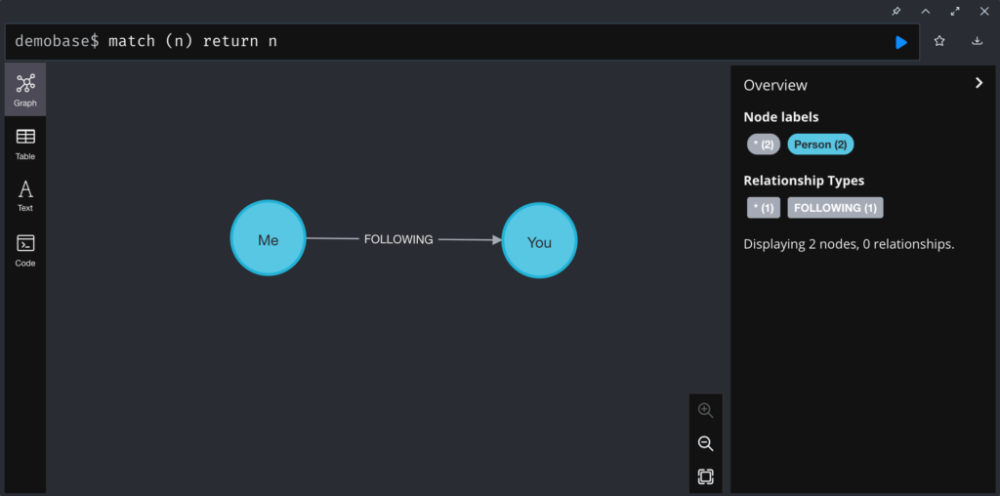

# Tips&Tricks: 如何更新关系的类型？

今天给大家分享一个小技巧。

问题是：如何更新已经存在的关系类型？

比如这个数据模型里：


示例数据是这样：


现在想要把`FOLLOWS`改成`关注`，应该怎么做呢？是不是这样：


`type`函数是无法写入的。

## 解决方案

这里分享2个方式，一个是直接Cypher语句，另一个是通过APOC进行。代码如下。

### Cypher语句方式：删除旧关系创建新关系

```cypher
MATCH (n)-[r:FOLLOWS]->(m)
MERGE (n)-[:关注]->(m)
DELETE r
```


检查一下数据，关系类型已经更新了。


### 使用APOC函数`apoc.refactor.setType`

```cypher
MATCH (n)-[r:`关注`]->(m)
CALL apoc.refactor.setType(r, 'FOLLOWING')
YIELD input, output
RETURN input, output
```


检查数据，关系类型已经更新好了。



怎么样你学会了吗？

注意的是，第一种方式里，如果关系上有属性，需要手动再创建关系时手动写入进去。

## 参考资源

- https://community.neo4j.com/t/change-relationships-name/6473
- https://neo4j.com/labs/apoc/4.4/graph-updates/graph-refactoring/set-relationship-type/
- https://neo4j.com/labs/apoc/4.4/overview/apoc.refactor/apoc.refactor.setType/