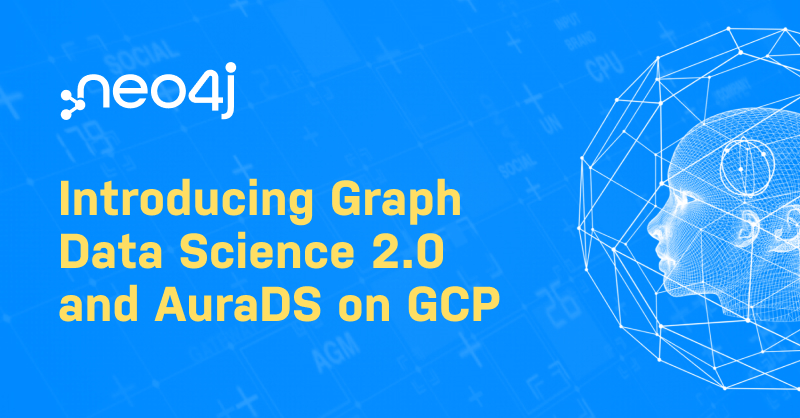

# 最新发布：图形数据科学 GDS 2.0 和 AuraDS GA

2022-05-07

Alicia Frame

Source: https://neo4j.com/blog/introducing-graph-data-science-2-0-aurads/

---

作者：Alicia Frame

Neo4j 图数据科学产品管理高级总监

Alicia Frame 是 Neo4j 的图数据科学产品管理高级总监（也是一名数据科学家）。

她很高兴能够构建使用户能够解决关键问题的工具。她的背景是生命科学，在她的职业生涯中，她一直致力于开发模型和仪表板，以帮助科学家和最终用户使用数据和预测模型回答业务关键问题。作为 Neo4j 的产品经理，她认为自己的角色是使最先进的学术研究民主化，因此最终用户可以以可扩展、易于理解的方式利用它。

---

从两年前我们发布最初的图数据科学（Graph Data Science，简称GDS）产品，到我们今天拥有功能齐全的图数据科学平台，这是一段疯狂的旅程。还记得当开始时，我们有一些你喜欢的图算法，以及让图数据科学变得超级简单的愿景，而今天，我们迎来了 Neo4j 图数据科学发布两周年的日子，为你带来了一些惊人的新特性：

- - 正式发布**图数据科学平台** 2.0 版，提供了大量的新功能。
  - 为了将 GDS 和 Neo4j 的强大功能带入你喜欢的编程语言中，我们发布了GDS专属的**[原生 Python 客户端驱动](https://github.com/neo4j/graph-data-science-client)**。
  - 使用我们的全新托管服务 AuraDS，让你的应用部署变得前所未有的轻松。

从一开始，我们的目标是让几乎任何人都能从关联数据中获得洞察力，现在看来，我们在兑现这一承诺方面做得非常出色。

## 什么是 Neo4j 图数据科学？

如果你初来乍到…… **Neo4j 图数据科学**是一个图分析和建模平台。使用图算法和机器学习 (ML)，数据科学家可以识别模式和行为，改进模型，以便在推荐引擎、欺诈检测、路线优化和客户 360 场景中使用。

## 我们在打造什么？

我们专注于打造市场上最全面的图数据科学解决方案。为此，我们在五个领域进行了重点投入：**易用性**、**企业就绪**、**为数据科学构建图**、**生态系统**和**云**。

从这些领域着手，将有助于我们了解在最新版本中推出的功能。

## 图数据科学的新功能

说实话，[本次发布版本](https://go.neo4j.com/rs/710-RRC-335/images/What%27s-New-In-Neo4j-Graph-Data-Science.pdf?_gl=1*o597k6*_ga*NDQ2OTk1NDYyLjE2NTA4NjU1Mzc.*_ga_DL38Q8KGQC*MTY1MTg4ODUyMy4yOC4xLjE2NTE4ODg2MzYuMA..&_ga=2.170301799.677466920.1651799736-446995462.1650865537)的更新内容太多了，也不可能在一篇博客中涵盖，而且没有人想读一本小说，但其中一些亮点包括：

- 🤖 通过添加**管道目录**（[Pipeline catalog](https://neo4j.com/docs/graph-data-science/current/pipeline-catalog/)），机器学习管道变得更简单；模型配置、训练和应用都使用统一的语法。并且增加了对[随机森林模型](https://neo4j.com/docs/graph-data-science/current/machine-learning/linkprediction-pipelines/#linkprediction-configure-model-parameters)的支持。
- 🎓 一流的数据科学，正式进入产品级的包括[广度优先搜索](https://neo4j.com/docs/graph-data-science/current/algorithms/bfs/)、[深度优先搜索](https://neo4j.com/docs/graph-data-science/current/algorithms/dfs/)、[K-最近邻](https://neo4j.com/docs/graph-data-science/current/algorithms/knn/)、[增量步进](https://neo4j.com/docs/graph-data-science/current/algorithms/delta-single-source/)和[相似性函数](https://neo4j.com/docs/graph-data-science/current/algorithms/similarity-functions/)，意味着这些算法都得到了充分的支持、并行化和优化。增量步进比我们之前的最短路径实现还要快 92%！
- 🪄 新增企业版功能，包括[集群兼容](https://neo4j.com/docs/graph-data-science/current/production-deployment/causal-cluster/)和[图备份与恢复](https://neo4j.com/docs/graph-data-science/current/management-ops/#backup-restore)，使得从概念验证到正式投产变得更简单。现在，你可以在事务集群旁边无缝运行图数据科学工作负载，而不用担心工作内容的丢失。
- 🐍 使用新发布的[Python客户端驱动](https://neo4j.com/docs/graph-data-science/current/python-client/)，让图数据科学成为你的数据科学生态的一部分。数据科学家不必花时间学习 Cypher 查询语言或理解事务函数了，现在你可以通过我们提供的原生 Python API 来直接进行有趣的工作。
- ⛅ [在谷歌云平台上使用AuraDS](https://console.cloud.google.com/marketplace/product/endpoints/prod.n4gcp.neo4j.io?mpp=4bfb2414ab973c741b6f067bf06d5575&mpid=auth0%7C60c7d214fd17ba0070bfeb83)，包含上述所有的特点，也没有任何烦扰。随着机器学习作为服务平台的推出，任何人都可以访问Neo4j 图数据科学，而不需要软件工程师团队、数据库管理员或IT部门的批准。你甚至可以用云平台的余额来支付!

这还不是全部，GDS 2.0 是一个重要的产品里程碑，已经包含了很多新功能。我们已经彻底修改了 Cypher 投影语法，改进了 GraphSAGE 和接近中心性的实现，甚至添加了一个新的警告消息界面，以便更容易理解你是否使用了正确的方式。如果你想要完整的概要，请查看我们的[发行说明](https://github.com/neo4j/graph-data-science/releases/tag/2.0.0)。

## Neo4j 图数据科学即服务与 AuraDS

虽然云是我们的开发支柱之一，但它对我们（还有你！）来说也是非常重要的事情。借助 AuraDS，您可以使用我们完全托管的图形数据科学服务，通过 SaaS 许可证导入、分析和可视化图形数据，该许可证包括基础设施堆栈的所有方面：存储（包括备份存储）、IO 速率、数据传输等。

虽然云计算是我们的发展支柱之一，但对我们（和你们）来说也是一件非常重要的事情。借助AuraDS，你可以使用我们完全托管的图数据科学服务来导入、分析和可视化图数据，这种SaaS许可模式包括基础架构堆栈的所有层面：存储（包括备份存储）、IO和数据传输等等。AuraDS现已在谷歌云平台上可用，因此你可以使用 VertexAI 与谷歌云平台所有的机器学习服务进行集成。

AuraDS 包含数据科学图算法的 GDS 企业版，建模工作区和用于可视化数据探索的 Neo4j Bloom，所有这些都由我们的图数据库支持。[今天就开始](https://console.neo4j.io/?action=signup&product=aura-ds&mpp=4bfb2414ab973c741b6f067bf06d5575&mpid=auth0%7C60c7d214fd17ba0070bfeb83&_gl=1*12bp09v*_ga*NDQ2OTk1NDYyLjE2NTA4NjU1Mzc.*_ga_DL38Q8KGQC*MTY1MTg4ODUyMy4yOC4xLjE2NTE4ODg2MzYuMA..&_ga=2.127253194.677466920.1651799736-446995462.1650865537)吧！

## 总结

两年前，Neo4j 是业界第一个图数据科学平台。今天，我们已经发布了市面上最好的产品。从拥有最多的算法和最简单的 API 到最简单的入门方式，我们深深地为这款产品感到自豪。

当然也不仅仅是我们，我们的客户，比如OrbitMI 工程副总裁，也非常支持这一点：

> “如果没有 Neo4j 的预测建模和图分析，我们就不可能拥有具有这种价值水平的产品。Neo4j 图数据科学为我们的每一位客户做出的每一个决策提供了引擎般的支持。”
>
> — OrbitMI 工程副总裁

顺带一提，OrbitMI 使用图数据科学构建了一个具有亚秒级响应时间的海上航线平台，提供优化的航线以节省时间、投资和减少碳排放。

