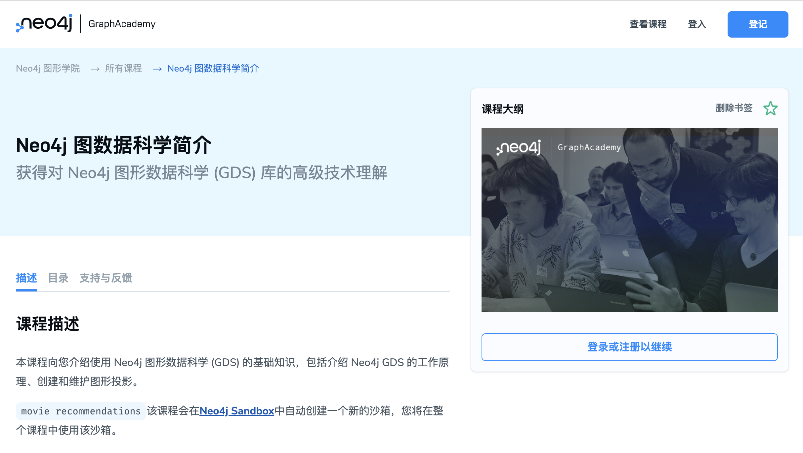
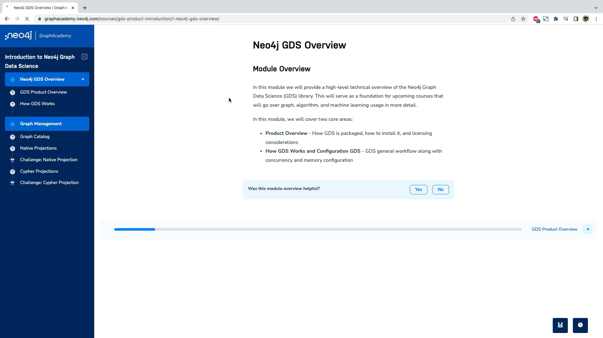
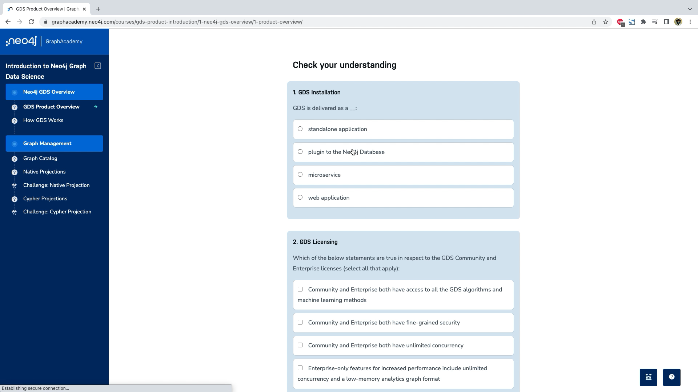
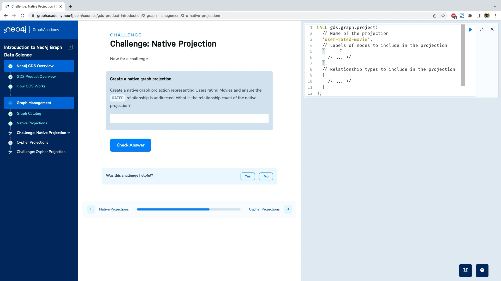
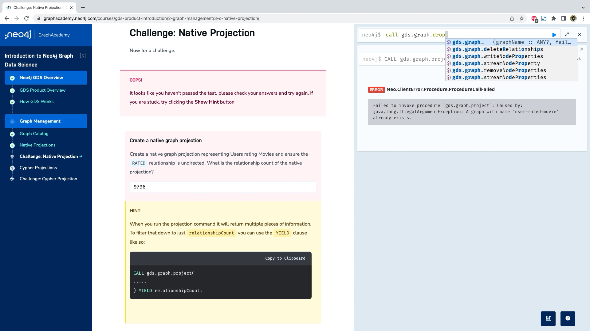
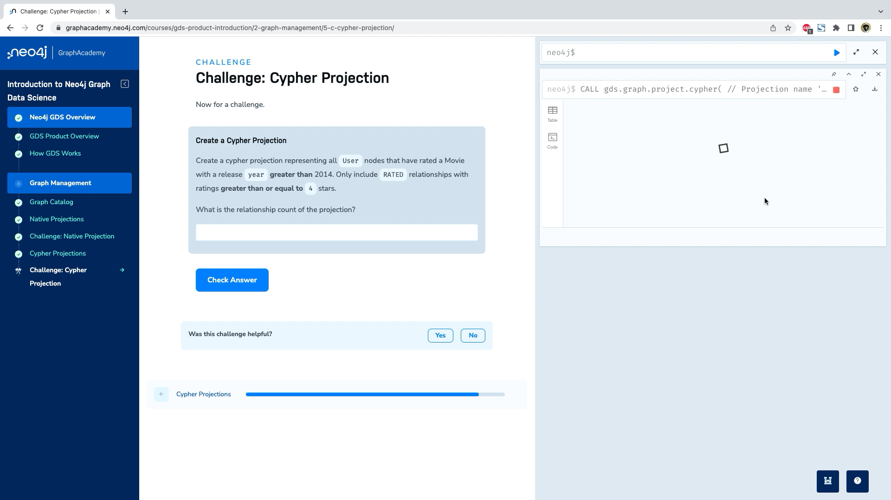

# GraphAcademy 课程讲解：《Neo4j 图数据科学简介》

2022-05-18 -> 2022-06-02


今天给大家介绍最近在 GraphAcademy 新上线的一门互动课程《Neo4j 图数据科学简介》，希望通过本文的阅读可以对课程结构和学习模式有个了解，欢迎注册本课程开始你自己的学习和测验。

## 什么是 GraphAcademy


Neo4j GraphAcademy 是 Neo4j 推出的在线互动学习平台，提供免费、自由掌握进度的在线动手实验培训课程。不管你是开发者、运维管理员，还是数据科学家或从事机器学习、人工智能相关工作的人员，都可以在 GraphAcademy 找到适合你的课程。

所有课程均由具有多年经验的 Neo4j 专业人士开发。我们的目标是为你提供令人愉快的实践培训，其中包含文本内容、视频和代码挑战。

你通过的每门课程都会解锁一个徽章，可以通过你的职业档案或社交网络与朋友和同事分享。通过完成 [Neo4j 认证考试](https://graphacademy.neo4j.com/categories/certification)，你将解锁限量版的 Neo4j T 恤奖励，以及更重要的是，获得图技术专业技术的证明，可以向雇主和同事展示这一荣誉。

## 《Neo4j 图数据科学简介》课程目标



在课程主页上可以看到简介和先决条件。需要理解数据科学的基本工作内容，了解 Neo4j 图数据库，以及能够使用 Cypher 开发图查询语句。

> 目前 GraphAcademy 的课程还没有中文版。推荐使用 Chrome 浏览器，通过将整个网页翻译成中文的方式查看。效果也还不错。如上图所示。

通过该课程，你可以学到 Neo4j GDS 如何赋能图分析的基础知识、如何安装 GDS 和不同的许可选项和图投影模式。

## 课程目录

本课程包含两小节内容，以下是课程目录：

**Neo4j GDS 概览**

- GDS 产品概览
- GDS 工作方式

**图管理**

- 图目录（Graph Catalog）
- 原生投影
- 挑战：原生投影
- Cypher 投影
- 挑战：Cypher 投影

这两个挑战会要求你编写一部分 Cypher 语句，并运行查询然后检查结果。所用到的 Neo4j 数据库实例均运行在 Neo4j 沙箱环境中，本课程会用到电影推荐数据集。

## 开始学习

要开始正式学习课程，需要你注册或登录现有账号，点击课程图片下的按钮就可以继续，你可以使用自己的邮箱或GitHub、LinkedIn等第三方账号登录。然后就可以进入课程学习平台了。



### Neo4j GDS 产品概览

我们进入第一节的内容，产品概览一节详细介绍了 GDS 插件的产品形式和兼容性，以及安装和配置方法，还有社区版和企业版的授权许可。在内容末尾有个小测验，会针对当前内容进行知识点检查。看看你是否能够一次答对？



Neo4j GDS 是作为 Java 库的方式分发，以插件的形式提供给 Neo4j 图数据库，这意味着安装时需要更新一些数据库的配置。不同的数据库运行时版本需要搭配相匹配的 GDS 库版本。

根据你的 Neo4j 数据库运行的方式，安装方式也不同。在 Neo4j 沙箱中默认启用了GDS插件，在 Neo4j AuraDS 中也默认启用。这里介绍面向 Neo4j Desktop 的安装方式。

安装并打开 Neo4j Desktop 后，可以在数据库的**Plugins**选项卡中找到 GDS，Desktop会检查匹配的版本，如果找到会显示 Install 按钮，点击就可以下载并安装。


GDS 提供免费社区版许可证和付费企业版许可证，两个许可证之间的所有分析功能（包括图算法和机器学习方法）都是相同的。但是，它们在性能和企业功能方面存在重要差异，企业版具有支持生产用例的附加功能：

- **具有更高性能的企业版特性：**支持无限并发以加快计算时间并访问低内存分析图格式，从而将数据科学应用于超大的图。
- **生产环境的安全性和工作流：**细粒度的安全性、持久化和发布机器学习模型的能力、内存中的图备份和恢复，以及通过只读副本实现的因果集群兼容性。

### GDS 工作方式

GDS 通过将数据转换和加载到内存中的格式来工作，该格式针对高性能图分析进行了优化。GDS 提供了图算法、特征工程和机器学习方法来在这种内存图格式上执行。这使得数据科学能够高效且可扩展地应用于大型图，包括整个图数据库或其中的一部分。

GDS 的工作流程可分为如下三个步骤：


1. **读取和加载图**：GDS 需要从 Neo4j 数据库中读取数据，对其进行转换，然后将其加载到内存中的图中。在 GDS 中，我们将此过程称为*投影图*，并将内存中的图称为*图投影*。GDS 可以同时保存多个图投影，它们由称为 *Graph Catalog* 的组件管理。我们将在下一个模块中更详细地介绍图目录和图投影管理。
2. **执行算法**：这包括经典的图算法，例如中心性、社区检测、路径查找等。它还包括嵌入，一种鲁棒的图特征工程，以及机器学习管道。
3. **存储结果**：您可能想要对图算法的输出/结果做一些事情。GDS 使您能够将结果写回数据库，以 csv 格式导出到磁盘，或将结果流式传输到另一个应用程序或下游工作流程。

在GDS配置中，因为GDS会尽可能多的使用内存和CPU，所以需要参考并发管理和内存配置的一些参数。可以通过课程中获得具体内容。

本节有小测验，在完成阅读和理解之后，可以看看是不是能够一次通过。

### 图目录（Graph Catalog）

我们接着开始第二节的内容。首先介绍图目录。图目录是一个允许你在 GDS 中管理图投影的概念。它包括：

- 创建（又名投影）图
- 查看有关图的详细信息
- 删除图投影
- 导出图投影
- 将图投影属性写回数据库

你可以使用 Cypher 语句来创建图：

```cypher
CALL gds.graph.project('my-graph-projection', ['Actor','Movie'], 'ACTED_IN')
```

创建投影的目的是为运行图算法和有效地进行图数据科学提供空间。比如下列代码运行算法：

```cypher
CALL gds.degree.mutate('my-graph-projection', {mutateProperty:'numberOfMoviesActedIn'})
```

本节有小测验，在完成阅读和理解之后，可以看看是不是能够一次通过。

### 原生投影

GDS 中有 2 种主要类型的投影，原生投影和 Cypher 投影。原生投影针对效率和性能进行了优化，以支持大规模的图数据科学。Cypher  投影针对灵活性和定制进行了优化，以支持探索性分析、实验和较小的图投影。

原生投影采用三个强制性参数`graphName`、`nodeProjection`和`relationshipProjection`。此外，可选`configuration`参数允许我们进一步配置图创建。

本节还将介绍更多的配置和代码示例。

本节有小测验，在完成阅读和理解之后，可以看看是不是能够一次通过。

### 挑战：原生投影

挑战环节是基于实际数据集，针对给定的问题，需要你编写查询代码，然后执行并获取结果，课程会校验你的结果是否正确。



本节挑战的问题是：创建一个代表用户对电影评分的原生图投影，并确保`RATED`关系是无向的。原生投影的关系数量是多少？

要完成挑战就需要实际编写 Cypher 语句了，可以回头看看前面的代码片段，或查询文档。

错了也没有关系，系统会给出一些提示。你也可以运行更多的查询来测试自己的查询。



### Cypher 投影

我们下一节学习 Cypher 投影，虽然原生投影具有可扩展性和快速性，但其过滤和聚合功能不如 Cypher 灵活。顾名思义，Cypher 投影使用 Cypher 来定义投影模式，因此具有更大的灵活性。

虽然 Cypher 投影提供了更多的灵活性和定制化，但相对于原生投影，它们对性能的关注度有所降低，因此在更大的图上不会表现得那么快或表现得那么好。每当您考虑使用 Cypher 投影时，请牢记这一关键权衡。

Cypher 投影采用三个强制性参数：`graphName`、`nodeQuery`和`relationshipQuery`。此外，可选`configuration`参数允许我们进一步配置图创建。举个例子：

```cypher
CALL gds.graph.project.cypher(
  'proj-cypher',
  'MATCH (a:Actor) RETURN id(a) AS id, labels(a) AS labels',
  'MATCH (a1:Actor)-[:ACTED_IN]->(m:Movie)<-[:ACTED_IN]-(a2)
   WHERE m.year >= 1990 AND m.revenue >= 1000000
   RETURN id(a1) AS source , id(a2) AS target, count(*) AS actedWithCount, "ACTED_WITH" AS type'
);
```

然后就可以像原生投影一样，在这个投影上执行算法了。

本节有小测验，在完成阅读和理解之后，可以看看是不是能够一次通过。

### 挑战：Cypher 投影

本课程的第二个实战挑战，问题是：创建一个 Cypher 投影，用于表示所有对发布年份（ `year`）在2014 年**以后**的电影进行评级的用户（`User`）节点，仅包括评级（`ratings`）**大于或等于 **4 星的 `RATED` 关系。



看看最终结果是多少呢？

完成课程的挑战和全部学习内容后，就可以获得本课程的徽章了。


## 下一步

现在你对 Neo4j GDS 库有了很好的了解，你可以继续学习[图数据科学基础](https://graphacademy.neo4j.com/courses/graph-data-science-fundamentals/)课程，在那里您将了解所有需要了解的有关图算法、GDS 中可用的算法以及如何使用机器学习管道来执行常见的一系列与图相关的机器学习任务。我们下一节课再见。

### 参考资源

本课程地址：https://graphacademy.neo4j.com/courses/gds-product-introduction/

图数据科学基础课程：https://graphacademy.neo4j.com/courses/graph-data-science-fundamentals/

课程数据集：https://github.com/neo4j-graph-examples/recommendations