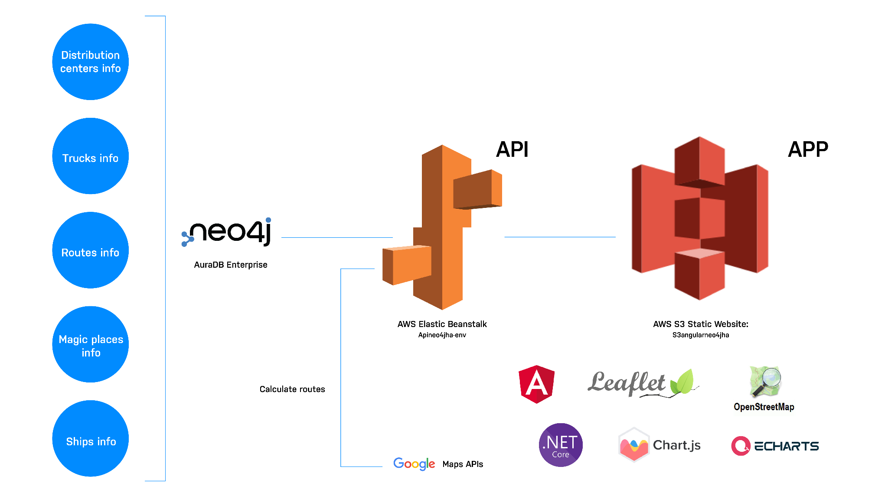

---

---

# 使用 Neo4j 构建的智能供应链应用程序源代码解析


在4月13号举办的Neo4j关联数据之一带一路主题活动上，Neo4j亚太区售前和服务总监Joshua Yu分享了使用知识图谱、物联网和数字孪生构建的智能供应链数字基础设施的案例及演示，直观和酷炫的前端交互和可视化界面吸引了不少观众。本文基于此案例给大家深度解析源代码，让你也能立刻拥有一套可定制和运行的智能供应链基础程序。

我们可以先看一段本系统的视频展示。


接下来我们从以下几个部分来解析本案例。

## 业务需求

为了应对需求波动，组织正在依靠预测性和规范性分析、机器学习、人工智能和增强技术，为突发问题和未来的潜在问题提供明确的解决方案。这包括缩短生产时间、确定缓冲供应和库存的最佳方式，以及自动化流程以应对供应短缺。

图技术对于优化物流、发现漏洞和提高整体供应链弹性至关重要。在任何业务中，尤其是在零售和仓库配送中，对库存、产品库存以及如何配送的准确信息的需求至关重要。供应链中的步骤越多，不稳定的风险就越大。图数据库非常适合这项任务，因为它们擅长表示复杂的关系。因此，基于图的供应链管理方法提供了应对这些挑战所需的灵活性和可扩展性。通过将数据表示为一系列相互连接的节点，Neo4j 可以轻松地对复杂关系进行建模，并识别隐藏在传统表格数据集中的模式和见解。

在这个演示中，我们关注的是**仓库**、**配送**和**车队管理**问题。

在业务分析阶段，我们就可以进行图数据建模了，别忘了跟业务专家一起来画出业务和之间的关联。本演示的数据模型如下：


你能从图数据模型看出具体的业务吗？

## 系统架构

为了直观的展示供应链的情况，我们需要一套视觉上非常直观和交互很灵活的方式，本演示采用了一系列前端的可视化框架，以及使用Angular作为承载框架。

同时我们需要一套服务端来跟数据库和前端交互，以及实现业务逻辑和API。在这里我们采用了.NET Core来实现，默认提供了Web API的架构以及使用Repository作为数据层交互接口。

数据库端我们使用了Neo4j AuraDB，无需任何运维即可快速使用。

另外我们也设计了一套完整的部署架构，你可以参照该设计将整套系统部署在云端。



## 源代码解析

听上去就跃跃欲试了对不对，接下来我们从底层数据库开始来一步一步解读源代码，完成后希望你可以直接运行一个你自己的版本。

本案例的源代码在GitHub，你可以先克隆到本地准备开发。在这里我使用Visual Studio Code来进行开发和调试。


### Neo4j AuraDB 初始化

我们首先创建AuraDB的实例。你可以选择你想部署的数据中心，也可以参考整个系统需要部署的数据中心来灵活选择。


实例创建好之后，本演示准备了一些测试数据，Cypher脚本位于路径`supply-chain-demo/DBScripts/populateDB.txt`。使用Neo4j Browser运行脚本即可将数据导入。

下一步需要记下数据库的连接字符串信息，用来从服务端连接到数据库。


### 服务端 Neo4j Back 源代码

有了数据库实例和连接字符串后，我们来看看服务端代码。首先看一下目录结构。


服务端的主要项目是`SpikeNeo4j`，另外还有测试项目`SpikeNeo4j.Tests`，本文仅介绍主项目。

#### 如何跟Neo4j数据库交互

为了跟Neo4j AuraDB数据库交互，本项目使用了社区贡献的.NET驱动`Neo4jClient`。同时，连接字符串等信息通过`appsettings.json`文件来管理。

```json
{
  "Logging": {
    "LogLevel": {
      "Default": "Information",
      "Microsoft": "Warning",
      "Microsoft.Hosting.Lifetime": "Information"
    }
  },
  "AllowedHosts": "*",
  "Neo4j": {  
    "Host": "neo4j+s://64e5d198.databases.neo4j.io",
    "User": "xxxxx",
    "Pass": "xxxxx"
  },
  "AppSettings": {
    "Token": "xxxxx"
  },
  "Login": {
    "Username": "xxx",
    "Password": "xxx"
  },
  "ApikeyGoogleMaps": {
    "ApiKey": "xxxxxxxxxxx"
  }
}
```

此外，还有地图和Swagger相关的库。可以通过浏览项目文件进一步探索。

Repository是一种数据层访问封装模式，接口文件`IClienteSpikeNeo4jRepository.cs`定义了数据获取的方法。

在文件`Startup.cs`里配置好Neo4j Driver的单例实现，代码如下：

```csharp
private IGraphClient GetGraphClient(IServiceProvider provider)
{
    //Create our IGraphClient instance.
    var client = new BoltGraphClient(Configuration["Neo4j:Host"], Configuration["Neo4j:User"], Configuration["Neo4j:Pass"]);
    //We have to connect - as this is fully async, we need to 'Wait()'
    client.ConnectAsync().Wait();

    return client;
}
```

#### 使用MVC模式实现API

API层通过MVC模式实现，在文件`Neo4jClientController.cs`里可以看到API实现。

然后通过Swagger来暴露API接口和文档。

#### 运行服务端

如果你想要看到效果，可以将服务端运行起来，需要安装好.NET，访问地址`get.dot.net`可以下载适合你的系统的版本。

然后在终端里切换到目录`Neo4j Back/SpikeNeo4j`，运行命令`dotnet run`，如果看到以下信息就说明成功编译并运行了。

```
SpikeNeo4j[main*] % dotnet run
Building...
info: Microsoft.Hosting.Lifetime[14]
      Now listening on: https://localhost:5001
info: Microsoft.Hosting.Lifetime[14]
      Now listening on: http://localhost:5000
info: Microsoft.Hosting.Lifetime[0]
      Application started. Press Ctrl+C to shut down.
info: Microsoft.Hosting.Lifetime[0]
      Hosting environment: Development
info: Microsoft.Hosting.Lifetime[0]
      Content root path: /Users/shinyzhu/Documents/GitHub/supply-chain-demo/Neo4J Back/SpikeNeo4j
```

此时，打开浏览器访问`https://localhost:5001/swagger`即可打开Swagger页面了。

### 前端Neo4j Front源代码

服务端API就绪后，我们来看一下前端应用。目录结构如下：


本项目的前端使用Angular来构建，Angular是一个非常流行的前端模块化框架，另外还包含了地图库Leaflet，图表库ECharts和ChartJS，等等。

#### 配置后端API信息

前端需要跟服务端的API交互，你可以修改文件`Neo4J Front/src/environments/environment.ts`的内容来指定你的服务端API地址。

```typescript
export const environment = {
  production: false,
  urlApi:
    'https://localhost:5001/api',
};
```

#### 运行前端

前端应用是基于NodeJS的，所以你需要提前安装好，访问地址`nodejs.org`可以找到下载。Angular我们通过NodeJS来安装即可，该项目里已经配置好相关的库，所以可以直接从项目里运行。

如果你安装好了NodeJS，但没有全局安装Angular。可以运行命令`npx ng serve`就可以启动前端应用了。

```
Neo4J Front[main*] % npx ng serve
⠦ Generating browser application bundles (phase: building)...WARNING: Using / for division is deprecated and will be removed in Dart Sass 2.0.0.

Recommendation: math.div($size, 16)

More info and automated migrator: https://sass-lang.com/d/slash-div

   ╷
21 │ $unit: $size / 16;
   │        ^^^^^^^^^^
   ╵
    src/app/maps/map2d/map2d.component.scss 21:8  root stylesheet

✔ Browser application bundle generation complete.

Initial Chunk Files            | Names         |      Size
vendor.js                      | vendor        |   2.76 MB
scripts.js                     | scripts       | 997.21 kB
polyfills.js                   | polyfills     | 123.38 kB
main.js                        | main          |  49.92 kB
styles.css                     | styles        |  23.75 kB
runtime.js                     | runtime       |  12.53 kB

                               | Initial Total |   3.94 MB

Lazy Chunk Files               | Names         |      Size
src_app_maps_maps_module_ts.js | -             |   5.88 MB

Build at: 2022-05-10T04:02:44.230Z - Hash: 0461de2fe12622853272 - Time: 9284ms

** Angular Live Development Server is listening on localhost:4200, open your browser on http://localhost:4200/ **


✔ Compiled successfully.

```

这时我们打开浏览器，访问`http://localhost:4200`就可以看到酷炫的前端应用了。

## 上云部署

云计算服务的优势在于提供了开箱即用的服务，Neo4j不仅提供了DBaaS的全托管服务AuraDB，你还可以在云厂商的市场中找到不同的虚拟机模板，也可以用于快速部署Neo4j数据库。

服务端使用了跨平台的.NET Core，因此可以轻松集成到现有的CI/CD等DevOps流程中。

你可以了解你们正在使用或熟悉的云厂商提供的服务，以此进一步完善整个系统的架构。

## 总结

到这里，你应该已经将演示的供应链完整项目运行起来了。不管你对哪一部分感兴趣，希望都能给你带来一套完整的方案，激发你的灵感。

### 资源链接

Neo4j供应链案例代码库：`https://github.com/neo4j-examples/supply-chain-demo`

已部署的在线案例：`http://dev.neo4j.com/supply-chain-demo`

免费使用Neo4j AuraDB：`https://neo4j.com/aura`

Joshua Yu的分享回放：`https://www.bilibili.com/video/BV1N5411m7fv?t=0h6m30s`

Neo4j供应链管理使用案例：`https://neo4j.com/use-cases/supply-chain-management/`

