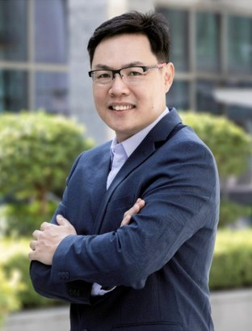

# Neo4j 任命方俊强为大中华区总经理

2022-05-25

> 业界领袖方俊强凭借 SAP、Oracle 和埃森哲积累的深厚经验，深化 Neo4j 在大中华区的客户和社区服务。

中国北京，2022年5月24日——全球领先的图数据平台 [Neo4j](https://neo4j.com/?ref=pr-&utm_source=announcement&utm_medium=referral&utm_campaign=2021-APAC-Momentum) 近日宣布任命方俊强为大中华区总经理。

方俊强先生在数据分析领域拥有多年的深厚经验，曾就职于Qubole、MapR、Pivotal、SAP 和Oracle 等软件公司，专注于数据分析，从事区域销售和业务开发工作。此前，他还曾在埃森哲和 3M等公司担任过咨询职务。

履新后，方俊强将负责制定 Neo4j 在大中华区的发展战略，带领团队加强社区建设，深入了解客户面临的挑战和需求，并通过提供图数据平台助力客户解锁数据价值来加速数字化转型，从而继续推动 Neo4j 在大中华区市场的长足发展。

**Neo4j 大中华区总经理方俊强**

作为图技术的开创者和原生图数据库市场的领导者，Neo4j拥有全球部署最广泛的图数据平台，现服务全球超1000家来自金融、电信、零售、医疗保健、制造、运输、物流等行业的客户和政府机构。2021年，Neo4j实现了显著的营收增长，年经常性收入 (ARR) 超过1亿美元。此外，Neo4j还在2021年获得超3.9 亿美元的融资，这是数据库领域有史以来的最大投资, Neo4j的估值达到 20 亿美元。

在过去的一年，Neo4j在亚太区市场的表现同样亮眼，营收增长超过100%，客户规模迅速壮大。澳大利亚联邦银行 (CBA)、澳洲电讯、Capital A、渣打银行、星展银行等全球知名的企业和政府机构用户都采用Neo4j的图数据平台来处理高度复杂且具有高度关联的数据。

Neo4j自2018年起进入中国市场，目前团队成员遍布北京、上海、广州、深圳，全面覆盖销售、市场、售后支持、合作伙伴和社区等领域，并与微云数聚、优阅达和南天信息等业内合作伙伴建立了良好的关系。Neo4j的社区在全球拥有25万名成员，其中多数分布在中国，成功的开发者生态建设为Neo4j在中国的迅速发展奠定了坚实的基础。迄今为止，Neo4j已将其全球团队规模扩大到 700 多人，拥有全球最大的图专业团队，并拥有众多品牌客户，呈现出强劲发展态势。

Neo4j亚太区副总裁Nik Vora表示：“方俊强的履新将进一步推动我们在大中华区市场的增长，也彰显了Neo4j对大中华区的重视和长期承诺。期待他带领Neo4j大中华区团队继续推动与加强合作伙伴关系，帮助客户分析复杂数据，提高应用价值，使其成为商业智能。”

方俊强表示：“由于数据量猛增、数据更加复杂且高度关联，以及人工智能的快速发展，图数据库相比传统型数据库呈现出显著优势，这也为Neo4j带来巨大的发展机遇。我非常荣幸能够与大中华区团队一起，继续深耕这一市场，帮助越来越多的中国企业通过Neo4j的图数据平台来挖掘数据的价值，释放增长潜能，提高投资回报率。”

大中华区是Neo4j的重要战略市场，Neo4j未来将在该区域专注于四个领域，包括**客户成功**、**合作伙伴**、**开发者社区**和**团队扩展**。通过进一步培养和壮大开源社区，为社区成员提供更多的培训，帮助其获得Neo4j的免费认证，从而让更多开发人员使用图数据技术。

## 关于 Neo4j

Neo4j是全球图数据平台的领导者。我们帮助包括康卡斯特(Comcast)、美国宇航局(NASA)、瑞银(UBS)和沃尔沃汽车(Volvo Cars)等客户，捕捉数据中隐藏的现实世界丰富的上下文情境，以应对任何规模的挑战。我们的客户通过遏制金融欺诈和网络犯罪、优化全球网络、加速突破性研究和提供更好的建议来改变其所在的行业。Neo4j提供实时交易处理、先进的AI/ML、直观的数据可视化等支持。欲获得更多信息请浏览neo4j.com。

## 媒体报道

1. http://www.365master.com/show-27-9914-1.html
2. https://cloud.zol.com.cn/793/7930844.html
3. https://www.toutiao.com/article/7101119785940926987/
4. https://www.ccidnet.com/2022/0524/10586127.shtml
5. http://www.ctiforum.com/news/guonei/601326.html
6. http://www.jifang360.com/news/2022524/n5050146102.html
7. http://www.cbismb.com/solution/news/2022-05-24/20248219.html
8. https://www.lieyunwang.com/news/107826
9. http://www.dcworld.cn/news/dc/2022/0524/1925.html
10. https://tech.it168.com/a2022/0524/6708/000006708469.shtml
11. http://www.ca800.com/news/d_1o3u5uhdi4an1.html
12. http://www.cps800.com/news/63996.htm
13. http://www.d1net.com/news/hydt/574721.html
14. https://blog.csdn.net/techdata1/article/details/124943141
15. https://www.sohu.com/a/550140390_121400326
16. https://k.sina.com.cn/article_6321387798_178c8b91600101354h.html
17. https://www.tmtpost.com/nictation/6121816.html
18. http://www.cnbp.net/news/detail/25441
19. http://www.chebrake.com/othernews/2022/05/24/24114.html
20. https://www.yidianzixun.com/article/0f7FGSab
21. https://www.newiot.com/ViewNews_6353.html
22. http://www.2025china.cn/znw/_01-ABC00000000000322789.shtml
23. https://www.industrysourcing.cn/client/article/details.html?id=411404&tid=301&lid=
24. http://www.zidonghua.com.cn/news/brand/45309.html
25. http://www.zaoche168.com/detail/_01-ABC00000000000322789.shtml
26. http://www.gongkong.com/news/202205/420547.html
27. https://www.techwalker.com/2022/0524/3141041.shtml