# 使用 Neo4j 分析 Crunchbase 公司投资关系

作者：Tony Wu - Neo4j 高级技术顾问

发布日期：2022-07-04

## 概述

Crunchbase 于2007年在美国旧金山创立，是一家覆盖全球各地区初创公司及投资机构的企业服务数据库公司。 Crunchbase 给出了公司层面的投资系列，并给出了公司状态。 我们通过分析Crunchbase 部分[开放的数据](https://www.kaggle.com/datasets/arindam235/startup-investments-crunchbase)，可以探查公司之间的投资关系，发现投资和其他标准，并有助于探究是否公司的各种运营/关闭/收购阶段。

## 数据导入

Crunchbase 数据集被导入Neo4j后，我们构建了数据模型。对关系进行调整后，模型可视化如下所示。

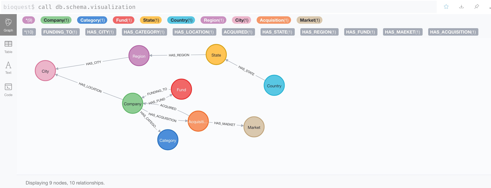

导入csv文件后，我们得到了24万个节点和约44万个关系。在Neo4j浏览器里显示如下。

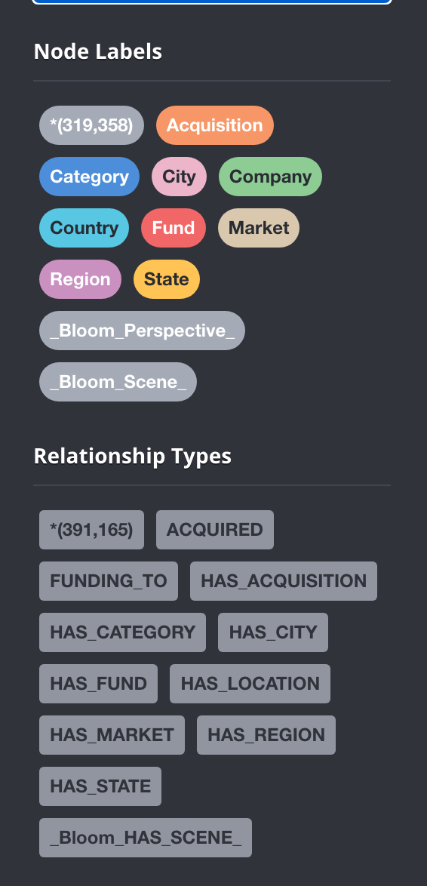

## 利用 NeoDash 统计分析

NeoDash是一个图形应用程序，可以在几分钟内通过Neo4j图形构建仪表板。您可以使用图形数据库创建多页可视化效果。有多个选项可以显示数据，例如地图，表格，条形图，饼图，图形，折线图等。它还允许设置影响其他可视化效果的动态参数。创建仪表板后，可以将其作为节点保存到图形数据库中。

我们可以使用Cypher返回统计信息。以下是一些关于投资的统计信息，由Cypher查询支持。如查询投资超过200家实体的公司。

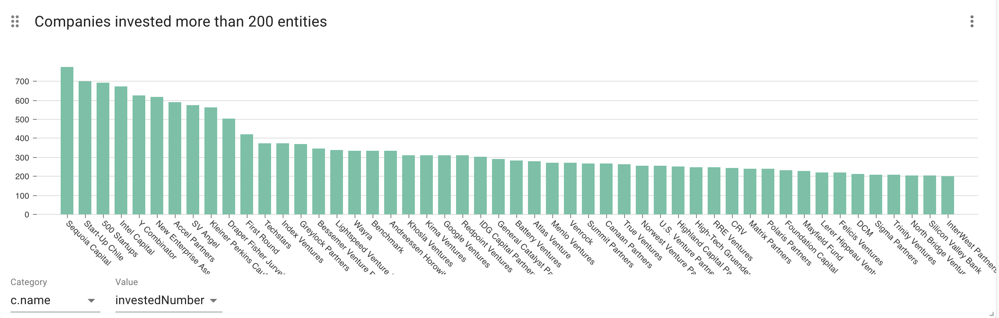

查询投资超过100亿的公司，这里可以看到投资最都的五家公司，分别是红杉资本，凯鹏华盈, 英特尔投资公司，恩颐投资， Accel合伙公司.

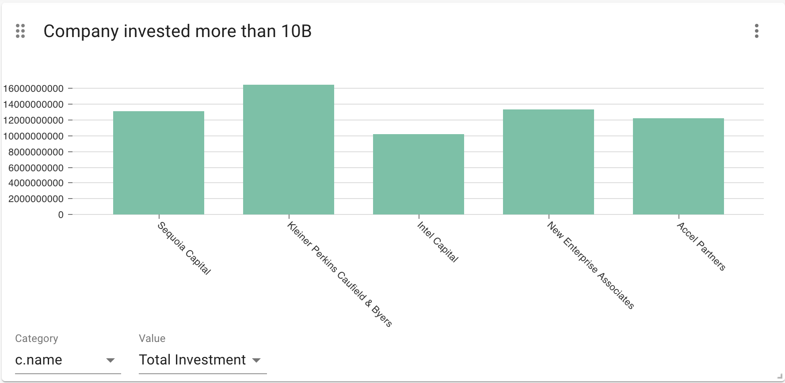

可以利用饼状图分析投资公司分布，如下图显示的在美国的投资公司按照城市的分布状况。

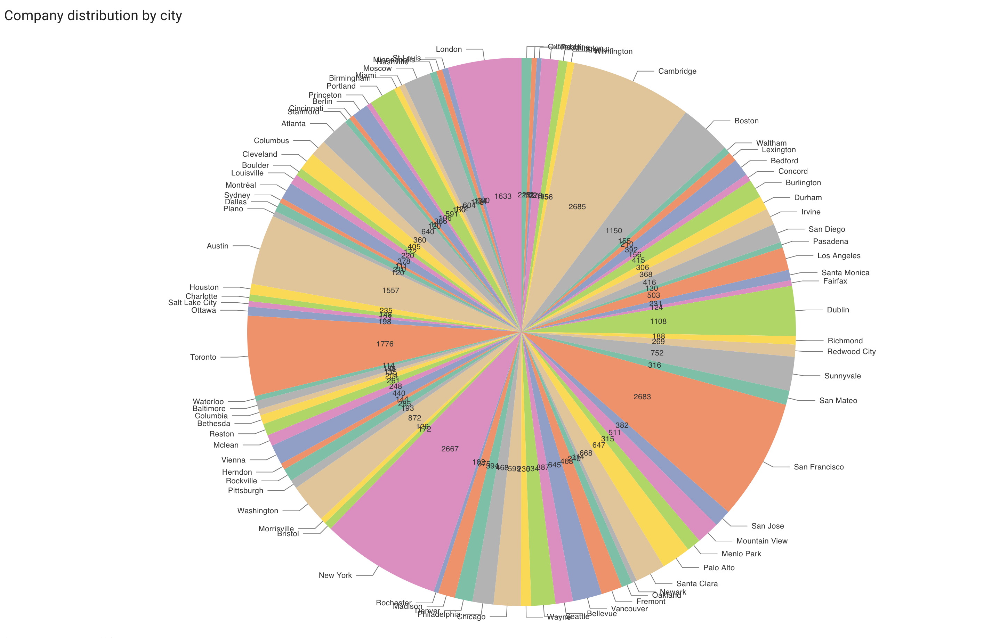

## 使用 GDS 分析投资走向和投资相似性

我们还可以使用GDS来获取一些有趣的数据，例如从一家公司到另一家公司的三角融资。 这些显示了使用Neodash的Neo4j GDS三角形算法检测到的三角形投资a->b->c->a。

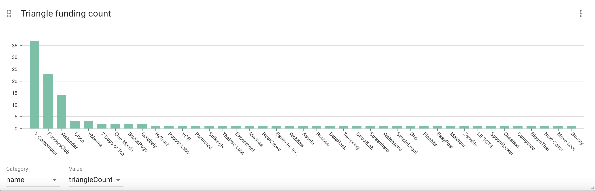

探查某个公司如VMware参与的三角投资关系，这里可以看到有多个公司参与了VMware的三角投资关系。

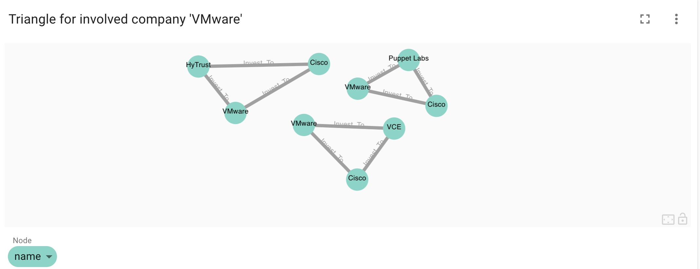

使用GDS 相似性算法可以揭示两个收购方根据其投资市场类别的相似程度。

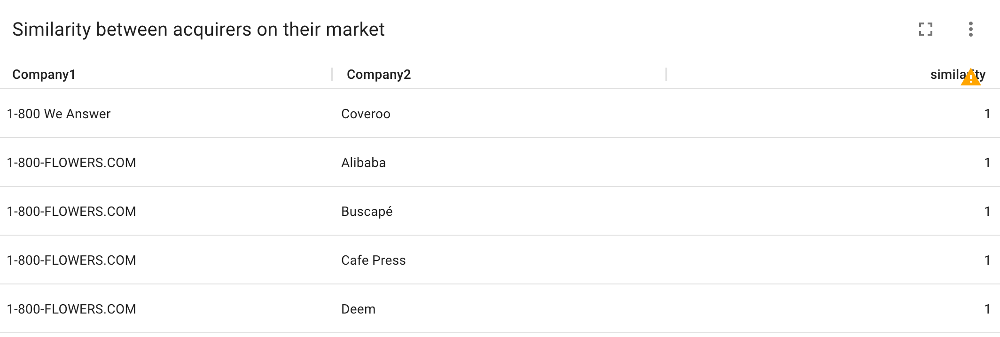

我们可以创建公司投资之间的内存子图

```cypher
CALL gds.graph.create.cypher(
  'companies',
  'MATCH (n:Company) RETURN id(n) AS id',
  'MATCH (n:Company)-[:HAS_FUND]-(:Fund)-[:FUNDING_TO]->(m:Company) RETURN id(n) AS source, id(m) AS target')
YIELD
  graphName AS graph, nodeQuery, nodeCount AS nodes, relationshipQuery, relationshipCount AS rels
```

通过分析，我们发现最大的联通子图成员有45030个成员。

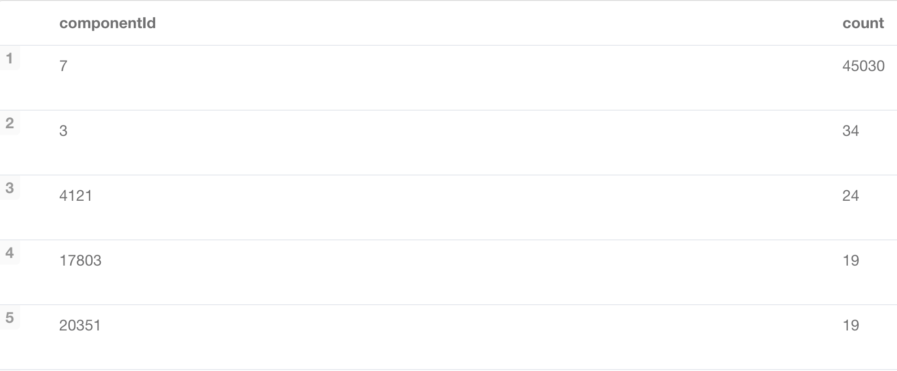

针对最大联通子图（也即社区号为7），我们可以继续创建内存子图，然后运行Page Rank 算法，找出投资指向最多的公司，下图显示Texxi公司获得了最高的PR分数。

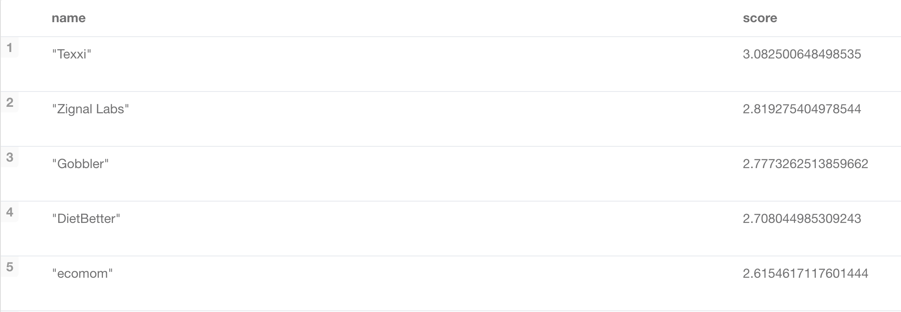

## 使用 Neo4j Bloom 进行投资探查

Neo4j Bloom 是一个用于交互式探索 Neo4j 图数据的工具。Neo4j Browser 主要由开发人员使用，而 Bloom 更适合数据分析师——那些想要动态可视化图数据和交互图数据的用户。Bloom 支持基于文本的搜索，没有 Cypher 知识的业务用户也可以容易的分析和探索 Neo4j 图数据。

我们可以使用 Bloom 浏览图形。下面是一个示例，用于通过多次跳转，查询了IAC公司收购了多家公司。

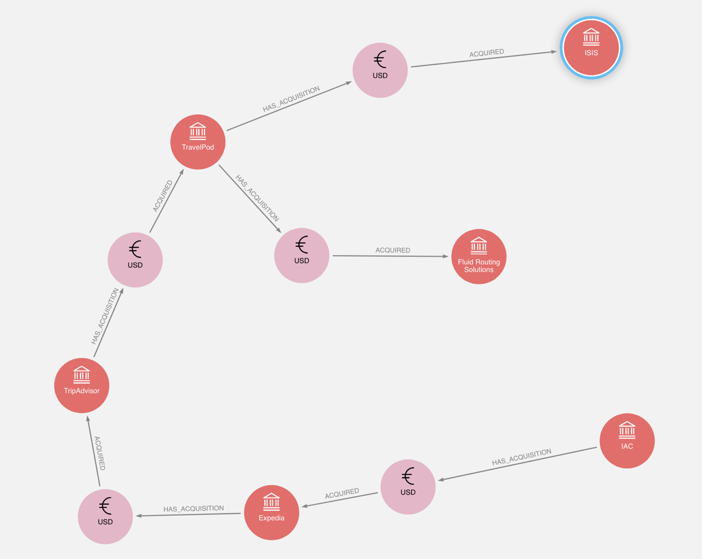

同时，针对投资指向最多的公司Texxi，可以通过Bloom直观显示有23笔投资投入。


## 结语

通过分析公司之间的投资关系，可以更好的发现探究是否公司的各种运营，关闭，收购阶段，同时该知识图谱可以扩展数据，如法人信息，法人之间关系，注册地信息，能够构建知识图谱，从而实现获益人分析，实体解析，或者非法获利等对知识图谱的广泛应用。

### 数据

Kaggle 比赛数据

https://www.kaggle.com/datasets/arindam235/startup-investments-crunchbase

### 更多资源

Neo4j Bloom

https://neo4j.com/product/bloom/ 

使用 NeoDash 1.1 构建交互式 Neo4j 仪表板

https://medium.com/neo4j/building-interactive-neo4j-dashboards-with-neodash-1-1-2431489a864e

NeoDash 2.0 — 一种全新的可视化 Neo4j 方式

https://medium.com/neo4j/neodash-2-0-a-brand-new-way-to-visualize-neo4j-ec8dee689e9b

