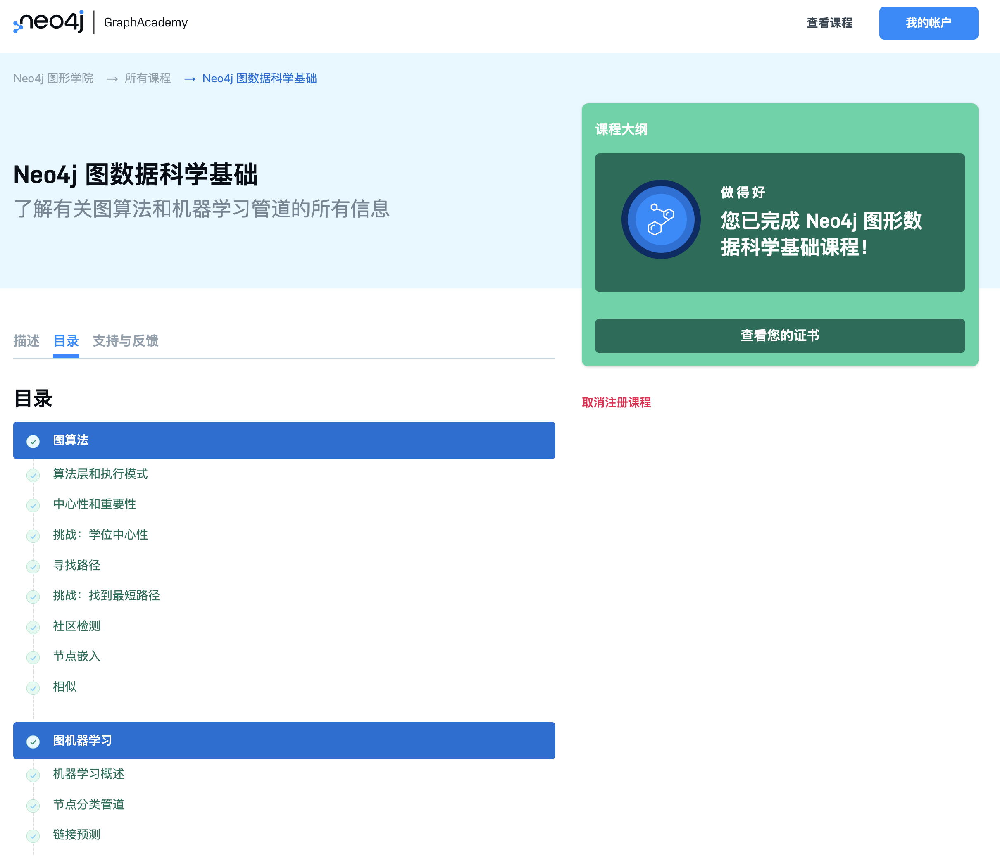
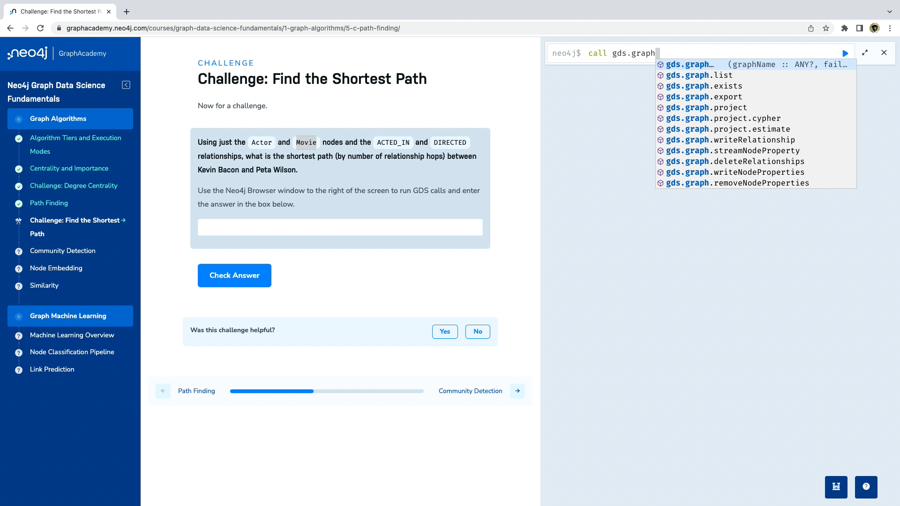
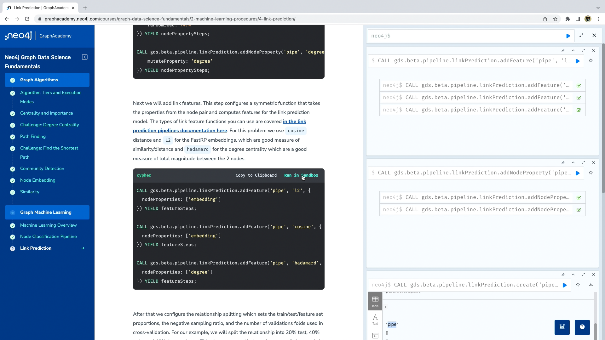

# GraphAcademy 课程讲解：《Neo4j 图数据科学基础》

2022-06-09


https://graphacademy.neo4j.com/courses/graph-data-science-fundamentals/

上次给大家介绍了GraphAcademy里面向数据科学家、数据工作者的课程《Neo4j 图数据科学简介》，从那里我们了解了Neo4j GDS的基本概念、安装和启用，以及图投影的具体操作。

今天给大家介绍后续课程《Neo4j 图数据科学基础》，我们详细看一下Neo4j GDS提供的图算法和它们适用的场景，以及图机器学习的基本用法。希望通过本文的阅读可以了解课程内容，强烈推荐注册课程开始你自己的学习和进行实际编码和测试。

## 什么是 GraphAcademy


Neo4j GraphAcademy 是 Neo4j 推出的在线互动学习平台，提供免费、自由掌握进度的在线动手实验培训课程。不管你是开发者、运维管理员，还是数据科学家或从事机器学习、人工智能相关工作的人员，都可以在 GraphAcademy 找到适合你的课程。

所有课程均由具有多年经验的 Neo4j 专业人士开发。我们的目标是为你提供令人愉快的实践培训，其中包含文本内容、视频和代码挑战。

你通过的每门课程都会解锁一个徽章，可以通过你的职业档案或社交网络与朋友和同事分享。通过完成 [Neo4j 认证考试](https://graphacademy.neo4j.com/categories/certification)，你将解锁限量版的 Neo4j T 恤奖励，以及更重要的是，获得图技术专业技术的证明，可以向雇主和同事展示这一荣誉。

## 《Neo4j 图数据科学基础》课程一览



在本课程中，我们将介绍数据科学家在使用 Neo4j 图形数据科学库 (GDS) 进行分析时需要了解的高级概念，课程涵盖了 GDS 中可用的图算法和机器学习操作的内容，并举例说明了如何在真实数据上使用它们。该课程继续使用运行在 [Neo4j 沙箱](https://sandbox.neo4j.com/?usecase=recommendations)的`movie recommendations`数据集，你将在整个课程中使用它。

本课程需要你具备一些基础的图数据科学知识和图数据库知识。如果没有完成《Neo4j 图数据科学简介》课程，建议先完成后再进行本课程的学习。

通过本课程你将掌握：

- 图算法的执行模式
- 不同类别的图算法和常见用例
- 如何在 GDS 中运行原生图机器学习管道

本课程分为两节内容，目录大纲如下：

### 图算法

- 算法层和执行模式
- 中心性和重要性
- 挑战：度中心性
- 路径查找
- 挑战：找到最短路径
- 社区检测
- 节点嵌入
- 相似度

### 图机器学习

- 机器学习概述
- 节点分类管道
- 链接预测

现在跟我一起看一看吧。

## 图算法

### 图算法产品级别和执行模式

我们从一段伪代码开始：

```cypher
CALL gds[.<tier>].<algorithm>.<execution-mode>[.<estimate>](
	graphName: STRING,
	configuration: MAP
)
```

这段代码表示调用Neo4j GDS库，`[]`表示可选，`<>`表示可以选择不同的值。

#### 图算法产品层级

`tier`表示Neo4j GDS产品的不同级别：**alpha**、**beta**和**正式版**。

- Alpha：表示算法处于实验阶段，可用于测试和验证，但随着版本的更新可能会发生变更。需要指定`tier`的值为`alpha`来调用Alpha版本的算法。
- Beta：表示算法经过了Alpha版本的验证，可以作为正式版的候选版本。需要指定`tier`为`beta`来调用。
- 正式版（production-quality）：即生产就绪版本，表示算法经过了稳定性和可扩展性测试，可以用在正式环境中。不指定`tier`的值就默认表示使用正式版。

#### 执行模式

`execution-mode`有4种，用来指定如何处理算法的结果：

1. `stream`：将算法的结果作为记录流返回。
2. `stats`：返回汇总统计的单条记录，但不写入 Neo4j 数据库或修改任何数据。
3. `mutate`：将算法的结果写入内存中的图投影并返回汇总统计的单个记录。
4. `write`：将算法的结果写回 Neo4j 数据库并返回汇总统计的单个记录。

#### 内存估计

`estimate`表示用来估算执行某个算法需要的内存大小，由GDS提供的一个估算程序来计算。

接下来我们详细看一看Neo4j GDS 提供的算法，即`algorithm`。

### 中心性和重要程度

中心性算法用于确定图中不同节点的重要程度，常见用例包括：

- **推荐系统**：识别并推荐你的内容或产品目录中最具影响力或最受欢迎的项目
- **供应链分析**：找到供应链中最关键的节点，无论是网络中的供应商、成品中的原材料还是路线中的港口
- **欺诈和异常检测**：查找具有许多共享标识符或充当许多社区之间桥梁的用户

#### 度中心性算法

度中心性是最普遍和最简单的中心性算法之一。它计算节点具有的关系数（度数）。在 GDS 实现中，我们专门计算*出度*中心性，即来自节点的传出关系的计数。比如：

```cypher
//get top 5 most prolific actors (those in the most movies)
//using degree centrality which counts number of `ACTED_IN` relationships
CALL gds.degree.stream('proj')
YIELD nodeId, score
RETURN gds.util.asNode(nodeId).name AS actorName, score AS numberOfMoviesActedIn
ORDER BY numberOfMoviesActedIn DESCENDING, actorName LIMIT 5
```

#### PageRank 算法

另一种常见的中心性算法是 PageRank，用于衡量有向图中节点的影响，特别是在关系暗示某种形式的移动*流*的情况下，例如支付网络、供应链和物流、通信、路由以及网站和链接图。PageRank 通过计算来自相邻节点的传入关系的数量来估计节点的重要性，这些相邻节点的权重是这些邻居的重要性和出度中心性。基本假设是，更重要的节点可能具有成比例的更多来自其他导入节点的传入关系。

如果您有兴趣深入研究，[我们的 PageRank 文档会提供有关 PageRank 的全面技术解释。](https://neo4j.com/docs/graph-data-science/current/algorithms/page-rank/)

#### 其他中心性算法

- **中介中心性**：衡量一个节点在图中其他节点之间的程度。它通常用于查找充当子图的一部分到另一部分的桥梁的节点。
- **特征向量中心性**：测量节点的传递影响。类似于 PageRank，但仅适用于邻接矩阵的最大特征向量，因此不会以相同的方式收敛，并且倾向于更强烈地偏爱高度节点。它在某些用例中可能更合适，尤其是那些具有无向关系的用例。
- **ArticleRank**：PageRank 的一种变体，它假设源自低度节点的关系比来自高度节点的关系具有更高的影响力。

可以在[GDS 文档的中心性部分](https://neo4j.com/docs/graph-data-science/current/algorithms/centrality/)找到所有产品层的中心性算法的完整列表。

#### 挑战：度中心性实战


如果网页上没有自己弹出Neo4j Browser窗口，可以点击右下角第一个按钮切换。希望你能一次通过，记得GDS的流程吗？先做投影然后执行算法。

### 路径查找

路径查找算法找到两个或多个节点之间的最短路径或评估路径的可用性和质量。常见用例是：

- **供应链分析**：确定原产地和目的地之间或原材料和成品之间的最快路径
- **客户旅程**：分析构成客户体验的事件。例如，在医疗保健领域，这可以是住院患者从入院到出院的经历

#### Dijkstra 源-目标最短路径

一种常见的行业标准相似性算法是 Dijkstra。它计算源节点和目标节点之间的最短路径。与 GDS 中的许多其他路径查找算法一样，Dijkstra 在比较路径时支持加权关系以考虑距离或其他成本属性。

下面是使用 Dijkstra 源-目标最短路径来查找演员“Kevin Bacon”和“Denzel Washington”之间的最短路径的示例。

```cypher
MATCH (a:Actor)
WHERE a.name IN ['Kevin Bacon', 'Denzel Washington']
WITH collect(id(a)) AS nodeIds
CALL gds.shortestPath.dijkstra.stream('proj', {sourceNode:nodeIds[0], TargetNode:nodeIds[1]})
YIELD sourceNode, targetNode, path
RETURN gds.util.asNode(sourceNode).name AS sourceNodeName,
    gds.util.asNode(targetNode).name AS targetNodeName,
    nodes(path) as path;
```

#### 其他寻路算法

其他 GDS 生产层路径查找算法可以分为以下几个不同的子类别：

*两个*节点之间的最短路径：

- **A\* 最短路径**：Dijkstra 的扩展，它使用启发式函数来加速计算。
- **Yen 最短路径**：Dijkstra 的扩展，可让您找到多条 top *k*最短路径。

一个源节点和多个其他目标节点之间的最短路径：

- **Dijkstra 单源最短路径**：Dijkstra 实现一个源和多个目标之间的最短路径。
- **增量步进单源最短路径**：并行化的最短路径计算。比 Dijkstra 单源最短路径计算更快，但使用更多内存。

一个源节点和多个其他目标节点之间的一般路径搜索：

- **广度优先搜索**：在每次迭代中按照与源节点的距离递增的顺序搜索路径。
- **深度优先搜索**：在每次迭代中尽可能沿着单个多跳路径进行搜索。

可以在[路径查找的文档](https://neo4j.com/docs/graph-data-science/current/algorithms/pathfinding/)中找到跨所有产品层的中心性算法的完整列表。

#### 挑战：寻找最短路径



同样，你可以在Neo4j Browser力执行任意的查询。希望你能一次通过。

### 社区检测

社区检测算法用于评估节点组在图中的聚类或分区方式。GDS 中的大部分社区检测功能都侧重于区分这些节点组并将其分配 ID，以进行下游分析、可视化或其他处理。常见用例包括：

- **欺诈检测**：通过识别经常发生可疑交易和/或彼此共享标识符的账户来发现欺诈圈。
- **客户 360**：将多个记录和交互消歧到一个客户档案中，这样组织就可以为每个客户提供一个汇总的事实来源。
- **市场细分**：根据优先级、行为、兴趣和其他标准将目标市场划分为可接近的子组。

#### Louvain 社区检测

一种常见的社区检测算法是 Louvain。Louvain 最大化每个社区的模块化分数，其中模块化量化了将节点分配给社区的质量。这意味着评估社区中节点的连接密度与随机网络中节点的连接程度相比。

Louvain 使用分层聚类方法优化了这种模块化，该方法将社区递归地合并在一起。有多个参数可用于调整 Louvain 以控制其性能以及产生的社区的数量和规模。这包括要使用的最大迭代次数和层次级别以及用于评估收敛/停止条件的容差参数。我们的[Louvain 文档](https://neo4j.com/docs/graph-data-science/current/algorithms/louvain/)更详细地介绍了这些参数和调整。


#### 其他社区检测算法

以下是其他一些生产层社区检测算法。可以[在社区检测算法文档](https://neo4j.com/docs/graph-data-science/current/algorithms/community/)中找到所有社区检测算法的完整列表。

- **标签传播**：与 Louvain 类似的意图。并行化良好的快速算法。非常适合大型图表。
- **弱连接组件（WCC）**：将图划分为连接节点集，使得
  1. 每个节点都可以从同一集合中的任何其他节点访问
  2. 不同集合的节点之间不存在路径
- **三角形计数**：计算每个节点的三角形数量。可用于检测社区的凝聚力和图的稳定性。
- **局部聚类系数**：计算图中每个节点的局部聚类系数，这是节点如何与其邻居聚类的指标。

### 节点嵌入

节点嵌入的目标是计算节点的低维向量表示，使得向量之间的相似度（例如点积）近似于原始图中节点之间的相似度。这些向量，也称为嵌入，对于探索性数据分析、相似性测量和机器学习非常有用。

下图说明了节点嵌入背后的概念，即图中靠得很近的节点最终在二维嵌入空间中靠得很近。因此，嵌入从图中获取结构，即 n 维邻接矩阵，并将其近似为每个节点的二维向量。由于显着降低了维度，嵌入向量在下游过程中的使用效率更高。例如，它们可以用于聚类分析，或者作为训练节点分类或链接预测模型的特征。


节点嵌入向量本身并不提供洞察力，它们是为了启用或扩展其他分析而创建的。常见的工作流程包括：

- **探索性数据分析 (EDA)**，例如可视化 TSNE 图中的嵌入，以更好地理解图结构和潜在的节点集群
- **相似度测量**：节点嵌入允许您使用 K 最近邻 (KNN) 或其他技术在大型图中扩展相似度推断。这对于扩展基于内存的推荐系统很有用，例如协同过滤的变体。它还可以用于欺诈检测等领域的半监督技术，例如，我们可能希望生成类似于一组已知欺诈实体的线索。
- **机器学习的特征**：节点嵌入向量自然地作为各种机器学习问题的特征插入。例如，在在线零售商的用户购买图表中，我们可以使用嵌入来训练机器学习模型来预测用户接下来可能有兴趣购买的产品。

#### FastRP

GDS 提供了一种节点嵌入技术的自定义实现，称为快速随机投影，或简称为 FastRP。FastRP 利用概率采样技术生成图的稀疏表示，从而可以*极快地*计算嵌入向量，其质量与传统随机游走和神经网络技术（如 Node2vec 和 GraphSage）生成的向量相当。这使得 FastRP 成为开始在 GDS 中探索嵌入图表的绝佳选择。

#### 其他节点嵌入算法

GDS 还实现了 [Node2Vec](https://neo4j.com/docs/graph-data-science/current/machine-learning/node-embeddings/node2vec/)，它基于图中的随机游走计算节点的向量表示，以及[GraphSage](https://neo4j.com/docs/graph-data-science/current/machine-learning/node-embeddings/graph-sage/)，它是一种使用节点属性和图结构计算节点嵌入的归纳建模方法。

### 相似度

相似度算法用于推断节点对之间的相似度。在 GDS 中，这些算法在图投影上批量运行。当根据用户指定的度量和阈值识别出相似的节点对时，在该对之间绘制具有相似性得分属性的关系。根据运行算法时使用的执行模式，这些相似性关系可以`stream`传输、`mutate`到内存图或`write`写回数据库。常见用例包括：

- **欺诈检测**：通过分析一组新用户帐户与标记帐户的相似程度来发现潜在的欺诈用户帐户。
- **推荐系统**：在在线零售商店中，识别与用户当前正在查看的商品配对的商品，以告知印象并提高购买率。
- **实体解析**：根据图中的活动或识别信息识别彼此相似的节点。

GDS 有两种主要的相似性算法：

- **节点相似度**：根据图中共享相邻节点的相对比例确定节点之间的相似度。在可解释性很重要的情况下，节点相似性是一个不错的选择，您可以将比较范围缩小到数据的子集。缩小范围的示例包括仅关注单个社区、新添加的节点或特定接近感兴趣子图的节点。
- **K 最近邻 (KNN)**：根据节点属性确定相似度。如果调整得当，GDS KNN 实现可以很好地扩展以在大图上进行全局推理。它可以与嵌入和其他图算法结合使用，根据图中的接近度、节点属性、社区结构、重要性/中心性等来确定节点之间的相似性。

#### 相似函数

除了节点相似度和 KNN 算法之外，GDS 还提供了一组函数，可用于使用各种相似度度量计算两个数字数组之间的相似度，包括 jaccard、overlap、pearson、余弦相似度等。完整的文档可以[在 Similarity Functions 文档](https://neo4j.com/docs/graph-data-science/current/algorithms/similarity-functions/)中找到。当您有兴趣一次测量单个选择节点对之间的相似性而不是计算整个图形的相似性时，这些函数很有用。

## 图机器学习

首先讨论一下 GDS 为何具有机器学习功能会有所帮助，你可以在 Neo4j 中生成图特征并将它们导出到另一个环境中以进行机器学习，例如 Python、Apache Spark 等。这些外部框架具有很大的自定义灵活性并调整机器学习模型。但是，您可能希望在 GDS 中使用基于图的机器学习工具有多种原因：

1. **管理复杂的模型设计**：图数据本质上是高度互连的，它给机器学习工作流程带来了复杂性，对于那些不太熟悉图的人来说，这些复杂性可能难以捕捉和解决。如果不加以考虑，这些复杂性可能会损害 ML 模型的有效性、计算性能和预测性能。GDS 管道包括解决这些复杂性的方法，否则这些复杂性很难在通用、非图特定的 ML 框架中开发和维护。主要示例是适当的数据拆分设计、处理严重的类不平衡以及避免特征工程中的数据泄漏。
2. **具有强数据库耦合的快速生产路径**：由于 Neo4j 中提供了 GDS，因此很容易将 GDS ML 直接应用于 Neo4j 数据库。一旦你在 GDS 中训练了一个管道，模型就会被有效地自动保存和部署——准备好通过一个简单的`predict`命令对来自 Neo4j 数据库的数据进行预测。企业用户可以保留这些模型以供重用，也可以将它们发布以在团队之间共享。
3. **开发和实验**：即使对于拥有成熟和强大 MLOps 工作流程的企业中经验丰富的从业者来说，原生 ML 管道也消除了许多通常与图机器学习相关的初始摩擦。这使您可以试验和测试模型方法以快速起步。

GDS 专注于为端到端 ML 工作流提供托管管道。数据选择、特征工程、数据拆分、超参数配置和训练步骤在管道对象中耦合在一起，以跟踪所需的端到端步骤。目前有两种受支持的 ML 管道类型：

- **节点分类管道**：节点的监督二元和多类分类
- **链接预测管道**：对节点对之间是否应该存在关系或“链接”的监督预测

这些管道有一个`train`程序，一旦运行，就会产生一个经过训练的模型对象。反过来，这些经过训练的模型对象具有`predict`可用于对数据进行预测的过程。您可以在 GDS 中同时拥有多个管道和模型对象。管道和模型都有一个目录，允许您按名称管理它们，类似于图目录中的图投影。

### 节点分类管道

下面是 GDS 中高级节点分类模式的图示，从投影图通过各个步骤到最终注册模型并对数据进行预测。


在实践中，训练步骤 1-6 将由流水线自动执行。您将只负责为它们提供配置和超参数。因此，在较高级别上，您的工作流程对于节点分类将如下所示，对于链接预测也是如此：

1. 投影图并配置管道（顺序无关紧要）。
2. 使用命令执行管道`train`。
3. `predict`使用命令在投影图上进行预测。如果需要，可以使用图写入`write`操作将预测写回数据库。

### 链接预测

GDS 目前提供二进制分类器，其中目标是 0-1 指标，0 表示无链接，1 表示有链接。这种类型的链接预测在无向图中非常有效，您可以在其中预测单个标签的节点之间的一种类型的关系，例如社交网络和实体解析问题。

下面是 GDS 中高级链接预测模式的图示，从投影图通过各个步骤到最终注册模型并对数据进行预测。


你会注意到此处的一些额外步骤与过去可能使用过的节点分类和其他通用 ML 管道不同。即，`feature-input`关系拆分中有一个附加集，现在位于节点属性和特征生成步骤之前。简而言之，这是为了处理数据泄漏问题，从而使用你想要预测的关系来计算模型特征。这种情况将允许模型使用通常不可用的特征中的信息，从而导致过于乐观的性能指标。[可以在文档](https://neo4j.com/docs/graph-data-science/current/machine-learning/linkprediction-pipelines/#linkprediction-configure-splits)中阅读有关数据拆分方法的更多信息。

图机器学习的两节都有详细的示例代码，你可以点击“Run in Sandbox”就能在当前页面的Neo4j Browser里看到执行结果。



## 课程总结

恭喜！你现在应该准备好使用 Neo4j 图数据科学库运行你的第一个图算法了。

在第一个模块**图算法**中，你了解了 Neo4j GDS 中可用的图算法以及如何在真实数据上使用它们。

在第二个模块**图机器学习**中，你了解了 GDS 原生机器学习操作，包括节点分类管道和链接预测。

## 下一步

现在你对 Neo4j 图数据科学 GDS 库的图算法和机器学习有了一些基本的了解和实战，你可以阅读 GDS 的详细文档来了解细节，甚至访问 GDS 的源代码来共同改进。现在是时候在实际业务中使用 GDS 了，欢迎随时跟我们保持联系。

### 参考资源

本课程地址：https://graphacademy.neo4j.com/courses/graph-data-science-fundamentals/

《Neo4j图数据科学简介》课程：https://graphacademy.neo4j.com/courses/gds-product-introduction/

课程数据集：https://github.com/neo4j-graph-examples/recommendations
