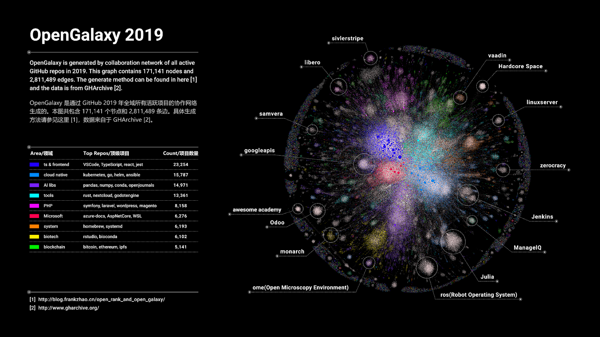

# Neo4j 中文开发者月刊 - 202206期

大家好，新的一期《Neo4j 中文开发者月刊》又和你见面了，刚刚过去的几周有很多事情发生。

比如6月8日 Neo4j 举办了线下的 GraphConnect 技术大会，接近1000人参会和上百场分享，虽然我们无法亲赴现场，但是我们准备了大会上的产品发布和更新，我们继续线上保持同步吧。

另外 GraphAcademy 对于系统掌握 Neo4j 技术有着非常大的帮助，而且目前参与课程和认证考试还有礼物赠送，本期月刊也分享了两门GDS课程的讲解，希望能帮助你更好的学习课程和通过考试。

\- Neo4j 中文开发者月刊编辑团队 

## 开发者头条

### [GraphConnect 2022 大会上的产品发布一览](https://blog.csdn.net/neo4jdev/article/details/125374951)

2022年6月8日 GraphConnect 2022 大会成功举办，本次大会上 Neo4j 公布了一系列产品发布和更新，本文介绍了多种新工具新产品和即将发布的新版本：新的工具：Neo4j Workspace图数据科学GDS新增算法：Leiden 和 K-means 聚类节点回归ML管道企业级数据量和用例支持Neo4j 运营管理工具新的Neo4j 集群和FabricNeo4j 数据仓库连接器（用来和Snowflake、BigQuery、Redshift和Azure Synapse交换数据)阅读原文了解详细介绍。

## 技术文章

### [GraphAcademy 课程讲解：《Neo4j 图数据科学简介》](https://neo4j.blog.csdn.net/article/details/125102073)

本文介绍 GraphAcademy 新上线的课程《Neo4j 图数据科学简介》，通过本文的阅读可以对课程结构和学习模式有所了解，敬请注册本课程开始你自己的学习和测验。

### [GraphAcademy 课程讲解：《Neo4j 图数据科学基础》](https://neo4j.blog.csdn.net/article/details/125214843)

本文介绍《Neo4j 图数据科学简介》的后续课程《Neo4j 图数据科学基础》，本课程将更详细地介绍 Neo4j GDS 提供的图算法和它们适用的场景，以及图机器学习的基本用法。通过本文的阅读可以了解课程内容，强烈推荐注册课程开始你自己的学习和进行实际编码和测试。

### [使用 ECharts 可视化 Neo4j 数据](https://neo4j.blog.csdn.net/article/details/125320398)

除了使用 Neo4j Browser 和 Neo4j Bloom 来展示 Neo4j 的查询结果以外，还有很多第三方的可视化工具能够用来展示图数据。本文介绍和演示在 Apache ECharts 中展示 Neo4j 数据库中的数据。

### [使用 Neo4j 沙箱学习 Neo4j 图数据科学 GDS](https://neo4j.blog.csdn.net/article/details/125112256)

在快速上手的系列文章和 GraphAcademy 的课程里，我们可以看到 Neo4j Sandbox，它是一个无需下载的在线Neo4j数据库服务，优势在于有很多可选择的预先准备好的数据集，非常方便用于学习和探索数据。最近我们发布了Neo4j GDS 2.0，一种本地使用GDS的方式就是安装Neo4j Desktop，新建数据库实例，安装GDS插件，然后需要寻找数据集……你知道如何快速学习 GDS 算法和应用图算法吗？答案就是 GDS 沙箱。立即注册 GDS 沙箱开始体验真实数据集上的图数据科学吧。

## 社区故事

### 基于 Neo4j GDS 开源网络异质图 PageRank

作者：Frank 赵生宇

在「加权 PageRank 下的 GitHub 全域项目活跃度分析」一文中，我详细介绍了一种基于 WPR 的全域项目活跃度分析方法，本文将据此进行深入并进一步形式化，使其成为一种更加通用的全域项目分析方法，我将其命名为 OpenRank，而基于 OpenRank 的图构建方法，可以进一步引申出一种图网络可视化方法，我将其称之为 OpenGalaxy，即开源星系。

在 6月8日的CDS活动上，Frank 赵生宇给大家分享了 OpenRank 和Neo4j的来龙去脉，以及GDS代码库开源协作案例。

原文为Frank演讲的回放录像。

[阅读原文](https://www.bilibili.com/video/BV1FW4y1k7Wf/?t=34m17s)

### 加入 CSDN Neo4j 社区，共同成长

Neo4j 官方团队正式进入中国为大家服务，我们通过本地化的交流帮助大家了解和掌握Neo4j产品。在这过程中，越来越多的开发人员和决策者跟我们取得了联系，在沟通过程中，希望大家多多参与到社区里正式的交流讨论，也能够沉淀出问题的解决方案，方便后续的搜索和分享，互助进步。

[访问 CSDN Neo4j 社区](https://bbs.csdn.net/forums/neo4j)

## 活动推荐

### Neo4j GraphTalk 与你话 “图” - 图数据科学GDS如何助力精准预测

如今的企业需要将图分析加入现有的分析能力中，图分析技术最重要的贡献在于帮助企业发掘数据中没有被意识到或者认为不存在的隐藏关系和模式。图分析是人工智能和机器学习跨越到新阶段的关键，为机器学习提供高度可信和精准的关系模型和预测。认知智能阶段，关联以知识图谱的方式呈现，并在知识图谱上运行，获得可解释的结果、数据以及算法，从而进行预测。这就是图数据科学(Graph Data Science)受到极大关注并日渐流行的主要原因之一。

Neo4j图数据科学是一个图分析和建模平台。它结合了现有数据中关系和网络结构的预测能力，解答之前难以解决的问题并提高预测准确性。使用图算法和机器学习，数据科学家可以识别模式和行为，改进他们的模型，以在引擎推荐、欺诈检测、路线优化和客户360场景中使用，通过改进预测来实现更优决策和创新。 

Neo4j是全球领先的图数据平台领导者，在企业级数据库基础之上建立了一个超级强大的可扩展数据科学平台。Neo4j图数据科学不仅提供全面丰富的功能，更大大简化数据科学家的工作流程，让数据科学家通过综合的图分析技术轻松实现更精准的预测。

我们特邀请Neo4j 合作伙伴（北京微云数聚）的专家们和 Neo4j 的优秀嘉宾一起与你话“图”，并由我们 Neo4j 开发者关系布道师朱兴亮担任主持。请于2022年7月6日（星期三）下午4点加入我们，聆听专家们如何解读图数据科学GDS。

#### **活动时间**

2022年7月6日 星期三 16:00

#### 活动日程

| 时间  | 主题                                          | 嘉宾                                                         |
| ----- | --------------------------------------------- | ------------------------------------------------------------ |
| 16:00 | 看 Neo4j 图数据科学如何让您的知识图谱如虎添翼 | Kristof Neys（Neo4j 图数据科学家） 翻译： 丁可（Neo4j亚太区高级技术顾问） |
| 16:30 | 面向 Python 开发者的数据科学家成长指南        | 朱兴亮（Neo4j 开发者布道师）                                 |
| 17:00 | Neo4j GDS 图数据科学介绍及应用分享            | 邬瑞文 (微云数聚（北京）科技有限公司销售负责人)              |
| 18:00 | 有奖问答，神秘嘉宾互动                        |                                                              |

本次活动特别礼品如下：

本次活动需要提前报名注册，我们还为积极的互动参会者提供了奖品，不容错过。

#### [立即报名](http://dataintelligencetribe.mikecrm.com/H81tW1J)

---

不想错过未来的精彩内容？点击[这里](https://go.neo4j.com/china-opt-in.html)或者扫描下面的二维码马上加入。

