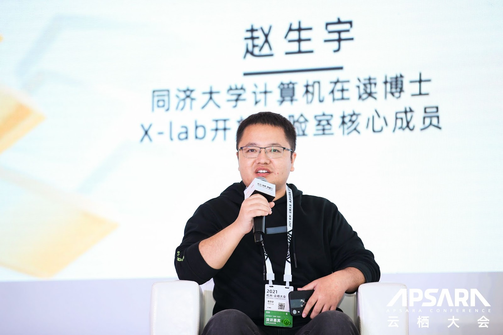

# 图无处不在系列活动：Neo4j GDS 如何助力数据科学家提升数据洞察力

2022-06-07

## 活动介绍

在数字化转型日益深入的同时，数据科学的应用也越来越广泛和深入。数据科学家所面对的业务问题的复杂性和难度亦在不断提高。基于这方面的需求，Neo4j 图数据科学（GDS）如何助力数据科学家提升数据洞察的能力和效率？

Neo4j 图数据科学（GDS）旨在让数据科学家通过综合的图分析技术轻松实现更精准预测，通过图算法库、机器学习和数据科学方法改进模型。Neo4j 图数据科学 （GDS）已被广泛采用并大规模实施，轻松处理数千亿个节点和关系。可访问 60多种强大、可扩展的算法和监督机器学习，利用数据关系做出更好的预测。是业界唯一的图内机器学习。

利用Neo4j 图数据科学 （GDS），数据科学家可在跨生态系统的现有数据管道工具中轻松工作。数据科学家可在本地使用Neo4j 图数据科学（GDS），现在还可通过 Neo4j AuraDS 使用完全托管的 SaaS 解决方案。

现特邀您参加我们为您精心准备的线上直播，了解图世界最新和最伟大的图数据技术，也热烈欢迎与我们团队的伙伴进行交流和保持联系。

## 活动时间

2022年6月8日 (星期三）16:00

## 活动报名

本次活动需要提前报名注册  https://meeting.tencent.com/dw/kphGVv0izWtu?ch=8336754796031

## 活动日程	

16:00 - 16:30：**利用 Neo4j GDS 2.0 Python Client 进行欺诈检测** (丁可 - Neo4j 亚太区高级技术顾问)
16:30 - 17:00：**基于 Neo4j GDS 开源网络异质图 PageRank** (赵生宇 - 同济大学计算机技术、X-lab 开源博士生。开源社理事会理事）
17:00 - 17:15：**有奖互动问答**
17:15 -           ：**闭幕**

## 讲师介绍

**丁可** - Neo4j 亚太区高级技术顾问

超过15年IT从业经验。加入Neo4j前，就任于亚马逊AWS解决方案架构师、甲骨文高级销售顾问等多个行业顶尖公司，有着多年咨询与解决方案支持经验。对于互联网公司、教育培训机构、制造业等行业的信息系统与应用架构有着多年的支持和实践经验。对于公有云、各类数据库和大数据技术有着长期的关注与深刻理解。

**赵生宇** - 同济大学计算机技术、X-lab 开源博士生。开源社理事会理事。

担任多届中国开源年会 COSCon 组委会成员。Wuhan2020 开源项目发起人。华东师范大学《开源软件开发与社区治理》特聘授课专家。

## 感谢

本次Neo4j中国图数据平台线上分享由Neo4j中国团队为你呈献，欢迎报名和分享本次活动。