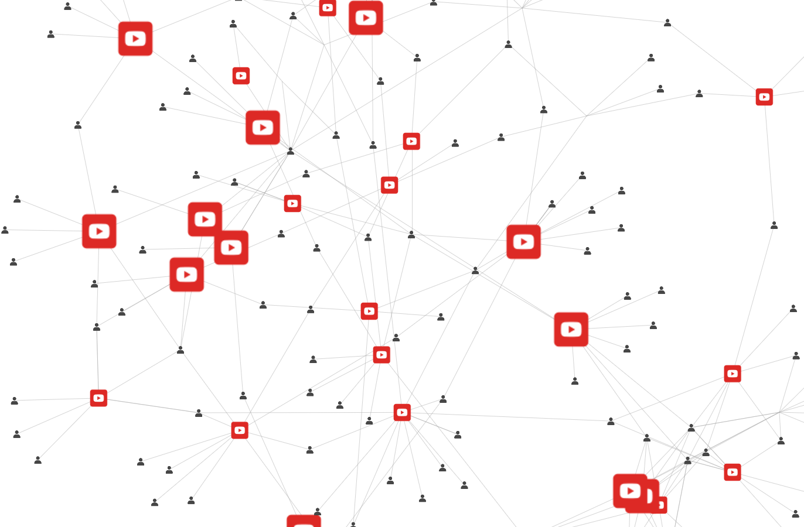
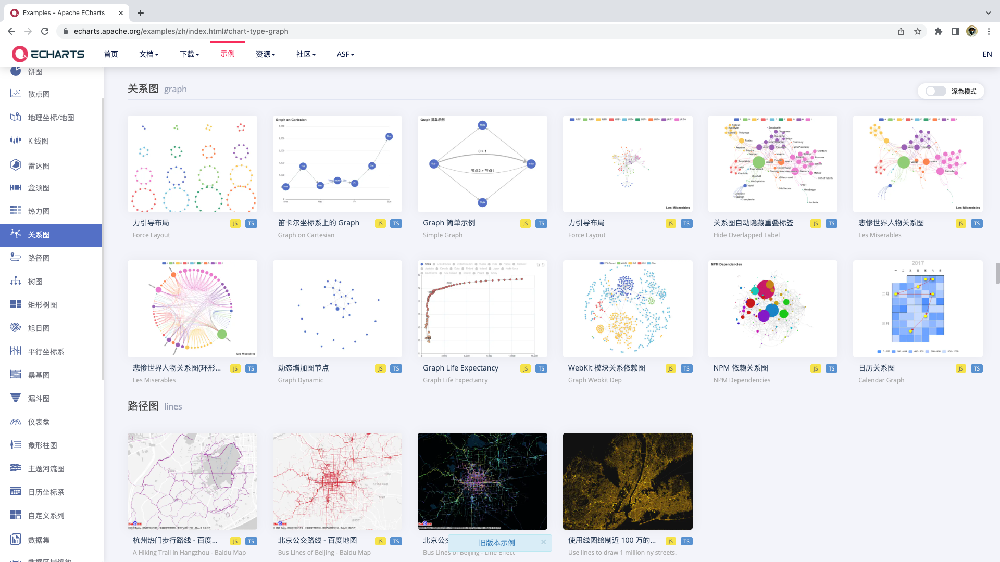
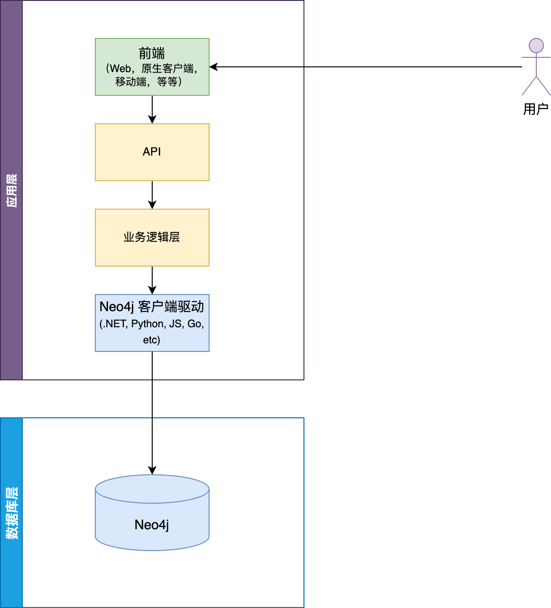
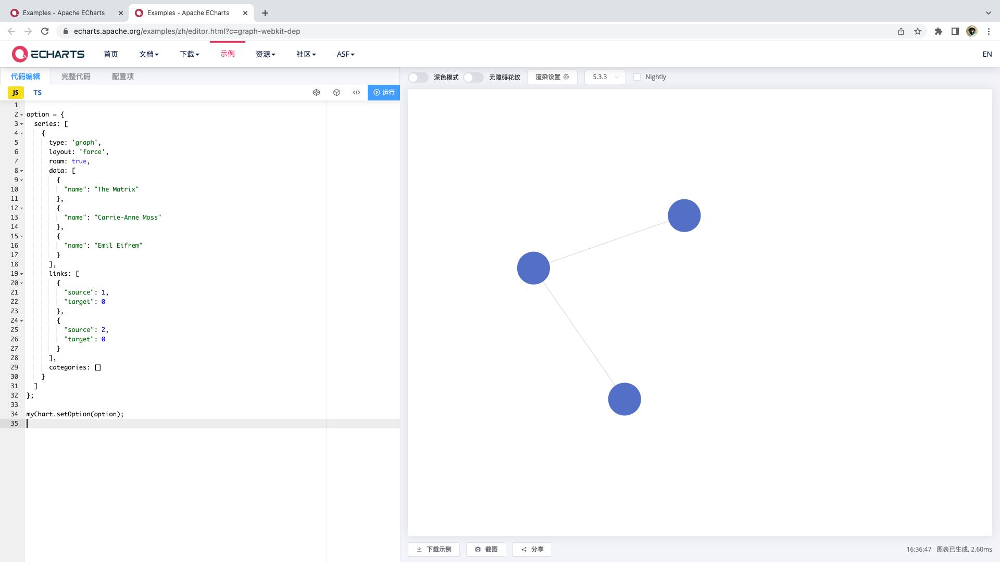
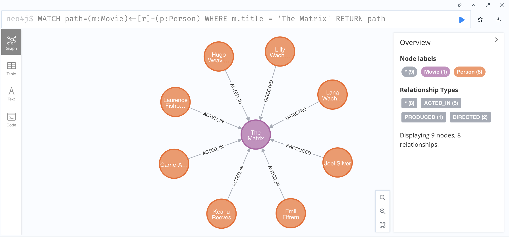
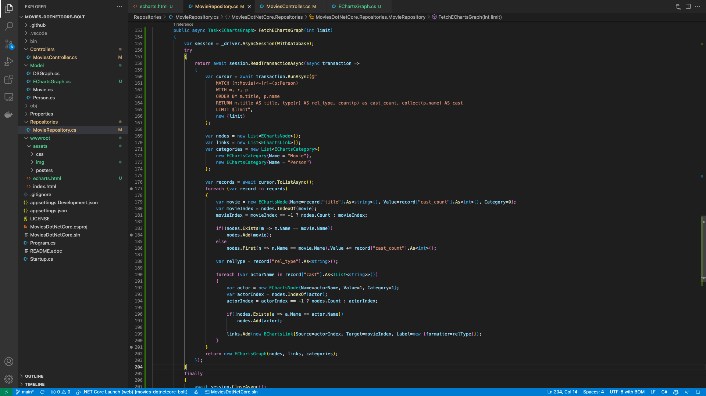
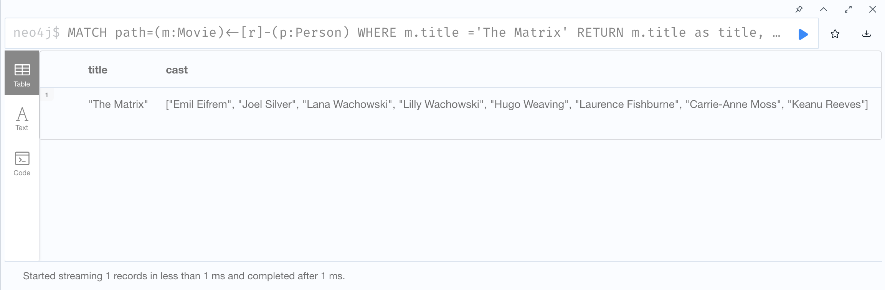
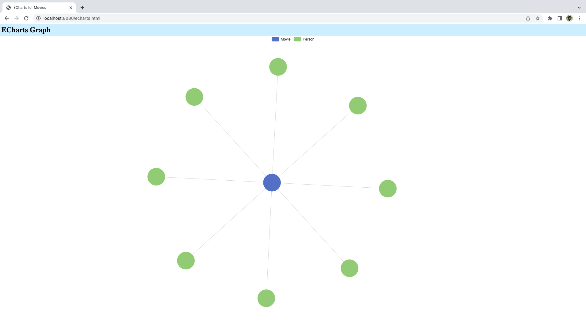
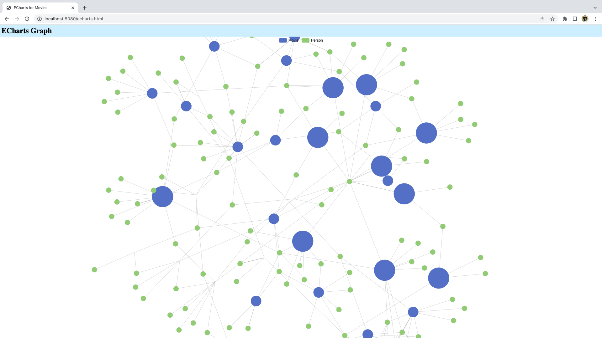

# 使用 Apache ECharts 可视化 Neo4j 图数据

2022-06-15



除了使用 Neo4j Browser 和 Neo4j Bloom 来展示 Neo4j 的查询结果以外，还有很多第三方的可视化工具能够用来展示图数据。今天给大家简单演示在 Apache ECharts 中展示 Neo4j 数据库中的数据。

## 什么是 ECharts

ECharts 是 Apache 的一个开源项目，由百度主导开发并捐献给 Apache 开源软件基金会。ECharts 是一个基于 JavaScript 的开源可视化图表库。

ECharts 除了提供常规的折线图、柱状图、饼图等等，今天我们重点来看看提供的关系图。在示例网站上可以看到有如下的例子：



## 如何使用 ECharts（及前端可视化工具）

使用JavaScript实现的可视化工具的应用非常广泛，因为它们几乎都能适应网页端和移动端，甚至能够通过嵌入方式整合进原生客户端应用程序里。

### 全栈系统架构

在正式开始之前，我们先一起看看这类可视化工具在我们整个软件系统里所处的位置，如果你是新手或者没有全栈的经验，也可以从下图中了解一下系统架构。



当用户需要看到我们的可视化图表时，用户需要通过浏览器来访问我们的前端网页。ECharts就是运行在前端网页里的一个可视化框架。

我们知道“数据可视化”是一个完整的词，可视化的就是数据，ECharts需要指定格式的数据来展示直观的图表，这些数据就是由后端的API层来提供。

后端API可以看作是通过业务逻辑层的处理，业务数据我们就存储在数据库层，比如Neo4j的数据库实例中。

所以我们要做一个可视化的应用时，你需要知道这整个流程，即使这一条线可能由不同的团队来具体实现，你也能够更好地与不同团队沟通交流。

### ECharts 入门

ECharts是以JS库的方式分发，我们只需要在前端页面中引入js文件就准备好了：

```html
<!DOCTYPE html>
<html>
  <head>
    <meta charset="utf-8" />
    <!-- 引入刚刚下载的 ECharts 文件 -->
    <script src="echarts.js"></script>
  </head>
</html>
```

然后在页面中创建一个占位的节点用来展示 ECharts 图表：

```html
<body>
  <!-- 为 ECharts 准备一个定义了宽高的 DOM -->
  <div id="main" style="width: 600px;height:400px;"></div>
</body>
```

接下来就可以配置 ECharts 如何展示和如何使用数据，就能看到图表了：

```html
<script type="text/javascript">
  // 基于准备好的dom，初始化echarts实例
  var myChart = echarts.init(document.getElementById('main'));

  // 指定图表的配置项和数据
  var option = {
    title: {
      text: 'ECharts 入门示例'
    },
    series: [
      {
        name: '销量',
        type: 'bar',
        data: [5, 20, 36, 10, 10, 20]
      }
    ]
  };

  // 使用刚指定的配置项和数据显示图表。
  myChart.setOption(option);
</script>
```

可以看到，具体的数据使用`series`来存储，然后将整个`option`赋给ECharts实例，就能够按照配置显示对应的图表了。这部分可以从 ECharts 官方文档中找到详细的介绍。

接下来我们就详细看看今天的关系图例子吧。

## ECharts 关系图配置

我们从官网的示例来学习如何准备关系图的数据。



打开示例后就能看到如图的编辑器，我们通过编辑左边的JS代码，就能实时看到展示效果。此时建议用少量数据来熟悉ECharts所要求的格式。上图用到的代码如下：

```js
option = {
  series: [
    {
      type: 'graph',
      layout: 'force',
      roam: true,
      data: [
        {
          "name": "The Matrix"
        },
        {
          "name": "Carrie-Anne Moss"
        },
        {
          "name": "Emil Eifrem"
        }
      ],
      links: [
        {
          "source": 1,
          "target": 0
        },
        {
          "source": 2,
          "target": 0
        }
      ],
      categories: []
    }
  ]
};

myChart.setOption(option);
```

如果你想知道每一项的含义，可以访问ECharts官网的文档》配置项手册进行详细了解。

要展示关系图，需要设置`type`为`graph`，然后有两个重要的配置项：`data`（或`nodes`）和`links`（或`edges`），以及`categories`用来表示不同类别的节点。

另外我们还能过看到节点的数据项包含`name`属性，`links`的数据项使用`source`和`target`来表示关系的方向。

那么，Neo4j查询出来的数据如何转换成这种格式呢？

## 数据一览

我们使用电影数据集为例，在Neo4j中使用这个查询：

```cypher
MATCH path=(m:Movie)<-[r]-(p:Person)
WHERE m.title = 'The Matrix'
RETURN path
```



这是 Neo4j Browser展示出来的图，从上面的ECharts配置我们知道，需要我们把数据封装成不同的格式。

现在就让我们来打通前端到数据库吧。

## 全栈应用一览

我使用了ASP.NET Core来开发这个应用，.NET目前是一个跨平台的框架，我也使用了十多年。这里用到了MVC模式来实现前端和业务层，使用Repository模式来实现数据库访问。

具体的开发项目配置可以参考GitHub上的代码库。



ECharts引入和配置的代码在`wwwroot/echarts.html`中。

为ECharts提供数据的API代码位于`Controllers/MoviesController.cs`中。

从Neo4j数据库获取数据是通过官方Neo4j .NET Client Driver实现，这部分代码在`Repositories/MovieRepository.cs`中。

Neo4j数据库实例我使用了AuraDB的免费版。注册即可无缝使用，免去运维和配置烦恼。

## 准备数据

我们知道ECharts的关系图需要将节点和关系分开成两个集合，所以我们要对Cypher查询做一些更新：

```cypher
MATCH path=(m:Movie)<-[r]-(p:Person)
WHERE m.title ='The Matrix'
RETURN m.title as title, collect(p.name) as cast
```

我们按照电影分组，将人物的名字作为集合返回，这样就能够在2个字段里看到这些数据了。



这一步需要在我们的应用里实现，这里就是使用.NET Driver来做这件事了，部分代码如下：

```csharp
public async Task<EChartsGraph> FetchEChartsGraph(int limit)
{
  var session = _driver.AsyncSession(WithDatabase);
  try
  {
    return await session.ReadTransactionAsync(async transaction =>
						{
						  var cursor = await transaction.RunAsync(@"
                        MATCH path=(m:Movie)<-[r]-(p:Person)
                        WHERE m.title = 'The Matrix'
                        RETURN m.title AS title, collect(p.name) AS cast
                        LIMIT $limit",
                        new {limit});

    				  var nodes = new List<EChartsNode>();
              var links = new List<EChartsLink>();
              
              var records = await cursor.ToListAsync();
              foreach (var record in records){
                var movie = new EChartsNode{Name=record["title"].As<string>()};
                var movieIndex = nodes.IndexOf(movie);
                movieIndex = movieIndex == -1 ? nodes.Count : movieIndex;
                
                if(!nodes.Exists(m => m.Name == movie.Name))
                  nodes.Add(movie);
                
                foreach (var actorName in record["cast"].As<IList<string>>()){
                  var actor = new EChartsNode{Name=actorName, Value=1, Category=1};
                  var actorIndex = nodes.IndexOf(actor);
                  actorIndex = actorIndex == -1 ? nodes.Count : actorIndex;
                  
                  if(!nodes.Exists(a => a.Name == actor.Name))
                    nodes.Add(actor);
                  
                  links.Add(new EChartsLink{Source=actorIndex, Target=movieIndex});
                }
              }
              
              return new EChartsGraph(nodes, links, categories);
            });
  }
  finally
  {
    await session.CloseAsync();
  }
}
```

这部分代码有精简，具体逻辑是通过Driver连接Neo4j数据库，然后在`transaction`中运行Cypher语句，再解析Cypher结果，这里我建立了一个`EChartsGraph`的类，用来表示需要封装的数据，里面有`EChartsNode`，`EChartsLink`用来表示节点和关系。

然后的逻辑是将数据封装到`nodes`和`links`集合中，注意集合中不能有重复的`name`，所以需要做一些检查。

## 提供API

在数据处理层完成了代码，我们就可以在API层通过Web API提供REST接口给ECharts用了，API层的代码如下：

```csharp
[Route("/echarts")]
[HttpGet]
public async Task<EChartsGraph> FetchEChartsGraph([FromQuery(Name = "limit")] int limit = 100)
{
  return await _movieRepository.FetchEChartsGraph(limit);
}
```

代码中`_movieRepository`就是数据层Repository的实例，直接调用获取数据的方法即可。

## 前端调用API

按照之前的配置，前端ECharts只是读取了固定的数据，我们需要在前端调用REST API，这样我们就能实现真实数据的展示了。

此时的ECharts配置如下：

```html
<script type="text/javascript">
  var myChart = echarts.init(document.getElementById("echarts"));

  myChart.showLoading();

  $.get("/echarts").done(function(graph){
    myChart.hideLoading();

    option = {
      legend: {
        data: ['Movie', 'Person']
      },
      series: [
        {
          type: 'graph',
          layout: 'force',
          animation: true,
          draggable: true,
          roam: true,
          selectedMode: true,
          lineStyle: {
            curveness: 0
          },
          emphasis: {
            focus: 'adjacency',
            lineStyle: {
              width: 5
            }
          },
          force: {
            repulsion: 50
          },
          nodes: graph.nodes,
          links: graph.links,
          categories: graph.categories
        }
      ]
    };
    myChart.setOption(option);
  })
</script>
```

这里我使用了另一个JS框架jQuery，提供了很简单的方式调用Web API。

然后将服务端的数据传给`nodes`和`links`，这样就完成了真实数据的对接。



是不是就有点感觉了？

## 更多定制

通过查看文档，我们可以看到通过`symbolSize`可以指定节点的大小，这里我们可以使用某个电影关联的人物数量来表示大小。

我们还可以去掉Cypher查询里的限制条件，返回更多的数据。

我这里最终使用的Cypher如下：

```cypher
MATCH path=(m:Movie)<-[r]-(p:Person)
RETURN m.title as title, type(r) as rel_type, count(p) as cast_count, collect(p.name) as cast
```

看到的效果如下：



## 继续探索

本文到这里就告一段落，但前端可视化展示的探索并没有结束，你可以继续调试不同的ECharts参数带来的影响，以此达到最佳的展示效果。

本文所用的源代码：https://github.com/shinyzhu/movies-dotnetcore-bolt

15种可视化工具：https://neo4j.com/developer-blog/15-tools-for-visualizing-your-neo4j-graph-database/

图可视化指南：https://neo4j.com/developer/graph-visualization/

Neo4j客户端驱动指南：https://neo4j.com/developer/language-guides/

