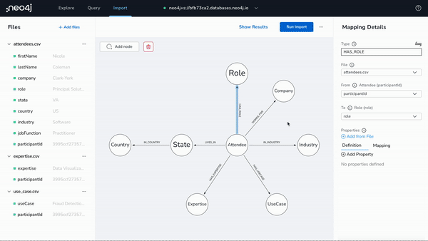
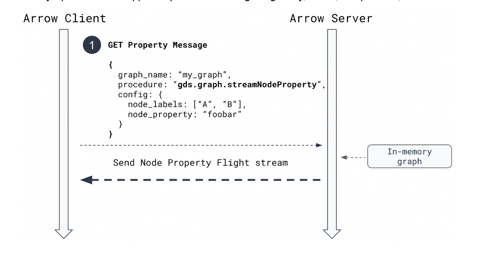
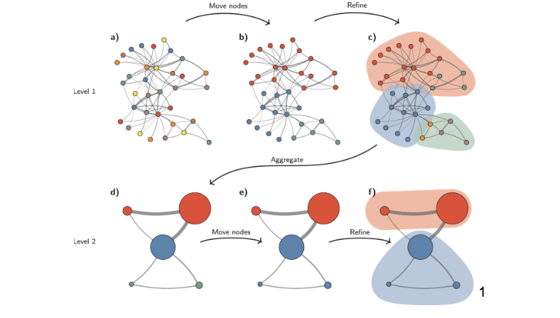
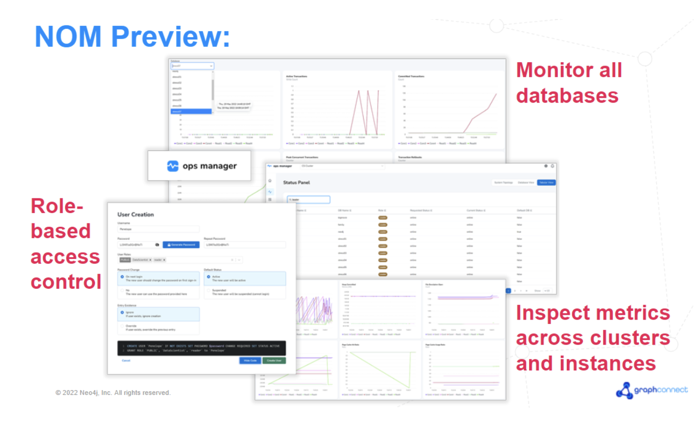

# GraphConnect 2022 大会产品发布一览

2022-06-21

2022年6月8日 GraphConnect 2022 大会成功举办，本次大会上 Neo4j 公布了一系列产品发布和更新，现在就跟我一起来看一下吧。

## 新工具

### Neo4j Workspace

Neo4j Workspace 是一个统一体验的新工具，将 Neo4j 最强大的图工具 — 数据导入工具 Data Importer、可视化工具 Bloom 和日常开发工具 Neo4j Browser — 集中在一个地方，帮助你快速、高效、轻松地启动和运行图数据库。

如果你已经有数据库实例了，只需在 Workspace 中连接数据库并开始探索和查询数据，而无需再次登录 Neo4j Bloom 或 Neo4j Browser。

如果你希望将新数据导入 Neo4j？今年早些时候宣布的 Data Importer 已经与 Workspace 集成，因此你可以提取多个数据集、设计数据模型、映射类别然后导入数据，搞定！现在你就可以在 Neo4j 图数据中探索和查询了。

这个动图演示了 Neo4j Workspace，如果你有兴趣，请在产品页面上注册，这样就可以成为第一个在测试版可用时尝鲜 Workspace 的人。

[了解 Neo4j Workspace](https://neo4j.com/product/workspace/?ref=blog)

## Neo4j GDS 新功能

### 什么是 GDS（图数据科学）？

Graph Data Science（图数据科学，简称 GDS）通过一个易于使用的引擎，可以处理已有的数据、已有的数据堆栈以及已有的数据管道，从而能够快速、可操作地洞察什么是重要的、什么是不寻常的以及接下来会发生什么，快速将更多数据科学项目从概念验证转移到生产。

### 企业级数据量、用例和复杂性的新功能：

与用于图投影的 Apache Arrow 集成：导入和导出海量大图 — 高达800 万个对象每秒！将 GDS 无缝插入到现有的机器学习管道，并进行需要导出到下游系统的分析工作。

该集成在 GDS Python 客户端中提供了方便的功能，可加载和导出 DataFrame，并访问低级别 Arrow API 以与任何 Apache Arrow 支持的产品（如 Google BigQuery、Beam、Parquet 文件等）集成。

### 助力数据科学家的新功能：

- 新发布`Alpha`层级算法 - [Leiden](https://neo4j.com/docs/graph-data-science/2.1/algorithms/alpha/leiden/)：一种新的社区检测算法，保证社区连接良好的层次聚类算法。与 Louvain 类似，用户要求这种方法来创建更具凝聚力的社区。

- 新发布`Alpha`层级算法 - [K-means 聚类](https://neo4j.com/docs/graph-data-science/2.1/algorithms/alpha/kmeans/)：一种社区检测算法，旨在基于属性（如嵌入）对节点进行聚类。用户可以指定所需的集群数量，GDS 会找到最佳的分组。
- 新的`Aplha`层级机器学习管道 - [节点回归](https://neo4j.com/docs/graph-data-science/2.1/machine-learning/node-property-prediction/noderegression-pipelines/)：用户可以使用节点回归管道预测节点的数值属性值。节点回归允许用户根据其他节点属性和图拓扑填充缺失的属性值。

要尝试 Neo4j GDS 中的新功能，请访问 Neo4j 的 GDS 专用沙箱环境。

[启动你的 GDS 沙箱](https://neo4j.com/data-science-sandbox/?ref=blog)

## Neo4j 图数据库新特性

### Neo4j 运营管理工具

直到最近，管理 Neo4j 数据库的运营团队还没有用于监控或管理的可视化 UI。他们必须依靠需要集成和单独订阅或签合同的第三方工具来监控数据库的状态和每个实例的健康指标，要执行管理任务，他们必须使用命令行界面。

运营团队还面临着必须管理数据库数量和种类不断增加的挑战，每个数据库都需要跨集群和主机部署越来越多的数据。 他们需要工具来应对这些复杂的挑战。 具体来说，你一直告诉我们需要一个基于图形 UI 的工具来管理 Neo4j 资产。

我们听到了，这正是我们正在提供的，它就是 Neo4j 运营管理工具（Operations Manager），这是一种新产品，可让你轻松地从基于 UI 的中央应用程序监控和管理所有 Neo4j 数据库、实例和集群。

#### 使用 Neo4j 运营管理工具的优势

- 运营团队成员可以立即以图形方式来查看管辖的所有数据库的状态，能看到是否一切正常，或者是否任何集群或实例在任何给定时间点需要关注。
- 运营团队成员可以检查每个实例的运行状况，查看特定于数据库的指标，例如缓存命中率，以便在问题变严重之前对其进行故障排除。
- 在管理方面，我们首先为运营团队成员提供了一种为每个用户设置基于角色的访问权限（RBAC）的方法。

随着我们采用敏捷交付模型，预计未来会频繁交付其他 Neo4j 运营管理工具的功能，例如自动执行重要的操作任务或评估 Neo4j 数据库的性能。

使用 Neo4j 运营管理工具管理 Neo4j 数据库将帮助你的运营团队大幅提高他们的生产力并提高 Neo4j 部署的可靠性。

### 新的 Neo4j 集群和 Fabric

随着数据不断增长到超过数 TB，关注与管理和扩展超大图相关的运营问题变得越来越重要。挑战包括大数据集的备份和恢复时间，每个月向现有图添加一个新的分片，或者避免一次扩展整个集群。

从 Neo4j 5.0 开始 — 将于 2022 年 10 月左右正式发布（GA） — 新的集群功能更新将提供水平扩展，而无需垂直扩展集群中的现有服务器。这意味着数据库的数量或这些数据库的大小会增加，因此您的基础架构可以随数据有效扩展。

通过分片，数据库在操作上变得更易于管理（例如备份和恢复），并且可以实时组合联邦图并以毫秒的响应时间进行查询。随着 Neo4j Fabric 5.0 中的新变化，现在可以跨集群、多个集群或 AuraDB 组合图，以实现真正的云数据扩展。虽然发生的任何数据库基础架构更改对应用程序都是不可见的，但对于需要将 Fabric 扩展到单个集群之外的客户，Neo4j 运营管理工具提供了整个 Neo4j 平台的操作视图。

如下图所示为Neo4j 5.0 中的集群增强（在 Neo4j 4.4 技术预览中可用）：

如下图为 Neo4j 5.0 的 Fabric 增强功能 – 即将推出！

## 连接器和扩展的新功能

我们正在将 Neo4j 数据仓库连接器添加到我们的连接器产品组合中。这个新的连接器提供了一种在 Neo4j 和流行的数据仓库（如 Snowflake、BigQuery、Amazon Redshift 和 Microsoft Azure Synapse Analytics）之间移动数据的简单方法。

### Neo4j 数据仓库连接器

您可以通过两种方式使用它：

1. 作为 Spark Submit 的 Job，通过提供一个 JSON 配置来抽象 Spark Job，该 Job 将数据从一个数据源移动到另一个数据源。
2. 作为 Scala/Python API，以简化将数据从一个数据库移动到另一个数据库的 Spark Job 的编写。

这允许数据科学家在不同数据源之间移动数据，以便他们可以将图和图数据科学集成到他们的管道中。

要了解有关数据仓库连接器的更多信息，请在 Github 上查看。

[访问 Neo4j 数据仓库连接器 Github 页面](https://github.com/neo4j-contrib/neo4j-dwh-connector/?ref=blog)

## 总结

这是一个简单的汇总，我们很高兴为客户和社区提供这些新的增强的功能。我们的使命是让图技术比以往任何时候都更易于访问、更强大和更适用，这些发展让我们在旅程中更进一步。

随着我们在接下来的几周和几个月内推出这些和其他新产品，我们期待听到您自己在图空间中的工作是如何演变的。欢迎跟我们反馈你的使用经历。

