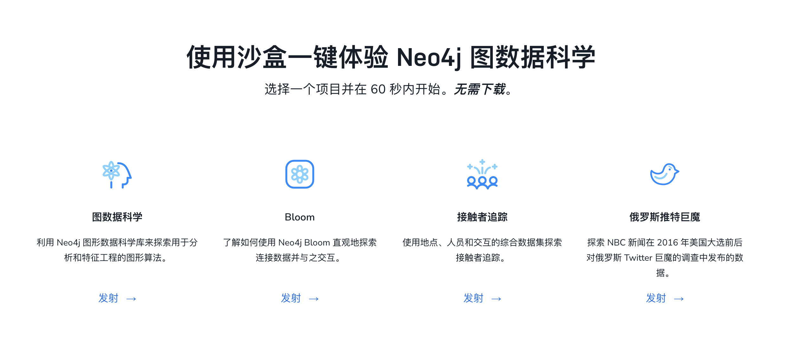
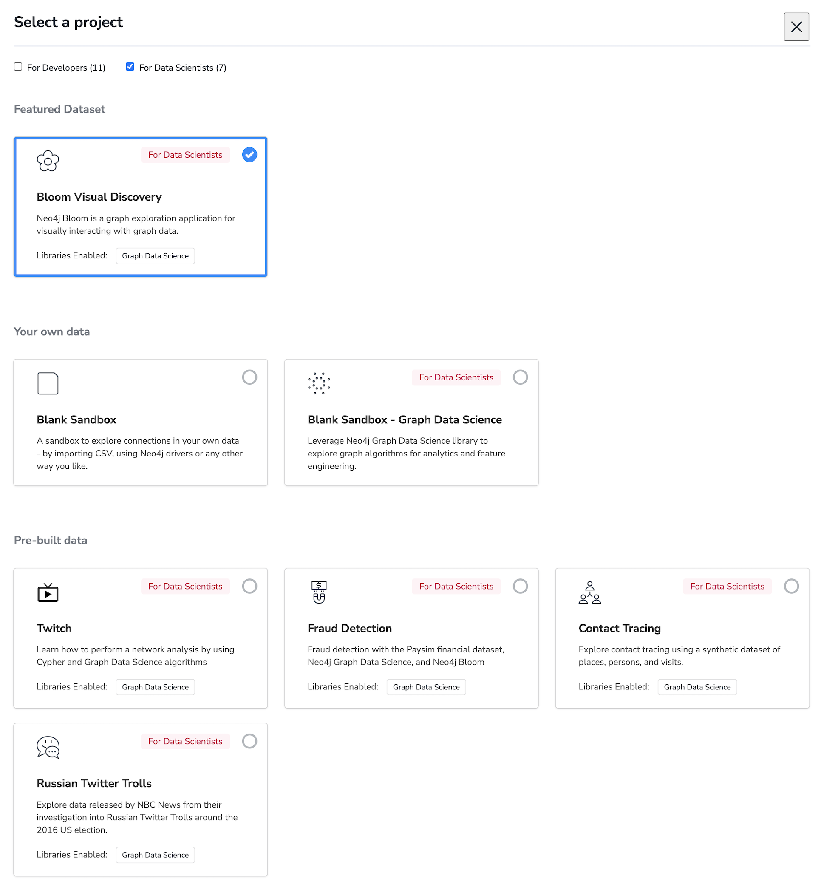
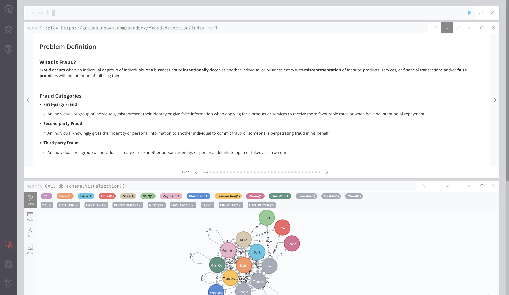

# 使用 Neo4j 沙箱学习图数据科学 GDS

2022-06-03

在快速上手的系列文章里，我们介绍了Neo4j Sandbox，它是一个无需下载的在线Neo4j数据库服务，优势在于有很多可选择的预先准备好的数据集，非常方便用于学习和探索数据。

最近我们发布了Neo4j GDS 2.0，一种本地使用GDS的方式就是安装Neo4j Desktop，新建数据库实例，安装GDS插件，然后需要寻找数据集……

你知道如何快速学习 GDS 算法和应用图算法吗？

答案就是 GDS 沙箱。

## 什么是 GDS 沙箱

> 默认还没有提供中文版，图中是使用Chrome浏览器的网页翻译的效果。推荐尝试。

Neo4j GDS 沙箱的运行环境就是Neo4j 沙箱，但是默认安装和启用了GDS库，并提供了多个数据集和浏览器指引用于学习GDS。并且无需下载和本地安装及配置环境，也无需自己去寻找数据集，数据库实例也不需要自己维护，所有环境和数据、还有GDS库，都在一键点击后自动配置并运行，甚至你还可以通过本地的Neo4j Desktop来管理远程的Neo4j GDS沙箱。

## GDS 沙箱环境一览

登录`https://sandbox.neo4j.com`后，点击新建项目，就能看到面向数据科学家提供了5个预先配置的数据集项目。

其中包括Twitch网络分析数据集、欺诈检测数据集、联系人跟踪数据集和俄罗斯社交网络数据集，比如选择了欺诈检测后，然后可以打开Neo4j Browser，就能看到已经为我们默认打开了Browser Guide：

这时你除了可以运行自己的Cypher语句以外，也可以按照指引进行详细的学习和探索。

## 视频演示

下面来看一段来自GDS产品管理高级总监Alicia的演示视频。

## 参考资源

Neo4j GDS 沙箱：<https://neo4j.com/data-science-sandbox/>

Neo4j GDS 主页：<https://neo4j.com/product/graph-data-science/>