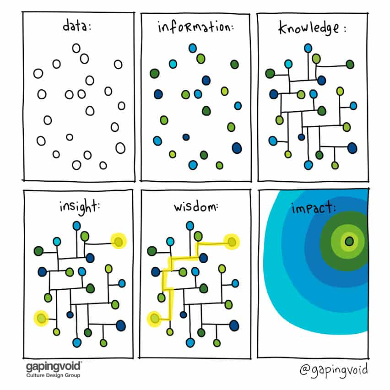
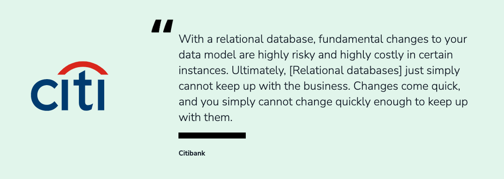
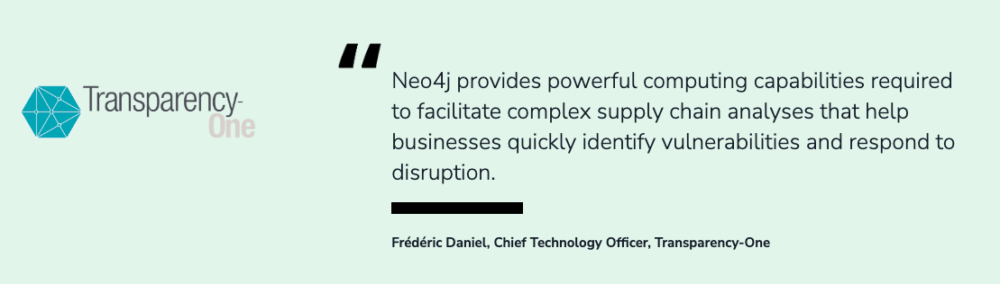
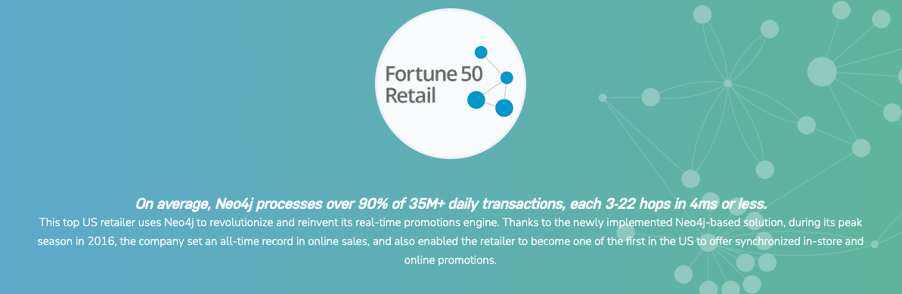

# 加入 Neo4j 行业交流群，共话图技术应用

2022-06-17

数据在各行各业都在发挥着巨大的作用，越来越多的行业已经在使用数据之间的关系来解决更复杂的问题，知识图谱就是一个非常广泛的关联数据的应用，知识图谱重点在于将离散的数据使用关系连接起来，进行图的表示从而获得更深层次的洞察。展望未来，使用图的机器学习和人工智能将发挥巨大作用。

Neo4j经过20多年的发展，已经成为图数据领域完善的技术平台，为各行各业提供了强有力的支撑。使用场景包括：

- 知识图谱
- 欺诈检测
- 社交网络
- 图分析和图数据科学（机器学习）
- 主数据管理
- 用户360
- 实时推荐系统
- 供应链管理
- 身份和访问管理
- 网络和IT运维管理
- 数据隐私合规和风险管理

为了更好地与各行业的Neo4j用户和爱好者沟通交流，我们为大家建立了分行业的微信交流群。诚邀你的加入，共话Neo4j图技术在行业的应用。

## 金融行业

欢迎金融、银行、保险等行业用户加入此群。

## 制造业

欢迎制造业的用户加入此群。

## 交通与物流行业

欢迎交通运输与物流行业的用户和伙伴加入此群。

## 生命科学行业

欢迎医疗、生物相关行业的用户加入此群。

## 零售行业

欢迎零售、电商相关行业的用户加入此群。

## 了解更多使用场景

请访问Neo4j官网的使用场景介绍了解更多行业的案例。

https://neo4j.com/use-cases/