# Neo4j 图数据可视化工具介绍

作者：刘洋，Neo4j 高级技术顾问

## 前言

关于Neo4j图数据的可视化一直是大家很感兴趣的一个话题。当分析图数据时，我们意识到要创建一个直观的图可视化并不是那么容易。值得庆幸的是，当前已经拥有了大量的现成工具，使图可视化可以很容易的创建在您的图应用中。

在这篇文章中，我们将常用的图可视化工具按照功能和应用场景进行分类介绍，希望您读完这篇文章后对图可视化有一个大致的了解，并对今后选择适合您业务场景的图可视化工具有所帮助。

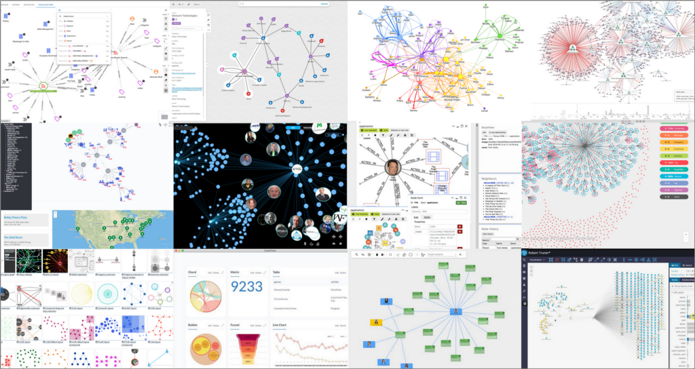

## 图可视化工具的分类

所有的图可视化工具都有他的应用场景和目标用户群定位，按照功能和应用场景我们可以把图可视化工具分为以下四大类：

- 开发工具，帮助开发人员开发图可视化
- 探索工具，帮助分析人员探索图数据关系
- 分析工具，用于揭示图数据中趋势和差异
- 报告工具，用于创建和组织图数据报告，如可视化报表、仪表盘等

在下图中，我们按以上类别分类显示了一些市面上常见的图可视化工具。在纵轴上按产品类型进行了分类（分为Neo4j产品、社区项目和企业软件）。

需要注意的是，有些工具功能可能属于两个类别，这种情况下该工具可以用于两个类别的场景，所以这个分类仅供参考。另外，第三方的企业软件可能需要购买对应工具的license许可。

接下来，让我们深入了解这些图可视化工具的具体情况。

### 1. Neo4j Browser (开发工具)

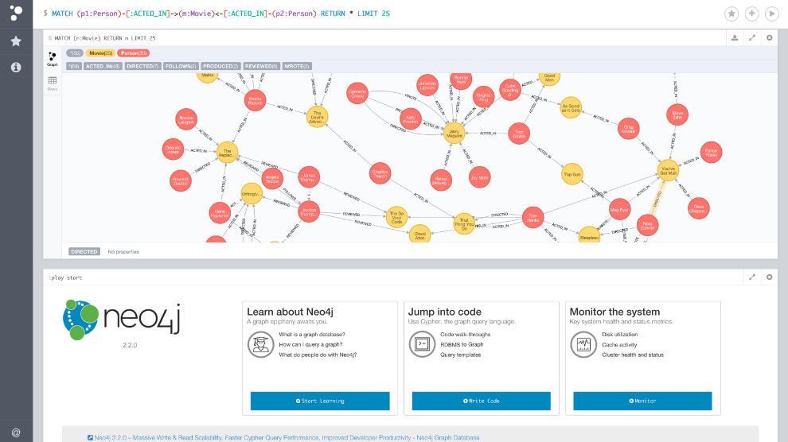

 Neo4j Browser大家都不会陌生了，它是Neo4j图数据库开发人员运行Cypher查询的工具，它可以让您以图或表格的形式呈现查询结果。虽然可视化能力有限，但我们每天都会用它来快速设计和优化Cypher查询。

主要特点：

- 容易上手，但可视化和风格选择有限
- 直接查询您的图数据，但需要Cypher知识
- 适合快速查询开发，但没有保存/嵌入/共享可视化的功能

### 2. Neo4j Bloom (探索 &分析工具)

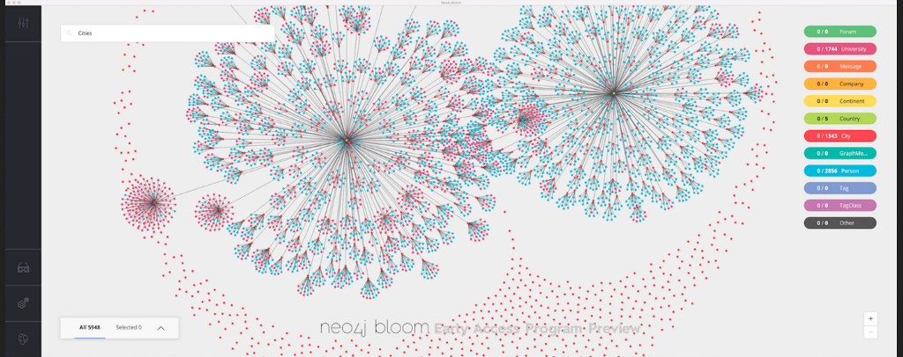

Neo4j Bloom是一个用于交互式探索Neo4j图数据的工具。Neo4j Browser主要由开发人员使用，而Bloom更适合数据分析师——那些想要动态可视化图数据和交互图数据的用户。Bloom支持基于文本的搜索，没有Cypher知识的业务用户也可以容易的分析和探索Neo4j图数据。

主要特点：

- 点击和拖拽即可探索图数据
- 通过自定义样式来可视化大规模图数据
- 用可视化界面编辑（修改）您的Neo4j图数据
- 存储和分享图分析结果视图
- 渲染不同的图布局

### 3. Neovis.js (开发工具)

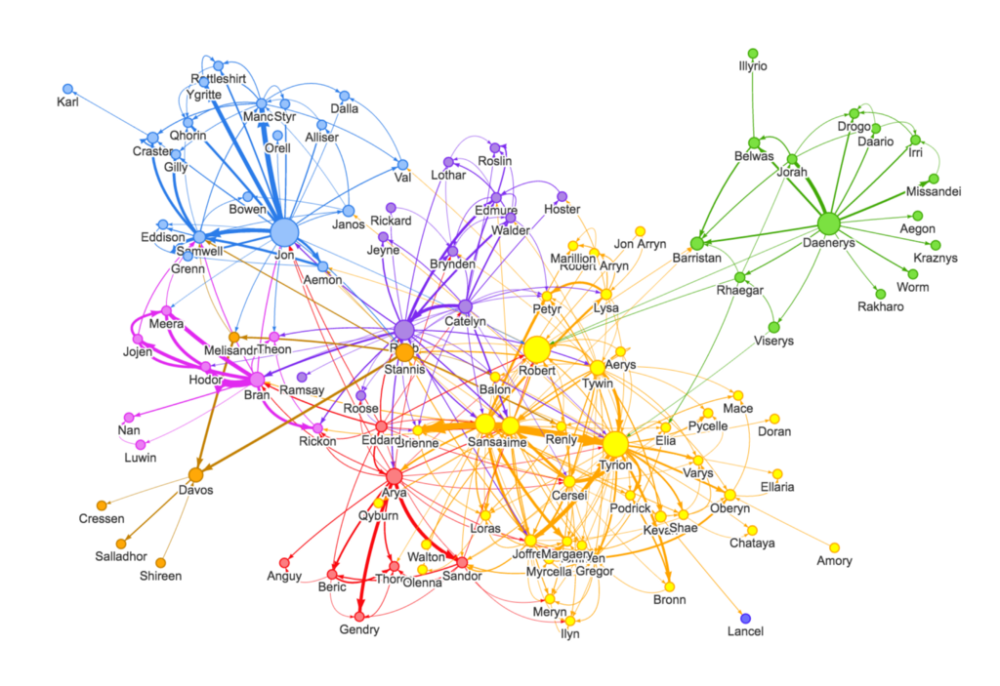

Neovis.js是一个JavaScript库，帮助开发者使用Neo4j图数据创建图可视化。Neovis.js是流行的库Vis.js的封装，在Cypher和浏览器中定制图可视化之间提供了一座桥梁。

主要特点：

- JavaScript库（基于Vis.js）用于创建Neo4j图可视化
- 直接连接到Neo4j实例以获得实时数据
- 基于标签、属性或社区的用户指定的样式属性
- 支持节点的悬停/点击等功能

### 4. Popoto.js (开发工具)

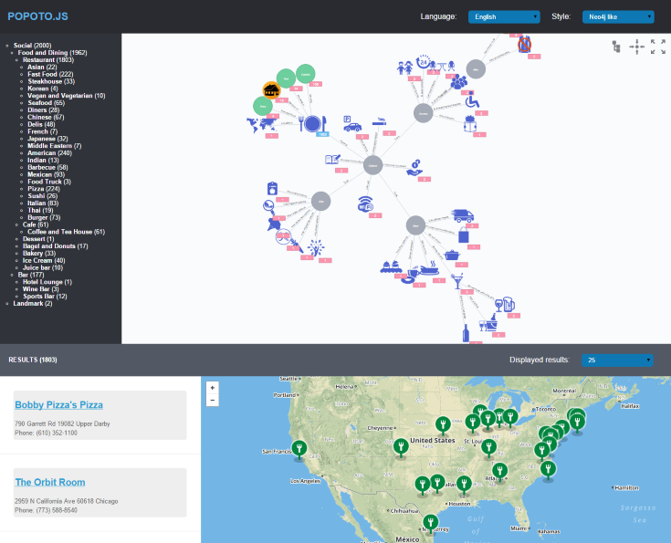

Popoto.js是另一个社区驱动的JS库，用于创建可嵌入的图可视化内容。Popoto.js基于被广泛使用的D3.js库，支持大量的图可视化内容。它还包含一个用于Neo4j的互动和可定制的图可视化查询生成器。网上有大量关于如何使用Popoto的例子，以及如何用自定义样式扩展它。 

主要特点：

- 一个交互式的可视化Cypher查询生成器，可与Neo4j直接连接
- 可嵌入到网页中，并有各种例子可供借鉴
- 由广泛使用的D3.js可视化库支持
- 通过扩展实现自定义风格设计

### 5. KeyLines (开发工具)

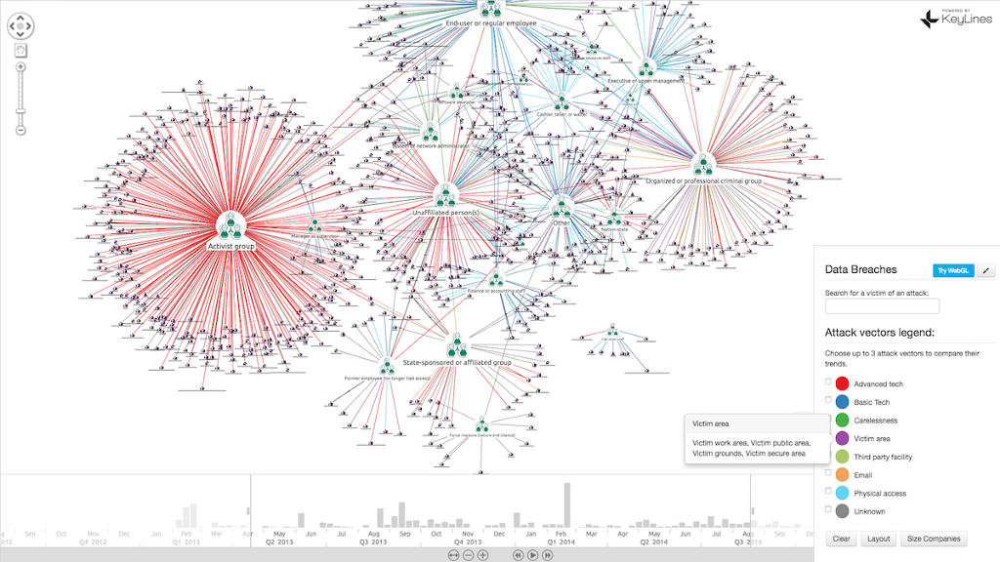

KeyLines是一个用于在JavaScript中构建图可视化的企业库。与neovis.js和popoto.js相比，KeyLines有更多的功能（布局、样式、分组、过滤），并且在大型图上有很好的表现。KeyLines是一个企业专用的产品，为其他一些独立的图探索工具（如GraphAware Hume）提供支持。

主要特点：

- 用于高级图可视化的JavaScript库
- 支持基于时间的分析，地理空间图分析，社交网络分析等
- 支持地理（地图）可视化
- 自定义图的布局（分组）和风格
- 高性能的WebGL渲染

### 6. CytoScape (开发工具)

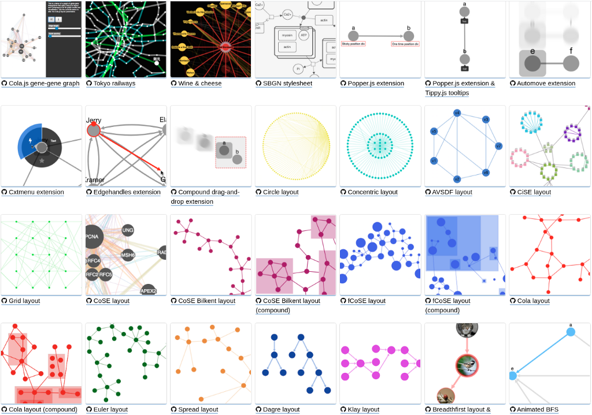

CytoScape是一个最初用于可视化生物网络的工具，但它最近被用于各种网络分析的用途。CytoScape.js 是一个用于图可视化的开源Javascript库，它是迄今为止最广泛的图可视化开源库——支持图布局、高级样式设计、事件处理等。

主要特点：

- 高度优化的图渲染
- 使用布局来自动或手动定位节点
- 自定义风格设计
- 易于嵌入到网络应用程序中
- 开放源代码，易于扩展自定义功能

### 7. yWorks Neo4j Explorer (探索工具)

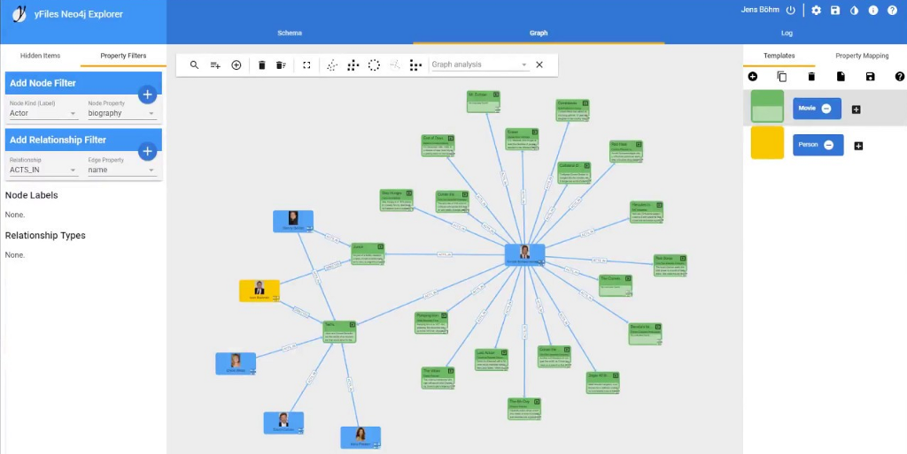

yWorks Neo4j Explorer是一个免费的、基于网络的工具，用于探索Neo4j图数据库。该工具是由yWorks公司建立的，该公司是广泛使用的yFiles JS库背后的公司，以展示yWorks框架对图数据的能力。对于那些希望通过简单直观的界面开始探索图的人来说，yWorks Neo4j Explorer是一个很好的选择，但与它的yWorks企业版产品（付费）相比，它的选项有限。

主要特点：

- 可视化和探索Neo4j图数据库模式
- 修改数据库模式--隐藏和显示你的模型的一部分
- 丰富的布局选项，以不同的布局查看Neo4j图数据
- 基于图表的节点/关系属性的基本搜索
- 基于关系类型和节点标签的图表探索
- 用颜色、形状和图像对节点和关系进行样式设计

### 8. Linkurious Enterprise (探索&分析工具)

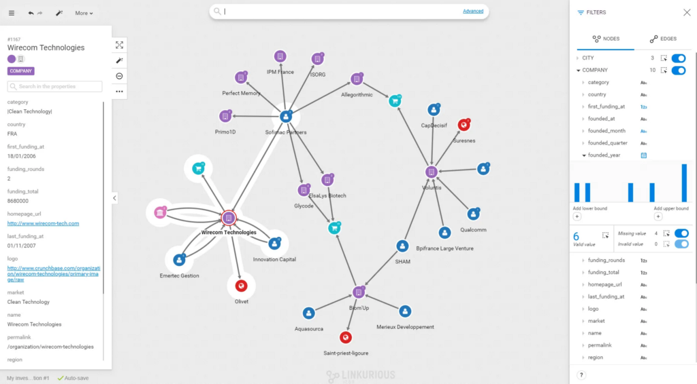

Linkurious Enterprise是一个企业级的图探索和分析工具。它是一个功能强大的工具，旨在供数据分析师使用，常用于如检测洗钱、网络威胁和其他犯罪活动等场景。Linkurious支持一个广泛的图搜索和分析功能列表，以及图操作。

主要特点：

- 交互式图探索
- 为常见的使用情况预定义工作流程
- 基于图的节点/关系属性的搜索
- 在团队中存储和分享图的分析结果
- 动态图编辑和可视化不同图布局的能力

### 9. GraphAware Hume (探索&分析工具)

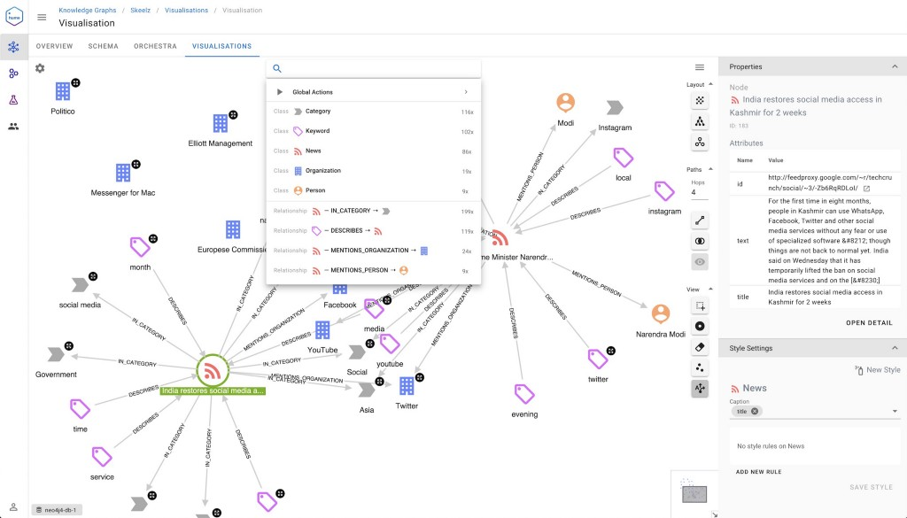

Hume是GraphAware公司开发的一个图探索和分析工具。它支持一个完整的 "图工作流程"——从构建知识图（ETL）到基于文本的搜索，以及数据科学应用。Hume是一个强大的图可视化工具，常被用于各种商业领域：如市场营销、推荐引擎和知识引擎等。

主要特点：

- 构建知识图谱平台，重点是NLP
- 交互式图探索和搜索
- 与Neo4j图数据科学集成
- 多种图的布局，自定义风格和节点分组
- 可嵌入可视化的iframe
- 自定义探索行动
- 支持SSO，高度关注RBAC和安全功能
- 本地虚拟关系、视角和基于时间的过滤

### 10. Kineviz GraphXR (分析工具)

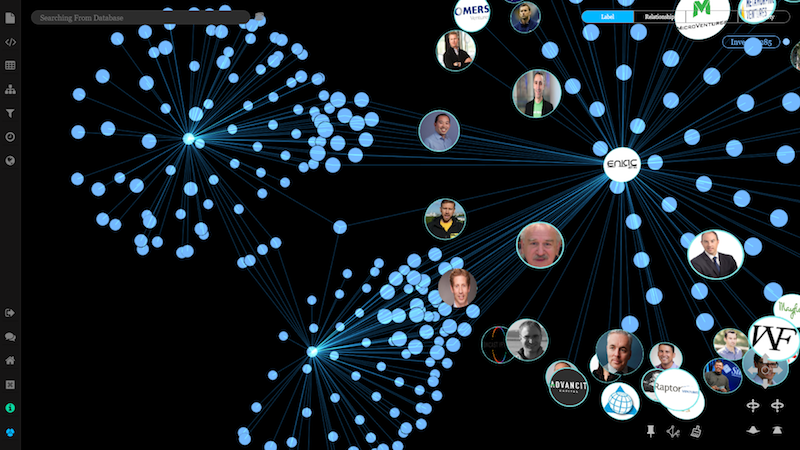

KineViz也是一个企业级图分析工具，能够以二维或三维方式呈现巨大的图（大于10万个节点）。KineViz支持从CSV、JSON或使用Cypher从Neo4j加载数据。它的图分析能力包括各种算法，包括路径查找和社区检测。

主要特点：

- 进行时间序列、地理空间和社会网络分析
- 对大型和复杂的图数据集进行统计分析
- 在各种三维和二维布局中实现100,000多个节点的可视化
- 协作、输出和报告各种格式的数据

### 11. Graphistry (分析工具)

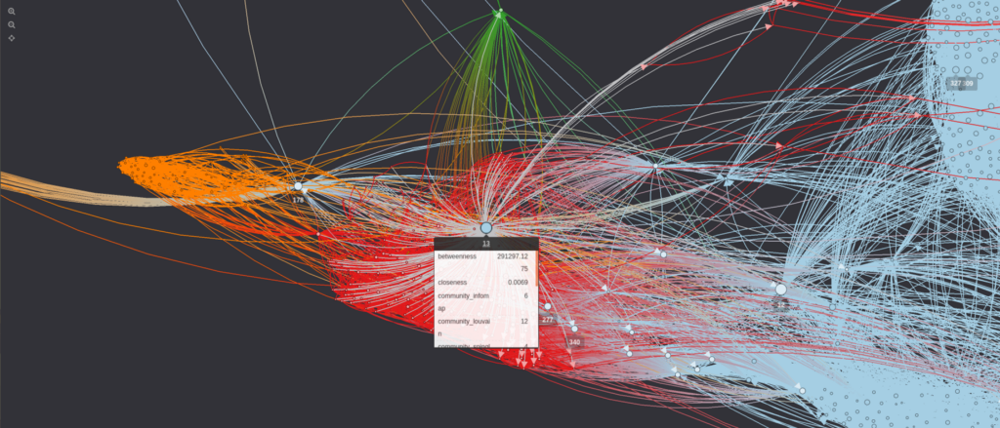

Graphistry是一个图分析工具，能够在浏览器中实现巨大图的可视化。它是目前渲染大图的最佳工具之一，支持GPU渲染100,000到1,000,000的节点和关系。数据可以直接从Neo4j加载到Graphistry，也可以通过开源的Python库加载。

主要特点：

- 用GPU加速渲染巨大的图可视化
- 基于图的聚类、过滤和搜索
- 为图分析定义可重复使用的工作流程
- 在网站、仪表盘和笔记本中嵌入可视化内容
- 在一个组织内共享可视化

### 12. Tom Sawyer’s Perspectives (分析&报告工具)

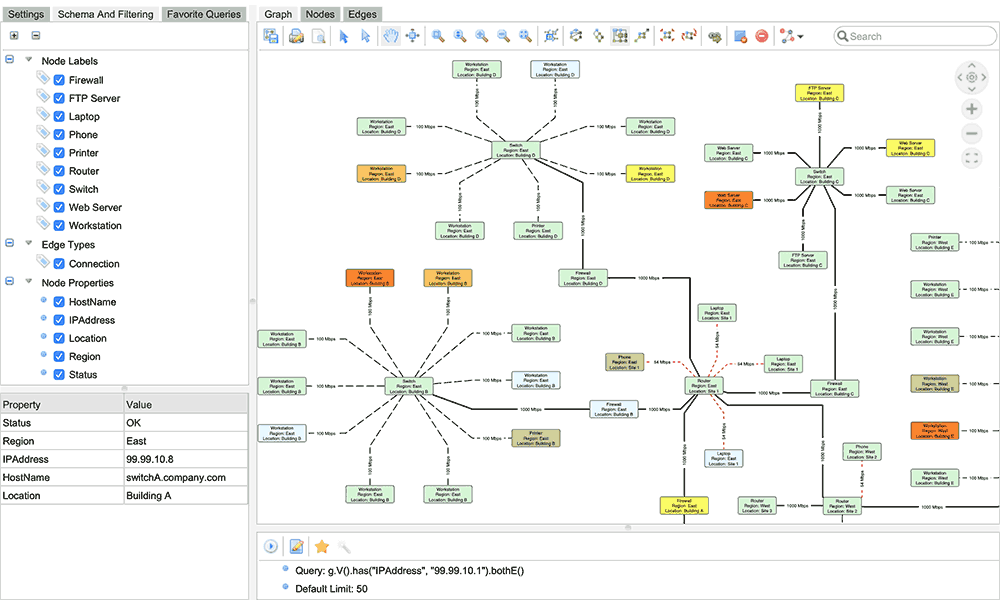

Perspectives是一个独立的（基于Java和.NET）企业级图可视化工具。Perspectives是一个图可视化的SDK，并配有一个GUI来构建应用程序。它支持各种图布局，以及报告类型（地图、图表、时间线、表格...）。图聚类和流量计算也可以直接在Perspectives界面上进行。

主要特点：

- 构建图可视化的独立工具箱
- 各种图布局和风格选项
- 用于分析的集成图算法
- 灵活的基于图的搜索和过滤

### 13. Graphileon (报告工具)

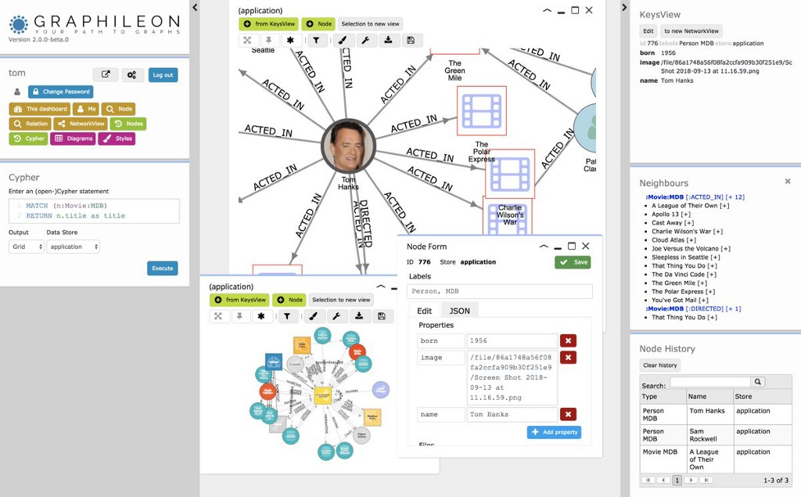

Graphileon是一个仪表盘开发环境，专门为图数据的可视化而构建。它允许您使用来自Neo4j和其他各种图数据库的数据，轻松设计、构建和分享仪表盘。

主要特点：

- 用网络、表格、表单、图表、地图、时间线、日历等形式来生产Neo4j图数据报表
- 通过函数和触发器来组织仪表盘中的互动
- 使用不同的布局、图标、颜色和形状，为你的可视化设计风格
- 将可视化内容保存为图表或图像
- 在其他应用程序中嵌入仪表盘和图表
- 访问控制和团队内的仪表盘共享
- Graphileon有个人版（免费使用）和企业版，后者包含额外的功能

### 14. Charts (报告工具)

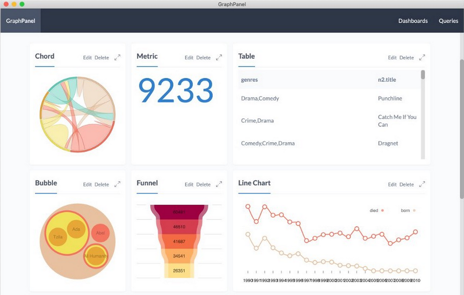

Charts是一个Neo4j实验室项目，是为了从Neo4j数据库中直接生成图表而建立的。Charts可以从Neo4j Desktop中安装，也可以从浏览器中访问https://charts.graphapp.io。使用Cypher，你能够使用Nivo（一个用于React的数据可视化库）快速创建大量的图可视化内容。它还配备了一个很棒的可视化Neo4j查询生成器，以帮助那些刚接触Cypher的人在短时间内编写查询。

主要特点：

- 绘制图表并将其组织到仪表盘中
- 在Neo4j desktop中保存和加载仪表盘
- 支持超过20种类型的图可视化
- 交互式Cypher查询生成器可以编写查询，以填充你的可视化内容

### 15. NeoDash (报告工具)

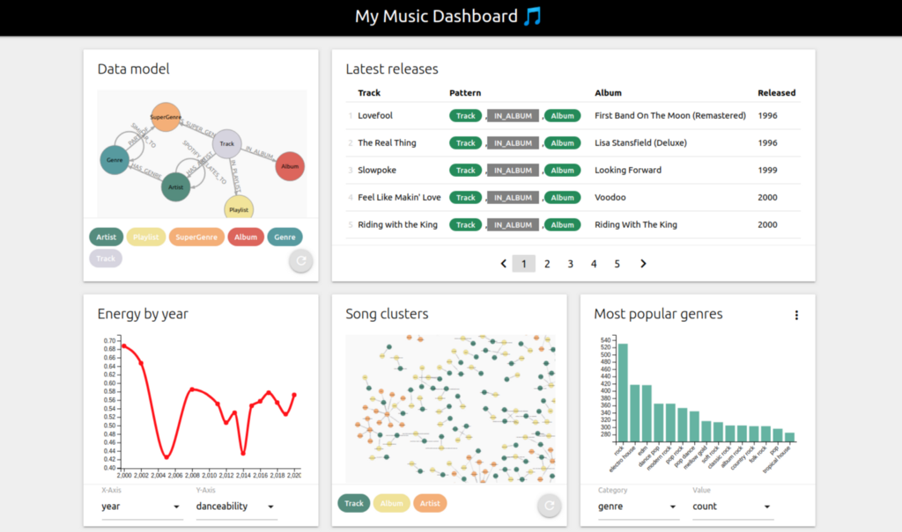

NeoDash可以在几分钟内实现基于Neo4j图数据库的仪表盘创建。它通过Bolt直接连接到Neo4j，从Cypher查询结果中生成报告。查询结果可以展示为表格、图形、柱状图等，用户可以互动地选择仪表盘的参数。

主要特点：

- 构建仪表盘的图应用和网络应用
- 将查询结果可视化为表格、图形、条形图，并带有自定义样式
- 交互式地选择查询参数
- 将可视化与Markdown文本混合，使用你的图数据创建一个 "在线文档"
- 以JSON格式加载和保存仪表盘

### 16. 其他工具

可用于图数据可视化的工具实在太多了。最后，还有一些有趣的工具没有详细列出来，在接下来的推文中我们会挑一些进行详细介绍。

- D3.js – 一个大家熟知的JS可视化库
- ECharts – 一个基于 JS的开源可视化图表库
- ReGraph - 一个用于React的高性能图可视化库
- G6- 另一个用于图可视化的JS库
- Graphlytic - 一个用于协作式图探索和分析的网络应用
- SemSpect - 一个不同类型的图可视化和探索工具

## 写在最后

通过这篇文章的介绍，希望能够帮助您了解各类图数据可视化工具的一些基本情况，以及各种工具的特点和适用场景。后续我们还会挑一些工具进行详细介绍，请关注后续的推文。

本文主要内容引自Neo4j开发者博客，原文（英文）地址如下：

https://neo4j.com/developer-blog/15-tools-for-visualizing-your-neo4j-graph-database/

### 参考资源

- https://neo4j.com/developer/graph-visualization/
- https://neo4j.com/developer/tools-graph-visualization/