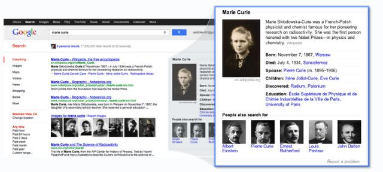

# （翻译）图技术简明历史

原文：https://www.compile.com/blog/insights/brief-history-of-graphs/

作者：[Cyriac](https://www.compile.com/blog/author/cyriac/)

日期：2019-05-28

译者：Shiny

日期：2022-07-22

## 译者前言

这篇文章我读过多次，里面的每一个链接我都点进去读过几次。最近又翻出来看了一下，还能发现一些新的理解。

作者在这篇文章中介绍了图技术的起源和一些相关的产品，并引用了很多链接，就跟“图”一样，这篇文章也可以作为一个起点，然后通过“关系”找到关联的文章。

以下是原文翻译。

## 原文翻译

目前存在各种编程范式 —— 机器码（译者注：指汇编等机器语言）、面向过程编程、面向对象编程和函数式编程。一个有趣的范例是面向对象编程，它通过类、对象和各种[现实世界的特性](https://en.wikipedia.org/wiki/Object-oriented_programming#Features)（如继承、封装和多态）提出了一种接近现实世界的数据表示。在技术方面，从自然中学习并采用接近现实世界模拟的方法总是会[取得巨大成功](https://www.youtube.com/watch?v=Ascql_RoeBU)。

存储数据以供长期使用也有类似的细分，从简单的基于文件的存储机制开始，然后发展到关系数据库和称为 NoSQL 数据库的新型数据库。NoSQL 数据库的增长带来了一些有趣的用例，例如原生图和时间序列存储机制。

### 图无处不在

[从社交网络和万维网到家谱和患者旅程](https://dbs.uni-leipzig.de/file/GRADOOP-April2019.pdf#page=5)，图隐藏在数据模型中。虽然它们的结构可能对用户隐藏，但我们一直在使用它们来解决各种问题。例如，找到两点之间路径的最短路径算法，优化资源的旅行商问题，这些都是现在通过图数据库解决的问题。

但除了“后端”修修补补之外，图技术正在走出阴影，并在许多应用程序中占据中心位置。这篇文章涵盖了从数据存储技术到我们今天使用的图数据存储的演变。

自从编程和“问题解决”产生以来，图的概念就已经存在了，但在很长的时间里，它始终停留在一系列复杂的数据结构上，这些数据结构在非特定的应用程序中无法访问或难以使用。

### 开篇 - 大约 2006 年

[当 Tim Bernes-Lee 在 2006 年左右构思了一个名为 Linked-Data](https://www.w3.org/DesignIssues/LinkedData.html) 的庞大信息数据库时，图作为一种技术在更大范围内被人熟知。这是使用资源描述框架 ([RDF](https://en.wikipedia.org/wiki/Resource_Description_Framework)) 格式的网站连接信息的一种概念，它是图存储的基础，与面向对象编程类似，这种结构能够显示人、组织和各种其他实体如何相互关联以及它们之间关系。

[什么是关联数据](https://wordlift.io/blog/en/entity/linked-data/)

至此，各种数据点形成了一个由各个网站的关联数据组成的网络。[Schema.org](https://schema.org/)、[谷歌结构化数据](https://developers.google.com/search/docs/guides/intro-structured-data)都支持开发者在网页上发布结构化数据。尽管发展缓慢，但在过去 13 年中，图数据库已经应用于各种应用程序。

### 2007年

关联数据或图关联数据应用程序重要的一个转折点是 [DBpedia](https://wiki.dbpedia.org/)。DBpedia 允许用户从语义上查询维基百科资源的关系和属性，包括指向其他相关数据集的链接。这成为当时最大的数据库之一，允许用户通过 SPARQL 等语言以易于使用的格式收集链接信息。

与此同时，出现了一个名为 [Freebase](https://en.wikipedia.org/wiki/Freebase) 的商业社区驱动的数据集，它提高了人们对以关联方式表达真实世界的数据的认识。

同年，出现了一个颠覆图存储的图数据库 —— Neo4j，这不是一夜之间的产品。Neo4j 最初是作为一种关系数据库方法开发，[然后转换为图技术解决方案](https://neo4j.com/blog/evolution-neo4j-native-graph-database/)。

### 2010-2012 年

Google 收购 Metaweb（Freebase 的创建者）是使图技术成为主流的关键事件。Google 宣布他们将使用这些数据集来支持“知识图谱”。这是 Google 搜索右侧的信息框，它提供了额外的上下文和指向搜索查询的链接。

[Google 知识图谱](https://searchengineland.com/google-launches-knowledge-graph-121585)

Google 知识图谱是一项悄无声息的技术，但它触动了所有使用 Google 搜索的人。它是由一个庞大的图谱提供支持，帮助用户获取有关以一种或多种方式相互连接的人、地点、书籍、事件等信息。你看到的每个搜索摘要和事实说明都是由这个知识图谱提供支持，它可以帮助用户快速做出决策，而不是通读所有搜索结果。

### 2013 年

Facebook 推出了 Facebook 图搜索。可以预见，这会引发对隐私和个人数据安全的担忧。这个图非常强大，它使人们能够在多个维度上提出非常复杂的问题，导致了数据暴露给未经授权的人。Facebook 很快就限制了图搜索的功能以解决隐私问题。但这些争议也让人们意识到了这种数据存储机制的威力。可以获取隐藏的关系，以及通过传统数据库无法获得的洞察力。

Facebook 图搜索

### 2014 年

Crunchbase [推出](https://neo4j.com/blog/congratulations-crunchbase/) 基于 Neo4j 的 Crunchbase 2.0。

> CrunchBase 1.0 是关于数据的，而 CrunchBase 2.0 是关于连接的。正如创业公司 Linkurious（Neo4j 可视化合作伙伴）的创始人 Jean Villedieu 在他关于 Medium（也是 Neo4j 客户）的博客中所说的那样，商业图谱具有重大意义。这是商界对 Facebook 社交图谱的回应，众所周知，它从根本上改变了我们在线互动的方式。

### 2016 年

> 通过映射每个成员、公司、工作和学校，我们能够按地区发现人才迁移、招聘率和需求技能等趋势。这些见解帮助我们以新的方式将人们与经济机会联系起来。通过与世界各地的政府和组织合作，我们帮助他们更好地将人们与机会联系起来。

微软收购领英。网络上约有 6 亿专业人士生成了一张庞大的[经济图谱](https://economicgraph.linkedin.com/)，此次收购再次证明了图技术力量的有效性。

### 2017 年

更大的组织和公司开始采用图技术，特别是知识图谱。[汤森路透公布了他们的知识图谱](https://developers.refinitiv.com/tr-knowledge-graph/tr-knowledge-graph-feed-api-beta/learning?content=48179&type=learning_material_item)，标志着使用基于图的数据为金融服务市场提供动力成为主流。

[汤森路透知识图谱](https://www.thomsonreuters.com/en/press-releases/2017/october/thomson-reuters-launches-first-of-its-kind-knowledge-graph-feed.html)

在过去几年中，图数据的存储技术发生了变革，这有助于企业以应有的方式利用现实世界的关系。但是，如果说商业图谱只是基于文章中提到的技术发展起来的，那将是轻描淡写了。[Tinkerpop](https://tinkerpop.apache.org/)、[NetworkX](https://networkx.github.io/) 等技术也促进了我们消费大规模数据集方式的增长。借助 [Gremlin](https://tinkerpop.apache.org/gremlin.html)、[GraphQL](https://graphql.org/)、[Cypher](https://neo4j.com/developer/cypher-query-language/) 等技术，图数据的查询也得到了显著的改进。各种专门针对图的可视化技术也已经发展并成为主流，比如 Gephi、Cytoscape、d3js 等等。

在接下来的几年里，我们将看到 ML/AI 与图技术的结合，将知识图谱市场提升到一个新的水平，这将以我们从未想象过的方式帮助业务。

## 翻译后记

这篇文章列举的每一个图技术发展的里程碑，都是当时比较重大的一个突破和发现，我们可以通过这些链接去探索之前人们是如何解决类似问题的。

时间翻到2022年，Neo4j 也快要发布 5.0 版本，国内也出现了众多的图数据相关产品和服务。图在机器学习和人工智能方面的发展也逐年增多，图机器学习也是当前非常前沿的一个方向。相信在不远的将来，由这些图技术厂商会带给大家更容易进入图技术世界的优质产品。