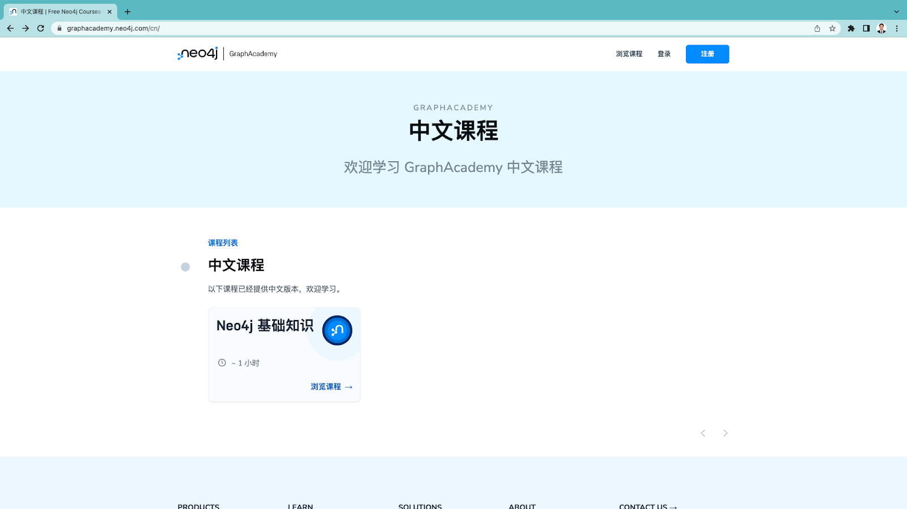
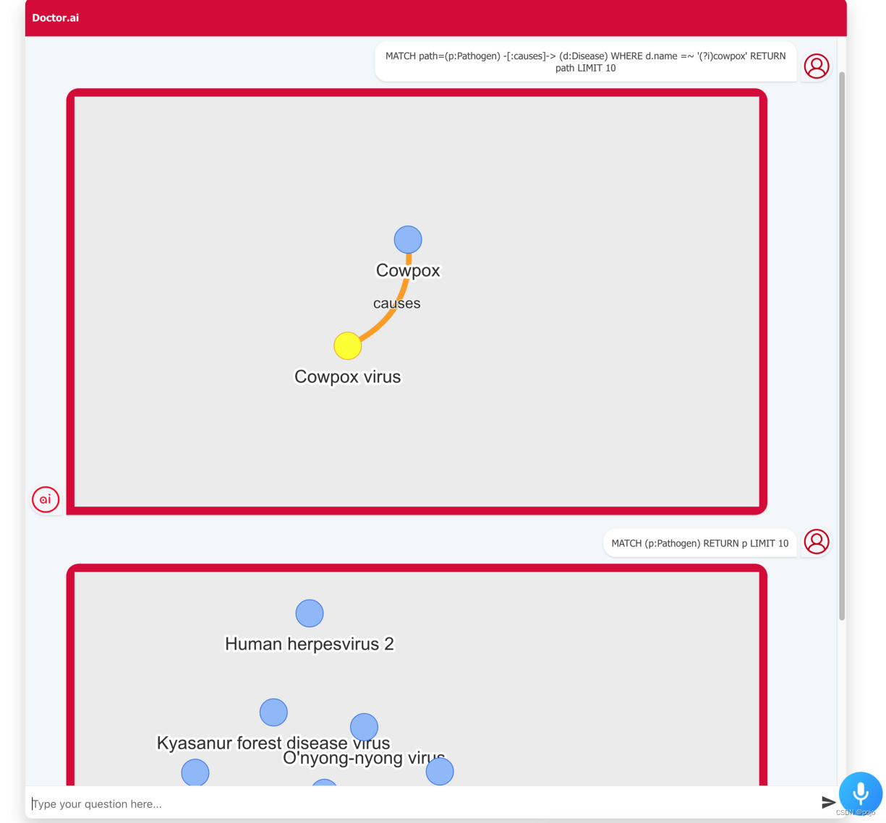
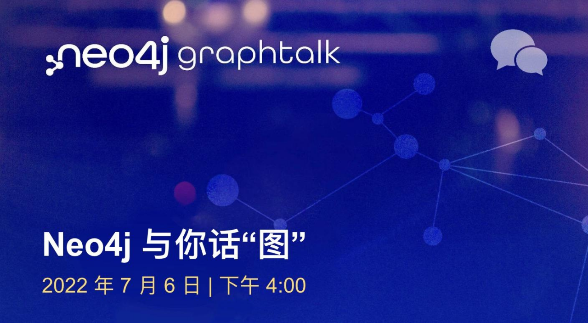

# Neo4j 中文开发者月刊 - 202207期

大家好，新的一期《Neo4j 中文开发者月刊》又和你见面了。如果你想即时了解我们的最新中文文章，请专注我们的微信公众号 Neo4j，每周都会有多篇技术文章发布。

正值三伏天，相信大家对于图技术的热情也是持续高温。我们最近推出了 GraphAcademy 中文课程专题页面，已经上线《Neo4j 基础知识》这门课程，全中文的课程内容，帮助大家更容易入门 Neo4j 和图数据的世界。

同时如果你也有 Neo4j 相关的使用心得，欢迎给我们的微信公众号投稿，同时也会在每一期的开发者邮件的社区故事部分展示给更多的开发者。

## 开发者头条

### [GraphAcademy 现已推出中文课程](https://graphacademy.neo4j.com/cn/)

GraphAcademy 是 Neo4j 推出的免费在线学习和培训平台，你可以通过 GraphAcademy 里的课程掌握 Neo4j 基础、Cypher 基础、图数据建模、面向多种编程语言的应用开发等等。目前 GraphAcademy 已经推出中文课程专题页面，现已完成《Neo4j 基础知识》课程的本地化。欢迎大家前去学习。

同时诚邀您参加 [Neo4j 认证专家](https://neo4j.com/graphacademy/neo4j-certification/)免费考试（英文），Neo4j T 恤等你拿！

如有任何反馈请联系我们。

## 技术文章

### [使用 Neo4j 分析 Crunchbase 公司投资关系](https://mp.weixin.qq.com/s/XsbXMw2mPGC87nn-LN9xuQ)

Crunchbase 于 2007 年在美国旧金山创立，是一家覆盖全球各地区初创公司及投资机构的企业服务数据库公司。Crunchbase 给出了公司层面的投资系列，并给出了公司状态。

我们通过分析 Crunchbase 部分开放的数据，可以探查公司之间的投资关系，发现投资和其他标准，并有助于探究是否公司的各种运营/关闭/收购阶段。

### [Neo4j 知识图谱的技术解析及案例分享](https://mp.weixin.qq.com/s/EyZdn8QIlY22FI8RRVoKPA)

Neo4j近年来与众多公司合作，在很多领域中成功结合知识图谱技术，使得知识图谱顺利落地于各个项目中。本文由Neo4j欧洲区售前和技术总监Jesus Barrasa博士介绍知识图谱的技术解析与案例分享。将围绕下面五点展开：数据架构中的知识存在于何处知识图谱在技能发现中的应用知识图谱在元数据管理中的应用知识图谱在语义搜索中的应用 

### [利用 Neo4j Ops Manager 监控管理数据库](https://mp.weixin.qq.com/s/qQJIiWcNuIH_QlhpJWNBNA)

Neo4j Ops Manager（缩写为 NOM）是一种工具，用于帮助 Neo4j DBMS 部署的管理员并解决这一差距。它包含当前和未来的功能，允许管理员在其资产范围内监控、管理和操作这些部署。

NOM 建立在旨在支持多个 DBMS 实现（包括单实例和集群）的核心架构之上。该架构包含用于智能监控和知识引擎的元数据驱动的可扩展框架。借助这些功能，NOM 是否有可能不仅帮助管理员了解正在发生的事情，而且了解它发生的原因，并通过可解释的洞察力提出建议来解释如何处理它。在此架构和框架之上是一组“管理器”，涵盖监控、管理、运营和集成四大支柱。

本文介绍如何搭建Neo4j Ops Manager 并实现对单个实例，或者集群实例的监控和管理。

## 社区故事

### 用 Alan 和 Neovis.js 去实现 Doctor.ai

作者：黄思行与李亮，灵感来自于 Maruthi Prithivirajan Lokananthan。

本文将介绍 Doctor.ai 的最新进展，黄思行和搭档李亮为你带来 Alan 和 Neovis.js 结合的案例。

[阅读原文](https://blog.csdn.net/qq_39576261/article/details/125647193)

加入 CSDN Neo4j 社区，共同成长

Neo4j 官方团队正式进入中国为大家服务，我们通过本地化的交流帮助大家了解和掌握Neo4j产品。在这过程中，越来越多的开发人员和决策者跟我们取得了联系，在沟通过程中，希望大家多多参与到社区里正式的交流讨论，也能够沉淀出问题的解决方案，方便后续的搜索和分享，互助进步。

[访问 CSDN Neo4j 社区](https://bbs.csdn.net/forums/neo4j)

## 活动推荐

****

### 参加 Neo4j Cypher 代码高尔夫挑战赛，赢取 27,000 美元奖金

Neo4j的在线黑客松现已上线，提交长度更短且数据库命中率更低的 Cypher 查询并返回正确的查询结果，就有机会打榜并赢得价值 27,000 美元的奖品。欢迎大家参与本次比赛，无需自己创建数据库和环境，我们已经为你准备好了StackOverflow问答数据集和Neo4j云端数据库实例。

访问 https://neo4j-code-golf-2022.devpost.com/ 开启你的挑战吧。

[**立即报名**](https://neo4j-code-golf-2022.devpost.com/)

### 直播回放： Neo4j 与你话 “图” - 图数据科学GDS如何助力精准预测

Neo4j图数据科学是一个图分析和建模平台。它结合了现有数据中关系和网络结构的预测能力，解答之前难以解决的问题并提高预测准确性。使用图算法和机器学习，数据科学家可以识别模式和行为，改进他们的模型，以在引擎推荐、欺诈检测、路线优化和客户360场景中使用，通过改进预测来实现更优决策和创新。 

Neo4j是全球领先的图数据平台领导者，在企业级数据库基础之上建立了一个超级强大的可扩展数据科学平台。Neo4j图数据科学不仅提供全面丰富的功能，更大大简化数据科学家的工作流程，让数据科学家通过综合的图分析技术轻松实现更精准的预测。

[**观看回放**](https://www.bilibili.com/medialist/play/ml1696959387) 

---

不想错过未来的精彩内容？点击[这里](https://go.neo4j.com/china-opt-in.html)或者扫描下面的二维码马上加入。

