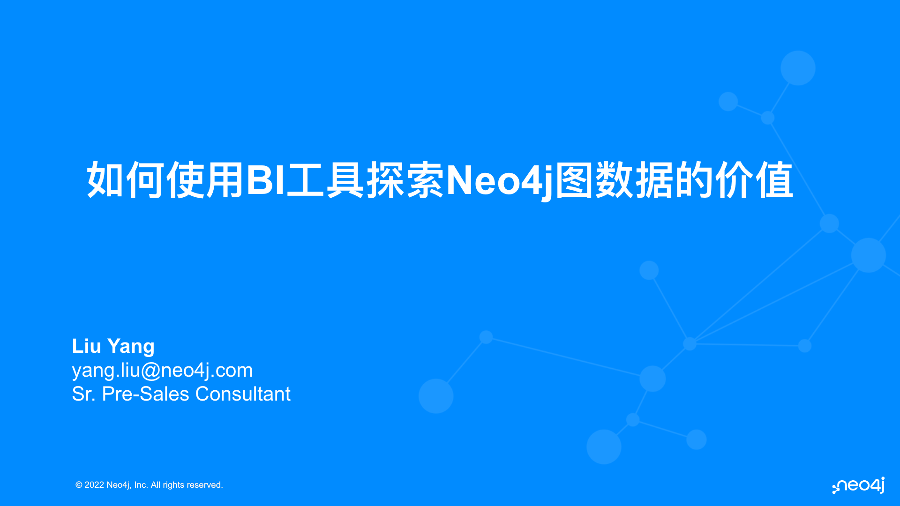

# 【报名中】关联数据系列-7月份在线活动抢先看

作者：Shiny

日期：2022-07-19

7月份的Neo4j关联数据系列在线分享活动正在火热报名中，本次活动将于【7月20日 星期三】下午正式举办，抓紧时间报名获得观看席位吧！也能第一时间掌握活动最新动态。

活动报名链接：https://meeting.tencent.com/dw/z0aXUqXMw4pb?ch=9eWRWtUZuOZs0

//或点击文末“阅读原文”直达。

## 活动介绍

近几年，众多企业纷纷加快海外市场扩张的步伐。越来越多的蓝海市场相继被国内企业挖掘。国内企业依靠丰富的产品开发运营经验、完善的工业制造能力在海外市场攻城略地，获取了巨大收益。2021年世界财富五百强中有143家中国企业上榜，较2020年增加了10家。未来企业出海成功将聚焦产品创新、供应链管理和精细化运营。

作为图数据平台的领导者，Neo4j 帮助出海企业深入分析高度关联的复杂数据，监测营销数据，实时分析并优化营销策略，对数据进行反欺诈管理，使业务数据变为商业智能，提高数据的应用价值，加快出海业务的全方位数字化转型和创新，助力企业快速增加海外市场份额，降低成本，增加营收，提升全球竞争力。

Neo4j 知识图谱是一个非常全面、丰富而且成熟的产品，包括负责数据存储的Neo4j图数据库,致力数据分析的图数据科学 (GDS) 以及负责数据挖掘和探索的可视化工具Neo4j Bloom。Neo4j知识图谱的应用极其广泛，覆盖网络安全、金融服务、医疗保健、生命科学、供应链和物流、零售、电信和制造等众多行业，适用于从欺诈检测和实时推荐到患者旅程、数字孪生、材料清单等各种用例。

出海企业可免费使用 Neo4j 易于使用、完全托管的云服务。企业开发人员使用图技术可进行快速学习、原型化和开发，无需对基础设施进行管理, 加速变革性图技术在现代智能应用中的部署。

现特邀您参加我们为您精心准备的线上直播，了解图世界最新和最伟大的图数据技术。

## 活动日程

2022-07-20 (周三) 16:00 - 16:30

**使用BI工具探索Neo4j图数据** (刘洋 - Neo4j 亚太区高级技术顾问）

2022-07-20 (周三) 16:30 - 17:00

**基于Neo4j构建医疗知识图谱问答机器人** (张子豪 - B站UP主“同济子豪兄”）

2022-07-20 (周三) 17:00 - 17:30

**零运维免安装轻松快速上手Neo4j**  (朱兴亮 - Neo4j 开发者布道师）

2022-07-20 (周三) 17:30 - 18:00

**有奖问答**（**奖品是我们最新的小礼品**）

## 内容抢先看

### 刘洋：如何使用BI工具探索Neo4j图数据的价值

数据离不开可视化工具的联合使用，在Neo4j亚太区高级技术顾问刘洋带来的分享中，将介绍如何使用Neo4j BI Connector，以及演示在Tableau中跟Neo4j交互。

如果你是从事BI相关岗位，以及对数据可视化感兴趣，本次分享不容错过。

### 同济子豪兄：基于Neo4j构建医疗知识图谱问答机器人

本次很荣幸邀请到了同济子豪兄来为大家分享他最新的一些成果，如果你对医疗数据探索感兴趣，欢迎参加本次分享。将为你带来基于Neo4j构建医疗知识图谱问答机器人的过程和效果。

### 朱兴亮：零运维免安装轻松快速上手Neo4j

在社区和用户组里，常常有伙伴反馈在安装环节遇到问题，真的是“从入门就放弃”啊。Neo4j听到了你们的反馈，我们也在不断改进产品和服务体验。本次分享将介绍一些常见的问题，以及解决方案//虽然不能完全解决每一个问题，但会为你提供一些思路。另一方面，也会介绍不同发行版本的区别，以及该如何选择合适的版本。

本次分享内容难度级别为100，适合入门和新手，如果你正准备开始进入图技术的世界，不容错过本次内容。

## 现在报名

本次活动采用腾讯会议网络研讨会模式提供，需要提前报名预留席位，以及获得后续活动的最新内容。

我们为精彩问答的参会者提供了最新的小礼品，我们也抢先看看吧。

定制10000mA充电宝，方便携带，同时保证手机等设备能量充足。

//奖品不包含图中的手机：）

现在就报名吧！

活动报名链接：https://meeting.tencent.com/dw/z0aXUqXMw4pb?ch=9eWRWtUZuOZs0

//或点击文末“阅读原文”直达。

期待与您在活动中相见！