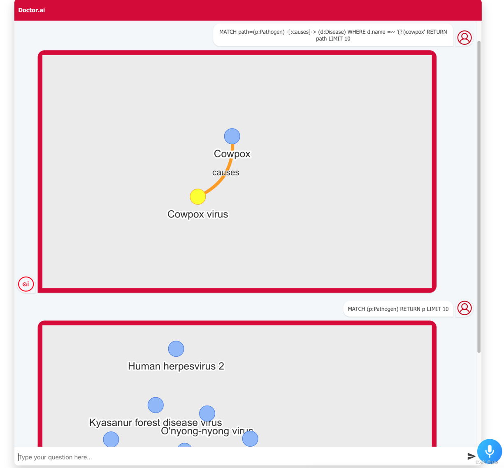
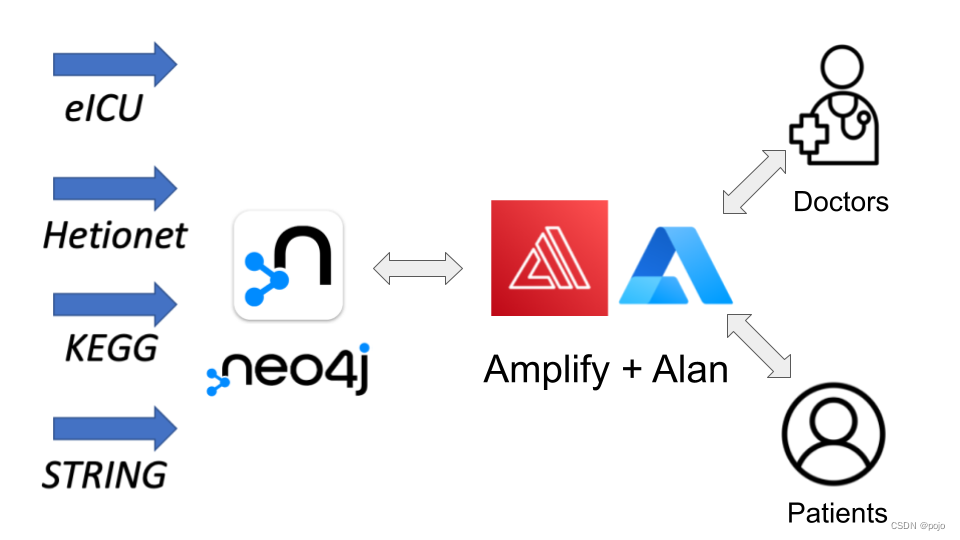
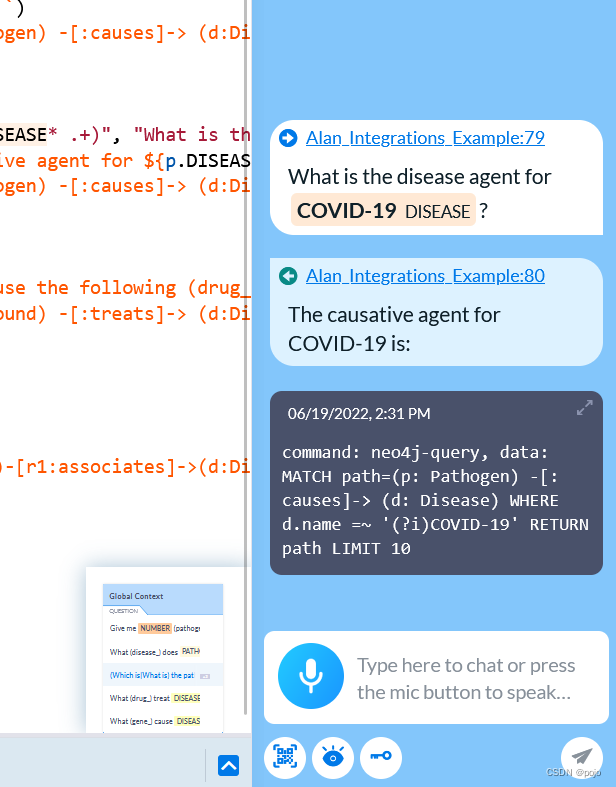
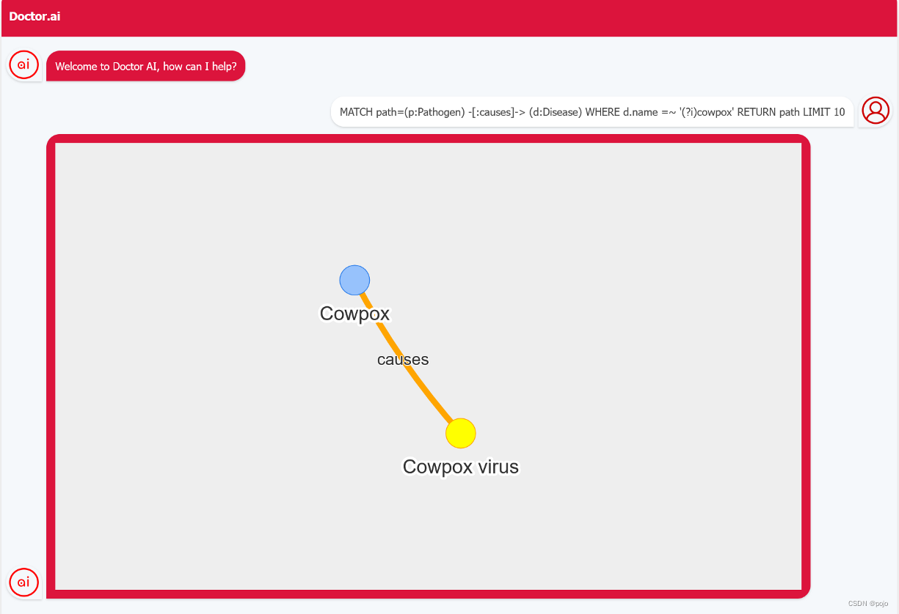
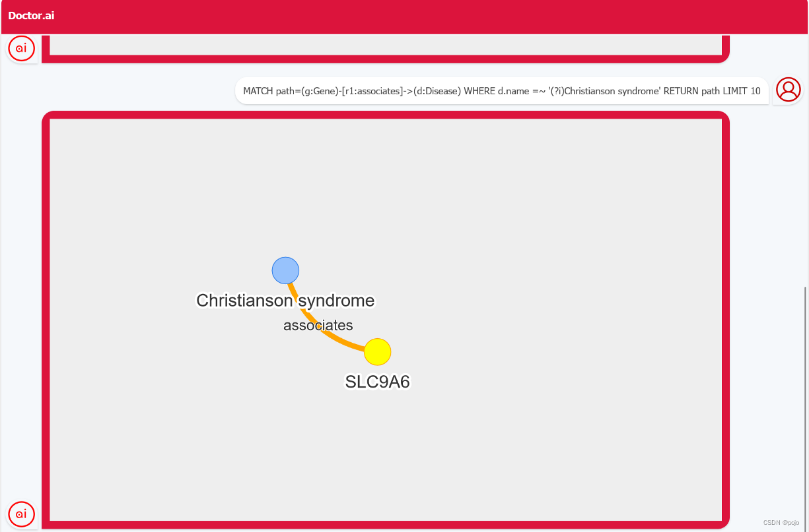
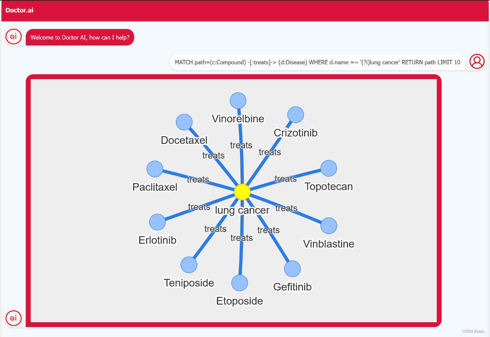

# 用 Alan 和 Neovis.js 去实现 Doctor.ai

> 尝试一种新的 Doctor.ai 实现方式

作者：[黄思行](https://dgg32.medium.com/)与[李亮](https://blog.csdn.net/qq_39576261)，灵感来自于 [Maruthi Prithivirajan Lokananthan](https://linkedin.com/maruthi-prithivirajan-lokananthan/)，本文[英语原文](https://medium.com/p/aa4ac0d94ba).



知识图谱是语义化的图数据库。我们将学科知识转化为一系列的“主谓宾”并导入到图数据库中。知识图谱能够整合多个来源的知识。它们能够为应用程序提供上下文和深度，从而提升用户体验。从谷歌的 Infoboxs 到亚马逊音乐，我们都可以看到知识图谱的身影。

在庞大的医疗行业，知识图谱能够让医疗知识和病历数据的存取变得更容易。一方面，医生们能更好的知道病人的情况，凭借数据去进行诊断和制定治疗方案，接触到最新的医疗发展。另一方面，病人能够得到更多精准的医疗建议和了解更多的医疗方案。然而，我们要编写 SPARQL 或 Cypher 来查询知识图谱。就是说，目前程序员们垄断了知识图谱的操作。

我们作者想要改变这一现象。我们要开发一个机器人，它能够将英文，德语或中文问题变成查询语句并且用它们来查询知识图谱来得出问题的答案。有了它，每个人都可以自由地畅游知识图谱和知识本身。

我们的解决方案是 Doctor.ai。在我们先前的文章中([这篇](https://medium.com/p/8c09af65aabb),[这篇](https://neo4j.com/blog/doctor-ai-a-voice-chatbot-for-healthcare-powered-by-neo4j-and-aws/),[这篇](https://medium.com/p/cc21765fa8a6),[这篇](https://medium.com/p/1396d1cd6fa5),[这篇](https://medium.com/p/b63b10d67bf4))，我们详细描述了 Doctor.ai。它由三个部分组成：一个包括了四个公共数据库的 Neo4j 的知识图谱，一个自然语言处理引擎和一个 React 的前端。所有的组件都是可以用不同的软件实现，不受任何单一软件厂商的牵制。开始的时候，我们用 AWS Lex 来作为我们的自然语言处理引擎，但后来我们转而使用[GPT-3](https://openai.com/api/)。我们用 Alan AI 提高了语音识别的正确率。我们甚至可以更改图里的数据，从而将 Doctor.ai 改变为 HR.ai，Forestry.ai 或 Logistics.ai。

通过逐步的优化，现在的 Doctor.ai 已是一个非常实用的机器人。当然，它还有很大的改进空间。首先，当前基于的 GTP-3 的 Doctor.ai 将查询输出直接发给用户，没有进行任何语言上的修饰。所以答案是非常的粗糙的。就像这个例子，当我们询问:”引起牛痘的病原体是什么？“Doctor.ai 只能简单地说：”牛痘病毒“。如果它能说”牛痘病原体的病毒是牛痘“就更好了。第二，这个机器人是个文字机器人。比起来自日本的漂亮[BEBOT](https://bespoke-inc.medium.com/サンルート新宿における-bebot-活用例-5ff6f87a1f40)，Doctor.ai 只能展示文字和表格，目前还不支持多媒体。

这些都不是什么大碍。我们已经想出了简单的解决方法。例如，为了解决第一个问题，我们可以用完整的 Alan Studio 来作为自然语言处理的引擎。 Alan Studio 是一个聊天机器人全套解决方案。像 AWS Lex,我们可以在 Alan 中，对每个不同类型的问题设计一些回答套路。这样，回答就会显得更丰富更人性化。至于第二点，我们可以编写一些自定义的 React 组件来进行多媒体的展示。



在这篇文章，我们将向你展示这两个方案。确切的说，我们将用 Alan Studio 作为自然语言处理引擎来处理自然语言。并且我们将使用 [Neovis.js](https://github.com/neo4j-contrib/neovis.js)在聊天栏中以网络图的方式来展示 Neo4j 的查询结果（如图 2）。本文的代码可以在我们的[GitHub 仓库](https://github.com/dgg32/alan_neovis)找到。

## 为 Alan 编写脚本

在我们之前的[文章](https://medium.com/p/5f0b2f479cca)中，我们有展示怎么在搭建 Alan 的服务端和客户端。那里，我们只想用它的笔录功能，所以我们将服务端代码精简成了一个函数。在本文中，Alan 将会做得更多。它听人说话，对人的话进行分类，说一些简单的提示，和将正确的 Cypher 语句返回给前端。

首先，在[Alan](https://alan.app/platform)上注册或登录帐号。然后单击“Create Voice Assistant”按钮创建语音助手。选择 Alan Integrations。脚本编辑器将会出现。删除所有的默认脚本并创建新的脚本。复制并粘贴以下内容。

```javascript
question("Give me $(NUMBER) (pathogen_)", (p) => {
  p.play(`Here are the ${p.NUMBER.value} pathogens:`);
  p.play({
    command: "neo4j-query",
    data: `MATCH (p:Pathogen) RETURN p LIMIT ${p.NUMBER.value}`,
  });
});

question("What (disease_) does $(PATHOGEN* .+) cause?", (p) => {
  p.play(`${p.PATHOGEN.value} can cause disease such as: `);
  p.play({
    command: "neo4j-query",
    data: `MATCH path=(p:Pathogen) -[:causes]-> (d:Disease) WHERE p.name =~ '(?i)${p.PATHOGEN.value}' RETURN path LIMIT 10`,
  });
});

question(
  "(Which is|What is) the pathogen that causes $(DISEASE* .+)",
  "What is the disease agent for $(DISEASE* .+)",
  "Which organism causes $(DISEASE* .+)",
  (p) => {
    p.play(
      `${p.DISEASE.value} is caused by:`,
      `The causative agent for ${p.DISEASE.value} is:`
    );
    p.play({
      command: "neo4j-query",
      data: `MATCH path=(p:Pathogen) -[:causes]-> (d:Disease) WHERE d.name =~ '(?i)${p.DISEASE.value}'  RETURN path LIMIT 10`,
    });
  }
);

question(
  "What (drug_) treat $(DISEASE* .+)?",
  "Which (drug_) is used against $(DISEASE* .+)?",
  "Which medicine is used against $(DISEASE* .+)?",
  (p) => {
    p.play(
      `${p.DISEASE.value} can be treated with:`,
      `We use the following drugs against ${p.DISEASE.value}:`
    );
    p.play({
      command: "neo4j-query",
      data: `MATCH path=(c:Compound) -[:treats]-> (d:Disease) WHERE d.name =~ '(?i)${p.DISEASE.value}'  RETURN path LIMIT 10`,
    });
  }
);

question("What (gene_) cause $(DISEASE* .+)?", (p) => {
  p.play(`${p.DISEASE.value} is caused by the gene:`);
  p.play({
    command: "neo4j-query",
    data: `MATCH path=(g:Gene)-[r1:associates]->(d:Disease) WHERE d.name =~ '(?i)${p.DISEASE.value}' RETURN path LIMIT 10`,
  });
});
```

在 Alan 中，我们要编写一对一对的意图-回答。意图（Intent）是用户想要做的。例如，一个用户想要说与克里斯蒂安森综合症（Christianson syndrome）有关的基因，又或者想要得到任意十种病原体的名称。在编辑器里，我们要用问题样式来表达意图。例如 ”`what (gene*) cause the $(DISEASE* .+)?`“就是一个问题样式，当我们这类问题的时候，Alan 就知道我们想问与某疾病相关的基因。question 函数以这些问题样式作为第一批参数（第 13 行）。`(noun*)`代表了名词的单复数。而`$(DISEASE* .+)` 是一个正则表达式，捕捉用户在问题里提到的疾病的名称。

最后一个参数是回复函数。我们回复的内容由两个’play’函数完成。第一个是播放语音提示，例如“`${p.Disease.value} is caused by the gene`”。第二个函数将两个键值对返回给客户端。第一个“command:“neo4j-query””部分提醒客户端：“data”是一个 Cypher 查询语句。我们使用表达式“`${p.DISEASE.value}`”来捕获我们之前提到的正则表达式的捕捉值。

我们的脚本定义了五个意图：展示一些病原体，某病原体所引起的疾病，引起某种疾病的病原体，治疗某种疾病的药物，以及与某种遗传性疾病相关的基因。我们可以在 Alan 的 Debugging Chat 中测试服务器端的功能。



你可以在这里输入一些示例问题，然后测试 Alan 是否能够正确识别占位符中的值并返回相应的答复。

## 编写前端部分

编写服务器端之后，我们可以写客户端了。我们将修改之前 Doctor.ai 的前端，以便它能够与 Alan 服务器交互。此外，我们将使用 Neovis.js 创建一个自定义组件来可视化 Cypher 查询创建的结果。

首先，让我们在前端配置 App.js。在上一篇[文章](https://medium.com/p/5f0b2f479cca)中，我们已经展示了如何将 Alan 按钮添加到前端。在这个项目中，我们需要扩充一下 alanBtn 函数。

```javascript
alanBtn({
  key: alan_api,
  rootEl: alanBtnContainer.current,
  onCommand: (commandData) => {
    console.log(
      "----------------------------------------------------",
      "commandData",
      commandData
    );
    if (commandData.command === "neo4j-query") {
      chatbotObject.onRecognitionChange(commandData.data);
      chatbotObject.onRecognitionEnd();
    }
  },
});
```

每当用户按着 Alan 按钮说话时，上面的函数就与 Alan 服务器通信并得到 commandData。正如我们在上面提到的，commandData 包含两个键值对。如果 command 变量等于 neo4j-query,我们将从 data 中提取 Cypher,将其作为用户输入显示到机器人中(第二段代码，第 11 行)。

该用户输入立刻触发 NeoVis.js 中的 draw 函数。

```javascript
componentDidMount() {
    console.log("componentDidMount.....");
    const { steps } = this.props;
    const search = steps.search.value;
    const self = this;
    this.setState({
      loading: false,
      trigger: false,
    });
    var viz = self.draw();
    viz.render(search);
    this.triggetNext();
  }
```

第 4 行的 search 变量会得到 Cypher 的内容。然后，我们在第 10 行中启动 Neovis,并将 Cypher 传递给 render 函数。

```javascript
 draw() {
    const config = {
      container_id: this.state.id,
      server_url: process.env.REACT_APP_NEO4JURI,
      server_user: process.env.REACT_APP_NEO4JUSER,
      server_password: process.env.REACT_APP_NEO4JPASSWORD,
      encrypted: "ENCRYPTION_ON",
      labels: {
        Compound: {
          caption: "name",
        },
        Disease: {
          caption: "name",
        },
        Pathogen: {
          caption: "name",
        },
        ...
      },
      relationships: {},

    };
    var viz = new NeoVis(config);
    return viz;
  }
```

在 draw 函数的初始化阶段，我们首先定义 Neo4j 服务器的 URL，用户名和密码（第四部分）。接下来，我们需要定义哪个属性作为可视化中的标签。在我们的示例中，我们希望显示所有节点类型的 name 属性（第 8-19 行）。

尽管官方示例从未提到这一点，但 render 函数实际上有一个可选参数——Cypher。render 会在 Neo4j 服务器上运行该 Cypher 语句。然后，它将结果绘制到聊天机器人中的交互式网络可视图中（图 1）。

## 在 AWS 上配置前端

在本地开发之后，我们可以将前端部署到 AWS Amplify。部署过程与我们之前的 Doctor.ai 部署非常相似。我们首先提交代码并将其推送到 GitHub。在 Amplify 控制台中，选择 Host web app 选项。然后，选择 GitHub 仓库和 main 分支。在 Configure build settings 页面中，添加以下四个键值对: REACT_APP_NEO4JURI、 REACT_APP_NEO4JUSER、 REACT_APP_NEO4JPASSWORD 和 REACT_APP_ALAN_API。值得一提的是，您应该在 REACT_APP_NEO4JURI 中使用 neo4j 协议而不要用 bolt 。也就是说，REACT_APP_NEO4JURI 的值应该是 neo4j://xx.xx.xx.xx: 7687 这样子。

## 测试新的 Doctor.ai

现在让我们测试一下这个新的 Doctor.ai。点击蓝色的 Alan 按钮，对着你的麦克风说: “What is the pathogen of cowpox?”

Doctor.ai 将先说出一段我们先前定义好的提示。然后，一个 Cypher 语句会作为用户输入而出现。最后我们会看到一个网络图。图表明，牛痘病毒是牛痘背后的罪魁祸首。



让我们试试第二个问题: “What gene causes Christianson syndrome”。



Doctor.ai 指出 SLC9A6 基因与该疾病有关。

最后，让我们试试: “Which medicine is used against lung cancer?”



由于我们在 Cypher 使用了 LIMIT 10，Doctor.ai 只展示了十种抗肺癌的药物。

## 结论

Doctor.ai 更多的是一个概念框架，而非一个具体的实现方案。我们可以很容易地交换其组件甚至数据，来实现不同的 Doctor.ai。在本文中，我们就向您展示这样一个另类 Doctor.ai。其中，Alan AI 作为 NLU 引擎，而 Neovis.js 给我们带来了交互式网络可视化。我们也可以看到，修改和扩展 Doctor.ai 是很容易的。

接触过 AWS Lex 的开发人员，会很容易上手 Alan Studio。这两个平台都有意图、占位符、上下文等概念。与 Lex 的多页面控制台相比，开发人员在 Alan Studio 里只需一个编辑器页面，就可以写下所有的服务器逻辑。另外，Alan 的程序比 Lex 简单多了。它没有 sessionState 和 sessionAttribute。同时 Alan 的程序流也大大简化了。

但是这种实现有一个小缺陷。我们还没想出办法把语音转录出来的文本放到机器人的输入栏里。现在，用户无法编辑问题，语音命令直接从 Alan 按钮转到 Alan 服务器。虽然 Alan 的语音识别非常好，但在某些情况下，它始终无法听懂我们的一些话语。

你对 Doctor.ai 有什么想法吗? 有的话，记得告诉我们哦。