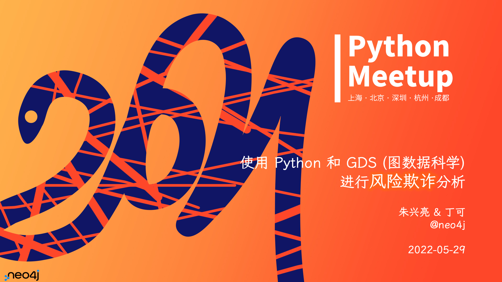
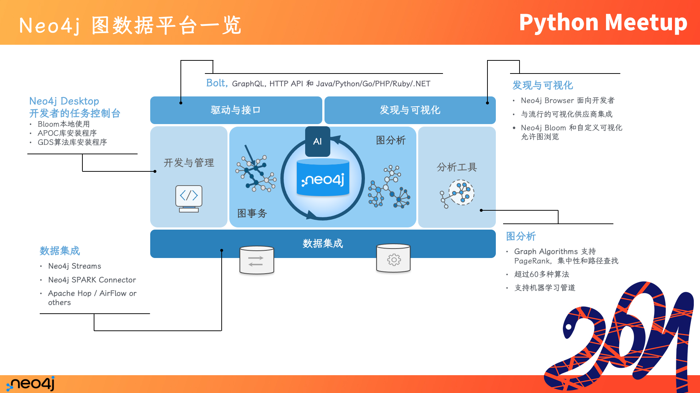
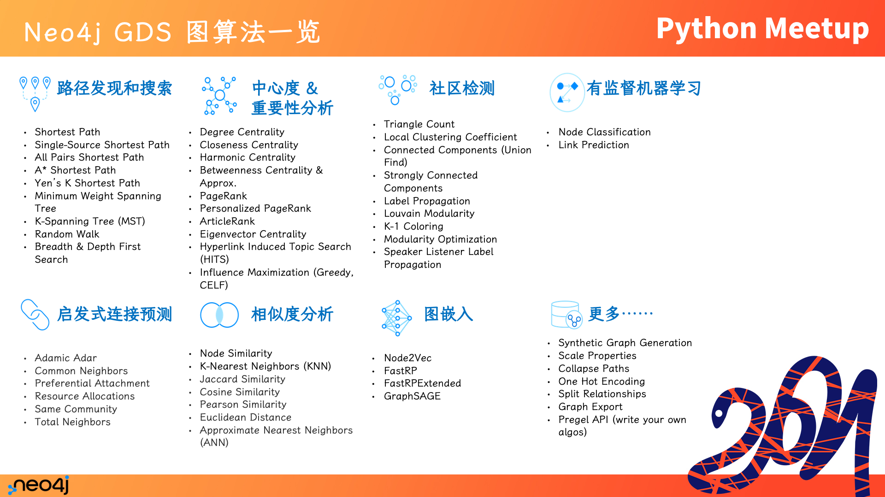
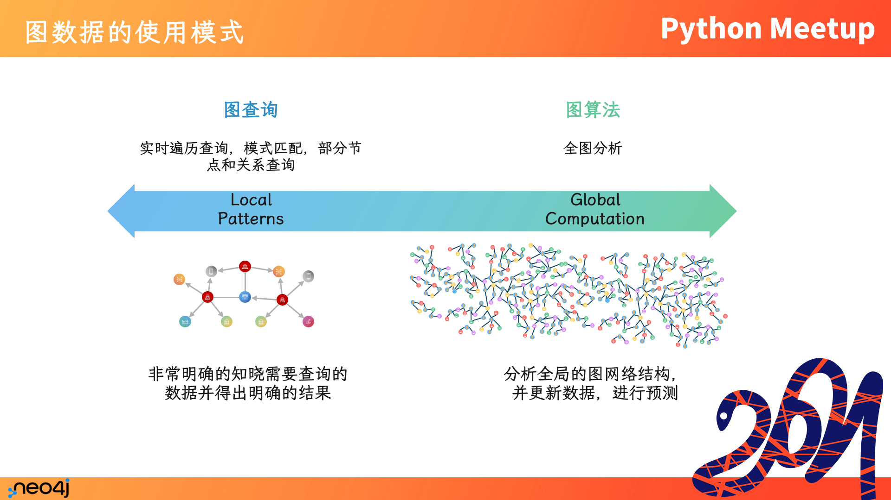
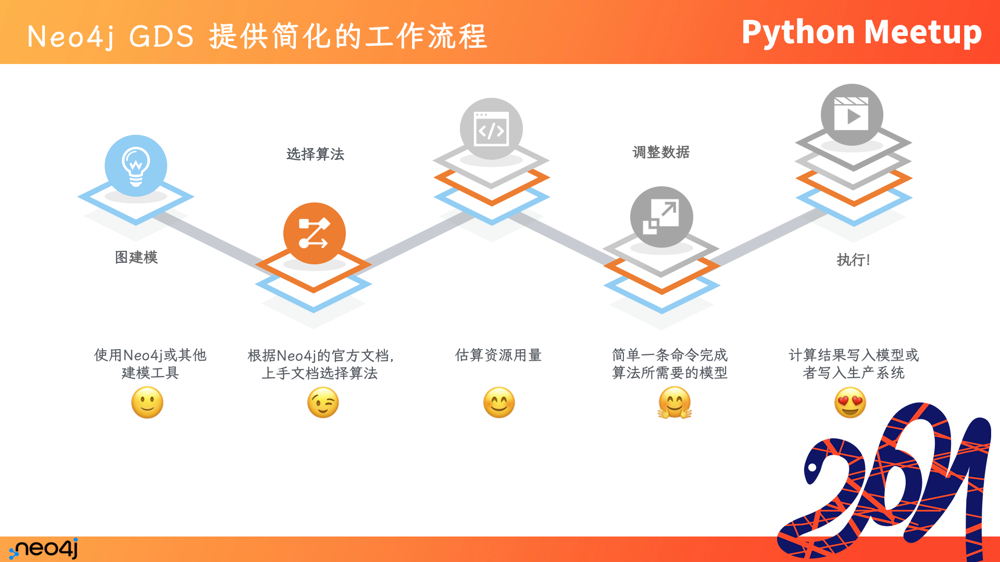
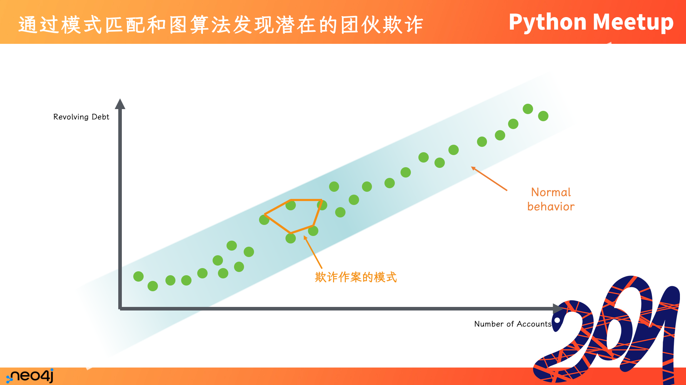

## Python Meetup 上海站2021回顾：使用Neo4j进行P2P欺诈检测

作者：Shiny, Derek

## 活动回顾

PyConChina 是Python社区的年度技术大会，Neo4j 赞助和参与了PyConChina 2021年的大会，按照计划除了大会以外，还会在多个城市举办线下活动，但是随着疫情的反复，上海站的线下活动一直延期到2022年5月底，而且转到了线上。

我们先回顾一下Neo4j在本次年度大会上的分享内容。

### PyConChina 2021 主会场

主题：**Python+图数据科学 - 保险欺诈检测实战**

讲师：**Joshua Yu 俞方桦**，Neo4j 亚太区技术总监

介绍了Neo4j GDS图数据科学，基于Neo4j的保险反欺诈场景和实战方法。

视频回放：https://www.bilibili.com/video/BV16q4y1g7CN

主题：**使用Python和图数据库Neo4j构建电影应用**

讲师：**Shiny Zhu 朱兴亮**，Neo4j 开发者布道师

介绍了Graph图的基本概念，以及使用Python相关技术栈和Neo4j构建一个电影查询和展示的网站应用。

视频回放：https://www.bilibili.com/video/BV1fL4y1v7M2

### Python Meetup 北京站

主题：**通过Python使用Neo4j图科学算法**

讲师：**Derek 丁可**，Neo4j 亚太区高级技术顾问

介绍了图数据库使用场景，图数据科学算法的概念，以及通过Python使用Neo4j GDS。

视频回放：https://www.bilibili.com/video/BV15P4y1E7FK

## Python Meetup 上海站

时间来到了2022年5月，在这次活动上，由Shiny和Derek共同带来了一次分享，主题为：使用Python和Neo4j GDS进行P2P欺诈检测实战。本文带大家回顾这次分享的主要内容。

本次活动的完整视频已由主办方分享，可以通过此链接直接跳转到我们的分享环节：https://www.bilibili.com/video/BV1A3411u7YP?t=6h25m28s

## Neo4j GDS 2.0 和 GDS Python Client 发布

本次分享是基于Neo4j新发布的GDS 2.0和GDS Python Client 1.0 进行，当时正值这两个产品的新版本发布。

## Neo4j 图数据平台

随着这20年的开发和发展，Neo4j 已经不仅仅是一个数据库，而是拓展了完整的工具和应用体系，以及提供了基于图算法的完整分析工具链。

作为事务数据库，Neo4j跟关系数据库一样支持ACID，可以胜任一致性要求较高的事务系统。

作为分析数据平台，随着GDS图数据科学库的开发和发展，提供了业界最多的算法和完善的集成工具。

同时为分析师提供了丰富可视化的查询分析工具 Neo4j Bloom，也可以通过Bolt客户端从而在你喜欢和擅长的编程语言中与图数据交互。

## 图算法的模式

但图算法的使用模式上是有一些区别的，比如事务系统是用于少量高频写入读取的数据，而图算法会更多地用在全图分析和发现隐含的模式。

## Neo4j GDS 流程

## 欺诈检测

本案例代码地址：

https://github.com/neo4j-product-examples/demo-fraud-detection-with-p2p

接下来我们看看代码。

### Part 1: Exploring Connected Fraud Data

### Part 2: Resolving Fraud Communities using Entity Resolution and Community Detection

### Part 3: Recommending Suspicious Accounts With Centrality & Node Similarity

### Part 4: Predicting Fraud Risk Accounts with Machine Learning

### Clean Up

## 总结

