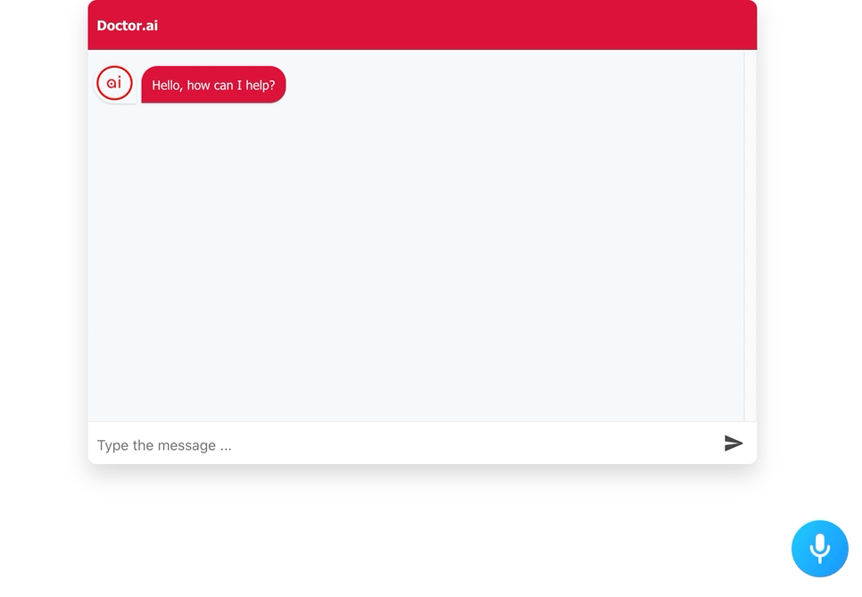
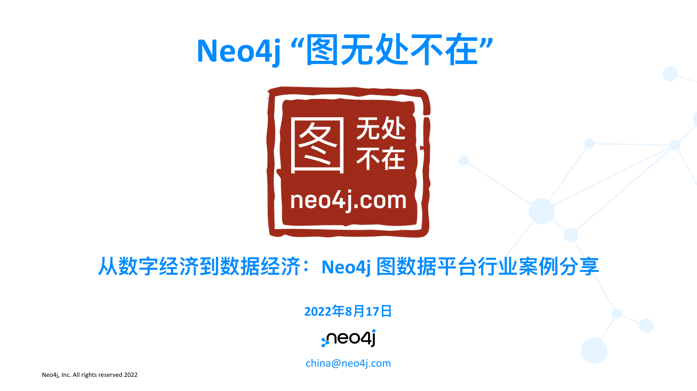

# Neo4j 中文开发者月刊 - 202208期

大家好，2022年8月份新的一期《Neo4j 中文开发者月刊》又和你见面了。最近的天气还是非常酷热，希望大家关注身心健康。

前几天我们宣布了2022年的NODES技术大会，将于11月16、17日举办。本次大会最大的不同是我们将推出不同时区的分会场，让大家看技术大会不再熬夜。同时我们也在征集亚太地区的讲师们，如果你有图技术和Neo4j的创意例子和经验教训，欢迎报名提交议题，届时将在全球范围展示你的技术成果。

另外，7月份的“图无处不在”活动的回放已经发布，错过活动的小伙伴可以前往观看，也别忘了给我们一些反馈和建议，让我们可以做得更好。还有一些技术文章分享给大家。

Neo4j 中文开发者月刊编辑团队 

## 开发者头条

### NODES 2022 开发者大会讲师议题征集中

Neo4j 将于 2022 年 11 月 16 日至 17 日举办新一届的 NODES 2022 开发者大会。这是一个免费、多个分会场、为期两天的在线技术活动，由开发人员和数据科学家带来技术演示和他们用图解决问题的实践。

我们诚挚邀请你作为讲师参与到这次全球范围的 NODES 2022 开发者大会，面向全世界分享你在图技术方面所取得的成就和经验教训。
讲师议题征集将于8月31日（北京时间9月1日 8:00）截止，我们不希望您错过与全球观众分享你的图故事的机会。我们提供三种形式的分享：30分钟主题演讲+QA，10分钟的闪电演讲和2小时的动手实验工作坊。希望能为你的内容提供合适的展现方式。

[点击链接](https://sessionize.com/neo4j-nodes-2022/)提交议题。我们期待你的精彩分享！

### 关联数据赋能智能化业务

*作者：Neo4j 首席营销官 Chandra Rangan*

数据是以易于移动或处理的方式组织在一起的信息。它是一种被转换为二进制数字形式，供计算机和现代信息传输方法使用的信息。
另一方面，关联数据是一种展现、使用和保留数据元素之间关系的方法。图技术有助于发现传统方法无法发现或分析的数据联系。

鉴于大数据在商业洞察上所提供的价值，不同行业都已投资于大数据技术。因此，各行业都呈现出对关联数据的需求，尤其是将员工或客户等与产品、业务流程和其他互联网驱动的设备 (IoT) 做关联。

完整内容请[阅读原文](https://blog.csdn.net/Jennifer726/article/details/126467969)。

## 技术文章

### 知识图谱、物联网和数字孪生——智能供应链的数字基础设施

*作者：俞方桦 博士 - Neo4j 亚太区售前和技术总监*

本文是根据作者在DataFun的分享内容整理。

供应链问题的本质是数据的问题，传统关系型数据库由于其模式的限制，并不能胜任当代智能供应链对复杂关联关系的存储、查询和计算要求。图数据库以及图数据科学则为这一挑战提供了新的选择，并将与物联网、数字孪生一起构建智能供应链的数字基础设施。本文将从数据的角度分享当今智能供应链应当如何搭建和不断完善基础设施。

[阅读全文](https://mp.weixin.qq.com/s/KSErtr3GzHJH33kbhj-nZg)

### Neo4j 与图算法共舞：Neo4j 内置图算法功能、计算思想与实例实操概览

*本文转载自公众号：“老刘说NLP”。*

Neo4j作为当前最为流行的图数据库之一，已经为众人所熟知。而基于Neo4j图数据库进行图算法相关的分析应用也逐步受到关注。一般而言，我们可以使用Neo4j+图算法分析工具（networkx等开源工具）的方式进行配合来完成相关工作。

幸运的是，Neo4j图形数据科学（GDS）库中提供了许多图形算法，包括Path finding路径查找算法、Similarity节点相似度算法、Community detection社区发现算法、Centrality中心度计算算法、Node embeddings节点嵌入算法以及Topological link prediction拓扑链接预测算法等。这也成为了第二种方式，值得我们探索一番。

本文围绕NEO4J中使用内置图谱算法的介绍与分析这一主题，对上述六个算法模块进行介绍和使用实践，供大家参考。

[阅读全文](https://mp.weixin.qq.com/s/7_ik_tlsXUC4n_0AJ0BErA)

### Neo4j 与 Java 微服务指南（英语）

由 Neo4j 开发者关系布道师 Jennifer 撰写的Java 微服务系列文章，现已发布第8篇。内容包括 Spring Data Neo4j，Spring Cloud等微服务和Neo4j相关组件的详细使用介绍。如果你是Java开发者，欢迎阅读该系列文章。

[阅读全文](https://jmhreif.com/blog/microservices-level8/)

## 社区故事

### 如何将 Alan 的听写引擎集成到 Doctor.ai

*作者：黄思行与李亮* 

在本文中，我们向你展示了如何将 Alan 的听写引擎集成到 Doctor.ai 中。这个引擎比 Chrome 更能成功捕捉我们的话语。尽管 Alan 还是会误解一些单词，但我们可以更容易地在输入框中纠正它们。这大大提高了我们与 Doctor.ai 交互的效率。

这个项目还展示了，扩展 Doctor.ai 是多么的容易。Doctor.ai 是模块化的，通过 API 进行通信。开发人员可以相应地切换单个组件。我们可以很容易地添加元素到 Amplify 前端，以提高用户体验。所以我们鼓励你使用 Doctor.ai 并告诉我们你的使用经验。

[阅读全文](https://blog.csdn.net/qq_39576261/article/details/125688918)

### 加入 CSDN Neo4j 社区

Neo4j 官方团队正式进入中国为大家服务，我们通过本地化的交流帮助大家了解和掌握Neo4j产品。在这过程中，越来越多的开发人员和决策者跟我们取得了联系，在沟通过程中，希望大家多多参与到社区里正式的交流讨论，也能够沉淀出问题的解决方案，方便后续的搜索和分享，互助进步。

[访问 CSDN Neo4j 社区](https://bbs.csdn.net/forums/neo4j)

## 活动推荐

### 直播回放： Neo4j “图无处不在 - 从数字经济到数据经济:图数据平台的行业案例深度分享

“大数据” 每年都在增长,如今的企业领导者不仅需要管理更大规模的数据,还迫切需要从现有数据中得出深刻见解。那么,首席信息官和数据科学家应该如何获得这些见解呢?

在图数据库出现并兴起的十余年间，其在各个领域都得到了成功的应用，并且产生了众多创新性的解决方案。

- 在金融领域，图和图分析帮助机构更高效地发现异常的关联交易，以赢得反洗钱战争；
- 在医疗领域，图数据科学为数据科学家带来了丰富的内嵌图分析功能，帮助快速获取患者360和治疗旅程信息，并洞察单个个体治疗旅程和群体特征；
- 在交通、制造等领域，图数据库广泛用于存储和查询知识图谱，成为大数据管理、数据分析和价值挖掘乃至人工智能技术领域的重要支撑；
- 在电力、电信行业，图数据库帮助管理复杂庞大的设备和线路网络，并及时为故障分析根源、估算影响；
- 在社交平台的 “网络水军”识别方面，通过分析用户的关系图特征、结合传统的基于用户行为和用户内容的发现方法，可以有效提高预测的准确性和鲁棒性。

[观看回放](https://www.bilibili.com/video/BV19G4y1r7pp/)

---

不想错过未来的精彩内容？点击[这里](https://go.neo4j.com/china-opt-in.html)或者扫描下面的二维码马上加入。

