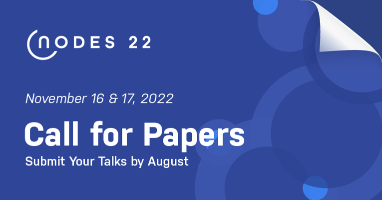
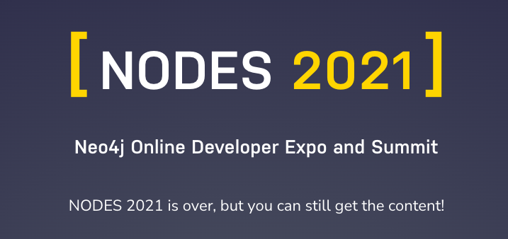
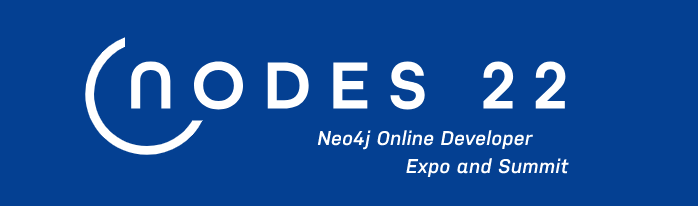

# NODES 2022 开发者大会正在征集讲师议题

作者：Shiny

日期：2022-08-19

## 什么是 NODES？

图的节点叫做 Node，NODES 是 Neo4j 和社区举办的年度开发者大会，面向图技术的开发者和数据科学家们，来自 Neo4j 的技术专家和社区的讲师共同分享他们在图技术上的经验。

NODES 2022 将于11月16、17两天全球直播，目前正在征集讲师和议题中，官网地址：https://neo4j.com/nodes-2022/

## 回顾 NODES 2021

去年 NODES 2021是在6月17号举办的，目前已经可以看到全部的回放视频。

内容涵盖基本知识、可视化、数据科学、最佳实践、应用开发和API等Neo4j图数据平台开发和应用的方方面面。

欢迎大家观看回放：https://neo4j.com/nodes-2021/

## 今年 NODES 2022 有什么不同？

最大的不同就是，今年接受中文议题和有专门的亚太区直播！

没错，随着 Neo4j 在全球市场的投入，开发者大会也已经变成了全球化的在线盛会。

## 为什么你应该参加 NODES 2022

- 面向全球开发者和数据科学家举办的活动。
- 包含广泛的图技术主题。
- 覆盖全球多个时区，参与活动无需熬夜。
- 顶级图技术专家和从业者的最佳社交网络。

所以，在此隆重邀请大家参与到这次 NODES 2022 开发者大会中，来分享你在使用 Neo4j 的经验和心得。

## 议题征集中

我们希望提交的内容应该是与图相关的技术主题。 范围从图驱动的 AI/ML 项目到推荐引擎内部的工程原理和优化实践等等。

虽然我们喜欢案例研究，但我们要求演示文稿是技术性的，侧重于“如何”并展示代码、图形数据模型、Cypher 查询、讨论最佳实践和经验教训等。

我们鼓励首次演讲者和所有代表少数群体的人提交给 NODES 2022！

还有来自中国的多位 Neo4j Ninja 也会带来精彩演讲，敬请期待。

### 关于截止日期

原计划截止日期为8月21日8:00，也欢迎大家继续联系我提交演讲主题。

### 议题格式

我们提供3种演讲方式：

1. 主题分享：30～45分钟以内的主题分享。
2. 闪电演讲：10～15分钟的快速分享。
3. 工作坊：2小时（以上）的动手实验工作坊。

议题的主题可选有：

- 数据库
- 数据分析
- 可视化
- Cypher
- APOC
- 图数据科学GDS
- 知识图谱
- 安全
- 性能优化
- API和驱动（Python, Java, .NET, Go 等等）
- GraphQL
- 云计算（AuraDB, AuraDS, 公有云等等）
- 机器学习/人工智能和自然语言处理（AI/ML, NLP）
- 最佳实践

你也可以将议题跟 Neo4j 的使用场景和行业关联起来，这样观众会更有针对性的选择你的议题。

另外，时区请填入`UTC+8`。

### 现在就去提交吧！

别犹豫，现在就去提交议题吧，期待我们共同为图技术开发者和数据科学家带来精彩体验。

议题提交网址：

https://sessionize.com/neo4j-nodes-2022/

