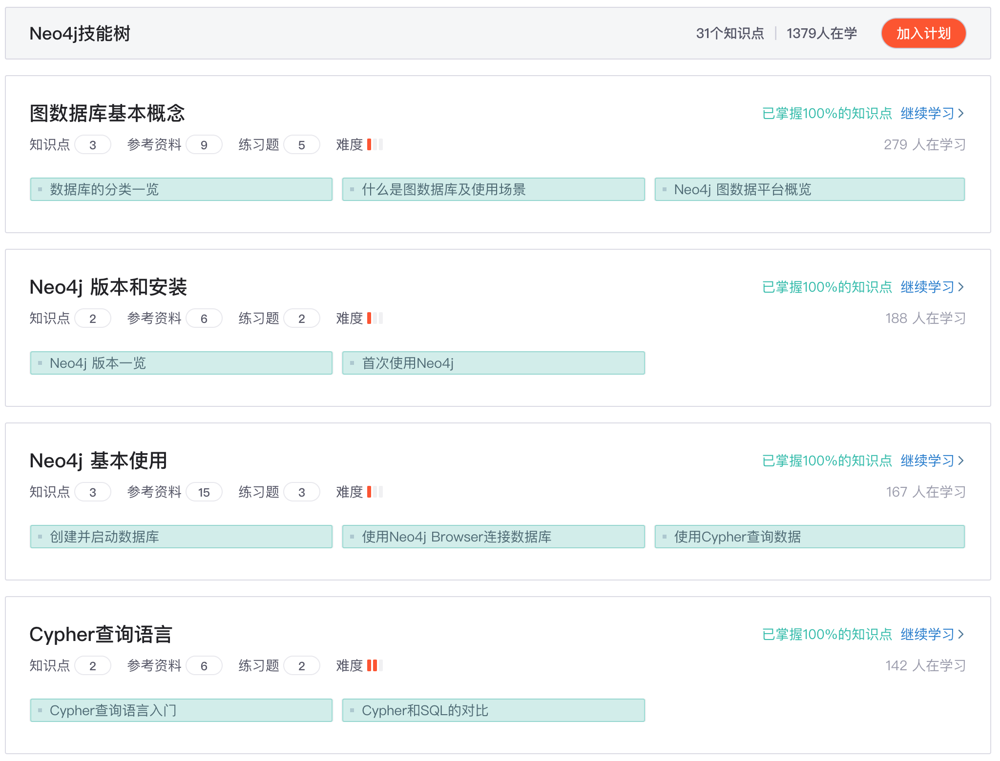
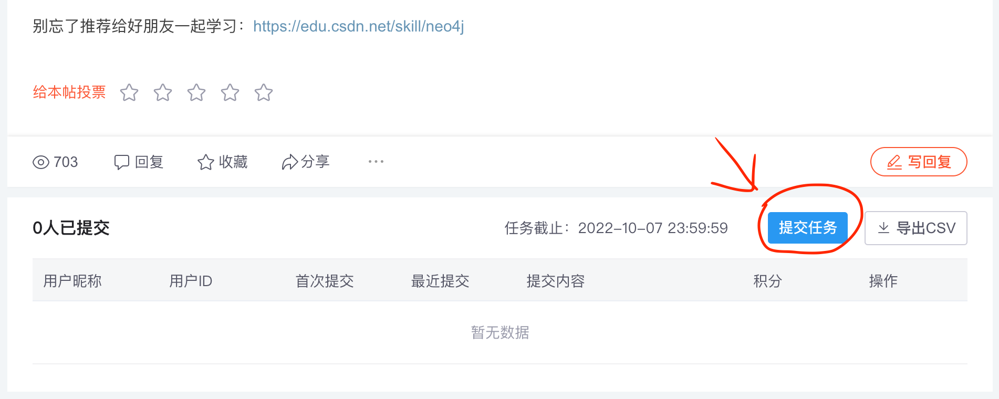
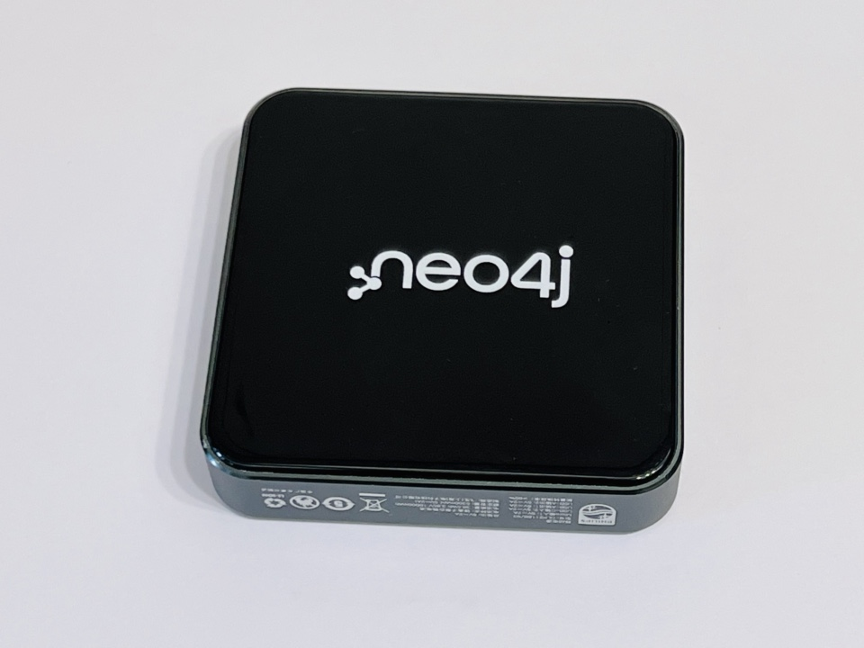
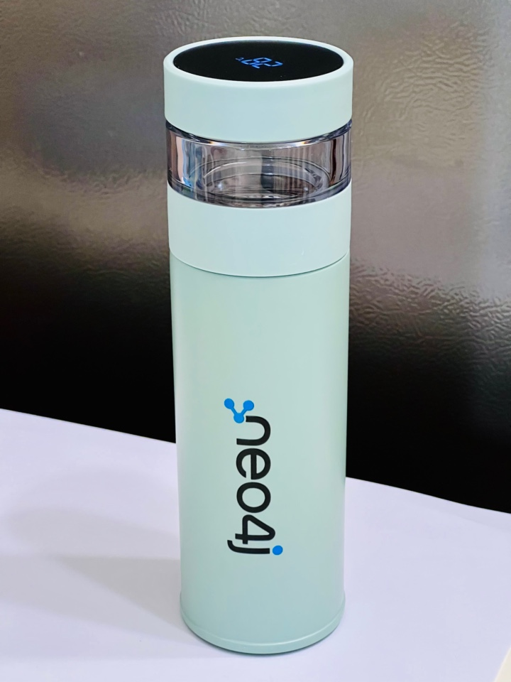
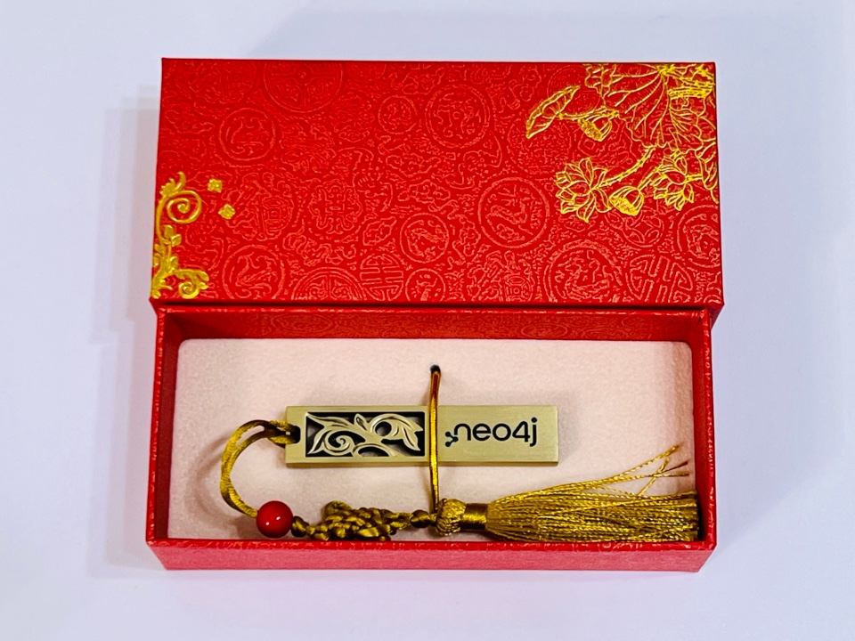
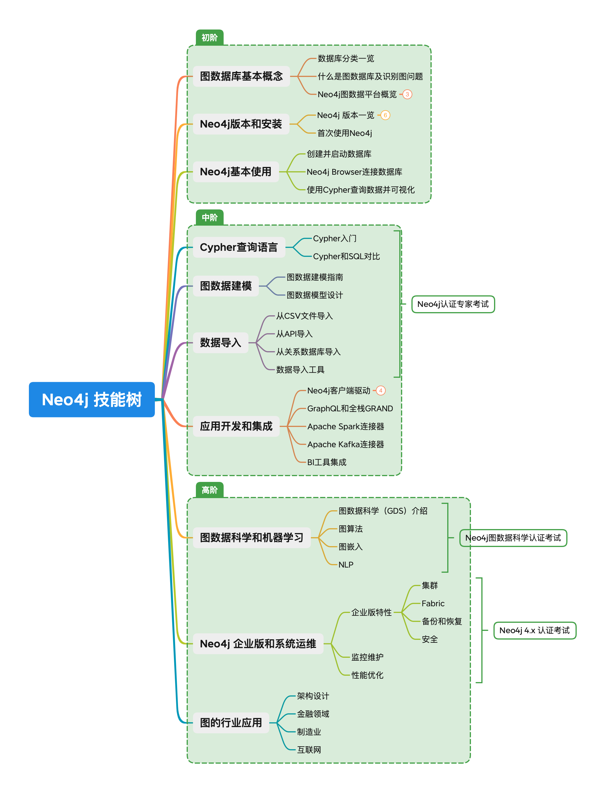

# 在CSDN学习Neo4j技能树，发表学习心得和反馈，赢定制周边

访问CSDN社区帖子参与活动：<https://bbs.csdn.net/topics/608068313>

大家好，我是来自Neo4j的朱兴亮，很高兴看到超过1000人完成了[Neo4j技能树](https://edu.csdn.net/skill/neo4j)的学习，非常感谢大家的热情！也非常感谢CSDN的大力支持！

为了更进一步完善和优化Neo4j技能树，我们希望听到大家的声音，所以我们准备了一些周边礼物，跟CSDN合作推出了本次活动，大家通过参与本活动就有机会领取。

一起来看看吧。

### 活动对象：

所有CSDN注册用户，要求 Neo4j 技能树学习进度在80%以上。

新用户现在就可以点击链接 https://edu.csdn.net/skill/neo4j 开始学习和练习。

### 参与方式：

1、创作一篇关Neo4j技能树的学习体验的相关文章、博客或社区帖子，包括但不限于bug反馈、内容建议、知识点补充等。

2、创作发布后，在本帖末尾，通过黏贴创作的博客地址的方式，提交创作内容。

3、评审人员在收到创作内容后，会从反馈内容量、反馈内容价值、反馈步骤的详细程度等维度综合对内容进行评分。

### 奖励内容：

| 排名     | 奖励内容   | 数量 |
| :------- | :--------- | :--- |
| 1~3名    | 定制充电宝 | 3    |
| 4～6名   | 定制水杯   | 3    |
| 7～10名  | 定制U盘    | 4    |
| 11～20名 | 定制T恤    | 10   |

### 小礼品一览：

定制充电宝。

能显示水温的定制保温杯。

中国元素的定制优盘。

“图无处不在”定制T恤。

### 活动时间：

博客提交时间：2022年9月15日 - 2022年10月7日 23:59

博客评分时间：2022年10月8日 - 2022年10月14日 23:59

获奖名单公布时间：2022年10月17日，在获奖名单公布后的7个工作日内，完成实物奖品的邮寄工作。

### 活动备注：

1、CSDN 团队会检测各种作弊和团伙作弊情况，并对作弊的用户给予处罚。包括但不限于抄袭评测博客、快速刷题获取奖励等

2、禁止为获取流量，提交和本次活动无关内容

3、CSDN 保持对这个活动的解释权。

### Neo4j 技能树介绍

技能树是 CSDN 提供的系统化，面向实战的学习环境。 Neo4j技能树是为大家提供的学习和掌握Neo4j图数据库的一套学习路径，它能帮助用户从初学者成长为合格的Neo4j工程师。Neo4j官方团队帮助大家系统地整理了关于Neo4j领域的知识点，并从海量的 CSDN 数据中不断更新高质量内容。

如图为Neo4j技能树的设计图，从中也可以看到分不同阶段的知识点和要求。

我们希望大家通过Neo4j技能树的学习和参与测试，对图数据库、图算法以及Neo4j图数据平台有基本的了解和上手能力。

如果你完成了大部分（80%）的学习，是时候发表博客、社区帖子来总结一下了。我们希望听到你的声音。

别忘了推荐给好朋友一起学习：https://edu.csdn.net/skill/neo4j