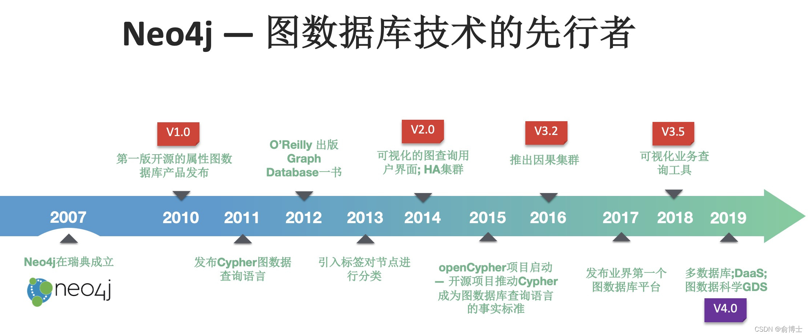
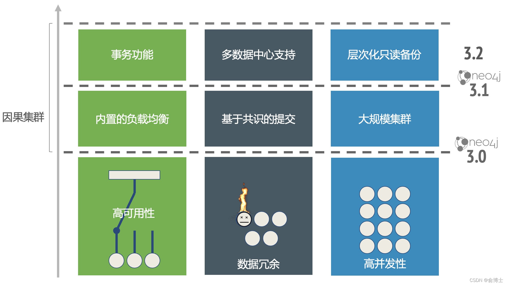
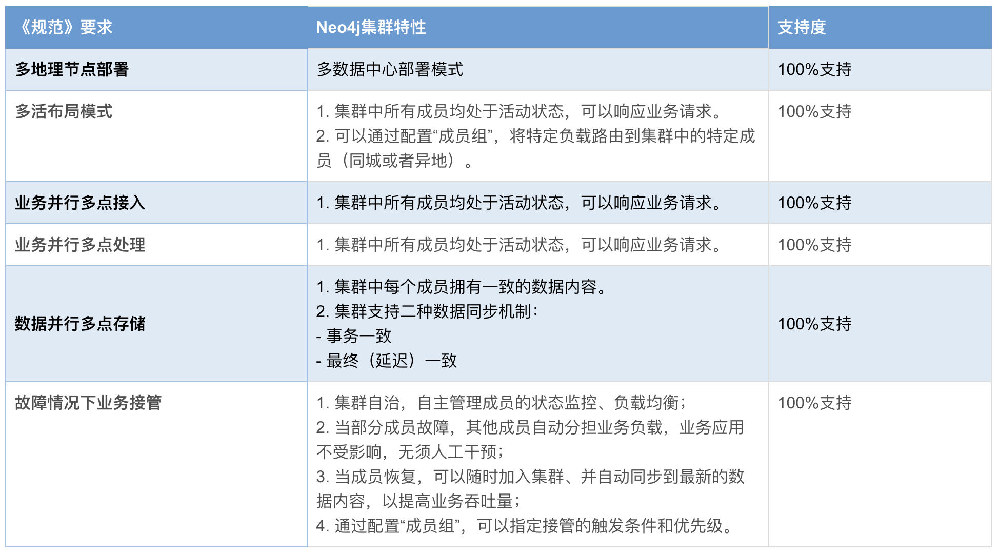
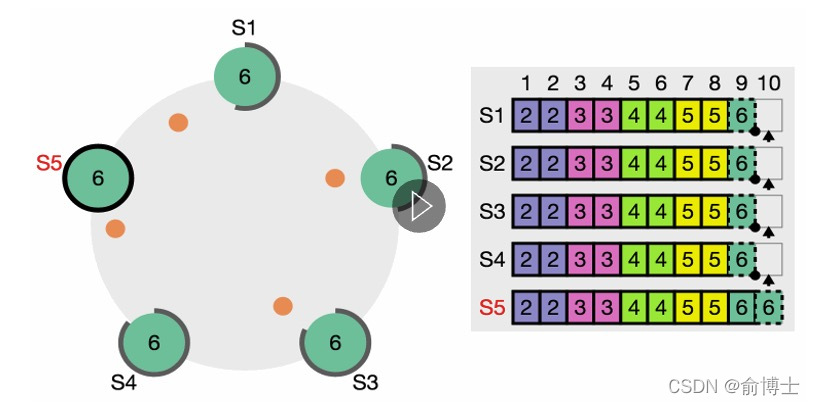
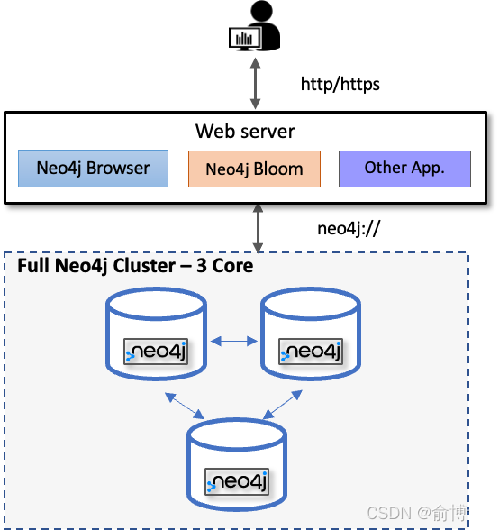
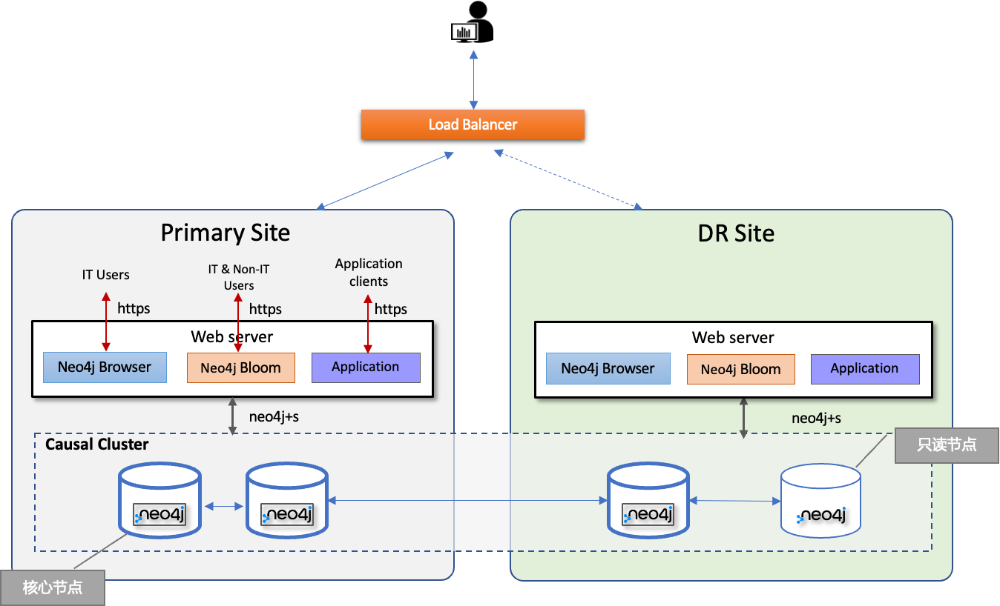
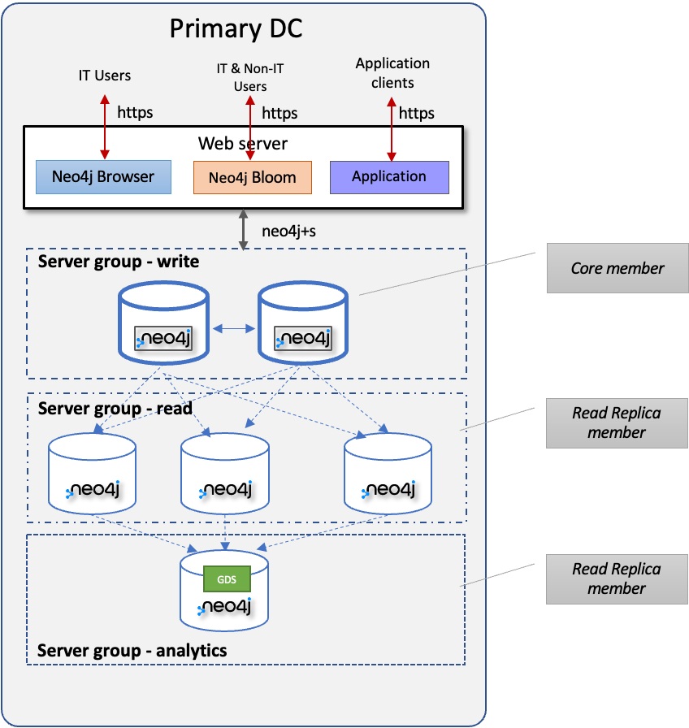
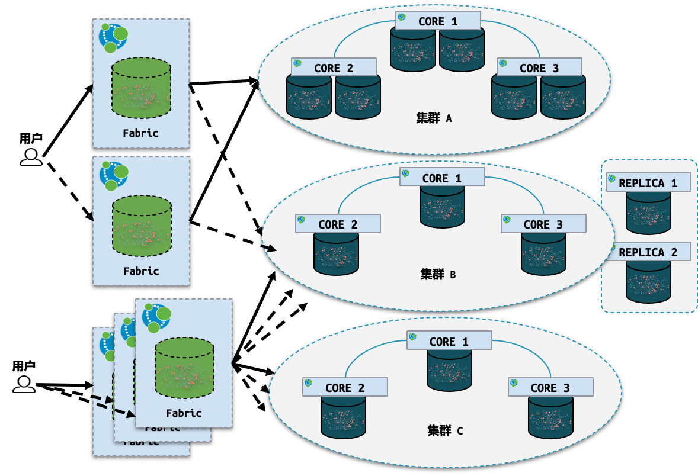

# 从《金融信息系统多活技术规范》看Neo4j企业版集群技术

作者：Joshua Yu，Neo4j亚太区售前和技术总监

原文：<https://blog.csdn.net/GraphWay/article/details/123403994>

## 背景

2021年2月7日，中国人民银行发布了《金融信息系统多活技术规范》（*以下简称《规范》*），首次将多活作为指导金融信息系统灾难恢复的标准。《规范》开篇给出了指导“多活技术”的驱动因素：

- 更高的灾难恢复要求，对于主备方式，当灾难事件发生后，灾难备份系统接管业务往往需要经过较长的时间，而当前金融业务的特点对业务连续性提出了更高的要求。

- 接管能力难以把控，对于主备方式，灾难备份系统在正常情况下并不承载真实业务，其真实接管能力难以有效评估，因对其接管能力的评估主要依赖于灾难恢复预案的制定、管理及演练效果，故一旦灾难发生，灾难备份系统是否可接管真实业务难以保证。

- 单数据中心扩展受限，由于各方面的限制，单数据中心的扩展能力往往存在瓶颈，或者持续扩展能力的经济效益降低。

- 资源利用率低，灾难备份系统在正常情况下不承载业务，资源浪费严重。

- 技术提升，主备方式是在传统技术架构的背景下提出的，而云计算、分布式等先进技术的成熟和应用推广，为信息系统灾难恢复能力的升级提供了技术支撑。

- 业务覆盖需要，对于覆盖地理范围较广的业务系统，部分用户业务接入的距离过长，可能由于处理延迟带来用户体验的下降。

简单来说，对于上述驱动因素，可以归纳为这样几个重点：**多活（Active-Active)**，自冗余，**故障自切换**，**负载自均衡**，流量自管理。

《规范》进一步给出了多活的内涵，及其定义：

1、多地理节点部署信息系统。 信息系统部署在多个地理节点，各地理节点的位置选择宜综合考虑电力、网络、供水等基础设施的容灾因素，包括独立的空调、电力设施、计算、网络、存储等物理资源。

2、布局模式。 根据地理节点的相对位置不同，多活信息系统的布局模式可分为同城多活（布局模式）和异地多活（布局模式）。

3、业务并行多点接入。 各多活子信息系统同时支持业务接入，并支持灵活调整业务接入的多活子信息系统，部分地理节点的灾难和故障不影响其他地理节点上多活子信息系统的业务接入。

4、业务并行多点处理。各多活子信息系统同时支持处理业务逻辑，并支持灵活调整处理业务逻辑的多活子信息系统，部分地理节点的灾难和故障不影响其他地理节点上多活子信息系统的业务处理。

5、数据并行多点存储。 各多活子信息系统同时提供数据存储，且保证其他多活子信息系统存在与业务处理结果一致、可用的数据副本。部分地理节点的灾难和故障不影响其他地理节点上多活子信息系统的数据存储。

6、部分业务影响和及时完成业务接管。当某个多活子信息系统发生灾难或故障时，只有部分业务受到影响并需要分配到其他多活子信息系统进行处理。当发生非区域性灾难时，同城多活子信息系统可及时接管业务；当发生区域性灾难时，异地多活子信息系统可在较短时间内接管业务。

## Neo4j 企业版发展回顾

在Neo4j企业版2.x的时候，实现的是**主-从**的集群模式。后来随着企业应用的增加，预见到未来双活/多活模式的技术趋势，Neo4j在众多数据库产品厂商中率先采纳并实现了**Raft分布式数据处理协议**，并在2016年的3.2版本中推出“**因果集群**”。

随后的几年中，集群技术不断完善、特性逐渐丰富，形成了完整的、面向企业级应用的集群能力。

## Neo4j 企业版集群对《规范》的支持度 

如果我们将Neo4j的集群技术与《规范》中要求的内涵做一下对比，可以得到以下结果：

| 《规范》要求       | Neo4j集群特性                                                | 支持度   |
| ------------------ | ------------------------------------------------------------ | -------- |
| 多地理节点部署     | 多数据中心部署模式                                           | 100%支持 |
| 多活布局模式       | 1. 集群中所有成员均处于活动状态，可以响应业务请求。 2. 可以通过配置“成员组”，将特定负载路由到集群中的特定成员（同城或者异地）。 | 100%支持 |
| 业务并行多点接入   | 1. 集群中所有成员均处于活动状态，可以响应业务请求。          | 100%支持 |
| 业务并行多点处理   | 1. 集群中所有成员均处于活动状态，可以响应业务请求。          | 100%支持 |
| 数据并行多点存储   | 1. 集群中每个成员拥有一致的数据内容。 2. 集群支持二种数据同步机制：事务一致，最终（延迟）一致 | 100%支持 |
| 故障情况下业务接管 | 1. 集群自治，自主管理成员的状态监控、负载均衡； 2. 当部分成员故障，其他成员自动分担业务负载，业务应用不受影响，无须人工干预； 3. 当成员恢复，可以随时加入集群、并自动同步到最新的数据内容，以提高业务吞吐量； 4. 通过配置“成员组”，可以指定接管的触发条件和优先级。 | 100%支持 |

## 因果集群的Raft协议

Raft是一种用于替换Paxos的共识算法，其最早出现于2013年斯坦福大学的一篇博士论文。相比于Paxos，Raft的目标是提供更清晰的逻辑分工使得算法本身能被更好地理解，同时它安全性更高，并能提供一些额外的特性。Raft算法的开源实现众多，在Go、C++、Java以及Scala 中都有完整的代码实现。Raft这一名字来源于"Reliable, Replicated, Redundant, And Fault-Tolerant"（“可靠、可复制、可冗余、可容错”）的首字母缩写。

我们知道，当数据存储分布式之后，如何保证每个节点/分区的数据的一致性是分布式算法的主要挑战。在此之前为大家所熟知的有“二阶段提交”、“三阶段提交”算法，而Raft采用了一种“基于共识的事务提交机制”，以兼顾一致性和可用性。简单地说，在Raft协议中，集群中只要有超过半数（即“共识”）的节点提交事务，就可以认为事务正确提交了。

下面，我们以一个有五个节点的Raft集群为例。

在该集群中，基于共识的事务提交满足下面的规则：

1）所有成员/节点都参与数据的更新/事务提交（多活）。任何对集群的更新只要有三个成员/节点成功提交就可以认为提交成功；

2）任何时候只能最多有一个“领导”（Leader）节点，负责事务提交的协调，其他节点是“跟随者”（Follower）；

3）如果跟随者故障，集群中其他节点仍然可以对外提供读/写请求的处理；如果领导者故障，其他节点则会自动发现、并自主选举出新的领导者；

4）集群的容错是2，即最多可以有二个节点故障，而集群仍然可读可写。如果第三个节点再出故障，集群变成“只读”，直到有至少一个节点恢复并重新加入集群；

5）所有节点上的数据都是一样的，数据同步通过事务日志同步机制保证。事务日志只能按事务ID顺序追加，不得更新、插入、删除。

基于Raft的因果集群是完全自治的。集群协议完成一致性、容错、数据复制、负载均衡、故障切换等操作，无需人工介入。

## 部署案例

### 多活+最小集群

最小的因果集群包含三个核心节点（Core）成员。其中有一个领导者，容错为1。最小集群可以部署在一个数据中心，也可以跨二个数据中心（主站点2个节点、DR站点1个节点）。

### 多活+跨数据中心+平衡节点

这里，三个核心节点跨二个数据中心部署，并在灾备数据中心增加了一个只读节点（Read Replica），以提供平衡的负载。

### 多活+单数据中心+混合负载

在大数据时代，应用类型不仅包含事务型（OLTP），分析型（OLAP），以及混合型（HTAP）。然而，事务型和分析型本质上是完全不同的负载类型，对一致性、系统资源使用、处理响应时间、数据库模式等多项指标的要求非常不一样，因此在实践中无法兼顾所有这些负载。

想一想为什么在事务型应用（例如ERP，支付系统）中我们要基于范式来设计数据库，而在分析型应用中（BI和报表）我们要反范式（例如维度模型）来设计数据库，就会明白上面的意思了。

在Neo4j集群中，可以按照负载类型将节点分成不同组，然后借助集群通讯协议（neo4j://)来实现将不同负载发送到不同节点去处理。

### 多活+多数据中心+混合负载+联邦式查询

在跨地域、多中心的部署中，还可以部署多个集群，每个集群存放不同的数据内容。Neo4j的Fabric则提供跨地区、跨数据库的联邦式查询能力。这使得图拥有无限的水平扩展能力。

## 总结

Neo4j的因果集群为金融信息系统多活标准提供了一个经过验证、稳定而且成熟的实现技术。其主要特点包括：

- 多活：所有集群成员均可处理读写请求；

- 冗余备份：所有集群成员均保存一致的数据；

- 始终在线：最大化利用系统资源；

- 自主自治：故障切换自动完成，无需人工干预

- 读写分离：集群的核心和只读节点可以分别处理更新（事务性）和只读（响应时间）请求；

- 业务流量路由：集群为不同的一致性、实时性、负载类型和规模而设计

- 垂直（系统资源）和水平（数据和负载）扩展

> 集群是Neo4j图数据库平台**企业版**的特性。欢迎问询和交流！

Neo4j企业版提供30天试用，欢迎下载。
