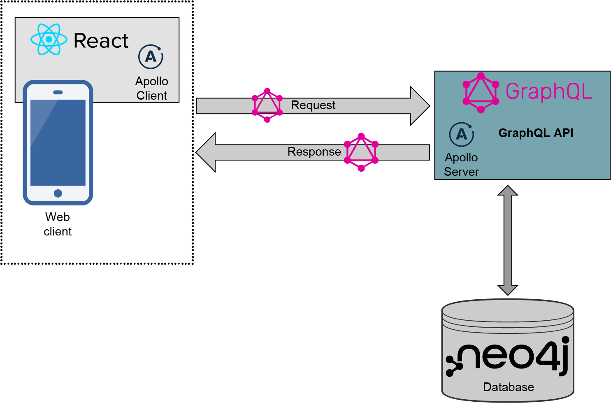

# 使用 React、Node.js 和 Neo4j 的全栈 GraphQL 应用

原文：https://neo4j.com/fullstack-graphql-applications-react-nodejs-neo4j/

## 简介

《全栈 GraphQL 应用》是 Neo4j 开发者关系团队 **William Lyon** 的一本书，由 Manning 印刷出版和发行电子书。本书向您展示了如何使用 GraphQL、React、Apollo 和 Neo4j 图数据库开发全栈 GraphQL 应用程序，以及如何使用 Neo4j Aura、Auth0、Netlify 和 AWS Lambda 等现代云服务部署应用程序。

如果你想使用 GraphQL 构建超快速和超高效的 Web 应用程序，这本实用、全面的指南就是帮助你上手不可或缺的资料。

本书现已免费提供下载！

> For anyone who wants to make amazing full stack apps with GraphQL.

## 内容介绍

许多书仅仅描述了一种单一的技术，但很少有书逐步向您展示如何使用现代组件构建完整的全栈应用程序。

《全栈 GraphQL 应用》教您如何将 GraphQL 与 React、Node.js 和 Neo4j 结合使用来构建复杂的**数据密集型**应用程序。

这本实用的书描述了从头到尾创建全栈 GraphQL 应用程序所需了解的一切。 你会找到如下内容：

- 为 GraphQL 应用程序构建后端功能
- 使用 GraphQL 类型定义为 GraphQL API 建模
- 利用 Neo4j 作为后端数据库
- 使用 GraphQL 处理身份验证和授权
- 在 GraphQL API 中实现分页和速率限制
- 使用 Apollo Server 开发 GraphQL 服务
- 在不同平台上安装 Neo4j 数据库
- 使用 React 和 Apollo Client 创建一个基本的前端应用程序
- 将全栈 GraphQL 应用程序部署到云端

GraphQL 查询语言通过构建精确的基于图的数据请求，从根本上减少了数据的过度获取或数据缺失。在《全栈 GraphQL 应用》中，您将学习如何构建能够充分利用 GraphQL 惊人效率的图感知 Web 应用程序。Neo4j 的 William Lyon 教您从头开始设计、部署和维护 GraphQL API 所需知道的一切。他揭示了如何使用 GraphQL、React、Apollo 和 Neo4j 数据库（又名“GRANDstack”）构建 Web 应用程序，以充分利用 GraphQL 的性能。

## 本书目录

**第一部分：全栈 GraphQL 入门**

1、什么是全栈 GraphQL

2、使用 GraphQL 进行图思维

3、数据库中的“图”

4、Neo4j GraphQL 库

**第二部分：前端开发**

5、使用 React 构建用户界面

6、使用 React 和 Apollo Client 的客户端 GraphQL

**第三部分：全栈注意事项**

7、添加授权和认证

8、部署全栈 GraphQL 应用

9、高级 GraphQL 事项

## 什么是全栈 GraphQL

构建全栈应用涉及使用**多层架构**，通常称为**三层应用**，它由**前端应用**、**API 层**和**数据库**组成。 在上图中，我们可以看到全栈 GraphQL 应用的各个组件以及它们如何相互交互。

## 什么是 Neo4j GraphQL 库

Neo4j GraphQL 库是一个 Node.js 库，可与任何 JavaScript GraphQL 实现（例如 GraphQL.js 和 Apollo Server）一起使用，旨在尽可能轻松地构建由 Neo4j 数据库支持的 GraphQL API。 

Neo4j GraphQL 库的两个主要功能是 **GraphQL 模式生成**和 **GraphQL 到 Cypher 的转换**。 可以参考项目文档。

## 本书作者

William Lyon 是 Neo4j 的开发者关系工程师。 他还负责 Neo4j 数据新闻加速器计划。他也是播客 GraphStuff.FM 的主持人。在加入 Neo4j 之前，William 在房地产、量化金融和预测 API 领域的多家初创公司担任软件开发人员。 William 拥有蒙大拿大学计算机科学硕士学位。

访问 Will 的网站：https://lyonwj.com/

## 免费下载全书！

请至 [Neo4j 官网下载本书](https://neo4j.com/fullstack-graphql-applications-react-nodejs-neo4j/)（英语版）完整电子版。

