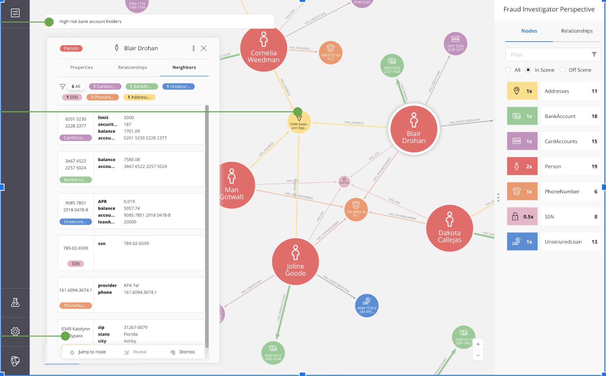
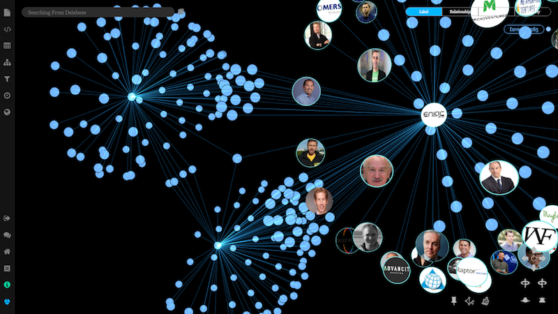
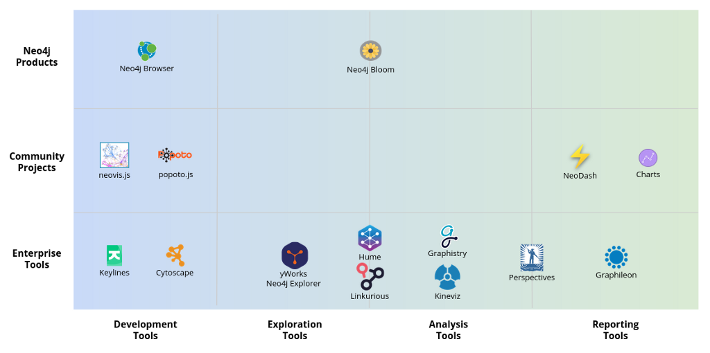

# Neo4j GraphTalk 与你话“图” - 探索关联数据内在之美，让您的数据绚丽绽放

活动时间：2022年9月28日，16:00

本期话题：探索图数据可视化，了解Neo4j Bloom、GraphXR在图数据探索的应用

免费报名中：http://hdxu.cn/UmBNL

## GraphTalk 与你话“图”系列活动介绍

GraphTalk 与你话“图”是 Neo4j 面向中国的数据管理决策者、开发者、数据科学家和图技术爱好者推出的直播活动，每个季度一次，你可以从活动上了解到 Neo4j 图数据平台的最新特性、代码演示、用户案例，以及合作伙伴分享等等，我们非常欢迎你加入直播来跟我们互动交流，期待与你线上相见。如有任何疑问和建议，以及咨询问题，也可以通过电子邮件 china@neo4j.com 与我们联系。

## 活动介绍

信息化时代，数据之间的关联日益紧密，涵盖系统、应用等各种维度的海量数据，每时每刻都在产生。而面对源源不断的数据，如何有效地表达与传递数据背后的价值，是企业作出更精准分析决策的关键。

Neo4j Bloom是一款突破性的美观且富有表现力的图数据可视化工具，其说明性、无代码的搜索到可视化设计使其成为促进同行和领域专家之间交流的理想界面。无论技术背景如何，图数据库新手和专家都无需编码即可快速探索并与 Neo4j 的图数据平台自由交互。

Neo4j Bloom旨在帮助用户以非常简单的方式查询和分析图数据，直观地揭示并解释连通的数据的概念，以及其中蕴藏的巨大价值。深受客户信赖和重视。

除了使用Neo4j Bloom来展现图数据的关联之美，你还可以使用Neo4j 合作伙伴推出的GraphXR进行可视化数据探索。

本期GraphTalk里我们特邀请到上海图客科技有限公司的专家来为大家分享，将通过GraphXR、Neo4j Desktop与Neo4j Sandbox来系统性演示基于零代码、交互式图数据可视化的金融欺诈行为检测、探索与分析，帮助大家直观理解图数据可视化探索与分析的无限可能。

当然，除了本次活动演示的工具以外，你也可以使用你熟悉的可视化工具来连接到Neo4j，从而进行图数据的可视化。

## 本期看点

本期直播活动带你详细了解Neo4j Bloom和GraphXR在搜索、发现、探索和共享Neo4j图数据可视化的能力。无需编程经验也能开始制作图数据可视化。本活动适合数据分析师、数据科学家、图数据爱好者、业务需求分析师，以及开发者们。希望通过本次活动的分享会给你带来启发，从而在Neo4j图数据可视化方面轻松应对，让数据绚丽绽放。

## 日程安排

本次活动将于**2022年9月28日下午4点**开始在活动行直播。活动日程安排如下：

**16:00：利用 Neo4j Bloom 进行 Low Code 的图探索与图算法**

​       丁可 - Neo4j 亚太区高级技术顾问

**16:30：使用 Neo4j Bloom 探索航班数据**

​       曹光雪 - Neo4j Bloom 团队软件工程师

**17:00：用 GraphXR 与 Neo4j 可视化探测、探索与分析金融欺诈行为**

​       Harrison Chen - 上海图客科技有限公司 图数据可视化探索分析方案工程师

**17:30：有奖互动问答交流**

​       主持人：朱兴亮，和嘉宾们

