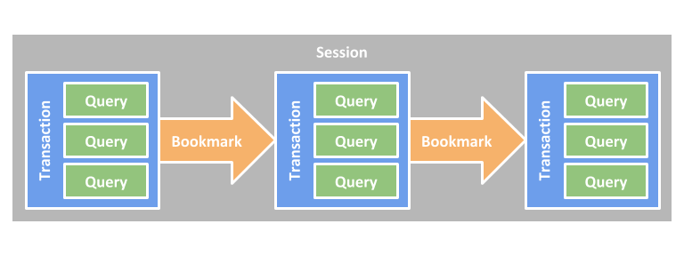

# Neo4j 的事务管理和锁行为介绍

中文作者：**Joshua Yu**，Neo4j 亚太区售前和技术总监

原文地址：<https://blog.csdn.net/GraphWay/article/details/119778024>

文档地址：<https://neo4j.com/docs/java-reference/current/transaction-management/>



## 概述

本文简要描述 Neo4j 的事务管理和行为。

为了充分维护数据完整性并确保良好的事务行为，Neo4j 支持 ACID 的四大属性：

- 原子性，如果事务的任何部分失败，数据库状态保持不变。
- 一致性，任何事务都会使数据库处于一致状态。
- 隔离性，在一个事务期间，修改过的数据不能被其他操作访问。
- 持久性，DBMS 始终可以恢复已提交事务的结果。

具体来说：

- 访问图、索引或模式的所有数据库操作都必须在事务中执行。
- 默认隔离级别是**读提交**（*read-commited*）隔离级别。
- 通过遍历检索得到的数据结果不被保护，其他事务可以修改。
- 可能会发生不可重复读（例如，仅获取写锁并保持到事务结束）。
- 可以手动获取节点和关系上的写锁，以实现更高级别的隔离 — **序列化隔离**级别（*serialization isolation* ）。
- 在节点和关系级别获取锁。
- 死锁检测内置于核心事务管理中。

## 执行周期

有些数据库操作必须在事务中执行以确保 ACID 属性。具体来说，访问图、索引或模式的操作就属于这类操作。事务是**单线程**的、**受限**的和**独立**的。多个事务可以在单个线程中启动，并且它们彼此保持独立。

处理事务的交互周期如下所示：

- 开始事务。
- 执行数据库操作。
- 提交或回滚事务。

> 完成每个事务非常重要。事务在完成之前不会释放它所获得的锁或内存。

Neo4j 中事务的惯用用法是使用 `try-with-resources` 语句并将事务声明为资源之一，然后启动事务并尝试执行图操作。 `try` 块中的最后一个操作应该提交或回滚事务，具体取决于业务逻辑。在这种情况下，`try-with-resources` 被用作防止异常的保护措施和额外的安全机制，以确保无论语句块内发生什么事情都可以关闭事务。所有未提交的事务将在语句结束时作为资源清理的一部分回滚。如果事务已明确提交或回滚，则不需要资源清理，事务关闭将是一个空操作。

> 在事务中执行的所有修改都保存在内存中，这意味着需要将非常大的更新拆分为多个事务以避免内存不足。

## 隔离级别

Neo4j 中的事务使用**读提交**隔离级别，这意味着它们会在数据提交后立即看到数据，但不会看到其他尚未提交的事务中的数据。这种类型的隔离比**序列化**弱，但提供了显著的性能优势，同时足以满足绝大多数情况。

此外，Neo4j Java API 支持**显式锁定节点和关系**。使用锁可以通过显式获取和释放锁来模拟更高级别隔离的效果。例如，如果在公共节点或关系上获取写锁，则所有事务都将在该锁上进行序列化 – 相当于序列化隔离级别的效果。

### Cypher 中丢失的更新

在 Cypher 中，在某些情况下可以获取写锁来模拟改进的隔离级别。想象一下当多个并发 Cypher 查询在增加同一属性值的情况。由于已提交读隔离级别的限制，增量可能**不会**产生确定性的最终值。如果存在**“直接依赖“**，Cypher 会在读取前自动获取写锁。“直接依赖”是指在 `SET` 语句的右侧表达式中有对依赖的属性的读取操作，或者一个 `Map` 中有对键-值对的中值的读取。

例如以下查询，如果由一百个并发客户端运行，则很可能**不会**将属性 `n.prop` 增加到 `100`，除非在读取属性值之前获取了写锁。这是因为所有查询都会在它们自己的事务中读取 `n.prop` 的值，并且不会从任何其他尚未提交的事务中看到已经增加值。在最坏的情况下，如果所有线程在任何其他线程提交其事务之前完成读取，则最终值将可能就是 `1`（假设 `n.prop` 的初始值是 `0`）。

**示例 1. Cypher 可以获取写锁**

下面的例子需要一个写锁，Cypher 会自动获取一个：

```cypher
MATCH (n:Example {id: 42})
SET n.prop = n.prop + 1
```

**示例 2. Cypher 可以获得写锁**

这个例子也需要一个写锁，Cypher 会自动获取一个：

```cypher
MATCH (n)
SET n += {prop: n.prop + 1}
```

由于确定此类依赖项存在相当的复杂，Cypher 不涵盖下面的示例情况。

**示例 3. 复杂 Cypher**

变量取决于读取语句之前若干行的某个属性的结果：

```cypher
MATCH (n)
WITH n.prop AS p
// ... operations depending on p, producing k
SET n.prop = k + 1
```

**示例 4. 复杂 Cypher**

在同一查询中存在读取和写入属性之间的循环依赖：

```cypher
MATCH (n)
SET n += {propA: n.propB + 1, propB: n.propA + 1}
```

为了在更复杂的情况下也保证执行的确定性，有必要很清楚的获取有关节点的写锁。 在 Cypher 中，对此**没有明确的支持**，但可以通过**写入临时属性**来解决此限制。

**示例 5. 明确获取写锁**

此示例通过在读取请求值之前写入虚拟属性来获取节点的写锁：

```cypher
MATCH (n:Example {id: 42})
SET n._LOCK_ = true
WITH n.prop AS p
// ... operations depending on p, producing k
SET n.prop = k + 1
REMOVE n._LOCK_
```

在读取 `n.prop` 之前添加一个无实际意义的 `SET n._LOCK_` 语句，它确保在读取操作之前获取写锁，并且不会由于该特定节点上所有并发查询的强制序列化而丢失更新。

## 默认的加锁行为

- 在节点或关系上添加、更改或删除属性时，将对特定节点或关系进行写锁定。
- 创建或删除节点时，将为特定节点获取写锁。
- 创建或删除关系时，将对特定**关系**及其**两端的节点**进行写锁定。

锁将被添加到事务中并在事务完成时释放。

## 死锁

既然使用了锁，就有可能会发生死锁，但 Neo4j 会在它们发生之前检测出来（由获取锁导致的死锁）并抛出异常。在这个异常被抛出之前，事务会被标记为回滚。事务获取的所有锁仍将被持有，但会在事务完成时释放（在前面指出的 `finally` 块中）。一旦锁被释放，等待锁（由被死锁的事务持有）的其他事务就可以继续进行。如果需要，用户可以重试导致死锁的事务执行的工作。

频繁的死锁往往意味着并发写入请求的正在以某种方式发生，即不可能在执行它们的同时满足预期的隔离和一致性。解决方案是确保并发更新**以合理的方式发生**。例如，给定两个特定节点（A 和 B），为每个事务以随机顺序添加或删除这两个节点的关系，当有两个或更多事务同时执行时将导致死锁。一种选择是确保更新总是以**相同的顺序**发生（首先是 A，然后是 B）。另一种选择是确保每个线程/事务不会像其他并发事务那样对节点或关系进行任何有冲突的写入。例如，可以通过让单个线程执行特定类型的所有更新来实现。

使用 Neo4j 管理的锁之外的其他同步导致的死锁仍然可能发生。由于 Neo4j API 中的所有操作都是线程安全的，除非另有说明，因此不需要外部同步。其他需要同步的代码应该以这样的方式同步，即它永远不会在同步的块中执行任何 Neo4j 操作。

### 死锁处理示例

下面，您将找到如何在**过程**、**服务器扩展**或使用**嵌入式 Neo4j** 时处理死锁的示例。

注：完整源代码可以在 [DeadlockDocTest.java](https://github.com/neo4j/neo4j-documentation/blob/4.3/kernel/src/test/java/examples/DeadlockDocTest.java) 中找到。

在处理代码中的死锁时，您可能需要解决几个问题：

- 只进行有限数量的重试，如果达到阈值则失败。
- 在每次尝试之间暂停以允许其他事务在再次尝试之前完成。
- 重试循环不仅可用于死锁，还可用于其他类型的瞬态错误。

下面是一个示例，说明如何实现这一点。

**示例 6. 使用重试循环处理死锁**

这个例子展示了如何使用重试循环来处理死锁：

```java
Throwable txEx = null;
int RETRIES = 5;
int BACKOFF = 3000;
for ( int i = 0; i < RETRIES; i++ )
{
    try ( Transaction tx = databaseService.beginTx() )
    {
        Object result = doStuff(tx);
        tx.commit();
        return result;
    }
    catch ( Throwable ex )
    {
        txEx = ex;

        // Add whatever exceptions to retry on here
        if ( !(ex instanceof DeadlockDetectedException) )
        {
            break;
        }
    }

    // Wait so that we don't immediately get into the same deadlock
    if ( i < RETRIES - 1 )
    {
        try
        {
            Thread.sleep( BACKOFF );
        }
        catch ( InterruptedException e )
        {
            throw new TransactionFailureException( "Interrupted", e );
        }
    }
}

if ( txEx instanceof TransactionFailureException )
{
    throw ((TransactionFailureException) txEx);
}
else if ( txEx instanceof Error )
{
    throw ((Error) txEx);
}
else
{
    throw ((RuntimeException) txEx);
}
```

## 删除语义

删除节点或关系时，将自动删除该实体的所有属性，但节点的关系**不会**删除。 Neo4j 强制执行一个约束（提交时），即所有关系都必须具有有效的开始节点和结束节点。实际上，这意味着尝试删除仍然具有关系的节点将在提交时引发异常。但是，只要在提交事务时不存在关系，就可以选择删除节点和附加关系的顺序。

删除语义可以总结如下：

- 当一个节点或关系被删除时，它的所有属性都将被删除。
- 当事务提交时，被删除的节点不能有任何关系。
- 可以获取对尚未提交的、删除的关系或节点的引用。
- 在节点或关系被删除（但尚未提交）之后，对节点或关系的任何写操作都将引发异常。
- 在提交后尝试获取对已删除节点或关系的新引用或旧引用，将引发异常。

## 创建唯一的节点

在许多用例中，实体之间需要一定程度的唯一性。例如，系统中可能只存在一个具有特定电子邮件地址的用户。如果多个并发线程都尝试创建用户，则会创建重复项。

以下是确保唯一性的主要策略，它们都适用于跨集群和单实例部署。

### 单线程

通过使用单个线程，没有两个线程甚至会尝试同时创建特定实体。在集群中，外部单线程客户端可以执行这样的操作。

### 获取或创建

定义唯一性约束并使用 Cypher 的 `MERGE` 子句是获取或创建唯一节点的最有效方法。

有关更多信息，请参阅文档：[使用Cypher和唯一性约束获取或创建唯一节点](https://neo4j.com/docs/java-reference/current/java-embedded/unique-nodes/#java-embedded-unique-nodes)。

## 事务事件

可以注册一个 `neo4j.org.graphdb.event.TransactionEventListener` 来接收 Neo4j 数据库事务事件。一旦它在 `org.neo4j.dbms.api.DatabaseManagementService` 实例上注册，它就会接收它注册的数据库的事务事件。侦听器会收到有关已执行的任何写操作、并将被提交的事务的通知。如果 `Transaction#commit()` 没有被调用，或者事务被 `Transaction#rollback()` 回滚，它将被回滚并且没有事件被发送到侦听器。

在提交事务之前，会调用侦听器的 `beforeCommit` 方法，并使用事务中所做修改的整个差异。此时事务仍在运行，因此仍然可以进行更改。该方法也可能抛出异常，这将阻止事务被提交。如果事务回滚，则会调用侦听器的 `afterRollback` 方法。

> 侦听器的执行顺序未定义 ，不能保证任何一个侦听器所做的更改会被其他侦听器收到。

如果 `beforeCommit` 在所有注册的侦听器中成功执行，则提交事务并使用相同的事务数据调用 `afterCommit` 方法。此调用还包括从 `beforeCommit` 返回的对象。

在 `afterCommit` 事务已关闭，访问 `org.neo4j.graphdb.event.TransactionData` 之外的任何内容都需要打开一个新事务。 `neo4j.org.graphdb.event.TransactionEventListener` 收到有关通过 `org.neo4j.graphdb.event.TransactionData` 可访问的任何更改的事务的通知。某些索引和架构更改不会触发这些事件。

以下示例显示如何为特定数据库注册侦听器，并在事务更改集之上执行基本操作。

注：完整源代码可以在 [TransactionEventListenerExample.java](https://github.com/neo4j/neo4j-documentation/blob/4.3/embedded-examples/src/main/java/org/neo4j/examples/TransactionEventListenerExample.java) 中找到。

**示例 7. TransactionEventListener 注册事务事件侦听器并检查更改集：**

```java
public static void main( String[] args ) throws IOException
{
    FileUtils.deleteDirectory( HOME_DIRECTORY );
    var managementService = new DatabaseManagementServiceBuilder( HOME_DIRECTORY ).build();
    var database = managementService.database( DEFAULT_DATABASE_NAME );

    var countingListener = new CountingTransactionEventListener();
    managementService.registerTransactionEventListener( DEFAULT_DATABASE_NAME, countingListener );

    var connectionType = RelationshipType.withName( "CONNECTS" );
    try ( var transaction = database.beginTx() )
    {
        var startNode = transaction.createNode();
        var endNode = transaction.createNode();
        startNode.createRelationshipTo( endNode, connectionType );
        transaction.commit();
    }
}

private static class CountingTransactionEventListener implements TransactionEventListener<CreatedEntitiesCounter>
{
    @Override
    public CreatedEntitiesCounter beforeCommit( TransactionData data, Transaction transaction, GraphDatabaseService databaseService ) throws Exception
    {
        return new CreatedEntitiesCounter( size( data.createdNodes() ), size( data.createdRelationships() ) );
    }

    @Override
    public void afterCommit( TransactionData data, CreatedEntitiesCounter entitiesCounter, GraphDatabaseService databaseService )
    {
        System.out.println( "Number of created nodes: " + entitiesCounter.getCreatedNodes() );
        System.out.println( "Number of created relationships: " + entitiesCounter.getCreatedRelationships() );
    }

    @Override
    public void afterRollback( TransactionData data, CreatedEntitiesCounter state, GraphDatabaseService databaseService )
    {
    }
}

private static class CreatedEntitiesCounter
{
    private final long createdNodes;
    private final long createdRelationships;

    public CreatedEntitiesCounter( long createdNodes, long createdRelationships )
    {
        this.createdNodes = createdNodes;
        this.createdRelationships = createdRelationships;
    }

    public long getCreatedNodes()
    {
        return createdNodes;
    }

    public long getCreatedRelationships()
    {
        return createdRelationships;
    }
}
```

## 更多关于事务的文档

你可以阅读如下的文档找到更多关于 Neo4j 事务的信息。

数据库监控环节的事务管理

https://neo4j.com/docs/operations-manual/current/monitoring/transaction-management/

Cypher 中的事务

https://neo4j.com/docs/cypher-manual/current/introduction/transactions/

图数据科学 GDS 中的事务处理

https://neo4j.com/docs/graph-data-science/current/production-deployment/transaction-handling/

Neo4j 知识库中事务标签

https://neo4j.com/developer/kb/tags/transaction/