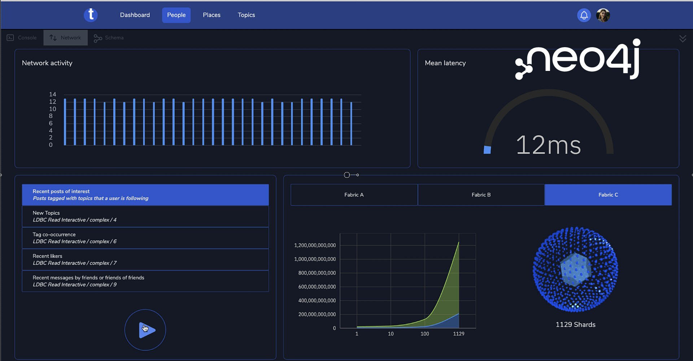
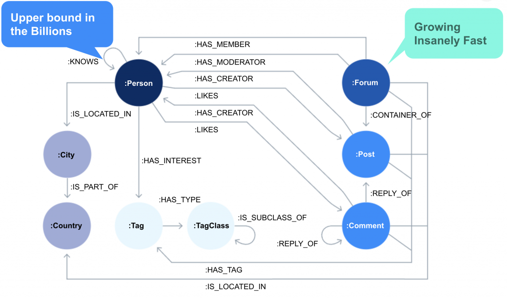
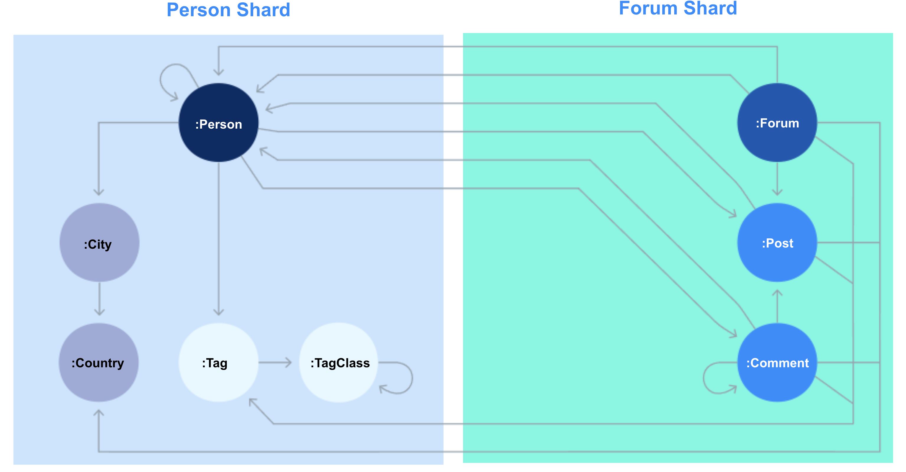
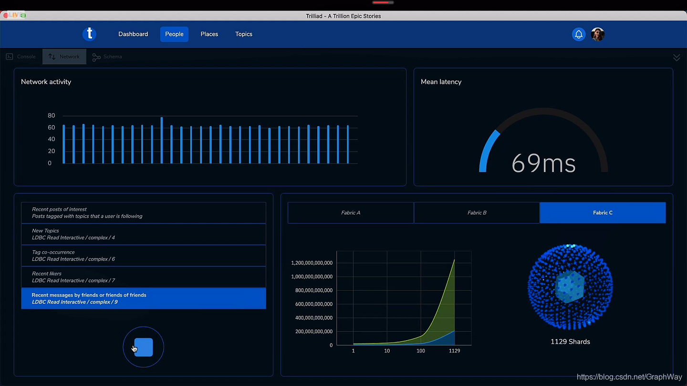

# NODES 回顾：世界上最大的分布式图数据库是怎样炼成的？

本文作者：**Joshua Yu**，Neo4j 亚太区售前和技术总监。

原文作者：**Chris Gioran**，Neo4j 首席架构师。

本文地址：https://blog.csdn.net/GraphWay/article/details/118150976

本文基于该文章整理和补充：https://neo4j.com/developer-blog/behind-the-scenes-worlds-biggest-graph-database/

## 简介

在2021年6月17日的 Neo4j NODES 2021 全球图技术峰会上，Neo4j 的工程师展示了迄今为止部署成功的最大的图数据库集群：

- 1129个Neo4j数据库实例，其中：
  - 1128个论坛数据分片
  - 1个用户分片
- 3个Neo4j Fabric服务实例提供跨分片的查询
- 每个论坛分片包含 9 亿个关系和 1.82 亿个节点，共2千亿节点
- 每个用户分片包含 30 亿个用户和他们之间的 160 亿个关系，超过1万亿条边
- 数据总规模超过 280 TB
- 从开始部署到得到最终结果用了 3 周
- 运行的成本约为 400 美元/小时（AWS）

这次测试的主要目的是验证Neo4j的可扩展性，以及在分布式部署下、Fabric联邦式查询引擎是否能够维持线性的查询相应延迟增长。

实验从1台Neo4j服务器开始，增加到10台、然后100台、最终1129台，数据量也从开始的数百GB到1TB到280TB。使用的数据集是LDBC。

## 动机

在Neo4j 4.0推出 Fabric 时，当时我们做了个验证基准，并在[FOSDEM](https://neo4j.com/fosdem20/?ref=csdn)展示给大家。结果表明，对于 1TB 的数据库，吞吐量和延迟会随着其分布的分片数量呈线性增长。更多的分片、更好的总体性能。结果看起来不错，这证实了我们对扩展图数据库的方法有很好的理解。Fabric 的开发继续使其成为 Neo4j 的一个组成部分。随后的产品更新中，新技术被创建和改进（服务器端路由是一个很好的例子），它们对非Fabric和分布式结构设置也很有用。

但是，我们一直惦记着来自 FOSDEM 的 1TB 数据集。1TB 并不大，至少对于 Neo4j 而言。我们通常有 10TB 或更多的生产数据，尽管它们在相当大的机器上运行，但 Neo4j 垂直扩展得很好。我们还没有真的遇到需要分片/分布的存储解决方案的场景。但是，为了适应真正大型数据库的解决方案，我们创建了 Fabric，但我们还没有发现它的真正极限。

那么什么样的规模是大规模？一年前，我们构建了 40 台机器的集群，它们运行得非常好。使用 100 台机器似乎也不会有多大的挑战。也许有数十亿个节点？嗯，数十亿个节点仅相当于几 TB 的数据。重要的是，图模式的丰富性来自节点之间的关系，而不是节点本身。我们想的是测试一下可以将 Neo4j 伸展多远，而不仅仅是让自己感觉或看起来不错。

时不时有这样的声音出现，“Neo4j不支持水平扩展”。很明显我们需要一个证明它错误的机会，一直以来我们都在等待这一机会的到来。现在，它终于来了。这个机会是[NODES 2021](https://neo4j.com/nodes-2021/?ref=csdn)。

## 规模

我们决定需要一个足够大的规模时，一个还没有其他人做到过的规模。我们需要向世界展示的不仅仅是Neo4j可以存储那样大规模的数据，当水平扩展时还能提高总体性能。

我们将需要更大的数据量，而且不仅仅是数百台机器或数十亿个节点。

> 一万亿。

> 一万亿关系应该够大了，对吧？

您甚至在哪里找到具有万亿关系的数据库？使用生产数据会带来物流的问题——数据传输本身会很复杂，更不用说脱密数据以使其适合公众查看。我们只能根据已知模型自己生成它。从数据模型开始，决定需要提供机器的数量和大小、运行的查询以及创建的测试。简而言之，从数据模型开始，了解它需要付出的努力。

[LDBC](http://ldbcouncil.org/)是一个很好的选择。它是一个包含人员、论坛和帖子的社交网络。它很容易理解和解释，大家应该对它也非常熟悉。我们创建了有 30 亿用户的数据集，并对其进行数据分区。这已经超过了地球上最大的社交网络的用户数。根据社交连接的程度，用户分区占用850GB，每个论坛分区有 250GB，每个分区大约有 9 亿个关系。为了达到 1 万亿关系的目标，我们建立了约1110 个论坛分区，每个分区运行在独立的服务器上。

下图是LDBC的数据模型。

 

下图是我们对数据进行分区的策略：

除了实际存储数据的分区，我们还增加了3个Neo4j Fabric服务实例，用来实现跨区的查询。

实际的测试如下：

1）在10个分区上运行LDBC查询，平均延迟12ms

2）在100个分区上执行查询的平均延迟是18ms。

3）在1000个分区上运行查询，平均延迟是69ms。

在实际的测试中，由于这样大规模的集群是亚马逊云上不曾部署过的，我们还解决了若干技术问题。

如有兴趣深入了解，欢迎随时[联系我们](http://neo4j.com/)。

## 总结

本篇重点介绍了基于 Neo4j 的高级分片技术，以及 Fabric联邦式查询引擎。这是[经过验证的、无与伦比的图数据扩展性能](https://neo4j.com/developer/neo4j-fabric-sharding/?ref=csdn)。

所有演示数据集和配置的详细信息均可在 [Github](https://github.com/neo4j/trillion-graph) 上公开获得。