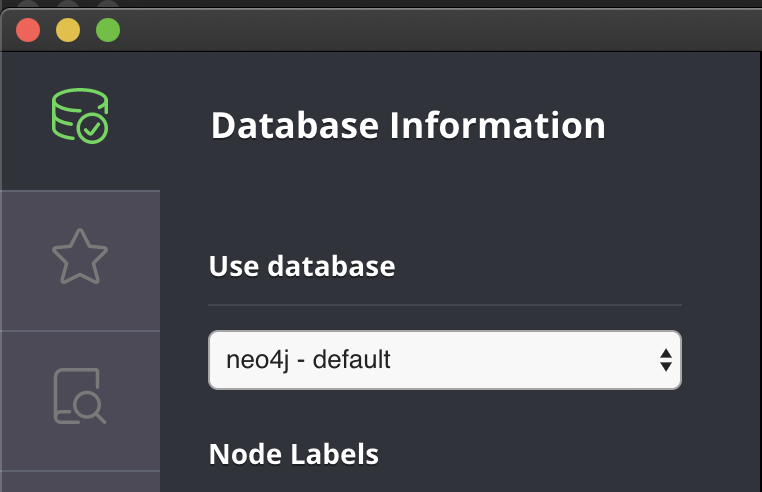

# Neo4j Fabric 快速入门

中文原文：https://blog.csdn.net/GraphWay/article/details/118105211

中文作者：Joshu Yu，Neo4j亚太区售前和技术总监

英文原文：https://neo4j.com/blog/getting-started-with-neo4j-fabric/

英文作者：Soham Dhodapkar，Neo4j 售前工程师


## 前言

Fabric 是 Neo4j 4.0 中引入的新功能，是一种在多个数据库中存储和检索数据的方法。 此功能可以使用单个 Cypher 查询轻松查询同一 数据库实例中的多个库/图，或多个 数据库实例中的数据。

从实用的角度来看，Fabric 提供了以下基础功能和工具：

- **数据联邦**（Data Federation）：能够访问分布式数据源中、彼此不相连的图中的数据。
- **数据分片**（Data Sharding）：能够访问分布式数据源中结构相同的图，并且图的数据存储分布在不同库中。

使用 Fabric，Cypher 查询可以在多个联邦和分片图中存储和检索数据。

在开始使用之前要注意的是：

- Fabric 是 Neo4j 4.x 的特性，这意味着它**不适用**于 Neo4j 3.x 版本。
- Fabric 是一项**仅限企业版**的功能，这意味着它不适用于 Neo4j 社区版。

在这篇文章中，我们不会介绍各种部署架构， 而主要是**学习如何使用 Neo4j Desktop 来设置基本的 Fabric 环境和查询图数据**。

## 设置 Neo4j Fabric 环境

下面详细介绍操作步骤，强烈建议您跟着步骤进行实际操作。

### 1. 设置环境

请您首先下载 [Neo4j Desktop](https://neo4j.com/download/?ref=blog)，接下来，我们从创建一个新的项目开始。


在新的项目中，单击“Add（添加）”，选择“Local DBMS（本地数据库）”，输入“Name（名称）”和“Password（密码）”，并确保选择以 4.* 开头的任何版本（笔者选择的是4.4.10版本）。 然后点击“Create（创建）”并等待数据库实例启动。

启动后，单击“Open（打开）”会打开 Neo4j 浏览器窗口。在左侧窗格中，我们可以看到默认数据库是“neo4j”。



我们将举一个在银行领域的非常简单的案例，出于数据安全的目的，我们需要把用户的个人信息与其交易数据分开。

> 出于数据安全的目的，我们需要把用户的个人信息与其交易数据分开。

例如，必须按部门控制对数据的访问，支持团队可以访问所有内容，但用户身份核查团队无权访问用户的交易。

在这里，也可以使用 Fabric 实现数据的物理分离，其中部分用户数据可以位于不同的地理位置。

要说明的是，使用 Fabric 是实现相关应用需求的一种方法。 从安全的角度来看，这也可以通过[细粒度的访问控制](https://neo4j.com/docs/operations-manual/4.4/authentication-authorization/access-control/)来实现。 但是，细粒度的访问控制实现不了物理分离，Fabric 却可以。

### 2. 创建初始数据

现在，让我们在这个数据库中创建一些非常简单的数据。

```sql
CREATE (u:User{uid:1234,name:"Andy"});
CREATE (a:Address{street:"2985 Finwood Dr",city:"Freehold",state:"NJ"});
CREATE (s:SSN{num:"321-7654-098"});
MATCH (u:User),(a:Address)
WHERE u.uid=1234 AND a.street="2985 Finwood Dr"
CREATE (u)-[:HAS_ADDRESS]->(a);
MATCH (u:User),(s:SSN)
WHERE u.uid=1234 AND s.num="321-7654-098"
CREATE (u)-[:HAS_SSN]->(s);
```

首先，让我们检查一下我们的图模式。 在Neo4j浏览器里运行如下命令：

```cypher
CALL db.schema.visualization
```

它将显示一个（元数据）图，展示数据中的节点标签和关系类型。可以看到这些数据是按照我们的想法创建的。


由于它是一个非常小的数据集，我们可以使用以下方法返回所有数据：

```sql
MATCH (n) RETURN n;
```

这里显示的是我们创建的图：


现在我们来创建另一个数据库。~~这是一个管理功能，在Neo4j 4.2版本以前，我们需要切换到系统数据库，使用命令`:use system` 来切换。~~ 直接在当前Neo4j浏览器里运行如下命令：

```cypher
CREATE DATABASE payments;
```

现在我们将通过如下的命令使用这个数据库：

```cypher
:use payments
```

您会注意到左窗格中的数据库名称已更改为`payments`。

我们再创建另外一些数据：

```sql
CREATE (u:User{uid:1234});
CREATE (t:Transaction{tid:"t001",amt:10,vendor:"amc"});
CREATE (t:Transaction{tid:"t002",amt:5,currency:"USD",vendor:"strbcks"});
MATCH (u:User),(t:Transaction)
WHERE u.uid=1234
CREATE (u)-[:HAS_TRANSACTION]->(t);
```

和以前一样，我们将首先使用 `CALL db.schema.visualization` 检查图模式。


再看看我们创建的数据：


看起来很不错，现在我们就来设置 Fabric 来查询这些图！ 

### 3. Fabric 配置

我们需要在配置文件中添加一些设置。在 Neo4j Desktop 中， 点击当前数据库"Open"右边的“…”按钮，从弹出菜单中选择 “Settings...“ ，这将显示 `neo4j.conf` 配置文件。

我们将在文件的末尾添加以下几行内容：

```bash
#Fabric config
fabric.database.name=fabric
 
fabric.graph.0.uri=neo4j://localhost:7687
fabric.graph.0.database=neo4j
fabric.graph.0.name=neo4j
 
fabric.graph.1.uri=neo4j://localhost:7687
fabric.graph.1.database=payments
fabric.graph.1.name=payments
```

首先我们命名用于Fabric的数据库，取名 `fabric`，当然它可以是任何其他名字。

然后我们声明第一个数据库的详细信息。这些包括 **URI**、**数据库**和**名称**。对第二个数据库，也同样如此。由于两个数据库都在本地机器上，URI 和 bolt 端口是 `localhost:7687`，我们的数据库名称是“`neo4j`”和“`payments`”。有关 Fabric 配置设置的更多信息请点击[这里](https://neo4j.com/docs/operations-manual/4.4/fabric/configuration/?ref=blog)查看。

点击“Apply（应用）”，然后选择“Restart Now（立即重启）”。我们对配置设置所做的更改将在数据库实例重新启动后生效。

要执行Fabric查询，我们必须首先切换到配置设置中指定的 Fabric 数据库，这里的名称为 `fabric`。

我们使用如下命令来做到这一点：

```cypher
:use fabric
```

您应该会看到左侧窗格中的数据库名称已更改为“`fabric`”。

### 4. 查询单图

现在让我们来运行第一个 Fabric 查询！

首先我们查询单个图并测试 Fabric 是否正常工作。在Neo4j浏览器中运行整个如下的查询：

```sql
// STEP 1: First, we tell fabric to USE the “neo4j” database for this query
USE fabric.neo4j
 
// STEP 2: Then we pick the user and their address
MATCH (u:User) -[:HAS_ADDRESS]-> (a:Address)
 
// STEP 3: Finally, we return the user id, name and a concatenation of the address properties as the address
RETURN u.uid AS userId, u.name as Name, a.street+", "+a.city+", "+a.state as Ad
```

结果将显示我们的 Fabric 设置有效！


### 5. 查询多个图

我们尝试查询这两个图。

```sql
// STEP 1: First, we tell fabric to USE the “neo4j” database for the first part of the query
USE fabric.neo4j
 
// STEP 2: Pick the User node
MATCH (u:User)
 
// STEP 3: We return the user id 
RETURN u.uid AS userId
 
// STEP 4: Now, we want to take a union of the result sets of both the queries
UNION
 
// STEP 5: For second part of the query, we tell the fabric to USE the “payments” database
USE fabric.payments
 
// STEP 6: Again, pick the user node
MATCH (u:User)
 
// STEP 7: Finally we return the user id, remember UNION works when both queries return the same column!
 
RETURN u.uid AS userId
```

由于我们的图中只有一个用户，因此 UNION 将生成此用户 ID 作为结果。我们可以创建一些数据来查看此查询更复杂些的结果。


### 6. 使用 Fabric 创建和更新数据

我们可以通过在“`neo4j`”图中简单地创建另一个用户节点来做到这一点。

要使用 Fabric 创建节点的步骤：

```php
// STEP 1: First, we tell the fabric to USE “neo4j” database
USE fabric.neo4j
 
// STEP 2: We run a simple CREATE command with just a user id.
 
CREATE (u:User{uid:7890})
```

现在我们有多个用户 ID，我们可以再次尝试运行上面的 `UNION` 查询。


请注意！ 两个不同数据库结果集的 `UNION` 可以为我们提供两个可用的用户 ID。

### 7. 关联子查询

在这种类型的查询中，我们将从第一个查询中的一个数据库中获取结果，并将其用作第二个查询中的条件。我们还将使用Neo4j 版本4中添加的 `CALL {}`子句。

```swift
//STEP 1: In the first subquery, we are using neo4j database to get the personal information of the user.
CALL{
      USE fabric.neo4j
      MATCH (u:User)-[:HAS_SSN]->(s:SSN)
      RETURN u.uid as userId, u.name as uname, s.num as ssn
    }
 
//STEP 2: In the second subquery, we use payments database to get transactions of a user based on the ‘userId’ returned from the first subquery.
CALL {
    USE fabric.payments
    WITH userId
    MATCH (u:User)-[:HAS_TRANSACTION]->(t:Transaction)
    WHERE u.uid = userId
    RETURN t.tid as transactionID, t.amt as Amount,t.vendor as Vendor
     }

//STEP 3: Finally returning personal and transactions data returned from both the subqueries.
RETURN uname,ssn,transactionID,Amount,Vendor
```

在这里，我们从“neo4j”数据库中挑选了一个特定用户，并从“payments”数据库中挑选了与该用户相关的所有交易，然后从“neo4j”数据库中返回了姓名和 SSN，最后从“payments”数据库中返回的交易信息。


## 总结

> 现在您已经会使用 Fabric 了！

在本篇文章中，我们研究了设置 Fabric、查询单个图、查询多个图、创建数据和运行相关子查询，所有这些都需要使用 Fabric。

想要了解有关架构、部署、配置设置和查询的更多信息，请点击查看[Fabric 文档](https://neo4j.com/docs/operations-manual/4.4/fabric/?ref=blog)。

想要让您的 Neo4j 技能更上一层楼吗？ 来参加我们的[在线培训课程](https://graphacademy.neo4j.com/cn/?ref=wechat)吧！或者在我们的 GraphAcademy 取得认证，并获得职业升级！