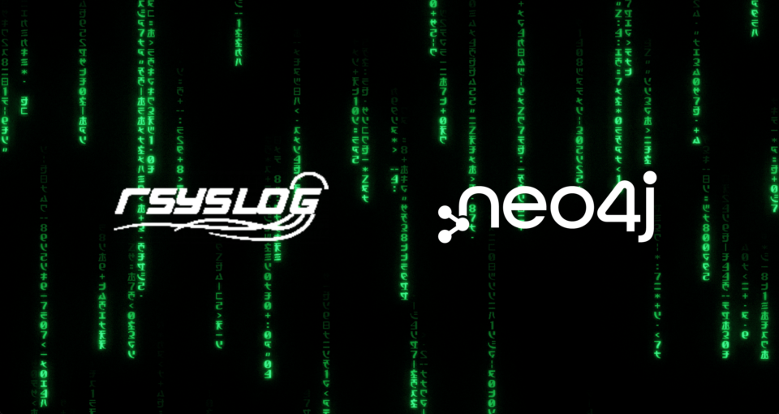

# 使用 rsyslog 将 Neo4j 日志重定向到 sysout



作者：**Tony Wu 博士**，Neo4j亚太高级技术顾问

## 摘要

本文介绍一种将Neo4j日志转发到系统日志的方法。

## 需求和解决方案

我们希望将所有应用程序日志输出到 Linux 的 sysout。虽然 Neo4j 不提供此功能，但我们可以使用 rsyslog 来实现这一点。

我们可以通过下面几个简单的步骤来实现。该方法适用于 Neo4j 4.x 及以上版本。

下面看看详细的配置步骤。

## 配置步骤

### 步骤 1: 安装 rsyslog 8.0 以上版本

参考文档链接安装 rsyslog 8或以上版本，下面命令在 Redhat或者CentOs 通过yum安装。

```bash
yum install rsyslog
```

### 步骤 2：为 rsyslog 创建配置文件从 Neo4j 读取日志信息

```bash
vim /etc/rsyslog.conf 
```

在文件中添加以下行 

```
### 配置文本文件读取模块
module(load="imfile" PollingInterval="10") 

### 配置读取Neo4j日志文件，如debug.log，并设定读取级别为信息日志，设定Facility名称为local6。
input(type="imfile"
   File="/neo4j/neo4j-enterprise-xxxx/logs/debug.log"
   Tag="neo4j_debug"
   Severity="info"
   Facility="local6")

### 将调试日志所有信息重定向到 /var/log/neo4j.log
local6.* /var/log/neo4j.log
```

### 步骤 3：重新启动 rsyslog 服务

CentOS 7：

```bash
service rsyslog restart
```

CentOS 8:

```bash
systemctl restart rsyslog 
```

### 步骤 4：检查服务运行状态

```bash
$systemctl status rsyslog.service
● rsyslog.service - System Logging Service
  Loaded: loaded (/usr/lib/systemd/system/rsyslog.service; enabled; vendor preset: enabled)
  Active: active (running) since Wed 2022-09-07 13:51:51 CST; 4s ago
   Docs: man:rsyslogd(8)
      http://www.rsyslog.com/doc/
 Main PID: 130546 (rsyslogd)
  Tasks: 4
  Memory: 1.8M
  CGroup: /system.slice/rsyslog.service
      └─130546 /usr/sbin/rsyslogd -n
```

然后在`/var/log`下面可以找到 neo4j.log，可以查看Neo4j重定向的调试日志了。

## 参考资源

更多信息可以在这里找到。

Redhat - Viewing and Managing Log Files

https://access.redhat.com/documentation/en-us/red_hat_enterprise_linux/6/html/deployment_guide/ch-viewing_and_managing_log_files#sec-Installing_rsyslog

Neo4j KB - Redirect Neo4j logs to sysout (using rsyslog)

https://neo4j.com/developer/kb/redirect-neo4j-logs-to-sysout-using-rsyslog/

Download rsyslog 8

https://www.rsyslog.com/downloads/download-v8-stable/

How to Configure Rsyslog Server in CentOS 8 / RHEL 8

https://www.linuxtechi.com/configure-rsyslog-server-centos-8-rhel-8/

RSyslog 8 Configuration Documentation

https://www.rsyslog.com/doc/v8-stable/configuration/modules/imfile.html

https://www.rsyslog.com/

