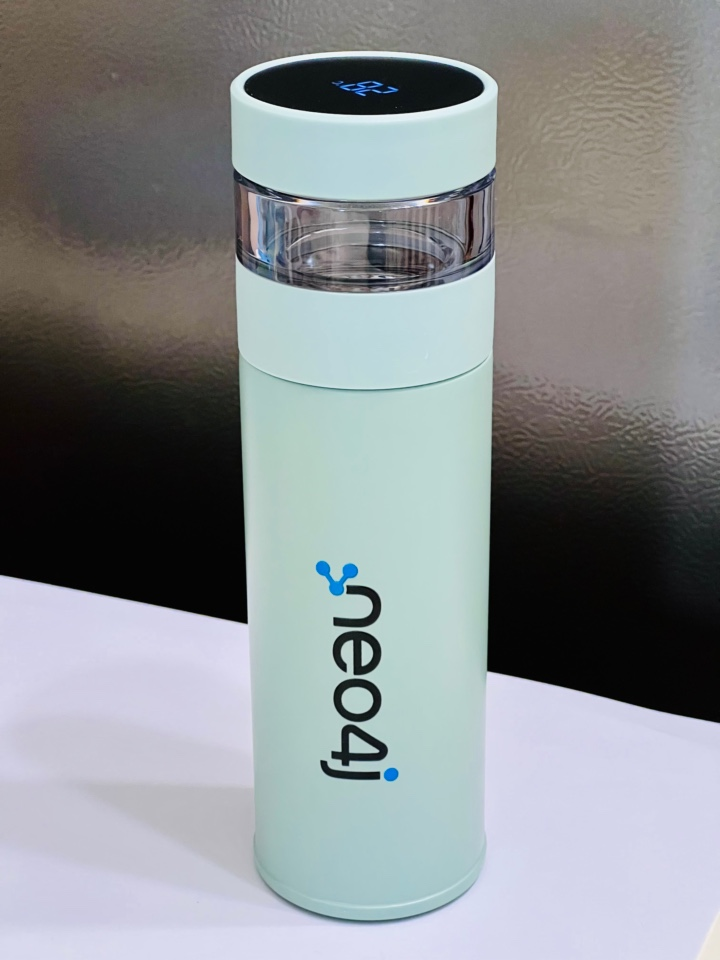

# 【报名中】“图无处不在”系列活动：看关联数据如何在多变时代下让商业价值流光溢彩

新的一期**Neo4j“图无处不在”关联数据系列活动**将于**10月19日星期三**下午举办，现在报名预留观看席位，届时可以通过腾讯会议直接入会。报名后也能第一时间掌握活动最新动态。

本次活动需要提前报名注册，积极参与互动者将有机会参与抽奖，赢得Neo4j 定制的茶水分离精美保温杯一个。

报名链接：https://meeting.tencent.com/dw/rUk1MdWtzMI6

## 活动亮点

本月“图无处不在”活动邀请到了两位讲师，将带来知识图谱在行业的案例分享，以及图数据科学GDS的图嵌入（Node Embedding）讲解和实战分享。不容错过。

## 活动介绍

数据是人们生活世界的一种表现，人们使用数据来呈现这个世界。因此，世界相连更加紧密，人们不再生活在孤岛中，而是在社会中持续相连。

如果没有关联数据，企业就缺乏深入了解客户、构建完整网络拓扑、实时提供相关建议或获取防止欺诈所需可见性的关键信息。

在关联数据的帮助下，人们的参与度、生产力和效率日益增高。企业可以弥合执行团队、现场技术、工厂操作、仓库管理和维护之间的信息和沟通差距。日益提升的敏捷性和生产力将为企业带来显著的商业利益。

现在许多组织现在都转向图数据科学来存储数据并生成见解。包括金融服务、旅游、零售、公共部门和想要解决复杂问题的医疗机构。利用图数据科学的洞察力可以发现指向欺诈的活动，找到相似的实体或人员，改进建议提高客户满意度，并简化供应链。专用的工作区结合了输入、分析和管理，无需重建工作流程即可进行简单的模型改进。Neo4j 图数据科学可以帮助数据科学家在海量数据中找到关联，以解决重要的业务问题并提升预测能力。

请于 **2022年10月19日 16:00** 加入我们，聆听Neo4j 图数据平台专家讲述今天的数据景观。

## 活动日程

16:00 **知识图谱在农业和金融行业案例分享** （孙云涛 - 博龙涛数据科技首席科学家）

16:30 **Node Embedding 理论基础以及GDS所支持的具体算法** （施博润 - Neo4j GDS 欧洲区软件工程师）

17:00 **有奖互动问答**

17:30 **结束**

本期活动奖品展示。

## 感谢

本次Neo4j“图无处不在”线上分享由Neo4j中国团队为你呈献，欢迎报名和分享本次活动。

