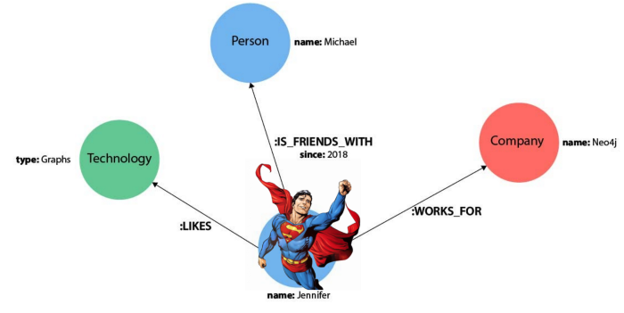
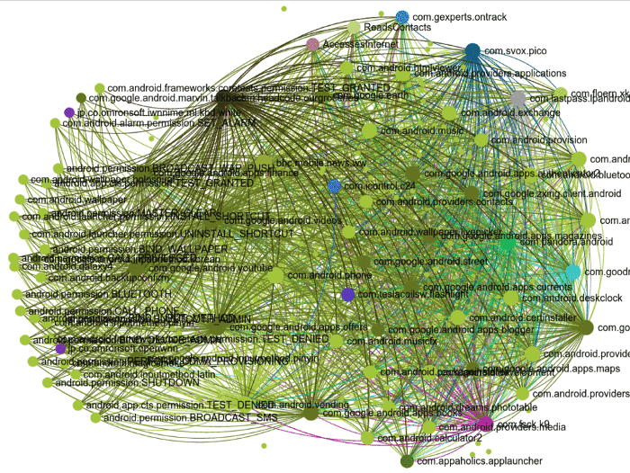

# 图数据建模：如何处理超级节点

作者：**David Allen**

原文：https://medium.com/neo4j/graph-modeling-all-about-super-nodes-d6ad7e11015b

> 本文是高级图建模系列文章中的最新一篇；该系列的其他文章处理[键](https://medium.com/neo4j/graph-data-modeling-keys-a5a5334a1297)*、*[关系](https://medium.com/neo4j/graph-data-modeling-all-about-relationships-5060e46820ce)*和*[分类变量](https://medium.com/neo4j/graph-data-modeling-categorical-variables-dd8a2845d5e0)*。*

今天我们将讨论超级节点，它们是什么，它们引起的问题以及如何处理它们。本文是对这些问题以及它们如何具体触及 Neo4j 的总结和总结。



本文将介绍它们是什么，它们是如何发生的，以及我们可以对它们做些什么。让我们开始吧。

## 什么是超级节点？

超级节点是碰巧有很多关系的任何节点。有多少关系？好吧，这并没有真正定义，所以我们称之为*很多*。如果一个事物比其他节点具有更多的关系，相对于图中的其他内容，称它为超级节点是公平的。多少是太多了？嗯，这确实是一件主观的事情，因为每个人都在运行具有不同内存配置和查询模式的机器。



发现超级节点并不难。如果你正在可视化一个图表，你得到的是一个“毛球”，那么看起来它们连接到所有东西的密集连接节点可能是超级节点。

> 超级节点将头发放入毛球中。

在极端情况下，您甚至无法可视化超级节点，因为如果您真的在一个节点上有数百万个出站关系，那么可视化将只是一团黑色，重叠线太多，无法真正看到任何东西。

# 超级节点是如何产生的？

有两个关键原因：它们可能来自您正在建模的领域，或者来自您对该领域的建模选择。

## 从域本身：密集连接的网络

想象一下，我们将 Twitter 建模为一个图表，其中包含彼此跟随的帐户之间的关系。我们知道热门账户有很多粉丝，所以在这种图结构中，[Lady Gaga](https://twitter.com/ladygaga)的节点将有 8200 万以上的关系。这非常棒*，*因为[普通用户有 700 名关注者](https://www.brandwatch.com/blog/twitter-stats-and-statistics/)。


Lady Gaga 超级节点就是这样诞生的（作为超级节点，而不是作为摩托车）

密集连接网络的另一个例子可能是`(:Flight)-[:DEPARTED_FROM]->(:Airport)`。亚特兰大的哈茨菲尔德-杰克逊机场每年可以轻松完成超过 200,000 次航班。这是很多 -`[:DEPARTED_FROM]->`关系。

许多其他业务领域都有丰富的示例：

- 大型企业银行账户，寿命长，每天进行数百或数千笔金融交易`(:Account)-[:TRANSFER]->(:Account)`。
- 其他社交网络，例如您可能在 LinkedIn 上认识的那些技术招聘人员，他们似乎拥有无数联系人。

## 从您的建模选择中：分类变量重载

在之前的一篇文章中，我写了关于[分类变量](https://medium.com/neo4j/graph-data-modeling-categorical-variables-dd8a2845d5e0)并在 Neo4j 中对其进行建模的文章。分类变量只是一个可以接受少量值的属性。变量的“基数”是指它可以有多少不同的值。

***示例\***：假设您将客户填写的性别字段建模为单独的节点。这是低基数，因为唯一的选项可能是男性、女性、未指定和其他。现在假设您有 100 万个客户帐户，那么我们可以确定，`(:Gender)`如果您将图形建模为`(:Customer)-[:GENDER]->(:Gender).`

性别只是一个例子；当您有一个包含数百万个节点的大型图需要引用该变量时，这是一个低基数变量的普遍问题，建模为节点。想象一下，Amazon.com 采用了少数产品类别（“家居与园艺”、“电子产品”、“健康与保健”），并将其数以千万计的产品中的每一个都链接到一个类别节点——同样的情况。

## 数据已超出模型

通常，您将拥有一个适用于小型数据集的简单图形模型，但您可能无法立即进行扩展以获取完整的生产数据，或者稍后随着您的总数据集随时间增长。想象一下客户/性别示例；拥有 1,000 名客户并不是什么大不了的事，而且可能是拥有 1000 万客户的杀手。同样，Lady Gaga 的账户在 2013 年对 Twitter 来说可能不是问题，但那是几亿用户之前的事了。

在建模中，请注意*超级节点问题来自基数不匹配*；如果每个产品都需要一个类别，并且产品的基数是 2000 万，而类别的基数是 12，那么这种巨大的不匹配可能会产生与类别一样多的超级节点。`(:X)-[:RELATED_TO]->(:Y)`在 X 和 Y 的基数不匹配的任何地方都可以看到相同的模式。

> 如果您的数据已经超出您的模型，那么是时候重构您的模型了。

# 为什么超级节点不好？

问题是它们分支的速度有多快，给了我们太多需要考虑的路径。简而言之，一棵树的叶子很容易找到树干。树干更难找到一片叶子。让我们看看它们损害读取性能的一些方式。

## 炸毁你的遍历

假设您编写了这样的查询：

```
MATCH (bob:TwitterUser { name: "bob" }) 
WITH bob 
MATCH p=(bob)-[:FOLLOWS*]-(:TwitterUser { name: "karla" })
返回 p
```

这要求 Bob 和 Karla 之间的所有路径。如果有人关注 Lady Gaga，这个查询将是一场灾难，因为为了让 Neo4j 回答这个查询，它必须扩展到可能有 8000 万个其他帐户。通往卡拉的道路数量将爆炸式增长；Bob 和 Karla 可能都住在纽约市，但请放心，此查询将需要查看 Gaga 的每个立陶宛和韩国粉丝（以及他们的所有追随者，以及他们的追随者等），以便返回。


听波罗米尔的，他知道发生了什么

## 减慢其他读取速度

另一个问题是关系过滤；Neo4j（从 4.1 版开始）不支持关系属性的二级索引。想象一个查询来查找 Gaga 在 2020 年获得的所有追随者。

```
MATCH (gaga:TwitterUser { name: 'ladygaga' })<-[r:FOLLOWS]-(u:User) 
WHERE r.date > date('2020-01-01') 
RETURN u.name, u.followers
```

此查询必须考虑所有超过 8000 万个关系，因为您无法索引`date`关系上的数据类型。当您需要在多个步骤的路径上使用关系过滤时，这会变得更重要，其中任何潜在的步骤都可能通过超级节点运行。

## **减慢写入速度**

从 Neo4j 4.1 开始，当您`MERGE`在图中建立关系时，它会暂时锁定该事务的源节点和目标节点。这对 Lady Gaga 来说非常糟糕，因为当她的下一张专辑发行时，我们会一直想`[:FOLLOWS]`为她建立新的关系。当我们添加新的关系时，她（在几分之一秒内）被锁定以供世界其他地方跟随，这将在她的国际粉丝群中的其他地方引起问题。

[DZone 上的这篇文章](https://dzone.com/articles/dealing-super-nodes-and)涵盖了性能影响的其他一些有趣方面，如果您想跟进更多细节。

## 并不总是世界末日

在某些情况下，超级节点可能无关紧要。

- 如果超级节点位于路径的尽头，而您没有遍历它，则不会产生太大影响。
- 如果超级节点不是高交易率查询或多用户更新的一部分，它可能是无害的。

# 好的，那我们该怎么办？

这是一点点艺术和一点点科学——对你来说最好的答案取决于你的领域，但这里有一个技术工具箱，可以充分利用你的图表。这些技术从简单到困难。

- 关系方向性
- 加入提示
- Lucene 关系索引
- 标签和关系分离
- 超级节点重构

我们将详细介绍其中的每一个，但实际上它们都归结为两类方法——要么帮助数据库在运行查询时考虑更少的关系（这使得超级节点*不那么*超级），要么尝试分解或首先消除超级节点。有些技术是两者的结合。当然请记住：您不必选择一种方法，可以随意混合搭配。

**关系方向性**

Cypher 让我们将路径表示为无向`(:User)-[:FOLLOWS]-(:User)`或有向`(:User)-[:FOLLOWS]->(:User)`。**始终使用定向路径**，因为它减少了您的查询必须考虑的关系数量。

您可以利用您对超级节点的方向性的了解。Lady Gaga 有 8000 万粉丝（即**入站** `:FOLLOWS`关系），但她只关注了 121,000 个帐户（**出站**关系）。实际上，当您想到这一点时，她关注了多少人真是太疯狂了，但是 - 这两个查询之间存在巨大差异：

`(:User)-[:FOLLOWS]-(:User { name: "ladygaga" })` ***（8000 万+关系）\***

`(:User)<-[:FOLLOWS]-(:User { name: "ladygaga" }) `***（121,000 个关系）\***


基努了解了超级节点的关键弱点之一

## 加入提示

[在这篇知识库文章中](https://neo4j.com/developer/kb/how-to-avoid-costly-traversals-with-join-hints/)，Andrew Bowman 阐述了如何使用 Cypher`JOIN`提示来约束 Cypher 如何进行图遍历。如果你知道你的图中有一些超级节点，你可以使用这个技术来确保 Neo4j 的查询评估不会遇到那个遍历问题。

与其对整篇文章进行重新加盖，这里是关键部分，并简要说明了它的工作原理：

```
MATCH (me:Person {name:'Me'})-[:FRIENDS_WITH]-(friend)-[:LIKES]->(a:Artist)<-[:LIKES]-(me) 
USING JOIN on a 
RETURN a , count(a) as likesInCommon
```

这种构造`USING JOIN ON a`确保 Cypher 只能遍历到`:Artist`节点，但永远不会穿过或离开它。如果所讨论的艺术家是拥有 8000 万粉丝的 Gaga，这将是一个很好的技巧。

有关此技术的更多信息，请查看 Cypher 手册的[规划器提示部分](https://neo4j.com/docs/cypher-manual/current/query-tuning/using/)。

## **Lucene 关系索引**

在前面的部分中，我说过 Neo4j 不支持关系属性索引。这几乎是真的。实际上有一种特殊情况。可以使用 Lucene 来索引关系上的文本属性。

在此处使用[此文档](https://neo4j.com/docs/cypher-manual/current/administration/indexes-for-full-text-search/#administration-indexes-fulltext-search-create-and-configure)，您可以调用例如：

```
CALL db.index.fulltext.createRelationshipIndex("taggedByRelationshipIndex",["FOLLOWS"],["date"], { finally_consistent: "true" })
```

假设关系`date`上的属性`:FOLLOWS`是一个字符串，您可以使用它来过滤关系（利用索引），这在某些有限的情况下可以帮助解决问题。这本身并不是解决超级节点问题的灵丹妙药。是的，我们需要将日期视为字符串以使其工作并不是很好。

## 标签和关系分离

解决超级节点问题的另一种方法是，各个密集连接的节点（如 Lady Gaga）看起来和行为与图的其余部分一样，但*实际上它们是特殊情况*。[推特上的大多数人（咳嗽）](https://twitter.com/mdavidallen)没有 8000 万粉丝。因此，我们可以通过不同的标签将超级节点从图中分离出来。如果我们引入新标签会怎样？


Lady Gaga：有点不像图中的常规平均节点，有点特殊

- `(:TwitterUser)`对于像我这样的普通 schmoes
- `(:Celebrity)`或`(:VerifiedUser)`对于大型帐户

这将使我们的遍历更加容易，因为如果我们愿意，我们仍然可以指定遍历所有节点，但是如果他们被标记不同，我们可以轻松地在遍历中排除名人。

关系也是如此——我们可以对关系进行不同的标记，而不是对节点进行不同的标记：`-[:FOLLOWS]->`普通用户与用户的关系，以及与`-[:FAN]->`名人的无回报关系。

注意这对我们之前的查询示例做了什么：

```
MATCH p=(:TwitterUser { name: "bob" })-[:FOLLOWS*]-(:TwitterUser { name: "karla" })
返回 p
```

如果我们只是引入一种`[:FAN]`关系类型，突然间这个查询看起来非常非常不同，我们不需要考虑 Lady Gaga。如果出于某种原因我们*确实*想要包括她，那么更改是微不足道的：

```
MATCH p=(:TwitterUser { name: "bob" })-[:FOLLOWS|FAN*]-(:TwitterUser { name: "karla" })
返回 p
```

区别很简单`-[:FOLLOWS|FAN*]->`

但是，这种方法的一个缺点是它仅适用于自然密集连接的域。如果我们的问题是一个分类变量，如`(:Gender)`，你无法用这种方法摆脱这个问题。`(:Celebrity)`它起作用的原因是因为我们可以从更大的图表中分离出一小部分。`(:Gender)`当所有节点都是超级节点时，这将不起作用。

## 超级节点重构

可能最艰难的方法是重构您的图表以将单个超级节点分解为多个节点。你可以拿走 Lady Gaga 的单个节点并将她分成 1,000 个 Gaga 副本。创建一系列等价关系，即`(gaga1:TwitterUser)-[:SAME_AS]->(gaga2:TwitterUser)`，然后制定一个策略，在 1,000 个“Gaga 克隆”之间分配您的应用程序关系。

> 这是最后的策略。

不过，它只会对某些查询模式有所帮助，原因如下：

- 如果查询需要了解有关 Gaga 的所有信息，则需要重写查询以便能够考虑`SAME_AS`关系，而不仅仅是触及该节点的本地克隆。
- 如果你需要穿越 Gaga，你还是回到了同样的境地；在遍历所有克隆之后，根据查询，您最终仍会获得 8000 万以上的总基数。
- 选择和实施一种策略来分配“Gaga 克隆”之间的关系并保持平衡，以使其中一个克隆不会逐渐成长为自己的超级节点，因为 Gaga 会随着时间的推移吸引更多粉丝，因此更加复杂。

# 结论

总结所有这些，以下是要记住的关键点：

- 超级节点是那些在您的图表中紧密连接的节点，相对于您的图表中发现的平均值，具有非常多的事件关系。
- 超级节点很糟糕，因为它们会损害读写性能。
- 超级节点来自几个不同的地方，但大多数通常来自您领域的自然复杂性和您的建模选择。
- 您在工具箱中有许多不同的工具来解决这个问题，对于高级图形建模，您肯定需要注意这个问题，以便从图形中获得最佳性能。

快乐的图形黑客！

**本文是系列文章的一部分**；如果您发现它有用，请考虑阅读有关[标签](https://medium.com/neo4j/graph-modeling-labels-71775ff7d121)、[关系](https://medium.com/neo4j/graph-data-modeling-all-about-relationships-5060e46820ce)、[超级节点](https://medium.com/neo4j/graph-modeling-all-about-super-nodes-d6ad7e11015b)和[分类变量](https://medium.com/neo4j/graph-data-modeling-categorical-variables-dd8a2845d5e0)的其他内容。